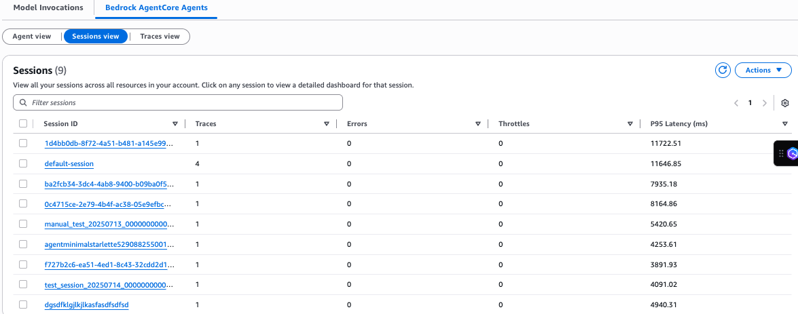

# Session view

The **Sessions** view shows the list of all the sessions
 associated with all agents in your account. Choose **Filters** or
 sort by columns to find a specific session. Choose a session under **Session
 ID** to view the session details.

You can view the Session summary metrics and the list of traces belonging to that
 session. Session metrics include:

* Traces – Number of traces belonging to the sessions
* Server errors – Count of system errors during request processing.
 High levels of server-side errors can indicate potential infrastructure or
 service issues that require investigation
* Client errors – Client errors are errors resulting from invalid
 requests. High levels of client-side errors can indicate issues with request
 formatting or permissions
* Throttles – Number of requests throttle relevant to this session
 due to exceeding allowed TPS (Transactions Per Second)
* Sessions details – Meta data about the session such as start time,
 session ID
###### Note

Summary page fields are consistent across **Agent view**,
 **Sessions view**, and **Traces view**.
 For more information on summary fields, see [Agent view](agent-view.md "agent-view.md").

Under **Traces** for a session, choose **Filter
 traces** to find the trace you want to review. After you choose a
 trace, view the trace details in the right-pane. You can view the trace summary,
 spans, and trace content for the selected trace.
