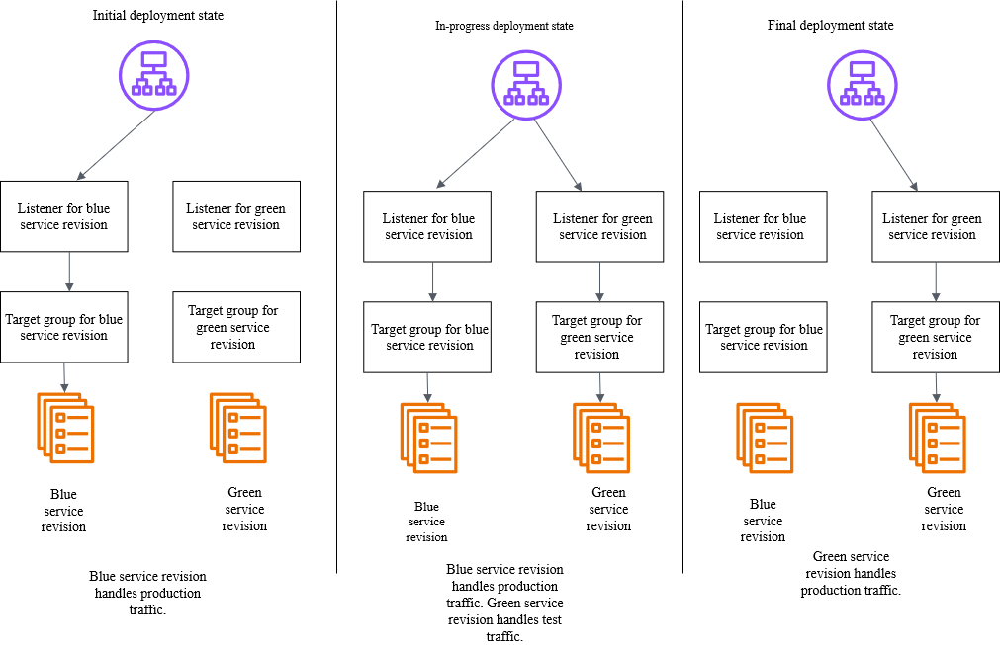

# Amazon ECS blue/green service deployments workflow

The Amazon ECS blue/green deployment process follows a structured approach with six distinct phases that ensure safe and reliable application updates. Each phase serves a specific purpose in validating and transitioning your application from the current version (blue) to the new version (green).

1. **Preparation Phase**: Create the green environment alongside the existing blue environment. This includes provisioning new service revisions, and preparing target groups.
2. **Deployment Phase**: Deploy the new service revision to the green environment. Amazon ECS launches new tasks using the updated service revision while the blue environment continues serving production traffic.
3. **Testing Phase**: Validate the green environment using test traffic routing. The Application Load Balancer directs test requests to the green environment while production traffic remains on blue.
4. **Traffic Shifting Phase**: Shift production traffic from blue to green based on your configured deployment strategy. This phase includes monitoring and validation checkpoints.
5. **Monitoring Phase**: Monitor application health, performance metrics, and alarm states during the bake time period. A rollback operation is initiated when issues are detected.
6. **Completion Phase**: Finalize the deployment by terminating the blue environment or maintaining it for potential rollback scenarios, depending on your configuration.

## Workflow

The following diagram illustrates the comprehensive blue/green deployment workflow,
showing the interaction between Amazon ECS, and the Application Load Balancer:

The enhanced deployment workflow includes the following detailed steps:

1. **Initial State**: The blue service (current production) handles 100% of production traffic. The Application Load Balancer has a single listener with rules that route all requests to the blue target group containing healthy blue tasks.
2. **Green Environment Provisioning**: Amazon ECS creates new tasks using the updated task definition. These tasks are registered with a new green target group but receive no traffic initially.
3. **Health Check Validation**: The Application Load Balancer performs health checks on green tasks. Only when green tasks pass health checks does the deployment proceed to the next phase.
4. **Test Traffic Routing**: If configured, the Application Load Balancer's listener rules route specific traffic patterns (such as requests with test headers) to the green environment for validation while production traffic remains on blue. This is controlled by the same listener that handles production traffic, using different rules based on request attributes.
5. **Production Traffic Shift**: Based on the deployment configuration, traffic shifts from blue to green. In ECS blue/green deployments, this is an immediate (all-at-once) shift where 100% of the traffic is moved from the blue to the green environment. The Application Load Balancer uses a single listener with listener rules that control traffic distribution between the blue and green target groups based on weights.
6. **Monitoring and Validation**: Throughout the traffic shift, Amazon ECS monitors CloudWatch metrics, alarm states, and deployment health. Automatic rollback triggers activate if issues are detected.
7. **Bake Time Period**: The duration when both blue
   and green service revisions are running simultaneously after the production
   traffic has shifted.
8. **Blue Environment Termination**: After successful traffic shift and validation, the blue environment is terminated to free up cluster resources, or maintained for rapid rollback capability.
9. **Final State**: The green environment becomes the new production environment, handling 100% of traffic. The deployment is marked as successful.

## Deployment lifecycle stages

The blue/green deployment process progresses through distinct lifecycle stages (a series of events in the deployment operation, such as "after production traffic shift"), each with specific responsibilities and validation checkpoints. Understanding these stages helps you monitor deployment progress and troubleshoot issues effectively.

Each lifecycle stage can last up to 24 hours. We recommend that the value remains below the 24-hour mark. This is because asynchronous processes need time to trigger the hooks. The system times out, fails the deployment, and then initiates a rollback after a stage reaches 24 hours.
AWS CloudFormation deployments have additional timeout restrictions. While the 24-hour stage limit remains in effect, AWS CloudFormation enforces a 36-hour limit on the entire deployment. AWS CloudFormation fails the deployment, and then initiates a rollback if the process doesn't complete within 36 hours.

| Lifecycle stages              | Description                                                                                                                                                                                        | Use this stage for lifecycle hook? |
| ----------------------------- | -------------------------------------------------------------------------------------------------------------------------------------------------------------------------------------------------- | ---------------------------------- |
| RECONCILE_SERVICE             | This stage only happens when you start a new service deployment with more than 1 service revision in an ACTIVE state.                                                                           | Yes                                |
| PRE_SCALE_UP                  | The green service revision has not started. The blue service revision is handling 100% of the production traffic. There is no test traffic.                                                  | Yes                                |
| SCALE_UP                      | The time when the green service revision scales up to 100% and launches new tasks. The green service revision is not serving any traffic at this point.                                      | No                                 |
| POST_SCALE_UP                 | The green service revision has started. The blue service revision is handling 100% of the production traffic. There is no test traffic.                                                      | Yes                                |
| TEST_TRAFFIC_SHIFT            | The blue and green service revisions are running. The blue service revision handles 100% of the production traffic. The green service revision is migrating from 0% to 100% of test traffic. | Yes                                |
| POST_TEST_TRAFFIC_SHIFT       | The test traffic shift is complete. The green service revision handles 100% of the test traffic.                                                                                                | Yes                                |
| PRODUCTION_TRAFFIC_SHIFT      | Production traffic is shifting to the green service revision. The green service revision is migrating from 0% to 100% of production traffic.                                                 | Yes                                |
| POST_PRODUCTION_TRAFFIC_SHIFT | The production traffic shift is complete.                                                                                                                                                          | Yes                                |
| BAKE_TIME                     | The duration when both blue and green service revisions are running simultaneously.                                                                                                             | No                                 |
| CLEAN_UP                      | The blue service revision has completely scaled down to 0 running tasks. The green service revision is now the production service revision after this stage.                                 | No                                 |

Each lifecycle stage includes built-in validation checkpoints that must pass before proceeding to the next stage. If any validation fails, the deployment can be automatically rolled back to maintain service availability and reliability.

When you use a Lambda function, the function must complete the work, or return IN_PROGRESS within 15 minutes. You can use the `callBackDelaySeconds` to delay the call to Lambda. For more information, see [app.py function](https://github.com/aws-samples/sample-amazon-ecs-blue-green-deployment-patterns/blob/main/ecs-bluegreen-lifecycle-hooks/src/approvalFunction/app.py#L20-L25 "https://github.com/aws-samples/sample-amazon-ecs-blue-green-deployment-patterns/blob/main/ecs-bluegreen-lifecycle-hooks/src/approvalFunction/app.py#L20-L25") in the sample-amazon-ecs-blue-green-deployment-patterns on GitHub.
