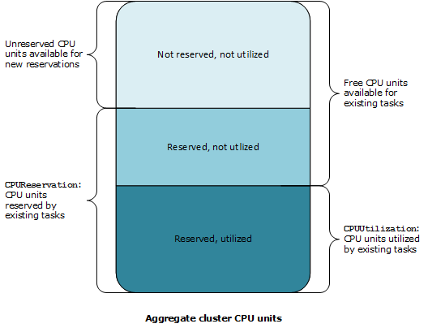

# Amazon ECS cluster reservation metrics

Cluster reservation metrics are measured as the percentage of CPU, memory, and GPUs
that are reserved by all Amazon ECS tasks on a cluster when compared to the aggregate CPU,
memory, and GPUs that were registered for each active container instance in the cluster.
Only container instances in `ACTIVE` or `DRAINING` status will
affect cluster reservation metrics. This metric is used only on clusters with tasks or
services hosted on EC2 instances. It's not supported on clusters with
tasks hosted on AWS Fargate.

```
                               (Total CPU units reserved by tasks in cluster) x 100
Cluster CPU reservation =  --------------------------------------------------------------
                           (Total CPU units registered by container instances in cluster)
```

```
                                   (Total MiB of memory reserved by tasks in cluster x 100)
Cluster memory reservation =  ------------------------------------------------------------------
                              (Total MiB of memory registered by container instances in cluster)
```

```
                                  (Total GPUs reserved by tasks in cluster x 100)
Cluster GPU reservation =  ------------------------------------------------------------------
                              (Total GPUs registered by container instances in cluster)
```

When you run a task in a cluster, Amazon ECS parses its task definition and reserves the
aggregate CPU units, MiB of memory, and GPUs that are specified in its container
definitions. Each minute, Amazon ECS calculates the number of CPU units, MiB of memory, and
GPUs that are currently reserved for each task that is running in the cluster. The total
amount of CPU, memory, and GPUs reserved for all tasks running on the cluster is
calculated, and those numbers are reported to CloudWatch as a percentage of the total
registered resources for the cluster. If you specify a soft limit
(`memoryReservation`) in the task definition, it's used to calculate the
amount of reserved memory. Otherwise, the hard limit (`memory`) is used. The
total MiB of memory reserved by tasks in a cluster also includes temporary file system
(`tmpfs`) volume size and `sharedMemorySize` if defined in the
task definition. For more information about hard and soft limits, shared memory size,
and tmpfs volume size, see [Task
Definition Parameters](task_definition_parameters.md#container_definitions "task_definition_parameters.md#container_definitions").

For example, a cluster has two active container instances registered: a
`c4.4xlarge` instance and a `c4.large` instance. The
`c4.4xlarge` instance registers into the cluster with 16,384 CPU units
and 30,158 MiB of memory. The `c4.large` instance registers with 2,048 CPU
units and 3,768 MiB of memory. The aggregate resources of this cluster are 18,432 CPU
units and 33,926 MiB of memory.

If a task definition reserves 1,024 CPU units and 2,048 MiB of memory, and ten tasks
are started with this task definition on this cluster (and no other tasks are currently
running), a total of 10,240 CPU units and 20,480 MiB of memory are reserved. This is
reported to CloudWatch as 55% CPU reservation and 60% memory reservation for the
cluster.

The following illustration shows the total registered CPU units in a cluster and what
their reservation and utilization means to existing tasks and new task placement. The
lower (Reserved, used) and center (Reserved, not used) blocks represent the total CPU
units that are reserved for the existing tasks that are running on the cluster, or the
`CPUReservation` CloudWatch metric. The lower block represents the reserved CPU
units that the running tasks are actually using on the cluster, or the
`CPUUtilization` CloudWatch metric. The upper block represents CPU units that
are not reserved by existing tasks; these CPU units are available for new task
placement. Existing tasks can use these unreserved CPU units as well, if their need for
CPU resources increases. For more information, see the [cpu](task_definition_parameters.md#ContainerDefinition-cpu "task_definition_parameters.md#ContainerDefinition-cpu") task definition parameter documentation.


