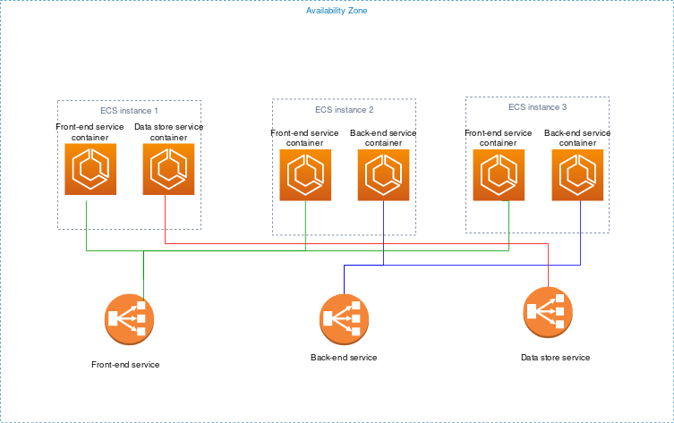

# Architect for EC2 capacity for Amazon ECS

Use EC2 capacity for large workloads that must be price optimized.

When considering how to model task definitions and services using EC2, we recommend
that you consider what processes must run together and how you might go about scaling
each component.

As an example, suppose that an application consists of the following
components:

- A frontend service that displays information on a webpage
- A backend service that provides APIs for the frontend service
- A data store
  For this example, create task definitions that group the containers that are used
  for a common purpose together. Separate the different components into multiple task definitions. The following example cluster has three container
  instances that are running three front-end service containers, two backend service
  containers, and one data store service container.

You can group related containers in a task definition, such as linked containers
that must be run together. For example, add a log streaming container to your
front-end service and include it in the same task definition.

After you have your task definitions, you can create services from them to
maintain the availability of your desired tasks. For more information, see [Creating an Amazon ECS rolling update
deployment](create-service-console-v2.md "create-service-console-v2.md"). In your services, you
can associate containers with Elastic Load Balancing load balancers. For more information, see [Use load balancing to distribute Amazon ECS service
traffic](service-load-balancing.md "service-load-balancing.md"). When
your application requirements change, you can update your services to scale the
number of desired tasks up or down. Or, you can update your services to deploy newer
versions of the containers in your tasks. For more information, see [Updating an Amazon ECS service](update-service-console-v2.md "update-service-console-v2.md").

