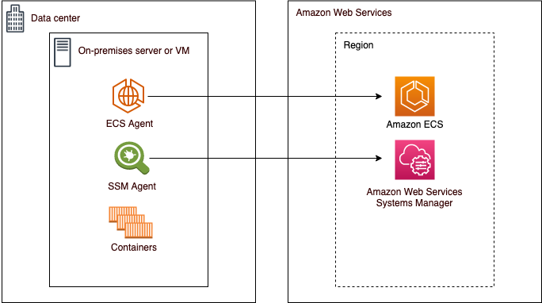

# External (Amazon ECS Anywhere) for Amazon ECS

Amazon ECS Anywhere provides support for registering an _external
instance_ such as an on-premises server or virtual machine (VM), to your
Amazon ECS cluster. External instances are optimized for running applications that generate
outbound traffic or process data. If your application requires inbound traffic, the lack
of Elastic Load Balancing support makes running these workloads less efficient. Amazon ECS added a new
`EXTERNAL` launch type that you can use to create services or run tasks
on your external instances.

The following provides a high-level system architecture overview of Amazon ECS Anywhere.
Your on-premises server has both the Amazon ECS agent and the SSM agent installed.

For more information, see [Amazon ECS clusters for external instances](ecs-anywhere.md "ecs-anywhere.md").
