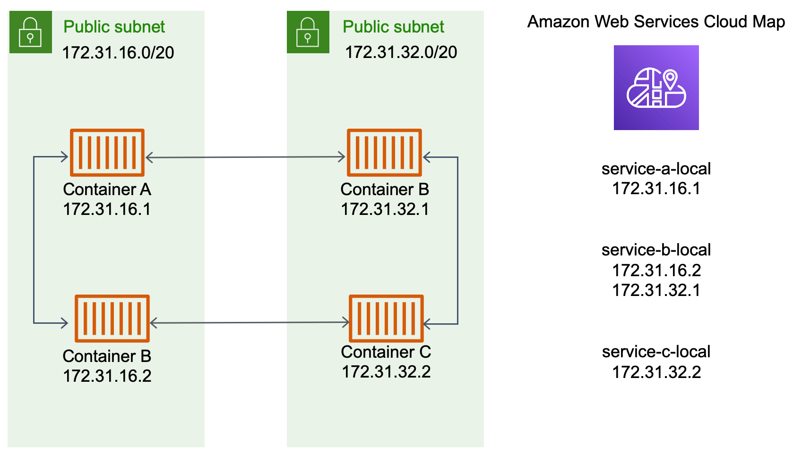
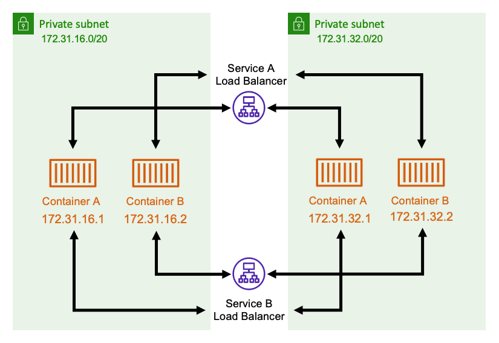

# Best practices for connecting Amazon ECS services in a VPC

Using Amazon ECS tasks in a VPC, you can split monolithic applications into separate parts
that can be deployed and scaled independently in a secure environment. This architecture
is called service-oriented architecture (SOA) or microservices. However, it can be
challenging to make sure that all of these parts, both in and outside of a VPC, can
communicate with each other. There are several approaches for facilitating
communication, all with different advantages and disadvantages.

## Using Service Connect

We recommend Service Connect, which provides Amazon ECS configuration for service discovery,
connectivity, and traffic monitoring. With Service Connect, your applications can
use short names and standard ports to connect to services in the same cluster,
other clusters, including across VPCs in the same Region. For more
information, see [Amazon ECS Service
Connect](service-connect.md "service-connect.md").

When you use Service Connect, Amazon ECS manages all of the parts of service discovery:
creating the names that can be discovered, dynamically managing entries for each
task as the tasks start and stop, running an agent in each task that is configured
to discover the names. Your application can look up the names by using the standard
functionality for DNS names and making connections. If your application does this
already, you don't need to modify your application to use Service Connect.

###### Changes only happen during deployments

You provide the complete configuration inside each service and task
definition. Amazon ECS manages changes to this configuration in each service
deployment, to ensure that all tasks in a deployment behave in the same way. For
example, a common problem with DNS as service discovery is controlling a
migration. If you change a DNS name to point to the new replacement IP
addresses, it might take the maximum TTL time before all the clients begin using
the new service. With Service Connect, the client deployment updates the
configuration by replacing the client tasks. You can configure the deployment
circuit breaker and other deployment configuration to affect Service Connect
changes in the same way as any other deployment.

## Using service discovery

Another approach for service-to-service communication is direct communication using
service discovery. In this approach, you can use the AWS Cloud Map service discovery
integration with Amazon ECS. Using service discovery, Amazon ECS syncs the list of launched
tasks to AWS Cloud Map, which maintains a DNS hostname that resolves to the internal IP
addresses of one or more tasks from that particular service. Other services in the
Amazon VPC can use this DNS hostname to send traffic directly to another container using
its internal IP address. For more information, see [Service
discovery](service-discovery.md "service-discovery.md").

In the preceding diagram, there are three services. `service-a-local` has
one container and communicates with `service-b-local`, which has two
containers. `service-b-local` must also communicate with
`service-c-local`, which has one container. Each container in all three
of these services can use the internal DNS names from AWS Cloud Map to find the internal IP
addresses of a container from the downstream service that it needs to communicate
to.

This approach to service-to-service communication provides low latency. At first
glance, it's also simple as there are no extra components between the containers.
Traffic travels directly from one container to the other container.

This approach is suitable when using the `awsvpc` network mode, where
each task has its own unique IP address. Most software only supports the use of DNS
`A` records, which resolve directly to IP addresses. When using the
`awsvpc` network mode, the IP address for each task are an
`A` record. However, if you're using `bridge` network
mode, multiple containers could be sharing the same IP address. Additionally,
dynamic port mappings cause the containers to be randomly assigned port numbers on
that single IP address. At this point, an `A` record is no longer be
enough for service discovery. You must also use an `SRV` record. This
type of record can keep track of both IP addresses and port numbers but requires
that you configure applications appropriately. Some prebuilt applications that you
use might not support `SRV` records.

Another advantage of the `awsvpc` network mode is that you have a
unique security group for each service. You can configure this security group to
allow incoming connections from only the specific upstream services that need to
talk to that service.

The main disadvantage of direct service-to-service communication using service
discovery is that you must implement extra logic to have retries and deal with
connection failures. DNS records have a time-to-live (TTL) period that controls how
long they are cached for. It takes some time for the DNS record to be updated and
for the cache to expire so that your applications can pick up the latest version of
the DNS record. So, your application might end up resolving the DNS record to point
at another container that's no longer there. Your application needs to handle
retries and have logic to ignore bad backends.

## Using an internal load balancer

Another approach to service-to-service communication is to use an internal load
balancer. An internal load balancer exists entirely inside of your VPC and is only
accessible to services inside of your VPC.

The load balancer maintains high availability by deploying redundant resources
into each subnet. When a container from `serviceA` needs to communicate
with a container from `serviceB`, it opens a connection to the load
balancer. The load balancer then opens a connection to a container from
`service B`. The load balancer serves as a centralized place for
managing all connections between each service.

If a container from `serviceB` stops, then the load balancer can remove
that container from the pool. The load balancer also does health checks against each
downstream target in its pool and can automatically remove bad targets from the pool
until they become healthy again. The applications no longer need to be aware of how
many downstream containers there are. They just open their connections to the load
balancer.

This approach is advantageous to all network modes. The load balancer can keep
track of task IP addresses when using the `awsvpc` network mode, as well
as more advanced combinations of IP addresses and ports when using the
`bridge` network mode. It evenly distributes traffic across all the IP
address and port combinations, even if several containers are actually hosted on the
same Amazon EC2 instance, just on different ports.

The one disadvantage of this approach is cost. To be highly available, the load
balancer needs to have resources in each Availability Zone. This adds extra cost
because of the overhead of paying for the load balancer and for the amount of
traffic that goes through the load balancer.

However, you can reduce overhead costs by having multiple services share a load
balancer. This is particularly suitable for REST services that use an Application Load Balancer. You can
create path-based routing rules that route traffic to different services. For
example, `/api/user/*` might route to a container that's part of the
`user` service, whereas `/api/order/*` might route to the
associated `order` service. With this approach, you only pay for one
Application Load Balancer, and have one consistent URL for your API. However, you can split the traffic
off to various microservices on the backend.
