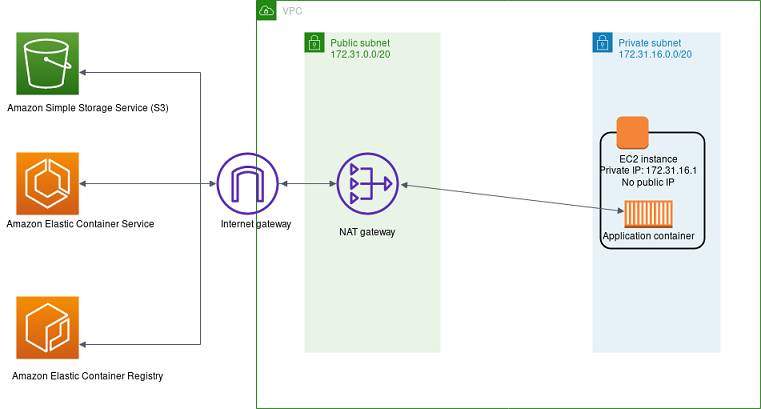
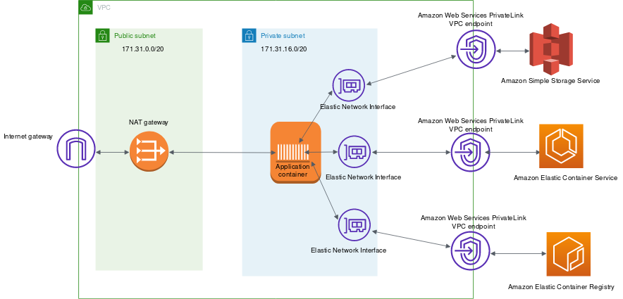

# Best practices for connecting Amazon ECS to AWS services from inside your VPC

For Amazon ECS to function properly, the Amazon ECS container agent that runs on each host must
communicate with the Amazon ECS control plane. If you're storing your container images in
Amazon ECR, the Amazon EC2 hosts must communicate to the Amazon ECR service endpoint, and to Amazon S3,
where the image layers are stored. If you use other AWS services for your
containerized application, such as persisting data stored in DynamoDB, double-check that
these services also have the necessary networking support.

## NAT gateway

Using a NAT gateway is the easiest way to ensure that your Amazon ECS tasks can access
other AWS services. For more information about this approach, see [Private subnet and NAT gateway](networking-outbound.md#networking-private-subnet "networking-outbound.md#networking-private-subnet").

The following are the disadvantages to using this approach:

- You can't limit what destinations the NAT gateway can communicate with.
  You also can't limit which destinations your backend tier can communicate to
  without disrupting all outbound communications from your VPC.
- NAT gateways charge for every GB of data that passes through. If you use the
  NAT gateway for any of the following operations, you're charged for every GB of
  bandwidth:

      + Downloading large files from Amazon S3
      + Doing a high volume of database queries to DynamoDB
      + Pulling images from Amazon ECR

  Additionally, NAT gateways support 5 Gbps of bandwidth and
  automatically scale up to 45 Gbps. If you route through a single NAT
  gateway, applications that require very high bandwidth connections might
  encounter networking constraints. As a workaround, you can divide your
  workload across multiple subnets and give each subnet its own NAT
  gateway.

## AWS PrivateLink

AWS PrivateLink provides private connectivity between VPCs, AWS services, and your
on-premises networks without exposing your traffic to the public internet.

A VPC endpoint allows private connections between your VPC and supported AWS
services and VPC endpoint services. Traffic between your VPC and the other service
doesn't leave the Amazon network. A VPC endpoint doesn't require an internet gateway,
virtual private gateway, NAT device, VPN connection, or Direct Connect connection. Amazon EC2
instances in your VPC don't require public IP addresses to communicate with resources in
the service.

The following diagram shows how communication to AWS services works when you are
using VPC endpoints instead of an internet gateway. AWS PrivateLink provisions elastic
network interfaces (ENIs) inside of the subnet, and VPC routing rules are used to
send any communication to the service hostname through the ENI, directly to the
destination AWS service. This traffic no longer needs to use the NAT gateway or
internet gateway.

The following are some of the common VPC endpoints that are used with the Amazon ECS
service.

- [Gateway endpoints for
  Amazon S3](../../../vpc/latest/privatelink/vpc-endpoints-s3.md "../../../vpc/latest/privatelink/vpc-endpoints-s3.md")
- [DynamoDB VPC endpoint](../../../amazondynamodb/latest/developerguide/vpc-endpoints-dynamodb.md "../../../amazondynamodb/latest/developerguide/vpc-endpoints-dynamodb.md")
- [Amazon ECS VPC
  endpoint](vpc-endpoints.md "vpc-endpoints.md")
- [Amazon ECR VPC
  endpoint](../../../AmazonECR/latest/userguide/vpc-endpoints.md "../../../AmazonECR/latest/userguide/vpc-endpoints.md")

Many other AWS services support VPC endpoints. If you make heavy usage of any
AWS service, you should look up the specific documentation for that service and
how to create a VPC endpoint for that traffic.
