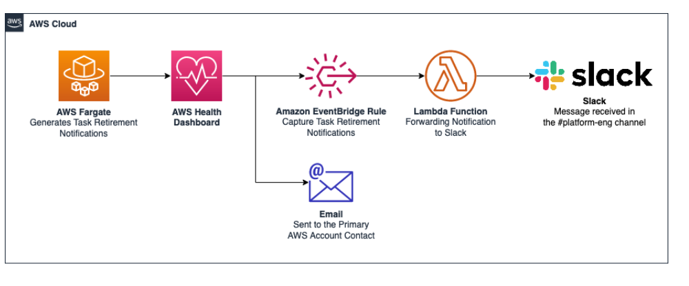

# Prepare for AWS Fargate task retirement on Amazon ECS

In order to prepare for task retirement, perform the following operations:

1. Set the task retirement wait period.
2. Capture task retirement notifications to notify team members.
3. You can't control the exact timing of a task retirement, however, you can control
   the replacement of tasks by updating the service with the force-deployment
   option.

## Step 1: Set the task wait time

You can configure the time that Fargate starts the task retirement. For workloads
that require immediate application of the updates, choose the
immediate setting (`0`). When you need more control, for example,
when a task can only be stopped during a certain window, configure the 7 day
(`7`), or 14 day (`14`) option.

We recommend that you choose a shorter waiting period in order to pick up newer platform versions revisions sooner.

Configure the wait period by running
`put-account-setting-default` or `put-account-setting` as the root user or an administrative user. Use the
`fargateTaskRetirementWaitPeriod` option for the `name` and the `value` option set to one of the following values:

- `0` - AWS sends the notification, and immediately starts to retire the affected tasks.
- `7` - AWS sends the notification, and waits 7 calendar days before starting to retire the affected tasks.
- `14` - AWS sends the notification, and waits 14 calendar days before starting to retire the affected tasks.

The default is 7 days.

For more information, see, [put-account-setting-default](../../../cli/latest/reference/ecs/put-account-setting-default.md "../../../cli/latest/reference/ecs/put-account-setting-default.md") and [put-account-setting](../../../cli/latest/reference/ecs/put-account-setting.md "../../../cli/latest/reference/ecs/put-account-setting.md") in the _Amazon Elastic Container Service API Reference_.

## Step 2: Capture task retirement notifications to

alert teams and take actions

When there is an upcoming task retirement, AWS sends a task retirement notification
to the AWS Health Dashboard, and to the primary email contact on the AWS account. The
AWS Health Dashboard provides a number of integrations into other AWS services,
including Amazon EventBridge. You can use EventBridge to build automations from a task retirement
notification, such as increasing the visibility of the upcoming retirement by forwarding
the message to a ChatOps tool. AWS Health Aware is a resource that shows the power of
the AWS Health Dashboard and how notifications can be distributed throughout an
organization. You can forward a task retirement notification to a chat application, such
as Slack.

The following illustration shows the solution overview.



The following information provides details.

- Fargate sends the task retirement notification to the AWS Health
  Dashboard.
- The AWS Health Dashboard sends mail to the primary email contact on the
  AWS account, and notifies EventBridge.
- EventBridge has a rule that captures the retirement notification.

The rule looking for events with the Event Detail Type: `"AWS Health
 Event" and the Event Detail Type Code:
 "AWS_ECS_TASK_PATCHING_RETIREMENT"`

- The rule triggers a Lambda function that forwards the information to Slack
  using a Slack Incoming Webhook. For more information, see [Incoming
  Webhooks](https://slack.com/marketplace/A0F7XDUAZ-incoming-webhooks "https://slack.com/marketplace/A0F7XDUAZ-incoming-webhooks").

For a code example, see [Capturing AWS Fargate Task Retirement Notifications](https://github.com/aws-samples/capturing-aws-fargate-task-retirement-notifications/tree/main "https://github.com/aws-samples/capturing-aws-fargate-task-retirement-notifications/tree/main") on Github.

## Step 3: Control the replacement of

tasks

You can't control the exact timing of a task retirement, however, you can define a
wait time. If you want control over replacing tasks at your own schedule, you can
capture the task retirement notice to first understand the task retirement date. You can
then redeploy your service to launch replacement tasks, and likewise replace any
standalone tasks.For services that use rolling deployment, you update the service using
`update-service` with the `force-deployment` option before the
retirement start time.

The following `update-service` example uses the
`force-deployment` option.

```
aws ecs update-service —-service `service_name` \
    --cluster `cluster_name` \
     --force-new-deployment
```

For services that use the blue/green deployment, you need to create a new deployment
in AWS CodeDeploy. For information about how to create the deployment, see [create-deployment](../../../cli/latest/reference/deploy/create-deployment.md "../../../cli/latest/reference/deploy/create-deployment.md") in the _AWS Command Line Interface
Reference_.
