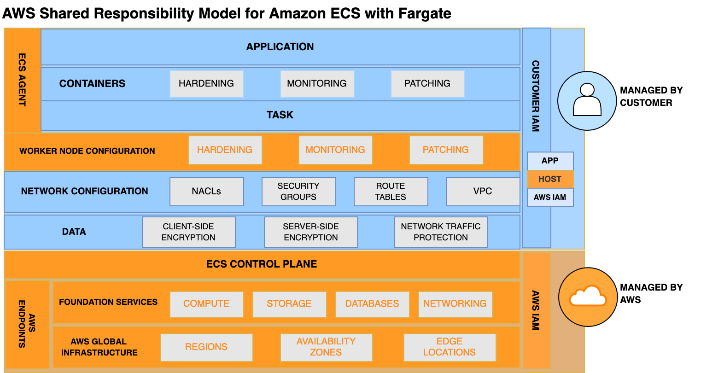
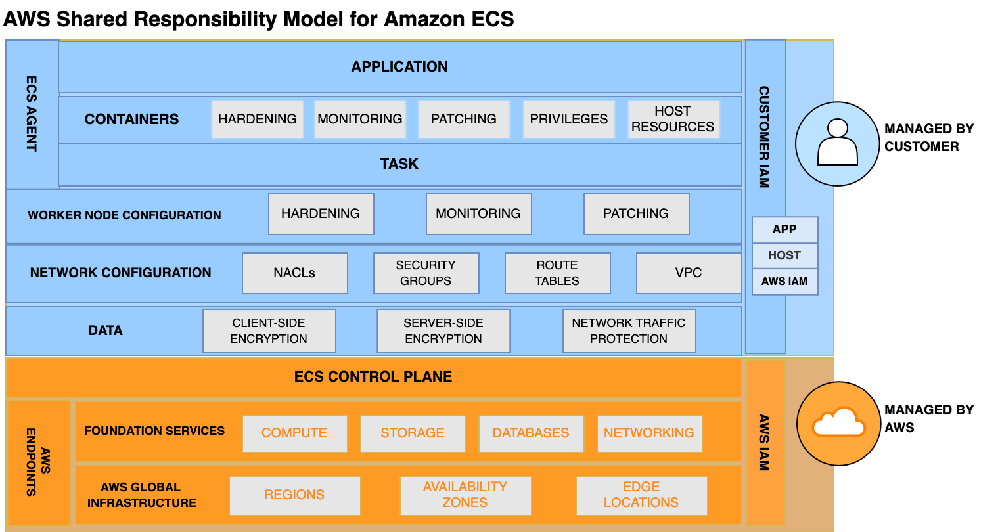

# AWS shared responsibility model for Amazon ECS

Security and Compliance is a shared responsibility between AWS and the customer. This
shared model can help relieve the customer’s operational burden as AWS operates, manages
and controls the components from the host operating system and virtualization layer down to
the physical security of the facilities in which the service operates. The customer assumes
responsibility and management of the guest operating system (including updates and security
patches), other associated application software as well as the configuration of the AWS
provided security group firewall. Customers should carefully consider the services they
choose as their responsibilities vary depending on the services used, the integration of
those services into their IT environment, and applicable laws and regulations. The nature of
this shared responsibility also provides the flexibility and customer control that permits
the deployment.

## Fargate

The following illustration shows the shared responsibility model for the Fargate launch
type. Fargate runs each workload in an isolated hardware virtualized environment. As a
result, each task gets dedicated infrastructure capacity. Containerized workloads
running on Fargate do not share an operating system, Linux kernel, network interface,
ephemeral storage, CPU, or memory with other tasks. When using Fargate, customers are
not responsible for securing the compute infrastructure that runs their containers.
Fargate will provision and patch the infrastructure upon which customer workloads run.
For more information, see [Task retirement and maintenance for AWS Fargate on Amazon ECS](task-maintenance.md "task-maintenance.md").

You are responsible for managing the following resources:

- Network configuration including VPC, NACLs, security groups, and route
  tables
- Client and service storage encryption. For more information, see [Storage options for Amazon ECS tasks](using_data_volumes.md "using_data_volumes.md").
- Container images. For more information, see [Amazon ECS task and container security best practices](security-tasks-containers.md "security-tasks-containers.md").
- IAM permissions for the applications by using the task role. For more information, see [Amazon ECS task IAM role](task-iam-roles.md "task-iam-roles.md").

## EC2

The following illustration shows the shared responsibility for EC2. When
you run tasks on EC2 instances you are responsible for maintaining your EC2 instances in
addition to the following resources:

- The Amazon ECS agent.
- • The EC2 instance AMI, including patching and hardening.
- Network configuration including VPC, NACLs, security groups, and route
  tables.
- Client and service storage encryption. For more information, see [Storage options for Amazon ECS tasks](using_data_volumes.md "using_data_volumes.md").
- Container images. For more information, see [Amazon ECS task and container security best practices](security-tasks-containers.md "security-tasks-containers.md").
- IAM permissions for the applications by using the task role. For more information, see [Amazon ECS task IAM role](task-iam-roles.md "task-iam-roles.md").

