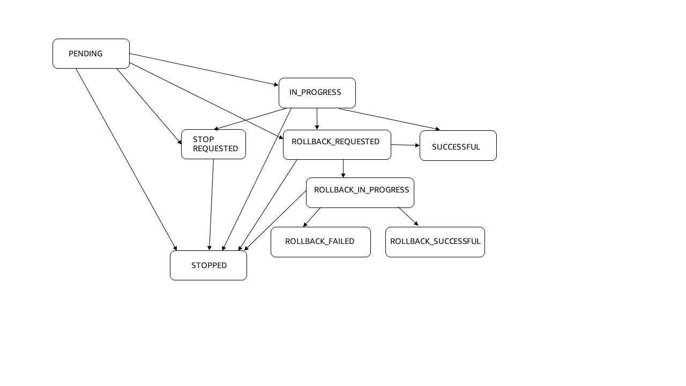

# View service history using Amazon ECS service deployments

Service deployments provide a comprehensive view of your deployments. Service deployments
provide the following information about the service:

- The currently deployed workload configuration (the source service revision)
- The workload configuration being deployed (the target service revision)
- The deployment status
- The number of failed tasks the circuit break detected
- The CloudWatch alarms that are in alarm
- When the service deployment started and completed
- The details of a rollback if one occurred
  For information about the service deployment properties, see [Properties included in an Amazon ECS service deployment](service-deployment-property.md "service-deployment-property.md").

Service deployments are read-only and each have a unique ID.

There are three service deployment stages:

| Stage     | Definition                                                            | Associated states                                                                   |
| --------- | --------------------------------------------------------------------- | ----------------------------------------------------------------------------------- |
| Pending   | A service deployment has been created, but has not started            | PENDING                                                                             |
| Ongoing   | A service deployment is in-progress                                   | • IN_PROGRESS • STOP_REQUESTED • ROLLBACK_REQUESTED • ROLLBACK_IN_PROGRESS |
| Completed | A service deployment has finished (successfully or unsuccessfully) | • SUCCESSFUL • STOPPED • ROLLBACK_SUCCESSFUL • ROLLBACK_FAILED             |

You use service deployments to understand the lifecycle of your service and to determine if
there are any actions you need to take. For example, if a rollback happened, you might need
to investigate the service deployment and looking at service events.

You can view the most recent 90-day history for deployments created on or after October
25, 2024 by using the console, API, and the AWS CLI.

You can stop a deployment that has not completed. For more information, see [Stopping Amazon ECS service deployments](stop-service-deployment.md "stop-service-deployment.md").

## Service deployment lifecycle

Amazon ECS creates a new service deployment automatically when any of the following actions
happen:

- A user creates a service.
- A user updates the service and uses the force new deployment option.
- A user updates one or more service properties that require a
  deployment.

While a deployment is ongoing, Amazon ECS updates the following service deployment
properties to reflect the service deployment’s progress:

- The state
- The number of running tasks

The number of running tasks indicated in the service revision might not equal
the actual number of running task. This number represents the number of tasks
running when the deployment completed. For example, if you launched tasks
independent of the service deployment, those tasks are not included in the
running task count for the service revision.

- Circuit breaker failure detection:
  - The number of tasks that have failed to start

- CloudWatch alarm failure detection
  - The alarms that are active

- Rollback information:
  - The start time
  - The reason for the rollback
  - The ARN of the service revision used for the rollback

- The status reason

Amazon ECS deletes the service deployment when you delete a service.

## Service deployment states

A service deployment starts in `PENDING` state.

The following illustration shows the service deployment states that can happen after the
`PENDING` state: `IN_PROGRESS`,
`ROLLBACK_REQUESTED`, `SUCCESSFUL`,
`STOP_REQUESTED`, `ROLLBACK_IN_PROGRESSS`,
`ROLLBACK_FAILED`, `ROLLBACK_SUCCESSFUL`, and
`STOPPED`.

The following information provides details about service deployment states:

- `PENDING` - The service deployment has been created, but has not
  started.

The state can move to `IN_PROGRESS`,
`ROLLBACK_REQUESTED`, `STOP_REQUESTED`, or
`STOPPED`.

- `IN_PROGRESS` - The service deployment is ongoing.

The state can move to `SUCCESSFUL`, `STOP_REQUESTED`,
`ROLLBACK_REQUESTED`, `ROLLBACK_IN_PROGRESS`, and
`STOPPED`.

- `STOP_REQUESTED` - The service deployment state moves to
  `STOP_REQUESTED` when any of the following happen:

      + A user starts a new service deployment.
      + The rollback option is not in use for the failure detection mechanism (the
       circuit breaker or alarm-based) and the service does not reach the
       `SUCCESSFUL` state.

  The state moves to `STOPPED`.

- `ROLLBACK_REQUESTED` - The service deployment state moves to
  `ROLLBACK_REQUESTED` when a user request a rollback through the
  console, API, or CLI.

The state can move to `SUCCESSFUL`,
`ROLLBACK_IN_PROGRESS`, and `STOPPED`.

- `SUCCESSFUL` - The service deployment state moves to
  `SUCCESSFUL` when the service deployment successfully
  completes.
- `ROLLBACK_IN_PROGRESS` - The service deployment state moves to
  `ROLLBACK_IN_PROGRESS` when the rollback option is in use for the
  failure detection mechanism (the circuit breaker or alarm-based) and the service
  fails.

The state moves to `ROLLBACK_SUCCESSFUL`, or
`ROLLBACK_FAILED`.
