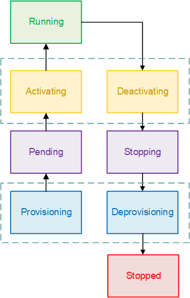

# Amazon ECS task lifecycle

When a task is started, either manually or as part of a service, it can pass through
several states before it finishes on its own or is stopped manually. Some tasks are
meant to run as batch jobs that naturally progress through from `PENDING` to
`RUNNING` to `STOPPED`. Other tasks, which can be part of a
service, are meant to continue running indefinitely, or to be scaled up and down as
needed.

When task status changes are requested, such as stopping a task or updating the
desired count of a service to scale it up or down, the Amazon ECS container agent tracks
these changes as the last known status (`lastStatus`) of the task and the
desired status (`desiredStatus`) of the task. Both the last known status and
desired status of a task can be seen either in the console or by describing the task
with the API or AWS CLI.

The flow chart below shows the task lifecycle flow.

## Lifecycle states

The following are descriptions of each of the task lifecycle states.

PROVISIONING

Amazon ECS has to perform additional steps before the task is launched. For
example, for tasks that use the `awsvpc` network mode, the elastic
network interface needs to be provisioned.

PENDING

This is a transition state where Amazon ECS is waiting on the container agent to
take further action. A task stays in the pending state until there are available
resources for the task.

ACTIVATING

This is a transition state where Amazon ECS has to perform additional steps after
the task is launched but before the task can transition to the
`RUNNING` state. This is the state where Amazon ECS pulls the container images, creates the containers, configures the task networking, registers load balancer target groups, and configures service discovery.

RUNNING

The task is successfully running.

DEACTIVATING

This is a transition state where Amazon ECS has to perform additional steps before
the task is stopped. For example, for tasks that are part of a service that's
configured to use Elastic Load Balancings target groups, the target group deregistration
occurs during this state.

STOPPING

This is a transition state where Amazon ECS is waiting on the container agent to
take further action.

For Linux containers, the container agent will send the `SIGTERM`
signal to notify the application needs to finish and shut down, and then
send a `SIGKILL` after waiting the `StopTimeout` duration
set in the task definition.

DEPROVISIONING

Amazon ECS has to perform additional steps after the task has stopped but before
the task transitions to the `STOPPED` state. For example, for tasks
that use the `awsvpc` network mode, the elastic network interface
needs to be detached and deleted.

STOPPED

The task has been successfully stopped.

If your task stopped because of an error, see [Viewing Amazon ECS stopped task errors](stopped-task-errors.md "stopped-task-errors.md").

DELETED

This is a transition state when a task stops. This state is not displayed in
the console, but is displayed in `describe-tasks`.
