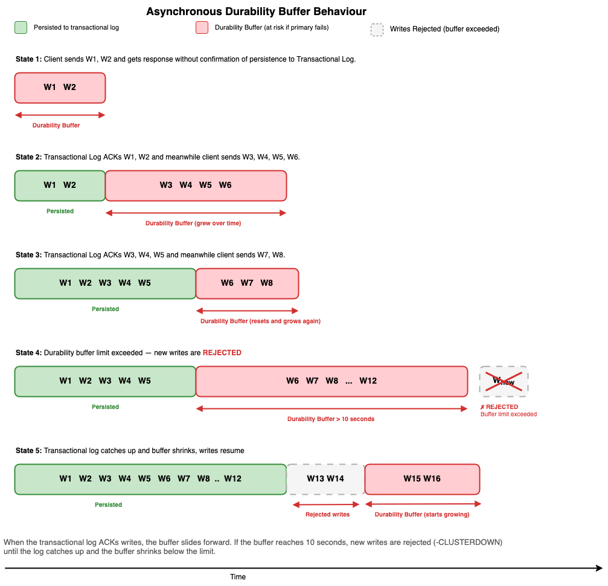

# Durability options

ElastiCache for Valkey offers two durability options: synchronous and asynchronous writes.

With synchronous writes, successful write operations are durably stored in the Multi-AZ transactional
log before returning to clients. This incurs single-digit millisecond write latency and ensures that no
acknowledged write operations will be lost in the event of a failure.

With asynchronous writes, successful write operations are returned to clients before being durably
stored in the Multi-AZ transactional log. Since the write operations don't wait to be durably stored in
the Multi-AZ transactional log, the write operation latency is equivalent to ElastiCache without durability.
However, up to the last 10 seconds of successful write operations may be lost in the event of a failure.

To understand the potential data loss with asynchronous writes, consider the concept of a durability
buffer. The durability buffer represents the maximum age of any write that has been accepted by the
primary node but not yet persisted to the Multi-AZ transactional log. The primary node tracks the age
of the oldest unacknowledged write. As long as this age remains under 10 seconds, the node continues
accepting new writes normally. If the age of the oldest unacknowledged write grows beyond 10 seconds,
the primary node will reject all incoming write commands until it catches up. Read operations continue
to be served at microsecond latency during this period. Once the pending writes are persisted, the node
resumes accepting writes automatically. This ensures that potential data loss is limited to 10 seconds
worth of writes in the event of a failure.

When configuring your client to send traffic to an asynchronous durable cluster, ensure that the
client automatically retries with exponential backoff any write commands that are rejected with the
cluster down error message. For guidance on configuring your clients to handle this and other transient
errors, see [Best
practices: Valkey/Redis OSS clients and Amazon ElastiCache](https://aws.amazon.com/blogs/database/best-practices-valkey-redis-oss-clients-and-amazon-elasticache/ "https://aws.amazon.com/blogs/database/best-practices-valkey-redis-oss-clients-and-amazon-elasticache/").

## Choosing a durability option

Use synchronous writes when your application cannot tolerate any data loss during failures. With
synchronous writes, you can use ElastiCache for a broader set of use cases beyond caching where data loss
is not acceptable, such as knowledge bases for RAG applications, AI agent memory, AI agent workflow
state, payment tokenization, streaming metadata, gaming player state, and real-time inventory
management.

Use asynchronous writes when your application prioritizes write performance and can tolerate the
potential loss of up to 10 seconds of uncommitted data during a failure. This option is ideal for
workloads such as application data caching, session stores, gaming leaderboards, and real-time
analytics.

###### Eviction policy consideration for durable clusters

Durable clusters use the same default parameter group as non-durable clusters.
This parameter group sets `maxmemory-policy` to
`volatile-lru`. With this policy, Amazon ElastiCache might evict
keys that have a time to live (TTL) set when memory is under pressure. This
can happen even on a durable cluster.

To prevent eviction of keys with a TTL, create a custom parameter
group and set `maxmemory-policy` to `noeviction`. With
`noeviction`, write commands return an error when memory is full
rather than removing keys.

Monitor `BytesUsedForCache` and
`DatabaseMemoryUsagePercentage` to make sure your cluster has enough
memory for your workload.
