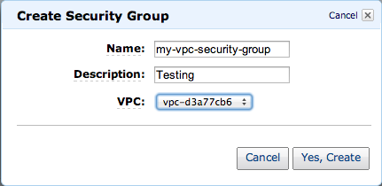

# Creating a Virtual Private Cloud (VPC)

In this example, you create an Amazon VPC with a private subnet for each Availability
Zone.

## Creating an Amazon VPC (Console)

1. Sign in to the AWS Management Console, and open the Amazon VPC console at [https://console.aws.amazon.com/vpc/](https://console.aws.amazon.com/vpc/ "https://console.aws.amazon.com/vpc/").
2. In the VPC dashboard, choose **Create VPC**.
3. Under **Resources** to create, choose **VPC and more**.
4. Under **Number of Availability Zones (AZs)**, choose the number of Availability Zones you want to launch your subnets in.
5. Under **Number of public subnets**, choose the number of public subnets you want to add to your VPC.
6. Under **Number of private subnets**, choose the number of private subnets you want to add to your VPC.

###### Tip

Make a note of your subnet identifiers, and which are public and private. You will need
this information later when you launch your clusters and add an
Amazon EC2 instance to your Amazon VPC. 7. Create an Amazon VPC security group. You will use this group for your cluster and your Amazon EC2
instance.

    1. In the navigation pane of the Amazon VPC Management console, choose **Security
     Groups**.
    2. Choose **Create Security Group**.
    3. Type a name and a description for your security group in the corresponding boxes.
     In the **VPC** box, choose the identifier for your Amazon VPC.

    
    4. When the settings are as you want them, choose **Yes, Create**.

8.  Define a network ingress rule for your security group. This rule will allow you to connect to
    your Amazon EC2 instance using Secure Shell (SSH).
    1.  In the navigation list, choose **Security Groups**.
    2.  Find your security group in the list, and then choose it.
    3.  Under **Security Group**, choose the **Inbound** tab.
        In the **Create a new rule** box,
        choose **SSH**,
        and then choose **Add Rule**.
    4.  Set the following values for your new inbound rule to allow HTTP access:

            * Type: HTTP
            * Source: 0.0.0.0/0

        Choose **Apply Rule Changes**.

Now you are ready to create a cache subnet group and launch a cluster in your Amazon VPC.

- [Creating a subnet group](SubnetGroups.md "SubnetGroups.md")
- [Creating a Memcached cluster (console)](Clusters.md#Clusters.Create.CON.Memcached "Clusters.md#Clusters.Create.CON.Memcached").
- [Creating a Valkey (cluster mode disabled) cluster (Console)](SubnetGroups.designing-cluster-pre.md#Clusters.Create.CON.valkey-gs "SubnetGroups.designing-cluster-pre.md#Clusters.Create.CON.valkey-gs").
