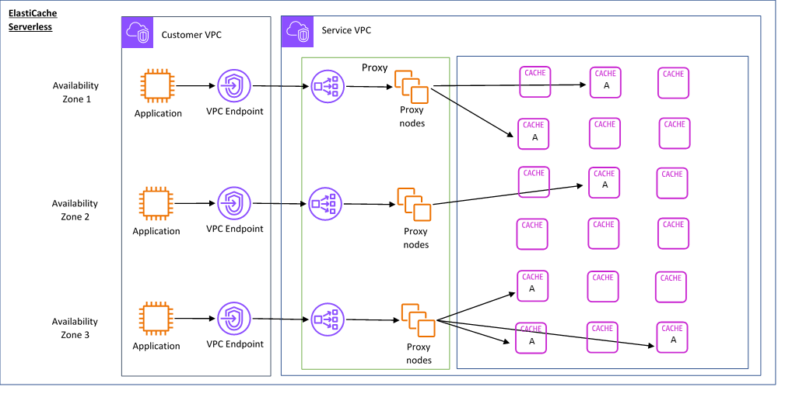
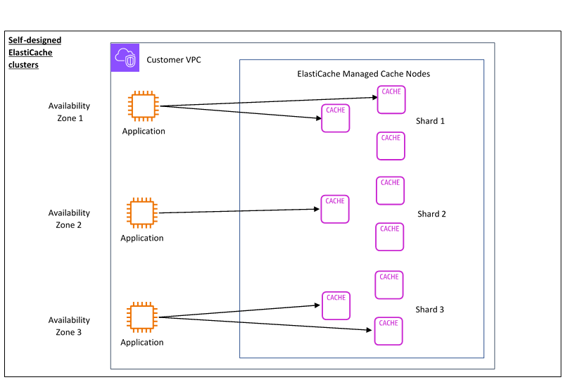

# How ElastiCache works

Here you can find an overview of the major components of an ElastiCache deployment.

## Cache and caching engines

A cache is an in-memory data store that you can use to store cached data. Typically, your application will cache
frequently accessed data in a cache to optimize response times. ElastiCache offers two deployment options:
serverless caches and node-based clusters. See [Choosing between deployment options](WhatIs.md "WhatIs.md").

###### Note

Amazon ElastiCache works with the Valkey, Memcached, and Redis OSS engines. If you're unsure which engine you want to use, see [Comparing node-based Valkey, Memcached, and Redis OSS clusters](SelectEngine.md "SelectEngine.md") in this guide.

###### Topics

- [How ElastiCache works](#WhatIs.HowELCworks "#WhatIs.HowELCworks")
- [Pricing dimensions](#WhatIs.ELCpricing "#WhatIs.ELCpricing")
- [ElastiCache backups](#WhatIs.corecomponents.backups-redis "#WhatIs.corecomponents.backups-redis")

### How ElastiCache works

**ElastiCache Serverless**

ElastiCache Serverless enables you to create a cache without worrying about capacity planning,
hardware management, or cluster design. You simply provide a name for your cache and you receive a
single endpoint that you can configure in your Valkey, Memcached, Redis OSS client to begin accessing your
cache.

###### Note

- ElastiCache Serverless runs Valkey, Memcached, or Redis OSS in cluster mode
  and is only compatible with clients that support TLS.

**Key Benefits**

- **No capacity planning:**
  ElastiCache Serverless removes the need for you to plan for capacity. ElastiCache Serverless continuously monitors
  the memory, compute, and network bandwidth utilization of your cache and scales both vertically and horizontally.
  It allows a cache node to grow in size, while in parallel initiating a scale-out operation to ensure that the
  cache can scale to meet your application requirements at all times.
- **Pay-per-use:**
  With ElastiCache Serverless, you pay for the data stored and compute utilized by your workload on the cache.
  See [Pricing dimensions](#WhatIs.ELCpricing "#WhatIs.ELCpricing").
- **High-availability:**
  ElastiCache Serverless automatically replicates your data across multiple Availability Zones (AZ) for high-availability.
  It automatically monitors the underlying cache nodes and replaces them in case of failures. It offers a 99.99%
  availability SLA for every cache.
- **Automatic software upgrades:**
  ElastiCache Serverless automatically upgrades your cache to the latest minor and patch software version without
  any availability impact to your application. When a new major version is available, ElastiCache will
  send you a notification.
- **Security:**
  Serverless always encrypts data in transit and at rest. You can use a service managed key or use your own
  Customer Managed Key to encrypt data at rest.

The following diagram illustrates how ElastiCache Serverless works.

When you create a new serverless cache, ElastiCache creates a Virtual Private Cloud (VPC) Endpoint in the subnets of
your choice in your VPC. Your application can connect to the cache through these VPC Endpoints.

With ElastiCache Serverless you receive a single DNS endpoint that your application connects to. When you
request a new connection to the endpoint, ElastiCache Serverless handles all cache connections through a proxy layer.
The proxy layer helps reduce complex client configuration, because the client does not need to rediscover cluster topology
in case of changes to the underlying cluster. The proxy layer is a set of proxy nodes that handle connections using a
network load balancer.

When your application creates a new cache connection, the request is sent to a proxy node by
the network load balancer. When your application executes cache commands, the proxy node that is connected to
your application executes the requests on a cache node in your cache. The proxy layer abstracts the cluster topology
and nodes from your client. This enables ElastiCache to intelligently load balance, scale out and add new cache nodes,
replace cache nodes when they fail, and update software on the cache nodes, all without availability impact to
your application or having to reset connections.

**Node-based clusters**

You can create a node-based ElastiCache cluster by choosing a cache node family, size, and number of nodes for your cluster. Creating a node-based cluster gives you finer grained control and enables you to choose the number of shards in your cache and the number of nodes (primary and replica) in each shard. You can choose to operate Valkey or Redis OSS in cluster mode by creating a cluster with multiple shards, or in non-cluster mode with a single shard.

**Key Benefits**

- **Create a node-based cluster:**
  With ElastiCache, you can create a node-based cluster and choose where you want to place your cache nodes. For example, if you have an application that wants to trade-off high-availability for low latency, you can choose to deploy your cache nodes in a single AZ. Alternatively, you can create a node-based cluster with nodes across multiple AZs to achieve high-availability.
- **Fine-grained control:**
  When creating a node-based cluster, you have more control over fine-tuning the settings on your cache. For example, you can use [Valkey and Redis OSS parameters](ParameterGroups.md#ParameterGroups.Redis "ParameterGroups.md#ParameterGroups.Redis") or [Memcached specific parameters](ParameterGroups.md#ParameterGroups.Memcached "ParameterGroups.md#ParameterGroups.Memcached") to configure the cache engine.
- **Scale vertically and horizontally:**
  You can choose to manually scale your cluster by increasing or decreasing the cache node size when needed.
  You can also scale horizontally by adding new shards or adding more replicas to your shards. You can also use the
  Auto-Scaling feature to configure scaling based on a schedule or scaling based on metrics like CPU and Memory usage
  on the cache.

The following diagram illustrates how node-based ElastiCache clusters work.

### Pricing dimensions

You can deploy ElastiCache in two deployment options. When deploying ElastiCache Serverless, you pay for usage for data stored in
GB-hours and compute in ElastiCache Processing Units (ECPU). When creating a node-based cluster, you pay per hour
of the cache node usage. See pricing details [here](https://aws.amazon.com/elasticache/pricing/ "https://aws.amazon.com/elasticache/pricing/").

**Data storage**

You pay for data stored in ElastiCache Serverless billed in gigabyte-hours (GB-hrs). ElastiCache Serverless continuously monitors
the data stored in your cache, sampling multiple times per minute, and calculates an hourly average to determine
the cache’s data storage usage in GB-hrs. Each ElastiCache Serverless cache is metered for a minimum of 1 GB of data stored.

**ElastiCache Processing Units (ECPUs)**

You pay for the requests your application executes on ElastiCache Serverless in ElastiCache Processing Units (ECPUs), a unit that includes both vCPU time and data transferred.

- Simple reads and writes require 1 ECPU for each kilobyte (KB) of data transferred. For example, a GET command that transfers up to 1 KB of data consumes 1 ECPU. A SET request that transfers 3.2 KB of data will consume 3.2 ECPUs.
- With Valkey and Redis OSS, commands that consume more vCPU time and transfer more data consume ECPUs based on the higher of the two dimensions. For example, if your application uses the HMGET command, consumes 3 times the vCPU time as a simple SET/GET command, and transfers 3.2 KB of data, it will consume 3.2 ECPU. Alternatively, if it transfers only 2 KB of data, it will consume 3 ECPUs.
- With Valkey and Redis OSS, commands that require additional vCPU time will consume proportionally more ECPUs. For example, if your application uses the Valkey or Redis OSS [HMGET command](https://valkey.io/commands/hmget/ "https://valkey.io/commands/hmget/"), and consumes 3 times the vCPU time as a simple SET/GET command, then it will consume 3 ECPUs.
- With Memcached, commands that operate on multiple items will consume proportionally more ECPUs. For example, if your application performs a multiget on 3 items, it will consume 3 ECPUs.
- With Memcached, commands that operate on more items and transfer more data consume ECPUs based on the higher of the two dimensions. For example, if your application uses the GET command, retrieves 3 items, and transfers 3.2 KB of data, it will consume 3.2 ECPU. Alternatively, if it transfers only 2 KB of data, it will consume 3 ECPUs.

ElastiCache Serverless emits a new metric called `ElastiCacheProcessingUnits` that helps you understand the ECPUs consumed by your workload.

**Node hours**

You can create a node-based cluster by choosing the EC2 node family, size, number of nodes, and placement across Availability Zones.
When creating a node-based cluster, you pay per hour for each cache node.

### ElastiCache backups

A _backup_ is a point-in-time copy of a serverless cache, or a Valkey or Redis OSS node-based cluster.
ElastiCache enables you to take a backup of your data at any time or setup automatic backups. Backups can be used to restore an existing cache or to seed a new cache. Backups consist of all the data in a cache plus some metadata. For more information see [Snapshot and restore](backups.md "backups.md").
