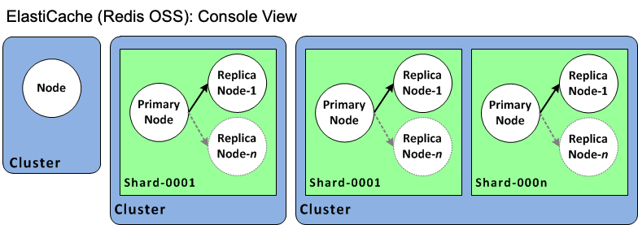
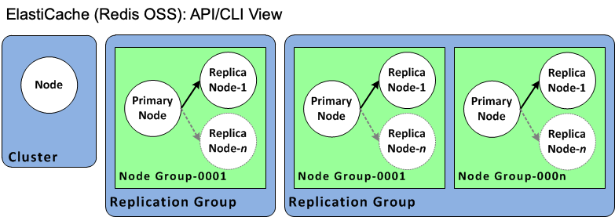

# ElastiCache terminology

In October 2016, Amazon ElastiCache launched support for Redis OSS 3.2. At that point, we added support
for partitioning your data across up to 500 shards (called node groups in
the ElastiCache API and AWS CLI). To preserve compatibility with previous versions, we extended
API version 2015-02-02 operations to include the new Redis OSS functionality.

At the same time, we began using terminology in the ElastiCache console that is used in this
new functionality and common across the industry. These changes mean that at some
points, the terminology used in the API and CLI might be different from the terminology
used in the console. The following list identifies terms that might differ between the
API and CLI and the console.

**Cache cluster or node vs. node**

There is a one-to-one relationship between a node and a cluster when there are no
replica nodes. Thus, the ElastiCache console often used the terms interchangeably.
The console now uses the term _node_
throughout. The one exception is the **Create Cluster**
button, which launches the process to create a cluster with or without
replica nodes.

The ElastiCache API and AWS CLI continue to use the terms as they have in the past.

**Cluster vs. Valkey or Redis OSS replication group**

The console now uses the term _cluster_ for all ElastiCache for Redis OSS
clusters. The console uses the term cluster in all these circumstances:

- When the cluster is a single node Valkey or Redis OSS cluster.
- When the cluster is a Valkey or Redis OSS (cluster mode disabled) cluster that supports replication within a single shard
  (in the API and CLI, called a _node group_).
- When the cluster is a Valkey or Redis OSS (cluster mode enabled) cluster that supports replication within
  1-90 shards or up to 500 with a limit increase request. To request a limit increase, see
  [AWS service limits](../../../general/latest/gr/aws_service_limits.md "../../../general/latest/gr/aws_service_limits.md")
  and choose the limit type **Nodes per cluster per instance type**.

For more information on Valkey or Redis OSS replication groups, see [High availability using replication groups](Replication.md "Replication.md").

The following diagram illustrates the various
topologies of ElastiCache for Redis OSS clusters from the console's
perspective.

The ElastiCache API and AWS CLI operations still distinguish single node ElastiCache for Redis OSS clusters
from multi-node Valkey or Redis OSS replication groups. The following diagram illustrates the
various ElastiCache for Redis OSS topologies from the ElastiCache API and AWS CLI
perspective.

**Valkey or Redis OSS Replication group vs. global datastore**
A global datastore is a collection of one or more clusters that replicate to one another across Regions, whereas a Valkey or Redis OSS replication group replicates data
across a cluster mode enabled cluster with multiple shards. A global datastore consists of the following:

- **Primary (active) cluster** – A primary
  cluster accepts writes that are replicated to all clusters within the global
  datastore. A primary cluster also accepts read requests.
- **Secondary (passive) cluster** – A secondary
  cluster only accepts read requests and replicates data updates from a primary
  cluster. A secondary cluster needs to be in a different AWS Region than the primary
  cluster.

For information on global datastores, see [Replication across AWS Regions using global
datastores](Redis-Global-Datastore.md "Redis-Global-Datastore.md").
