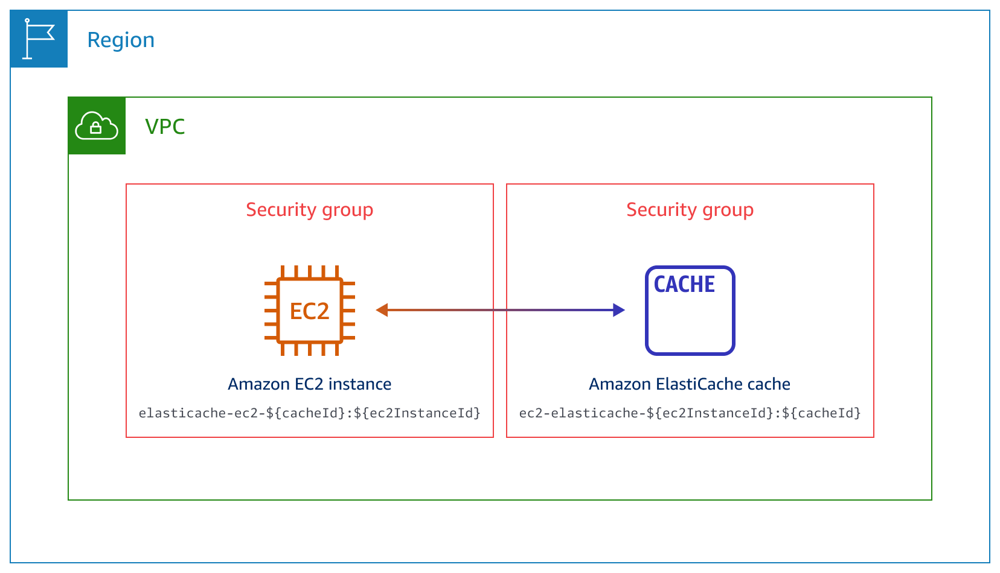
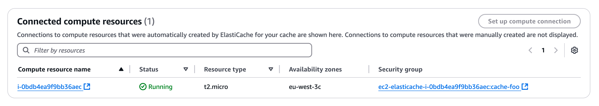

# Connecting an EC2 instance and an ElastiCache cache automatically

You can use the ElastiCache console to simplify setting up a connection between an Amazon Elastic Compute Cloud (Amazon EC2) instance and an ElastiCache cache. Often, your
cache is in a private subnet and your EC2 instance is in a public subnet
within a VPC. You can use a SQL client on your EC2 instance to connect to your ElastiCache cache. The EC2 instance can also run web servers or applications that access
your private ElastiCache cache.

###### Topics

- [Automatic connectivity with an EC2 instance](#ec2-elc-connect-overview "#ec2-elc-connect-overview")
- [Viewing connected compute resources](#ec2-elc-connect-viewing "#ec2-elc-connect-viewing")

## Automatic connectivity with an EC2 instance

When you set up a connection between an EC2 instance and an ElastiCache cache, ElastiCache automatically configures the
VPC security group for your EC2 instance and for your ElastiCache cache.

The following are requirements for connecting an EC2 instance with an ElastiCache cache:

- The EC2 instance must exist in the same VPC as the ElastiCache cache.

If no EC2 instances exist in the same VPC,
then the console provides
a link to create one.

- The user who sets up connectivity must have permissions to perform the following Amazon EC2 operations. These permissiosn are generally added to EC2 accounts when they're created. For more information on EC2 permissions, see [Granting required permissions for Amazon EC2 resources](../../../AWSEC2/latest/APIReference/ec2-api-permissions.md "../../../AWSEC2/latest/APIReference/ec2-api-permissions.md").
  - `ec2:AuthorizeSecurityGroupEgress`
  - `ec2:AuthorizeSecurityGroupIngress`
  - `ec2:CreateSecurityGroup`
  - `ec2:DescribeInstances`
  - `ec2:DescribeNetworkInterfaces`
  - `ec2:DescribeSecurityGroups`
  - `ec2:ModifyNetworkInterfaceAttribute`
  - `ec2:RevokeSecurityGroupEgress`

When you set up a connection to an EC2 instance, ElastiCache acts
according to the current configuration of the security groups associated with the ElastiCache cache and EC2 instance, as
described in the following table.

| Current ElastiCache security group configuration                                                                                                                                                                                                                                                                                                                                                                                                                                                                                                                                                                                                                                                                                                                                        | Current EC2 security group configuration                                                                                                                                                                                                                                                                                                                                                                                                                                                                                                                                                                                                                                                       | ElastiCache action                                                                                                                                                                                                                                              |
| --------------------------------------------------------------------------------------------------------------------------------------------------------------------------------------------------------------------------------------------------------------------------------------------------------------------------------------------------------------------------------------------------------------------------------------------------------------------------------------------------------------------------------------------------------------------------------------------------------------------------------------------------------------------------------------------------------------------------------------------------------------------------------------- | ---------------------------------------------------------------------------------------------------------------------------------------------------------------------------------------------------------------------------------------------------------------------------------------------------------------------------------------------------------------------------------------------------------------------------------------------------------------------------------------------------------------------------------------------------------------------------------------------------------------------------------------------------------------------------------------------- | --------------------------------------------------------------------------------------------------------------------------------------------------------------------------------------------------------------------------------------------------------------- | ---------------------------------------------------------------------------------------------------------------------------------------------------------------------------------------------------------------------------------------------------------------------------------------------------------------------------------------------------------------------------------------------------------------------------------------------------------------------------------------------------------------------------------------------------------------------------------------------------------------------------------------------------------------------------------------------------------------------------------------------------------------------------------------------------------------------------------------------------------------------------------------------------------------------------------------------------------------------------------------------------------------------------------------------------------------------------------------------------------------------------------------------------------------------------------------------------------------------------------------------------------------------------------------------------------------------------------------------------------------------------------------------------------------------------------------------------------------------------------------------------------------------------------------------------------------------------------------------------------------------------------------------------------------------------------------------------------------------------------------------------------------------------------------------------------------------------------------------------------------------------------------------------------------------------------------------------------------------------------------------------------------------------------------------------------------------------- |
| There are one or more security groups associated with the ElastiCache cache with a name that matches the pattern `elasticache-ec2-${cacheId}:${ec2InstanceId}`. A security group that matches the pattern hasn't been modified. This security group has only one inbound rule with the VPC security group of the EC2 instance as the source.                                                                                                                                                                                                                                                                                                                                                                                                                                            | There are one or more security groups associated with the EC2 instance with a name that matches the pattern `elasticache-ec2-${cacheId}:${ec2InstanceId}`. A security group that matches the pattern hasn't been modified. This security group has only one outbound rule with the VPC security group of the ElastiCache cache as the source.                                                                                                                                                                                                                                                                                                                                                  | ElastiCache takes no action. A connection was already configured automatically between the EC2 instance and the ElastiCache cache. Because a connection already exists between the EC2 instance and the ElastiCache cache, the security groups aren't modified. |
| Either of the following conditions apply:  • There is no security group associated with the ElastiCache cache with a name that matches the pattern `elasticache-ec2-${cacheId}:${ec2InstanceId}`.  • There are one or more security groups associated with the ElastiCache cache with a name that matches the pattern `elasticache-ec2-${cacheId}:${ec2InstanceId}`. However, ElastiCache can't use any of these security groups for the connection with the EC2 instance. ElastiCache can't use a security group that doesn't have one inbound rule with the VPC security group of the EC2 instance as the source. ElastiCache also can't use a security group that has been modified. Examples of modifications include adding a rule or changing the port of an existing rule. | Either of the following conditions apply:  • There is no security group associated with the EC2 instance with a name that matches the pattern `ec2-elasticache-${ec2InstanceId}:${cacheId}`.  • There are one or more security groups associated with the EC2 instance with a name that matches the pattern `ec2-elasticache-${ec2InstanceId}:${cacheId}`. However, ElastiCache can't use any of these security groups for the connection with the ElastiCache cache. ElastiCache can't use a security group that doesn't have one outbound rule with the VPC security group of the ElastiCache cache as the source. ElastiCache also can't use a security group that has been modified. | [ELC action: create new security groups](#elc-action-create-new-security-groups "#elc-action-create-new-security-groups")                                                                                                                                       |
| There are one or more security groups associated with the ElastiCache cache with a name that matches the pattern `elasticache-ec2-${cacheId}:${ec2InstanceId}`. A security group that matches the pattern hasn't been modified. This security group has only one inbound rule with the VPC security group of the EC2 instance as the source.                                                                                                                                                                                                                                                                                                                                                                                                                                            | There are one or more security groups associated with the EC2 instance with a name that matches the pattern `elasticache-ec2-${cacheId}:${ec2InstanceId}`. However, ElastiCache can't use any of these security groups for the connection with the ElastiCache cache. ElastiCache can't use a security group that doesn't have one outbound rule with the VPC security group of the ElastiCache cache as the source. ElastiCache also can't use a security group that has been modified.                                                                                                                                                                                                       | [ELC action: create new security groups](#elc-action-create-new-security-groups "#elc-action-create-new-security-groups")                                                                                                                                       |
| There are one or more security groups associated with the ElastiCache cache with a name that matches the pattern `elasticache-ec2-${cacheId}:${ec2InstanceId}`. A security group that matches the pattern hasn't been modified. This security group has only one inbound rule with the VPC security group of the EC2 instance as the source.                                                                                                                                                                                                                                                                                                                                                                                                                                            | A valid EC2 security group for the connection exists, but it is not associated with the EC2 instance. This security group has a name that matches the pattern `ec2-elasticache-${ec2InstanceId}:${cacheId}`. It hasn't been modified. It has only one outbound rule with the VPC security group of theElastiCache cache as the source.                                                                                                                                                                                                                                                                                                                                                         | [ELC action: associate EC2 security group](#elc-action-associate-ec2-security-group "#elc-action-associate-ec2-security-group")                                                                                                                                 |
| Either of the following conditions apply:  • There is no security group associated with the ElastiCache cache with a name that matches the pattern `elasticache-ec2-${cacheId}:${ec2InstanceId}`.  • There are one or more security groups associated with the ElastiCache cache with a name that matches the pattern `elasticache-ec2-${cacheId}:${ec2InstanceId}`. However, ElastiCache can't use any of these security groups for the connection with the EC2 instance. ElastiCache can't use a security group that doesn't have one inbound rule with the VPC security group of the EC2 instance as the source. ElastiCache also can't use security group that has been modified.                                                                                             | There are one or more security groups associated with the EC2 instance with a name that matches the pattern `ec2-elasticache-${ec2InstanceId}:${cacheId}`. A security group that matches the pattern hasn't been modified. This security group has only one outbound rule with the VPC security group of the ElastiCache cache as the source.                                                                                                                                                                                                                                                                                                                                                  | [ELC action: create new security groups](#elc-action-create-new-security-groups "#elc-action-create-new-security-groups")                                                                                                                                       | ###### ElastiCache action: create new security groups ElastiCache takes the following actions:  • Creates a new security group that matches the pattern `elasticache-ec2-${cacheId}:${ec2InstanceId}`. This security group has an inbound rule with the VPC security group of the EC2 instance as the source. This security group is associated with the ElastiCache cache and allows the EC2 instance to access it.  • Creates a new security group that matches the pattern `elasticache-ec2-${cacheId}:${ec2InstanceId}`. This security group has an outbound rule with the VPC security group of the ElastiCache cache as the target. This security group is associated with the EC2 instance and allows the EC2 instance to send traffic to the ElastiCache cache. ###### ElastiCache action: associate EC2 security group ElastiCache associates the valid, existing EC2 security group with the EC2 instance. This security group allows the EC2 instance to send traffic to the ElastiCache cache. ## Viewing connected compute resources You can use the AWS Management Console to view the compute resources that are connected to an ElastiCache cache. The resources shown include compute resource connections that were set up automatically. For example, you can allow a compute resource to access a cache manually by adding a rule to the VPC security group associated with the cache. These resources will not appear in the connected compute resources list. For a compute resource to be listed, the same conditions must apply as when automatically connecting an EC2 instance and an ElastiCache cache. ###### To view compute resources connected to an ElastiCache cache 1. Sign in to the AWS Management Console and open the ElastiCache console 2. In the navigation pane, choose **Caches**, and then choose a Valkey or Redis OSS cache. 3. On the **Connectivity & security** tab, view the compute resources in the **Set up compute connection**.  |
