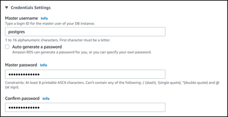

# Understanding PostgreSQL roles and

permissions

When you create an Aurora PostgreSQL DB cluster
using the AWS Management Console, an
administrator account is created at the same time. By default, its name is
`postgres`, as shown in the following screenshot:

You can choose another name rather than accept the default (`postgres`). If you
do, the name you choose must start with a letter and be between 1 and 16 alphanumeric
characters. For simplicity's sake, we refer to this main user account by its default value
(`postgres`) throughout this guide.

If you use the `create-db-cluster` AWS CLI rather than the
AWS Management Console, you create the user name by passing it with the `master-username`
parameter. For more information, see [Step 2: Create an
Aurora PostgreSQL DB cluster](CHAP_GettingStartedAurora.CreatingConnecting.md#CHAP_GettingStarted.AuroraPostgreSQL.CreateDBCluster "CHAP_GettingStartedAurora.CreatingConnecting.md#CHAP_GettingStarted.AuroraPostgreSQL.CreateDBCluster").

Whether you use the AWS Management Console, the AWS CLI, or the Amazon RDS API, and whether you use the default
`postgres` name or choose a different name, this first database user account is a
member of the `rds_superuser` group and has `rds_superuser`
privileges.

###### Topics

- [Understanding the
  rds_superuser role](Appendix.PostgreSQL.CommonDBATasks.Roles.md "Appendix.PostgreSQL.CommonDBATasks.Roles.md")
- [Controlling user access to the
  PostgreSQL database](Appendix.PostgreSQL.CommonDBATasks.md "Appendix.PostgreSQL.CommonDBATasks.md")
- [Delegating and
  controlling user password management](Appendix.PostgreSQL.CommonDBATasks.md "Appendix.PostgreSQL.CommonDBATasks.md")
- [Using SCRAM for PostgreSQL
  password encryption](PostgreSQL_Password_Encryption_configuration.md "PostgreSQL_Password_Encryption_configuration.md")
