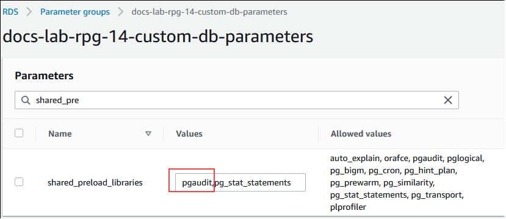
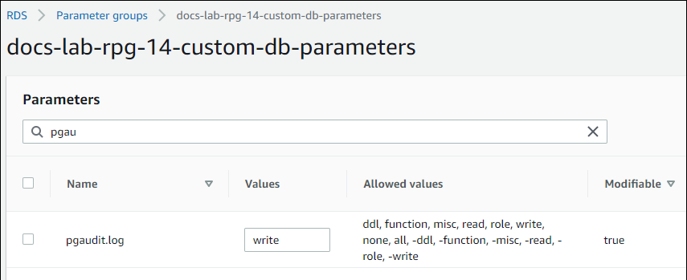

# Setting up the pgAudit extension

To set up the pgAudit extension on your
Aurora PostgreSQL DB cluster, you first add pgAudit to the shared libraries
on the
custom DB cluster parameter group for your Aurora PostgreSQL DB cluster. For information
about creating a custom DB cluster parameter group, see
[Parameter groups for Amazon Aurora](USER_WorkingWithParamGroups.md "USER_WorkingWithParamGroups.md").
Next, you
install the pgAudit extension. Finally, you specify the databases and objects that you want to audit.
The procedures in this section show you how. You can use the AWS Management Console or the AWS CLI.

You must have permissions as the `rds_superuser` role to perform all these tasks.

The steps following assume that your Aurora PostgreSQL DB cluster
is associated with a custom DB cluster
parameter group.

###### To set up the pgAudit extension

1. Sign in to the AWS Management Console and open the Amazon RDS console at
   [https://console.aws.amazon.com/rds/](https://console.aws.amazon.com/rds/ "https://console.aws.amazon.com/rds/").
2. In the navigation pane, choose your Aurora PostgreSQL DB
   cluster's Writer instance
   .
3. Open the **Configuration** tab for your
   Aurora PostgreSQL DB cluster writer instance.
   Among the Instance details, find
   the **Parameter group** link.
4. Choose the link to open the custom parameters associated with your Aurora PostgreSQL DB cluster.
5. In the **Parameters** search field, type `shared_pre` to
   find the `shared_preload_libraries` parameter.
6. Choose **Edit parameters** to access the property values.
7. Add `pgaudit` to the list in the **Values** field. Use
   a comma to separate items in the list of values.

 8. Reboot the writer instance of your Aurora PostgreSQL
DB cluster so that
your change to the `shared_preload_libraries` parameter takes effect. 9. When the instance is available, verify that pgAudit
has been initialized. Use `psql` to connect to the writer instance
of your Aurora PostgreSQL DB cluster,
and then run the following command.

```
`SHOW shared_preload_libraries;`
`shared_preload_libraries
--------------------------
rdsutils,pgaudit
(1 row)`
```

10. With pgAudit initialized, you can now create the extension. You need to create the
    extension after initializing the library because the `pgaudit` extension
    installs event triggers for auditing data definition language (DDL) statements.

```
CREATE EXTENSION pgaudit;
```

11. Close the `psql` session.

```
`labdb=>` `\q`
```

12. Sign in to the AWS Management Console and open the Amazon RDS console at
    [https://console.aws.amazon.com/rds/](https://console.aws.amazon.com/rds/ "https://console.aws.amazon.com/rds/").
13. Find the `pgaudit.log` parameter in the list and set to the appropriate value for your
    use case. For example, setting the `pgaudit.log` parameter to `write` as
    shown in the following image captures inserts, updates, deletes, and
    some other types changes to the log.



You can also choose one of the following values for the `pgaudit.log` parameter.

    * none – This is the default. No database changes are logged.
    * all – Logs everything (read, write, function, role, ddl, misc).
    * ddl – Logs all data definition language (DDL) statements that
     aren't included in the `ROLE` class.
    * function – Logs function calls and `DO` blocks.
    * misc – Logs miscellaneous commands, such as `DISCARD`, `FETCH`,
     `CHECKPOINT`, `VACUUM`, and `SET`.
    * read – Logs `SELECT` and `COPY` when the source is a relation (such
     as a table) or a query.
    * role – Logs statements related to roles and privileges, such as
     `GRANT`, `REVOKE`, `CREATE ROLE`, `ALTER ROLE`, and `DROP ROLE`.
    * write – Logs `INSERT`, `UPDATE`, `DELETE`, `TRUNCATE`,
     and `COPY` when the destination is a relation (table).

14. Choose **Save changes**.
15. Open the Amazon RDS console at
    [https://console.aws.amazon.com/rds/](https://console.aws.amazon.com/rds/ "https://console.aws.amazon.com/rds/").
16. Choose your Aurora PostgreSQL DB
    cluster's writer instance
    from the
    Databases list.

###### To setup pgAudit

To setup pgAudit using the AWS CLI, you call the
[modify-db-parameter-group](../../../cli/latest/reference/rds/modify-db-parameter-group.md "../../../cli/latest/reference/rds/modify-db-parameter-group.md") operation
to modify the audit log parameters in your
custom parameter group, as shown in the following procedure.

1. Use the following AWS CLI command to add `pgaudit` to the
   `shared_preload_libraries` parameter.

```
aws rds modify-db-parameter-group \
   --db-parameter-group-name `custom-param-group-name` \
   --parameters "ParameterName=shared_preload_libraries,ParameterValue=pgaudit,ApplyMethod=pending-reboot" \
   --region `aws-region`
```

2. Use the following AWS CLI command to reboot the writer instance of your Aurora PostgreSQL
   DB cluster so that the
   pgaudit library is initialized.

```
aws rds reboot-db-instance \
    --db-instance-identifier `writer-instance` \
    --region `aws-region`
```

3. When the instance is available, you can verify that `pgaudit`
   has been initialized. Use `psql` to connect to the writer instance
   of your Aurora PostgreSQL DB cluster,
   and then run the following command.

```
`SHOW shared_preload_libraries;`
`shared_preload_libraries
--------------------------
rdsutils,pgaudit
(1 row)`
```

With pgAudit initialized, you can now create the extension.

```
CREATE EXTENSION pgaudit;
```

4. Close the `psql` session so that you can use the AWS CLI.

```
`labdb=>` `\q`
```

5. Use the following AWS CLI command to specify the classes of statement that want logged by session audit logging. The
   example sets the `pgaudit.log` parameter to `write`, which captures inserts, updates, and deletes to the
   log.

```
aws rds modify-db-parameter-group \
   --db-parameter-group-name `custom-param-group-name` \
   --parameters "ParameterName=pgaudit.log,ParameterValue=`write`,ApplyMethod=pending-reboot" \
   --region `aws-region`
```

You can also choose one of the following values for the `pgaudit.log` parameter.

    * none – This is the default. No database changes are logged.
    * all – Logs everything (read, write, function, role, ddl, misc).
    * ddl – Logs all data definition language (DDL) statements that
     aren't included in the `ROLE` class.
    * function – Logs function calls and `DO` blocks.
    * misc – Logs miscellaneous commands, such as `DISCARD`, `FETCH`,
     `CHECKPOINT`, `VACUUM`, and `SET`.
    * read – Logs `SELECT` and `COPY` when the source is a relation (such
     as a table) or a query.
    * role – Logs statements related to roles and privileges, such as
     `GRANT`, `REVOKE`, `CREATE ROLE`, `ALTER ROLE`, and `DROP ROLE`.
    * write – Logs `INSERT`, `UPDATE`, `DELETE`, `TRUNCATE`,
     and `COPY` when the destination is a relation (table).

Reboot the writer instance of your Aurora PostgreSQL
DB cluster using the following AWS CLI
command.

```
aws rds reboot-db-instance \
    --db-instance-identifier `writer-instance` \
    --region `aws-region`
```
