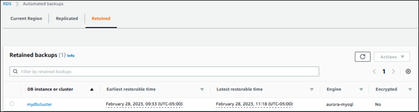

# Deleting retained automated backups for Amazon Aurora

You can delete retained automated backups when they are no longer needed. To delete a retained automated backup using the AWS Management Console, AWS CLI, or Amazon RDS API, use the following procedures.

###### To delete a retained automated backup

1. Sign in to the AWS Management Console and open the Amazon RDS console at
   [https://console.aws.amazon.com/rds/](https://console.aws.amazon.com/rds/ "https://console.aws.amazon.com/rds/").
2. In the navigation pane, choose **Automated backups**.
3. Choose the **Retained** tab.

 4. Choose the retained automated backup that you want to delete. 5. For **Actions**, choose **Delete**. 6. On the confirmation page, enter `delete me` and choose
**Delete**.
You can delete a retained automated backup by using the AWS CLI command [delete-db-cluster-automated-backup](../../../cli/latest/reference/rds/delete-db-cluster-automated-backup.md "../../../cli/latest/reference/rds/delete-db-cluster-automated-backup.md") with
the following option:

- `--db-cluster-resource-id` – The resource identifier for the source DB cluster.

You can find the resource identifier for the source DB cluster of a retained automated backup by running
the AWS CLI command [describe-db-cluster-automated-backups](../../../cli/latest/reference/rds/describe-db-cluster-automated-backups.md "../../../cli/latest/reference/rds/describe-db-cluster-automated-backups.md").

###### Example

This example deletes the retained automated backup for the source DB cluster that has the resource ID
`cluster-123ABCEXAMPLE`.

For Linux, macOS, or Unix:

```
aws rds delete-db-cluster-automated-backup \
    --db-cluster-resource-id `cluster-123ABCEXAMPLE`
```

For Windows:

```
aws rds delete-db-cluster-automated-backup ^
    --db-cluster-resource-id `cluster-123ABCEXAMPLE`
```

You can delete a retained automated backup by using the Amazon RDS API operation [DeleteDBClusterAutomatedBackup](../APIReference/API_DeleteDBClusterAutomatedBackup.md "../APIReference/API_DeleteDBClusterAutomatedBackup.md") with the
following parameter:

- `DbClusterResourceId` – The resource identifier for the source DB cluster.

You can find the resource identifier for the source DB instance of a retained automated backup using the
Amazon RDS API operation [DescribeDBClusterAutomatedBackups](../APIReference/API_DescribeDBClusterAutomatedBackups.md "../APIReference/API_DescribeDBClusterAutomatedBackups.md").
