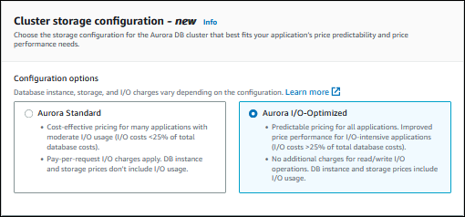
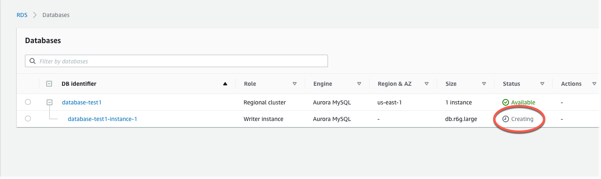
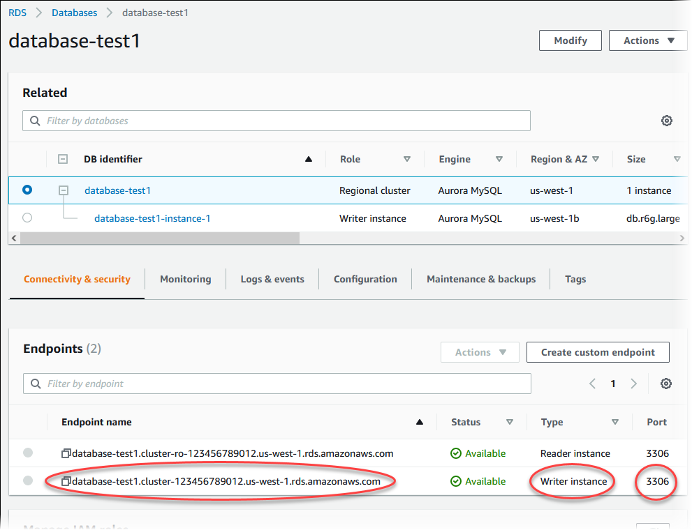

# Creating an Amazon Aurora DB cluster

An Amazon Aurora DB cluster consists of a DB instance, compatible with either MySQL or
PostgreSQL, and a cluster volume that holds the data for the DB cluster, copied across
three Availability Zones as a single, virtual volume. By default, an Aurora DB cluster contains a primary
DB instance that performs reads and writes, and, optionally, up to 15 Aurora Replicas (reader DB instances). For more
information about Aurora DB clusters, see [Amazon Aurora DB clusters](Aurora.md "Aurora.md").

Aurora has two main types of DB cluster:

- Aurora provisioned – You choose the DB instance class for the writer and reader instances based on your expected
  workload. For more information, see [Amazon Aurora DB instance classes](Concepts.md "Concepts.md").
  Aurora provisioned has several options, including Aurora global databases. For more information, see [Using Amazon Aurora Global Database](aurora-global-database.md "aurora-global-database.md").
- Aurora Serverless – Aurora Serverless v2 is an on-demand
  automatic scaling configuration for Aurora. Capacity is adjusted automatically based
  on application demand. You're charged only for the resources that your DB cluster
  consumes. This automation is especially useful for environments with highly variable
  and unpredictable workloads. For more information, see
  [Using Aurora Serverless v2](aurora-serverless-v2.md "aurora-serverless-v2.md").
  Following, you can find out how to create an Aurora DB cluster. To get
  started, first see [DB cluster prerequisites](#Aurora.CreateInstance.Prerequisites "#Aurora.CreateInstance.Prerequisites").

For instructions on connecting to your Aurora DB cluster, see [Connecting to an Amazon Aurora DB cluster](Aurora.md "Aurora.md").

###### Contents

- [DB cluster prerequisites](Aurora.md#Aurora.CreateInstance.Prerequisites "Aurora.md#Aurora.CreateInstance.Prerequisites")
  - [Configure the network for the DB cluster](Aurora.md#Aurora.CreateInstance.Prerequisites.VPC "Aurora.md#Aurora.CreateInstance.Prerequisites.VPC")
    - [Configure automatic network connectivity with
      an EC2 instance](Aurora.md#Aurora.CreateInstance.Prerequisites.VPC.Automatic "Aurora.md#Aurora.CreateInstance.Prerequisites.VPC.Automatic")
    - [Configure the network manually](Aurora.md#Aurora.CreateInstance.Prerequisites.VPC.Manual "Aurora.md#Aurora.CreateInstance.Prerequisites.VPC.Manual")

  - [Additional
    prerequisites](Aurora.md#Aurora.CreateInstance.Prerequisites.Additional "Aurora.md#Aurora.CreateInstance.Prerequisites.Additional")

- [Creating a DB cluster](Aurora.md#Aurora.CreateInstance.Creating "Aurora.md#Aurora.CreateInstance.Creating")
  - [Creating a primary (writer) DB instance](Aurora.md#aurora-create-writer "Aurora.md#aurora-create-writer")

- [Settings for Aurora DB clusters](Aurora.md#Aurora.CreateInstance.Settings "Aurora.md#Aurora.CreateInstance.Settings")
- [Settings that
  don't apply to Amazon Aurora for DB clusters](Aurora.md#Aurora.CreateDBCluster.SettingsNotApplicableDBClusters "Aurora.md#Aurora.CreateDBCluster.SettingsNotApplicableDBClusters")
- [Settings that don't apply
  to Amazon Aurora DB instances](Aurora.md#Aurora.CreateInstance.SettingsNotApplicable "Aurora.md#Aurora.CreateInstance.SettingsNotApplicable")

## DB cluster prerequisites

###### Important

Before you can create an Aurora DB cluster, you must complete the tasks in [Setting up your environment for Amazon Aurora](CHAP_SettingUp_Aurora.md "CHAP_SettingUp_Aurora.md").

The following are prerequisites to complete before creating a DB cluster.

###### Topics

- [Configure the network for the DB cluster](#Aurora.CreateInstance.Prerequisites.VPC "#Aurora.CreateInstance.Prerequisites.VPC")
- [Additional
  prerequisites](#Aurora.CreateInstance.Prerequisites.Additional "#Aurora.CreateInstance.Prerequisites.Additional")

### Configure the network for the DB cluster

You can create an Amazon Aurora DB cluster only in a virtual private cloud (VPC) based
on the Amazon VPC service, in an AWS Region that has at least two Availability
Zones. The DB subnet group that you choose for the DB cluster must cover at least
two Availability Zones. This configuration ensures that your DB cluster always has
at least one DB instance available for failover, in the unlikely event of an
Availability Zone failure.

If you plan to set up connectivity between your new DB cluster and an EC2 instance in the same
VPC, you can do so during DB cluster creation. If you plan to connect to your DB cluster
from resources other than EC2 instances in the same VPC, you can configure the network
connections manually.

###### Topics

- [Configure automatic network connectivity with
  an EC2 instance](#Aurora.CreateInstance.Prerequisites.VPC.Automatic "#Aurora.CreateInstance.Prerequisites.VPC.Automatic")
- [Configure the network manually](#Aurora.CreateInstance.Prerequisites.VPC.Manual "#Aurora.CreateInstance.Prerequisites.VPC.Manual")

#### Configure automatic network connectivity with

an EC2 instance

When you create an Aurora DB cluster, you can use the AWS Management Console to set up connectivity between an Amazon EC2 instance
and the new DB cluster. When you do so, RDS configures your VPC and network settings automatically. The DB cluster is
created in the same VPC as the EC2 instance so that the EC2 instance can access the DB cluster.

The following are requirements for connecting an EC2 instance with the DB cluster:

- The EC2 instance must exist in the AWS Region before you create the DB cluster.

If no EC2 instances exist in the AWS Region, the console provides a link to create one.

- Currently, the DB cluster can't be an Aurora Serverless DB cluster or part of an Aurora global database.
- The user who is creating the DB instance must have permissions to perform the following operations:
  - `ec2:AssociateRouteTable`
  - `ec2:AuthorizeSecurityGroupEgress`
  - `ec2:AuthorizeSecurityGroupIngress`
  - `ec2:CreateRouteTable`
  - `ec2:CreateSubnet`
  - `ec2:CreateSecurityGroup`
  - `ec2:DescribeInstances`
  - `ec2:DescribeNetworkInterfaces`
  - `ec2:DescribeRouteTables`
  - `ec2:DescribeSecurityGroups`
  - `ec2:DescribeSubnets`
  - `ec2:ModifyNetworkInterfaceAttribute`
  - `ec2:RevokeSecurityGroupEgress`

Using this option creates a private DB cluster. The DB cluster uses a DB subnet group with only
private subnets to restrict access to resources within the VPC.

To connect an EC2 instance to the DB cluster, choose **Connect to an EC2 compute resource**
in the **Connectivity** section on the **Create database** page.


When you choose **Connect to an EC2 compute resource**, RDS sets the following options automatically.
You can't change these settings unless you choose not to set up connectivity with an EC2 instance by choosing **Don't connect
to an EC2 compute resource**.

| Console option                    | Automatic setting                                                                                                                                                                                                                                                                                                                                                                                                                                                                                                                                                                                                                                                                                                                                                                                                                                                                                                                                                                                                                                                                                                                                                                                                          |
| --------------------------------- | -------------------------------------------------------------------------------------------------------------------------------------------------------------------------------------------------------------------------------------------------------------------------------------------------------------------------------------------------------------------------------------------------------------------------------------------------------------------------------------------------------------------------------------------------------------------------------------------------------------------------------------------------------------------------------------------------------------------------------------------------------------------------------------------------------------------------------------------------------------------------------------------------------------------------------------------------------------------------------------------------------------------------------------------------------------------------------------------------------------------------------------------------------------------------------------------------------------------------- |
| **Network type**                  | RDS sets network type to **IPv4**. Currently, dual-stack mode isn't supported<br>when you set up a connection between an EC2 instance and the DB cluster.                                                                                                                                                                                                                                                                                                                                                                                                                                                                                                                                                                                                                                                                                                                                                                                                                                                                                                                                                                                                                                                                  |
| **Virtual Private Cloud (VPC)**   | RDS sets the VPC to the one associated with the EC2 instance.                                                                                                                                                                                                                                                                                                                                                                                                                                                                                                                                                                                                                                                                                                                                                                                                                                                                                                                                                                                                                                                                                                                                                              |
| **DB subnet group**               | RDS requires a DB subnet group with a private subnet in the<br>same Availability Zone as the EC2 instance. If a DB subnet group<br>that meets this requirement exists, then RDS uses the existing<br>DB subnet group. By default, this option is set to<br>**Automatic setup**. When you choose<br>**Automatic setup\*<br>• and there is no DB<br>subnet group that meets this requirement, the following<br>action happens. RDS uses three available private subnets in<br>three Availability Zones where one of the Availability Zones<br>is the same as the EC2 instance. If a private subnet isn’t<br>available in an Availability Zone, RDS creates a private<br>subnet in the Availability Zone. Then RDS creates the DB<br>subnet group.When a private subnet is<br>available, RDS uses the route table associated with the<br>subnet and adds any subnets it creates to this route table.<br>When no private subnet is available, RDS creates a route<br>table without internet gateway access and adds the subnets<br>it creates to the route table.RDS also allows<br>you to use existing DB subnet groups. Select<br>**Choose existing\*<br>• if you want to use<br>an existing DB subnet group of your choice. |
| **Public access**                 | RDS chooses \*_No_<br>• so that the DB cluster isn't publicly accessible.<br>For security, it is a best practice to keep the database private and make sure it isn't<br>accessible from the internet.                                                                                                                                                                                                                                                                                                                                                                                                                                                                                                                                                                                                                                                                                                                                                                                                                                                                                                                                                                                                                      |
| **VPC security group (firewall)** | RDS creates a new security group that is associated with the DB cluster. The security group is named<br>`rds-ec2-`n`, where `n``<br>is a number. This security group includes an inbound rule with the EC2 VPC security group (firewall)<br>as the source. This security group that is associated with the DB cluster allows the EC2 instance to<br>access the DB cluster.<br>RDS also creates a new security group that is associated with the EC2 instance. The security group is named<br>`ec2-rds-`n``, where `n` is a number.<br>This security group includes an outbound rule with the VPC security group of the DB cluster as the source.<br>This security group allows the EC2 instance to send traffic to the DB cluster.<br>You can add another new security group by choosing **Create new\*<br>• and<br>typing the name of the new security group.<br>You can add existing security groups by choosing **Choose existing\*<br>• and<br>selecting security groups to add.                                                                                                                                                                                                                                       |
| **Availability Zone**             | When you don't create an Aurora Replica in \*_Availability<br>& durability_<br>• during DB cluster creation (Single-AZ deployment),<br>RDS chooses the Availability Zone of the EC2 instance.<br>When you create an Aurora Replica during DB cluster creation (Multi-AZ deployment),<br>RDS chooses the Availability Zone of the EC2 instance for one DB instance in the DB<br>cluster. RDS randomly chooses a different Availability Zone for the other DB<br>instance in the DB cluster. Either the primary DB instance or the Aurora Replica<br>is created in the same Availability Zone as the EC2 instance. There is the possibility<br>of cross Availability Zone costs if the primary DB instance and EC2 instance are in<br>different Availability Zones.                                                                                                                                                                                                                                                                                                                                                                                                                                                          |

For more information about these settings, see [Settings for Aurora DB clusters](#Aurora.CreateInstance.Settings "#Aurora.CreateInstance.Settings").

If you make any changes to these settings after the DB cluster is created, the changes might affect the connection
between the EC2 instance and the DB cluster.

#### Configure the network manually

If you plan to connect to your DB cluster from resources other than EC2 instances in the same VPC,
you can configure the network connections manually. If you use the AWS Management Console
to create your DB cluster, you can have Amazon RDS automatically create a VPC for you.
Or you can use an existing VPC or create a new VPC for your Aurora DB cluster. Whichever
approach you take, your VPC must have at least one subnet in each of at least two Availability
Zones for you to use it with an Amazon Aurora DB cluster.

By default, Amazon RDS creates the primary DB instance and the Aurora Replica in the Availability Zones
automatically for you. To choose a specific Availability Zone, you need to change the
**Availability & durability** Multi-AZ deployment setting
to **Don't create an Aurora Replica**. Doing so exposes an
**Availability Zone** setting that lets you choose from among the Availability Zones
in your VPC. However, we strongly recommend that you keep the default setting and let Amazon RDS create a Multi-AZ
deployment and choose Availability Zones for you. By doing so, your Aurora DB cluster is created
with the fast failover and high availability features that are two of Aurora's key benefits.

If you don't have a default VPC or you haven't created a VPC, you can
have Amazon RDS automatically create a VPC for you when you create a DB cluster
using the console. Otherwise, you must do the following:

- Create a VPC with at least one subnet in each of at least two of the
  Availability Zones in the AWS Region where you want to deploy your DB
  cluster. For more information, see [Working with a DB cluster in a VPC](USER_VPC.md#Overview.RDSVPC.Create "USER_VPC.md#Overview.RDSVPC.Create") and [Tutorial: Create a VPC for use with a
  DB cluster (IPv4 only)](CHAP_Tutorials.WebServerDB.md "CHAP_Tutorials.WebServerDB.md").
- Specify a VPC security group that authorizes connections to your DB
  cluster. For more information, see [Provide access to the DB cluster in the VPC by
  creating a security group](CHAP_SettingUp_Aurora.md#CHAP_SettingUp_Aurora.SecurityGroup "CHAP_SettingUp_Aurora.md#CHAP_SettingUp_Aurora.SecurityGroup") and
  [Controlling access with security
  groups](Overview.md "Overview.md").
- Specify an RDS DB subnet group that defines at least two subnets in the
  VPC that can be used by the DB cluster. For more information, see
  [Working with DB subnet groups](USER_VPC.md#USER_VPC.Subnets "USER_VPC.md#USER_VPC.Subnets").

For information on VPCs, see [Amazon VPC and Amazon Aurora](USER_VPC.md "USER_VPC.md"). For a tutorial
that configures the network for a private DB cluster, see [Tutorial: Create a VPC for use with a
DB cluster (IPv4 only)](CHAP_Tutorials.WebServerDB.md "CHAP_Tutorials.WebServerDB.md").

If you want to connect to a resource that isn't in the same VPC as the Aurora DB cluster, see the appropriate
scenarios in [Scenarios for accessing a DB cluster in a VPC](USER_VPC.md "USER_VPC.md").

### Additional

prerequisites

Before you create your DB cluster, consider the following additional prerequisites:

- If you are connecting to AWS using AWS Identity and Access Management (IAM) credentials, your AWS account must have
  IAM policies that grant the permissions required to perform Amazon RDS operations. For more information,
  see [Identity and access management for Amazon Aurora](UsingWithRDS.md "UsingWithRDS.md").

If you are using IAM to access the Amazon RDS console, you must first sign on to the AWS Management Console with
your user credentials. Then go to the Amazon RDS console at [https://console.aws.amazon.com/rds/](https://console.aws.amazon.com/rds/ "https://console.aws.amazon.com/rds/").

- If you want to tailor the configuration parameters for your DB cluster,
  you must specify a DB cluster parameter group and DB parameter group with
  the required parameter settings. For information about creating or modifying
  a DB cluster parameter group or DB parameter group, see [Parameter groups for Amazon Aurora](USER_WorkingWithParamGroups.md "USER_WorkingWithParamGroups.md").
- Determine the TCP/IP port number to specify for your DB cluster.
  The firewalls at some companies block connections to the default ports (3306 for
  MySQL, 5432 for PostgreSQL) for Aurora. If your company firewall blocks the default
  port, choose another port for your DB cluster. All instances in a DB cluster use the
  same port.
- If the major engine version for your database has reached the RDS end of
  standard support date, you must use the Extended Support CLI option or the RDS API
  parameter. For more information, see RDS Extended Support in [Settings for Aurora DB clusters](#Aurora.CreateInstance.Settings "#Aurora.CreateInstance.Settings").

## Creating a DB cluster

You can create an Aurora DB cluster using the AWS Management Console, the AWS CLI, or the RDS API.

You can create a DB cluster using the AWS Management Console with **Easy create** enabled or not enabled. With
**Easy create** enabled, you specify only the DB engine type, DB instance size, and DB instance
identifier. **Easy create** uses the default setting for other configuration options. With
**Easy create** not enabled, you specify more configuration options when you create a database,
including ones for availability, security, backups, and maintenance.

###### Note

For this example, **Standard create** is enabled, and **Easy create** isn't
enabled. For information about creating a DB cluster with **Easy create** enabled, see [Getting started with Amazon Aurora](CHAP_GettingStartedAurora.md "CHAP_GettingStartedAurora.md").

###### To create an Aurora DB cluster using the console

1. Sign in to the AWS Management Console and open the Amazon RDS console at
   [https://console.aws.amazon.com/rds/](https://console.aws.amazon.com/rds/ "https://console.aws.amazon.com/rds/").
2. In the upper-right corner of the AWS Management Console, choose the AWS Region in which you
   want to create the DB cluster.

Aurora is not available in all AWS Regions. For a list of AWS Regions where Aurora is available, see [Region availability](Concepts.md#Aurora.Overview.Availability "Concepts.md#Aurora.Overview.Availability"). 3. In the navigation pane, choose **Databases**. 4. Choose **Create database**. 5. For **Choose a database creation method**, choose **Standard create**. 6. For **Engine type**, choose one of the following:

    * **Aurora (MySQL Compatible)**
    * **Aurora (PostgreSQL Compatible)**

 7. Choose the **Engine version**.

For more information, see [Amazon Aurora versions](Aurora.md "Aurora.md"). You can
use the filters to choose versions that are compatible with features that you want, such as Aurora Serverless v2.
For more information, see [Using Aurora Serverless v2](aurora-serverless-v2.md "aurora-serverless-v2.md"). 8. In **Templates**, choose the template that matches your use case. 9. To enter your master password, do the following:

    1. In the **Settings** section, expand **Credential Settings**.
    2. Clear the **Auto generate a password** check box.
    3. (Optional) Change the **Master username** value and enter the same password
     in **Master password** and **Confirm
     password**.By default, the new DB instance uses an automatically generated password for the master user.

10. In the **Connectivity** section under **VPC security group (firewall)**, if you select **Create new**,
    a VPC security group is created with an inbound rule that allows your local computer's IP address to access the database.
11. For **Cluster storage configuration**, choose either **Aurora I/O-Optimized** or
    **Aurora Standard**. For more information, see [Storage configurations for Amazon Aurora DB
    clusters](Aurora.Overview.md#aurora-storage-type "Aurora.Overview.md#aurora-storage-type").

 12. (Optional) Set up a connection to a compute resource for this DB cluster.

You can configure connectivity between an Amazon EC2 instance and the new DB cluster during
DB cluster creation. For more information, see [Configure automatic network connectivity with
an EC2 instance](#Aurora.CreateInstance.Prerequisites.VPC.Automatic "#Aurora.CreateInstance.Prerequisites.VPC.Automatic"). 13. For the remaining sections, specify your DB cluster settings.
For information about each setting, see
[Settings for Aurora DB clusters](#Aurora.CreateInstance.Settings "#Aurora.CreateInstance.Settings"). 14. Choose **Create database**.

If you chose to use an automatically generated password, the **View credential details** button appears
on the **Databases** page.

To view the master user name and password for the DB cluster, choose **View credential details**.

To connect to the DB instance as the master user, use the user name and
password that appear.

###### Important

You can't view the master user password again. If you don't
record it, you might have to change it. If you need to change the
master user password after the DB instance is available, you can
modify the DB instance to do so. For more information about
modifying a DB instance, see [Modifying an Amazon Aurora DB cluster](Aurora.md "Aurora.md"). 15. For **Databases**, choose the name of the new Aurora DB
cluster.

On the RDS console, the details for new DB cluster appear.
The DB cluster and its DB instance have a status of **creating**
until the DB cluster is ready to use.



When the state changes to **available** for both, you can connect to the DB cluster.
Depending on the DB instance class and the amount of storage, it can take up to 20 minutes before
the new DB cluster is available.

To view the newly created cluster, choose **Databases** from
the navigation pane in the Amazon RDS console. Then choose the DB cluster to
show the DB cluster details. For more information, see [Viewing an Amazon Aurora DB cluster](accessing-monitoring.md#Aurora.Viewing "accessing-monitoring.md#Aurora.Viewing").



On the **Connectivity & security** tab, note the port and the endpoint of the writer DB instance.
Use the endpoint and port of the cluster in your JDBC and ODBC connection strings for any application
that performs write or read operations.

###### Note

Before you can create an Aurora DB cluster using the AWS CLI, you must fulfill the
required prerequisites, such as creating a VPC and an RDS DB subnet group. For more
information, see [DB cluster prerequisites](#Aurora.CreateInstance.Prerequisites "#Aurora.CreateInstance.Prerequisites").

You can use the AWS CLI to create an Aurora MySQL DB cluster or an Aurora PostgreSQL DB cluster.

###### To create an Aurora MySQL DB cluster using

the AWS CLI

When you create an Aurora MySQL 8.0-compatible or 5.7-compatible DB cluster or DB instance, you specify
`aurora-mysql` for the `--engine` option.

Complete the following steps:

1. Identify the DB subnet group and VPC security group ID for your new DB
   cluster, and then call the [create-db-cluster](../../../cli/latest/reference/rds/create-db-cluster.md "../../../cli/latest/reference/rds/create-db-cluster.md")
   AWS CLI command to create the Aurora MySQL DB cluster.

For example, the following command creates a new MySQL 8.0–compatible DB cluster named
`sample-cluster`. The cluster uses the default engine version and the Aurora I/O-Optimized storage
type.

For Linux, macOS, or Unix:

```
aws rds create-db-cluster --db-cluster-identifier sample-cluster \
    --engine aurora-mysql --engine-version 8.0 \
    --storage-type aurora-iopt1 \
    --master-username `user-name` --manage-master-user-password \
    --db-subnet-group-name mysubnetgroup --vpc-security-group-ids sg-c7e5b0d2
```

For Windows:

```
aws rds create-db-cluster --db-cluster-identifier sample-cluster ^
    --engine aurora-mysql --engine-version 8.0 ^
    --storage-type aurora-iopt1 ^
    --master-username `user-name` --manage-master-user-password ^
    --db-subnet-group-name mysubnetgroup --vpc-security-group-ids sg-c7e5b0d2
```

The following command creates a new MySQL 5.7–compatible DB cluster named `sample-cluster`. The
cluster uses the default engine version and the Aurora Standard storage type.

For Linux, macOS, or Unix:

```
aws rds create-db-cluster --db-cluster-identifier sample-cluster  \
    --engine aurora-mysql --engine-version 5.7 \
    --storage-type aurora \
    --master-username `user-name` --manage-master-user-password \
    --db-subnet-group-name mysubnetgroup --vpc-security-group-ids sg-c7e5b0d2
```

For Windows:

```
aws rds create-db-cluster --db-cluster-identifier sample-cluster sample-cluster  ^
    --engine aurora-mysql --engine-version 5.7 ^
    --storage-type aurora ^
    --master-username `user-name` --manage-master-user-password ^
    --db-subnet-group-name mysubnetgroup --vpc-security-group-ids sg-c7e5b0d2
```

2. If you use the console to create a DB cluster, then Amazon RDS automatically
   creates the primary instance (writer) for your DB cluster. If you use
   the AWS CLI to create a DB cluster, you must explicitly create the primary
   instance for your DB cluster. The primary instance is the first instance
   that is created in a DB cluster. Until you create the primary DB
   instance, the DB cluster endpoints remain in the `Creating`
   status.

Call the [create-db-instance](../../../cli/latest/reference/rds/create-db-instance.md "../../../cli/latest/reference/rds/create-db-instance.md") AWS CLI command to create the primary instance for
your DB cluster. Include the name of the DB cluster as the
`--db-cluster-identifier` option value.

###### Note

You can't set the `--storage-type` option for DB instances. You can set it only for DB
clusters.

For example, the following command creates a new MySQL 5.7–compatible or
MySQL 8.0–compatible DB instance named `sample-instance`.

For Linux, macOS, or Unix:

```
aws rds create-db-instance --db-instance-identifier sample-instance \
     --db-cluster-identifier sample-cluster --engine aurora-mysql --db-instance-class db.r5.large
```

For Windows:

```
aws rds create-db-instance --db-instance-identifier sample-instance ^
     --db-cluster-identifier sample-cluster --engine aurora-mysql --db-instance-class db.r5.large
```

###### To create an Aurora PostgreSQL DB cluster using

the AWS CLI

1. Identify the DB subnet group and VPC security group ID for your new DB
   cluster, and then call the [create-db-cluster](../../../cli/latest/reference/rds/create-db-cluster.md "../../../cli/latest/reference/rds/create-db-cluster.md")
   AWS CLI command to create the Aurora PostgreSQL DB cluster.

For example, the following command creates a new DB cluster named `sample-cluster`. The cluster uses the
default engine version and the Aurora I/O-Optimized storage type.

For Linux, macOS, or Unix:

```
aws rds create-db-cluster --db-cluster-identifier sample-cluster \
    --engine aurora-postgresql \
    --storage-type aurora-iopt1 \
    --master-username `user-name` --manage-master-user-password \
    --db-subnet-group-name mysubnetgroup --vpc-security-group-ids sg-c7e5b0d2
```

For Windows:

```
aws rds create-db-cluster --db-cluster-identifier sample-cluster ^
    --engine aurora-postgresql ^
    --storage-type aurora-iopt1 ^
    --master-username `user-name` --manage-master-user-password ^
    --db-subnet-group-name mysubnetgroup --vpc-security-group-ids sg-c7e5b0d2
```

2. If you use the console to create a DB cluster, then Amazon RDS automatically
   creates the primary instance (writer) for your DB cluster. If you use
   the AWS CLI to create a DB cluster, you must explicitly create the primary
   instance for your DB cluster. The primary instance is the first instance
   that is created in a DB cluster. Until you create the primary DB
   instance, the DB cluster endpoints remain in the `Creating`
   status.

Call the [create-db-instance](../../../cli/latest/reference/rds/create-db-instance.md "../../../cli/latest/reference/rds/create-db-instance.md") AWS CLI command to create the primary instance for
your DB cluster. Include the name of the DB cluster as the
`--db-cluster-identifier` option value.

For Linux, macOS, or Unix:

```
aws rds create-db-instance --db-instance-identifier sample-instance \
     --db-cluster-identifier sample-cluster --engine aurora-postgresql --db-instance-class db.r5.large
```

For Windows:

```
aws rds create-db-instance --db-instance-identifier sample-instance ^
     --db-cluster-identifier sample-cluster --engine aurora-postgresql --db-instance-class db.r5.large
```

These examples specify the `--manage-master-user-password` option
to generate the master user password and manage it in Secrets Manager. For more
information, see [Password management with
Amazon Aurora
and AWS Secrets Manager](rds-secrets-manager.md "rds-secrets-manager.md"). Alternatively, you can use the
`--master-password` option to specify and manage the password
yourself.

###### Note

Before you can create an Aurora DB cluster using the AWS CLI, you must fulfill the
required prerequisites, such as creating a VPC and an RDS DB subnet group. For more
information, see [DB cluster prerequisites](#Aurora.CreateInstance.Prerequisites "#Aurora.CreateInstance.Prerequisites").

Identify the DB subnet group and VPC security group ID for your new DB
cluster, and then call the [CreateDBCluster](../APIReference/API_CreateDBCluster.md "../APIReference/API_CreateDBCluster.md") operation to
create the DB cluster.

When you create an Aurora MySQL version 2 or 3 DB cluster or DB instance, specify `aurora-mysql` for the
`Engine` parameter.

When you create an Aurora PostgreSQL DB cluster or DB instance, specify `aurora-postgresql` for the
`Engine` parameter.

If you use the console to create a DB cluster, then Amazon RDS automatically creates the
primary instance (writer) for your DB cluster. If you use the RDS API to create a DB
cluster, you must explicitly create the primary instance for your DB cluster using the
[CreateDBInstance](../APIReference/API_CreateDBInstance.md "../APIReference/API_CreateDBInstance.md"). The
primary instance is the first instance that is created in a DB cluster. Until you create
the primary DB instance, the DB cluster endpoints remain in the `Creating`
status.

### Creating a primary (writer) DB instance

If you use the AWS Management Console to create a DB cluster, then Amazon RDS automatically creates the primary instance (writer) for your DB
cluster. If you use the AWS CLI or RDS API to create a DB cluster, you must explicitly create the primary instance for your DB
cluster. The primary instance is the first instance that is created in a DB cluster. Until you create the primary DB
instance, the DB cluster endpoints remain in the `Creating` status.

For more information, see [Creating a DB cluster](#Aurora.CreateInstance.Creating "#Aurora.CreateInstance.Creating").

###### Note

If you have a DB cluster without a writer DB instance, also called a _headless_ cluster, you can't
use the console to create a writer instance. You must use the AWS CLI or RDS API.

The following example uses the [create-db-instance](../../../cli/latest/reference/rds/create-db-instance.md "../../../cli/latest/reference/rds/create-db-instance.md") AWS CLI
command to create a writer instance for an Aurora PostgreSQL DB cluster named `headless-test`.

```
aws rds create-db-instance \
    --db-instance-identifier no-longer-headless \
    --db-cluster-identifier headless-test \
    --engine aurora-postgresql \
    --db-instance-class db.t4g.medium
```

## Settings for Aurora DB clusters

The following table contains details about settings that you choose when you create an Aurora DB cluster.

| Console setting                                      | Setting description                                                                                                                                                                                                                                                                                                                                                                                                                                                                                                                                                                                                                                                                                                                                                                                                                                                                                                                                                                                                                                                                                                                                                  | CLI option and RDS API parameter                                                                                                                                                                                                                                                                                                                                                                                                                                                                                          |
| ---------------------------------------------------- | -------------------------------------------------------------------------------------------------------------------------------------------------------------------------------------------------------------------------------------------------------------------------------------------------------------------------------------------------------------------------------------------------------------------------------------------------------------------------------------------------------------------------------------------------------------------------------------------------------------------------------------------------------------------------------------------------------------------------------------------------------------------------------------------------------------------------------------------------------------------------------------------------------------------------------------------------------------------------------------------------------------------------------------------------------------------------------------------------------------------------------------------------------------------- | ------------------------------------------------------------------------------------------------------------------------------------------------------------------------------------------------------------------------------------------------------------------------------------------------------------------------------------------------------------------------------------------------------------------------------------------------------------------------------------------------------------------------- | ---------------------------------------------------------------------------------------------------------------------------------------------------------------------------------------------------------------------------------------------------------------------------------------------------------------------------------------------------------------------------------------------------------------------------------------------------------------------------------------------------------------------------------------------------------------------------------------------------------------------------------------------------------------------------------------------------------------------------------------------------------------- |
| **Auto minor version upgrade**                       | Choose **Enable auto minor version upgrade\*<br>• if you want to enable your Aurora<br>DB cluster to receive preferred minor version upgrades to the DB engine automatically when they<br>become available.<br>The **Auto minor version upgrade\*<br>• setting applies to both<br>Aurora PostgreSQL and Aurora MySQL DB clusters.<br>For more information about engine updates for Aurora PostgreSQL, see<br>[Database engine updates for<br>Amazon Aurora PostgreSQL](AuroraPostgreSQL.md "AuroraPostgreSQL.md").<br>For more information about engine updates for Aurora MySQL, see<br>[Database engine updates for Amazon Aurora MySQL](AuroraMySQL.md "AuroraMySQL.md").                                                                                                                                                                                                                                                                                                                                                                                                                                                                                         | Set this value for every DB instance in your Aurora cluster. If any DB instance in your cluster<br>has this setting turned off, the cluster isn't automatically upgraded.<br>Using the AWS CLI, run [`create-db-instance`](../../../cli/latest/reference/rds/create-db-instance.md "../../../cli/latest/reference/rds/create-db-instance.md") and set the `--auto-minor-version-upgrade                                                                                                                                   | --no-auto-minor-version-upgrade`<br>option.<br>Using the RDS API, call [`CreateDBInstance`](../APIReference/API_CreateDBInstance.md "../APIReference/API_CreateDBInstance.md") and set the `AutoMinorVersionUpgrade` parameter.                                                                                                                                                                                                                                                                                                                                                                                                                                                                                                                                  |
| **AWS KMS key**                                      | Only available if **Encryption\*<br>• is<br>set to **Enable encryption\*\*. Choose the AWS KMS key<br>to use for encrypting this DB cluster. For more information, see<br>[Encrypting Amazon Aurora<br>resources](Overview.md "Overview.md").                                                                                                                                                                                                                                                                                                                                                                                                                                                                                                                                                                                                                                                                                                                                                                                                                                                                                                                        | Using the AWS CLI, run [`create-db-cluster`](../../../cli/latest/reference/rds/create-db-cluster.md "../../../cli/latest/reference/rds/create-db-cluster.md") and set the `--kms-key-id`<br>option.<br>Using the RDS API, call [`CreateDBCluster`](../APIReference/API_CreateDBCluster.md "../APIReference/API_CreateDBCluster.md") and set the `KmsKeyId` parameter.                                                                                                                                                     |
| **Backtrack**                                        | Applies only to Aurora MySQL. Choose **Enable<br>Backtrack\*<br>• to enable backtracking or **Disable<br>Backtrack\*<br>• to disable backtracking. Using<br>backtracking, you can rewind a DB cluster to a specific time,<br>without creating a new DB cluster. It is disabled by default. If you<br>enable backtracking, also specify the amount of time that you want<br>to be able to backtrack your DB cluster (the target backtrack<br>window). For more information, see [Backtracking an Aurora DB cluster](AuroraMySQL.Managing.md "AuroraMySQL.Managing.md").                                                                                                                                                                                                                                                                                                                                                                                                                                                                                                                                                                                               | Using the AWS CLI, run [`create-db-cluster`](../../../cli/latest/reference/rds/create-db-cluster.md "../../../cli/latest/reference/rds/create-db-cluster.md") and set the `--backtrack-window`<br>option.<br>Using the RDS API, call [`CreateDBCluster`](../APIReference/API_CreateDBCluster.md "../APIReference/API_CreateDBCluster.md") and set the `BacktrackWindow` parameter.                                                                                                                                        |
| **Certificate authority**                            | The certificate authority (CA) for the server certificate used by the DB instances<br>in the DB cluster.<br>For more information, see [Using SSL/TLS to encrypt a connection to a DB<br>cluster](UsingWithRDS.md "UsingWithRDS.md").                                                                                                                                                                                                                                                                                                                                                                                                                                                                                                                                                                                                                                                                                                                                                                                                                                                                                                                                 | Using the AWS CLI, run [`create-db-instance`](../../../cli/latest/reference/rds/create-db-instance.md "../../../cli/latest/reference/rds/create-db-instance.md") and set the `--ca-certificate-identifier`<br>option.<br>Using the RDS API, call [`CreateDBInstance`](../APIReference/API_CreateDBInstance.md "../APIReference/API_CreateDBInstance.md") and set the `CACertificateIdentifier` parameter.                                                                                                                 |
| **Cluster storage configuration**                    | The storage type for the DB cluster: **Aurora I/O-Optimized\*<br>• or **Aurora Standard\*\*.<br>For more information, see [Storage configurations for Amazon Aurora DB<br>clusters](Aurora.Overview.md#aurora-storage-type "Aurora.Overview.md#aurora-storage-type").                                                                                                                                                                                                                                                                                                                                                                                                                                                                                                                                                                                                                                                                                                                                                                                                                                                                                                | Using the AWS CLI, run [`create-db-cluster`](../../../cli/latest/reference/rds/create-db-cluster.md "../../../cli/latest/reference/rds/create-db-cluster.md") and set the `--storage-type` option.<br>Using the RDS API, call [`CreateDBCluster`](../APIReference/API_CreateDBCluster.md "../APIReference/API_CreateDBCluster.md") and set the `StorageType` parameter.                                                                                                                                                   |
| **Copy tags to snapshots**                           | Choose this option to copy any DB instance tags to a<br>DB snapshot when you create a snapshot.<br>For more information, see<br>[Tagging Amazon Aurora and Amazon RDS resources](USER_Tagging.md "USER_Tagging.md").                                                                                                                                                                                                                                                                                                                                                                                                                                                                                                                                                                                                                                                                                                                                                                                                                                                                                                                                                 | Using the AWS CLI, run [`create-db-cluster`](../../../cli/latest/reference/rds/create-db-cluster.md "../../../cli/latest/reference/rds/create-db-cluster.md") and set the `--copy-tags-to-snapshot                                                                                                                                                                                                                                                                                                                        | --no-copy-tags-to-snapshot`<br>option.<br>Using the RDS API, call [`CreateDBCluster`](../APIReference/API_CreateDBCluster.md "../APIReference/API_CreateDBCluster.md") and set the `CopyTagsToSnapshot` parameter.                                                                                                                                                                                                                                                                                                                                                                                                                                                                                                                                               |
| **Database authentication**                          | The database authentication you want to use.<br>For MySQL:<br>• Choose **Password authentication** to<br>authenticate database users with database passwords<br>only.<br>• Choose **Password and IAM database<br>authentication\*<br>• to authenticate database users<br>with database passwords and user credentials through IAM<br>users and roles. For more information, see [IAM database authentication](UsingWithRDS.md "UsingWithRDS.md").<br>For PostgreSQL:<br>• Choose **IAM database authentication** to<br>authenticate database users with database passwords and user<br>credentials through users and roles. For more<br>information, see [IAM database authentication](UsingWithRDS.md "UsingWithRDS.md").<br>• Choose **Kerberos authentication\*\* to<br>authenticate database passwords and user credentials using<br>Kerberos authentication. For more information, see [Using Kerberos authentication with Aurora PostgreSQL](postgresql-kerberos.md "postgresql-kerberos.md").                                                                                                                                                                 | To use IAM database authentication with the AWS CLI, run [`create-db-cluster`](../../../cli/latest/reference/rds/create-db-cluster.md "../../../cli/latest/reference/rds/create-db-cluster.md") and set the `--enable-iam-database-authentication                                                                                                                                                                                                                                                                         | --no-enable-iam-database-authentication`<br>option.<br>To use IAM database authentication with the RDS API, call [`CreateDBCluster`](../APIReference/API_CreateDBCluster.md "../APIReference/API_CreateDBCluster.md") and set the `EnableIAMDatabaseAuthentication` parameter.<br>To use Kerberos authentication with the AWS CLI, run [`create-db-cluster`](../../../cli/latest/reference/rds/create-db-cluster.md "../../../cli/latest/reference/rds/create-db-cluster.md") and set the `--domain`and`--domain-iam-role-name`<br>options.<br>To use Kerberos authentication with the RDS API, call [`CreateDBCluster`](../APIReference/API_CreateDBCluster.md "../APIReference/API_CreateDBCluster.md") and set the `Domain`and`DomainIAMRoleName` parameters. |
| **Database port**                                    | Specify the port for applications and utilities to use<br>to access the database. Aurora MySQL DB clusters default to the<br>default MySQL port, 3306, and Aurora PostgreSQL DB clusters default<br>to the default PostgreSQL port, 5432. The firewalls at some<br>companies block connections to these default ports. If your company<br>firewall blocks the default port, choose another port for the new DB<br>cluster.                                                                                                                                                                                                                                                                                                                                                                                                                                                                                                                                                                                                                                                                                                                                           | Using the AWS CLI, run [`create-db-cluster`](../../../cli/latest/reference/rds/create-db-cluster.md "../../../cli/latest/reference/rds/create-db-cluster.md") and set the `--port`<br>option.<br>Using the RDS API, call [`CreateDBCluster`](../APIReference/API_CreateDBCluster.md "../APIReference/API_CreateDBCluster.md") and set the `Port` parameter.                                                                                                                                                               |
| **DB cluster identifier**                            | Enter a name for your DB cluster that is unique for<br>your account in the AWS Region that you chose. This identifier is<br>used in the cluster endpoint address for your DB cluster. For<br>information on the cluster endpoint, see [Amazon Aurora endpoint connections](Aurora.Overview.md "Aurora.Overview.md").<br>The DB cluster identifier has the following<br>constraints:<br>• It must contain from 1 to 63 alphanumeric<br>characters or hyphens.<br>• Its first character must be a letter.<br>• It cannot end with a hyphen or contain two<br>consecutive hyphens.<br>• It must be unique for all DB clusters per AWS<br>account, per AWS Region.                                                                                                                                                                                                                                                                                                                                                                                                                                                                                                       | Using the AWS CLI, run [`create-db-cluster`](../../../cli/latest/reference/rds/create-db-cluster.md "../../../cli/latest/reference/rds/create-db-cluster.md") and set the `--db-cluster-identifier`<br>option.<br>Using the RDS API, call [`CreateDBCluster`](../APIReference/API_CreateDBCluster.md "../APIReference/API_CreateDBCluster.md") and set the `DBClusterIdentifier` parameter.                                                                                                                               |
| **DB cluster parameter group**                       | Choose a DB cluster parameter group. Aurora has a<br>default DB cluster parameter group you can use, or you can create<br>your own DB cluster parameter group. For more information about DB<br>cluster parameter groups, see [Parameter groups for Amazon Aurora](USER_WorkingWithParamGroups.md "USER_WorkingWithParamGroups.md").                                                                                                                                                                                                                                                                                                                                                                                                                                                                                                                                                                                                                                                                                                                                                                                                                                 | Using the AWS CLI, run [`create-db-cluster`](../../../cli/latest/reference/rds/create-db-cluster.md "../../../cli/latest/reference/rds/create-db-cluster.md") and set the `--db-cluster-parameter-group-name`<br>option.<br>Using the RDS API, call [`CreateDBCluster`](../APIReference/API_CreateDBCluster.md "../APIReference/API_CreateDBCluster.md") and set the `DBClusterParameterGroupName` parameter.                                                                                                             |
| **DB instance class**                                | Applies only to the provisioned capacity type. Choose<br>a DB instance class that defines the processing and<br>memory requirements for each instance in the DB cluster.<br>For more information about DB instance classes, see<br>[Amazon Aurora DB instance classes](Concepts.md "Concepts.md").                                                                                                                                                                                                                                                                                                                                                                                                                                                                                                                                                                                                                                                                                                                                                                                                                                                                   | Set this value for every DB instance in your Aurora cluster.<br>Using the AWS CLI, run [`create-db-instance`](../../../cli/latest/reference/rds/create-db-instance.md "../../../cli/latest/reference/rds/create-db-instance.md") and set the `--db-instance-class`<br>option.<br>Using the RDS API, call [`CreateDBInstance`](../APIReference/API_CreateDBInstance.md "../APIReference/API_CreateDBInstance.md") and set the `DBInstanceClass` parameter.                                                                 |
| **DB parameter group**                               | Choose a parameter group. Aurora has a default<br>parameter group you can use, or you can create your own parameter<br>group. For more information about parameter groups, see [Parameter groups for Amazon Aurora](USER_WorkingWithParamGroups.md "USER_WorkingWithParamGroups.md").                                                                                                                                                                                                                                                                                                                                                                                                                                                                                                                                                                                                                                                                                                                                                                                                                                                                                | Set this value for every DB instance in your Aurora cluster.<br>Using the AWS CLI, run [`create-db-instance`](../../../cli/latest/reference/rds/create-db-instance.md "../../../cli/latest/reference/rds/create-db-instance.md") and set the `--db-parameter-group-name`<br>option.<br>Using the RDS API, call [`CreateDBInstance`](../APIReference/API_CreateDBInstance.md "../APIReference/API_CreateDBInstance.md") and set the `DBParameterGroupName` parameter.                                                      |
| **DB subnet group**                                  | The DB subnet group you want to use for the DB<br>cluster. Select **Choose<br>existing\*<br>• to use an existing DB subnet group. Then choose<br>the required subnet group from the **Existing DB<br>subnet groups\*<br>• dropdown list.Choose **Automatic setup**<br>to let RDS select a<br>compatible DB subnet group. If none exist, RDS creates a new subnet<br>group for your cluster.For more information, see [DB cluster prerequisites](#Aurora.CreateInstance.Prerequisites "#Aurora.CreateInstance.Prerequisites").                                                                                                                                                                                                                                                                                                                                                                                                                                                                                                                                                                                                                                        | Using the AWS CLI, run [`create-db-cluster`](../../../cli/latest/reference/rds/create-db-cluster.md "../../../cli/latest/reference/rds/create-db-cluster.md") and set the `--db-subnet-group-name`<br>option.<br>Using the RDS API, call [`CreateDBCluster`](../APIReference/API_CreateDBCluster.md "../APIReference/API_CreateDBCluster.md") and set the `DBSubnetGroupName` parameter.                                                                                                                                  |
| **Enable deletion<br>protection**                    | Choose \*_Enable deletion protection_<br>• to<br>prevent your DB cluster from being deleted. If you create a production<br>DB cluster with the console, deletion protection is enabled by default.                                                                                                                                                                                                                                                                                                                                                                                                                                                                                                                                                                                                                                                                                                                                                                                                                                                                                                                                                                   | Using the AWS CLI, run [`create-db-cluster`](../../../cli/latest/reference/rds/create-db-cluster.md "../../../cli/latest/reference/rds/create-db-cluster.md") and set the `--deletion-protection                                                                                                                                                                                                                                                                                                                          | --no-deletion-protection`<br>option.<br>Using the RDS API, call [`CreateDBCluster`](../APIReference/API_CreateDBCluster.md "../APIReference/API_CreateDBCluster.md") and set the `DeletionProtection` parameter.                                                                                                                                                                                                                                                                                                                                                                                                                                                                                                                                                 |
| **Enable encryption**                                | Choose `Enable encryption` to enable<br>encryption at rest for this DB cluster. For more information, see<br>[Encrypting Amazon Aurora<br>resources](Overview.md "Overview.md").                                                                                                                                                                                                                                                                                                                                                                                                                                                                                                                                                                                                                                                                                                                                                                                                                                                                                                                                                                                     | Using the AWS CLI, run [`create-db-cluster`](../../../cli/latest/reference/rds/create-db-cluster.md "../../../cli/latest/reference/rds/create-db-cluster.md") and set the `--storage-encrypted                                                                                                                                                                                                                                                                                                                            | --no-storage-encrypted`<br>option.<br>Using the RDS API, call [`CreateDBCluster`](../APIReference/API_CreateDBCluster.md "../APIReference/API_CreateDBCluster.md") and set the `StorageEncrypted` parameter.                                                                                                                                                                                                                                                                                                                                                                                                                                                                                                                                                     |
| **Enable Enhanced Monitoring**                       | Choose \*_Enable enhanced monitoring_<br>• to enable gathering<br>metrics in real time for the operating system that your<br>DB cluster runs on. For more information, see [Monitoring OS metrics with Enhanced Monitoring](USER_Monitoring.md "USER_Monitoring.md").                                                                                                                                                                                                                                                                                                                                                                                                                                                                                                                                                                                                                                                                                                                                                                                                                                                                                                | Set these values for every DB instance in your Aurora cluster.<br>Using the AWS CLI, run [`create-db-instance`](../../../cli/latest/reference/rds/create-db-instance.md "../../../cli/latest/reference/rds/create-db-instance.md") and set the `--monitoring-interval` and<br>`--monitoring-role-arn` options.<br>Using the RDS API, call [`CreateDBInstance`](../APIReference/API_CreateDBInstance.md "../APIReference/API_CreateDBInstance.md") and set the `MonitoringInterval` and<br>`MonitoringRoleArn` parameters. |
| **Enable the RDS Data API**                          | Choose \*_Enable the RDS Data API_<br>• to enable RDS Data API (Data API). Data API provides a secure HTTP endpoint for running<br>SQL statements without managing connections. For more information, see [Using the Amazon RDS Data API](data-api.md "data-api.md").                                                                                                                                                                                                                                                                                                                                                                                                                                                                                                                                                                                                                                                                                                                                                                                                                                                                                                | Using the AWS CLI, run [`create-db-cluster`](../../../cli/latest/reference/rds/create-db-cluster.md "../../../cli/latest/reference/rds/create-db-cluster.md") and set the `--enable-http-endpoint                                                                                                                                                                                                                                                                                                                         | --no-enable-http-endpoint`<br>option.<br>Using the RDS API, call [`CreateDBCluster`](../APIReference/API_CreateDBCluster.md "../APIReference/API_CreateDBCluster.md") and set the `EnableHttpEndpoint` parameter.                                                                                                                                                                                                                                                                                                                                                                                                                                                                                                                                                |
| **Engine type**                                      | Choose the database engine to be used for this DB cluster.                                                                                                                                                                                                                                                                                                                                                                                                                                                                                                                                                                                                                                                                                                                                                                                                                                                                                                                                                                                                                                                                                                           | Using the AWS CLI, run [`create-db-cluster`](../../../cli/latest/reference/rds/create-db-cluster.md "../../../cli/latest/reference/rds/create-db-cluster.md") and set the `--engine`<br>option.<br>Using the RDS API, call [`CreateDBCluster`](../APIReference/API_CreateDBCluster.md "../APIReference/API_CreateDBCluster.md") and set the `Engine` parameter.                                                                                                                                                           |
| **Engine version**                                   | Applies only to the provisioned capacity type. Choose<br>the version number of your DB engine.                                                                                                                                                                                                                                                                                                                                                                                                                                                                                                                                                                                                                                                                                                                                                                                                                                                                                                                                                                                                                                                                       | Using the AWS CLI, run [`create-db-cluster`](../../../cli/latest/reference/rds/create-db-cluster.md "../../../cli/latest/reference/rds/create-db-cluster.md") and set the `--engine-version`<br>option.<br>Using the RDS API, call [`CreateDBCluster`](../APIReference/API_CreateDBCluster.md "../APIReference/API_CreateDBCluster.md") and set the `EngineVersion` parameter.                                                                                                                                            |
| **Failover priority**                                | Choose a failover priority for the instance. If you<br>don't choose a value, the default is **tier-1**.<br>This priority determines the order in which Aurora Replicas are<br>promoted when recovering from a primary instance failure. For more<br>information, see [Fault tolerance for an Aurora DB<br>cluster](Concepts.md#Aurora.Managing.FaultTolerance "Concepts.md#Aurora.Managing.FaultTolerance").                                                                                                                                                                                                                                                                                                                                                                                                                                                                                                                                                                                                                                                                                                                                                         | Set this value for every DB instance in your Aurora cluster.<br>Using the AWS CLI, run [`create-db-instance`](../../../cli/latest/reference/rds/create-db-instance.md "../../../cli/latest/reference/rds/create-db-instance.md") and set the `--promotion-tier` option.<br>Using the RDS API, call [`CreateDBInstance`](../APIReference/API_CreateDBInstance.md "../APIReference/API_CreateDBInstance.md") and set the `PromotionTier` parameter.                                                                         |
| **Initial database name**                            | Enter a name for your default database. If you don't<br>provide a name for an Aurora MySQL DB cluster, Amazon RDS doesn't create a database on the DB<br>cluster you are creating. If you don't provide a name for an Aurora PostgreSQL DB cluster,<br>Amazon RDS creates a database named `postgres`.<br>For Aurora MySQL, the default<br>database name has these constraints:<br>• It must contain 1–64 alphanumeric<br>characters.<br>• It can't be a word reserved by the<br>database engine.<br>For Aurora PostgreSQL, the default<br>database name has these constraints:<br>• It must contain 1–63 alphanumeric<br>characters.<br>• It must begin with a letter.<br>Subsequent characters can be letters, underscores, or digits<br>(0–9).<br>• It can't be a word reserved by the<br>database engine.<br>To create additional databases, connect to the DB<br>cluster and use the SQL command CREATE DATABASE. For<br>more information about connecting to the DB cluster, see<br>[Connecting to an Amazon Aurora DB cluster](Aurora.md "Aurora.md").                                                                                                        | Using the AWS CLI, run [`create-db-cluster`](../../../cli/latest/reference/rds/create-db-cluster.md "../../../cli/latest/reference/rds/create-db-cluster.md") and set the `--database-name`<br>option.<br>Using the RDS API, call [`CreateDBCluster`](../APIReference/API_CreateDBCluster.md "../APIReference/API_CreateDBCluster.md") and set the `DatabaseName` parameter.                                                                                                                                              |
| **Log exports**                                      | In the \*_Log exports_<br>• section, choose the logs that you<br>want to start publishing to Amazon CloudWatch Logs. For more information<br>about publishing Aurora MySQL logs to CloudWatch Logs, see [Publishing Amazon Aurora MySQL logs to Amazon CloudWatch Logs](AuroraMySQL.Integrating.md "AuroraMySQL.Integrating.md").<br>For more information about publishing Aurora PostgreSQL logs to CloudWatch Logs, see [Publishing Aurora PostgreSQL logs to Amazon CloudWatch Logs](AuroraPostgreSQL.md "AuroraPostgreSQL.md").                                                                                                                                                                                                                                                                                                                                                                                                                                                                                                                                                                                                                                  | Using the AWS CLI, run [`create-db-cluster`](../../../cli/latest/reference/rds/create-db-cluster.md "../../../cli/latest/reference/rds/create-db-cluster.md") and set the `--enable-cloudwatch-logs-exports`<br>option.<br>Using the RDS API, call [`CreateDBCluster`](../APIReference/API_CreateDBCluster.md "../APIReference/API_CreateDBCluster.md") and set the `EnableCloudwatchLogsExports` parameter.                                                                                                              |
| **Maintenance window**                               | Choose **Select window\*<br>• and specify<br>the weekly time range during which system maintenance can occur. Or<br>choose **No preference\*<br>• for Amazon RDS to assign a<br>period randomly.                                                                                                                                                                                                                                                                                                                                                                                                                                                                                                                                                                                                                                                                                                                                                                                                                                                                                                                                                                     | Using the AWS CLI, run [`create-db-cluster`](../../../cli/latest/reference/rds/create-db-cluster.md "../../../cli/latest/reference/rds/create-db-cluster.md") and set the `--preferred-maintenance-window`<br>option.<br>Using the RDS API, call [`CreateDBCluster`](../APIReference/API_CreateDBCluster.md "../APIReference/API_CreateDBCluster.md") and set the `PreferredMaintenanceWindow` parameter.                                                                                                                 |
| **Manage master credentials in AWS Secrets Manager** | Select \*_Manage master credentials in AWS Secrets Manager_<br>• to manage the master user<br>password in a secret in Secrets Manager.<br>Optionally, choose a KMS key to use to protect the<br>secret. Choose from the KMS keys in your account, or enter the key<br>from a different account.<br>For more information, see [Password management with<br>Amazon Aurora<br>and AWS Secrets Manager](rds-secrets-manager.md "rds-secrets-manager.md").                                                                                                                                                                                                                                                                                                                                                                                                                                                                                                                                                                                                                                                                                                                | Using the AWS CLI, run [`create-db-cluster`](../../../cli/latest/reference/rds/create-db-cluster.md "../../../cli/latest/reference/rds/create-db-cluster.md") and set the<br>`--manage-master-user-password                                                                                                                                                                                                                                                                                                               | --no-manage-master-user-password`<br>and `--master-user-secret-kms-key-id` options.<br>Using the RDS API, call [`CreateDBCluster`](../APIReference/API_CreateDBCluster.md "../APIReference/API_CreateDBCluster.md") and set the `ManageMasterUserPassword`<br>and `MasterUserSecretKmsKeyId` parameters.                                                                                                                                                                                                                                                                                                                                                                                                                                                         |
| **Master password**                                  | Enter a password to log on to your DB cluster:<br>• For Aurora MySQL, the password must contain 8–41 printable ASCII characters.<br>• For Aurora PostgreSQL, it must contain 8–99 printable ASCII characters.<br>• It can't contain `/`, `"`, `@`, or a space.                                                                                                                                                                                                                                                                                                                                                                                                                                                                                                                                                                                                                                                                                                                                                                                                                                                                                                       | Using the AWS CLI, run [`create-db-cluster`](../../../cli/latest/reference/rds/create-db-cluster.md "../../../cli/latest/reference/rds/create-db-cluster.md") and set the `--master-user-password`<br>option.<br>Using the RDS API, call [`CreateDBCluster`](../APIReference/API_CreateDBCluster.md "../APIReference/API_CreateDBCluster.md") and set the `MasterUserPassword` parameter.                                                                                                                                 |
| **Master username**                                  | Enter a name to use as the master user name to log on<br>to your DB cluster:<br>• For Aurora MySQL, the name must contain 1–16<br>alphanumeric characters.<br>• For Aurora PostgreSQL, it must contain 1–63<br>alphanumeric characters.<br>• The first character must be a letter.<br>• The name can't be a word reserved by the database<br>engine.<br>You can't change the master user name after the DB cluster is created.                                                                                                                                                                                                                                                                                                                                                                                                                                                                                                                                                                                                                                                                                                                                       | Using the AWS CLI, run [`create-db-cluster`](../../../cli/latest/reference/rds/create-db-cluster.md "../../../cli/latest/reference/rds/create-db-cluster.md") and set the `--master-username`<br>option.<br>Using the RDS API, call [`CreateDBCluster`](../APIReference/API_CreateDBCluster.md "../APIReference/API_CreateDBCluster.md") and set the `MasterUsername` parameter.                                                                                                                                          |
| **Multi-AZ deployment**                              | Applies only to the provisioned capacity type.<br>Determine if you want to create Aurora Replicas in other Availability<br>Zones for failover support. If you choose **Create Replica<br>in Different Zone**, then Amazon RDS creates an Aurora<br>Replica for you in your DB cluster in a different Availability Zone<br>than the primary instance for your DB cluster. For more information<br>about multiple Availability Zones, see [Regions and<br>Availability Zones](Concepts.md "Concepts.md").                                                                                                                                                                                                                                                                                                                                                                                                                                                                                                                                                                                                                                                              | Using the AWS CLI, run [`create-db-cluster`](../../../cli/latest/reference/rds/create-db-cluster.md "../../../cli/latest/reference/rds/create-db-cluster.md") and set the `--availability-zones`<br>option.<br>Using the RDS API, call [`CreateDBCluster`](../APIReference/API_CreateDBCluster.md "../APIReference/API_CreateDBCluster.md") and set the `AvailabilityZones` parameter.                                                                                                                                    |
| **Network type**                                     | The IP addressing protocols supported by the DB cluster.<br>**IPv4\*<br>• to specify that resources can communicate with the DB cluster only<br>over the IPv4 addressing protocol.<br>**Dual-stack mode\*<br>• to specify that resources can communicate with the<br>DB cluster over IPv4, IPv6, or both. Use dual-stack mode if you have any resources that<br>must communicate with your DB cluster over the IPv6 addressing protocol. To use dual-stack<br>mode, make sure at least two subnets spanning two Availability Zones that support both the IPv4<br>and IPv6 network protocol. Also, make sure you associate an IPv6 CIDR block with subnets in the<br>DB subnet group you specify.<br>For more information, see [Amazon Aurora IP<br>addressing](USER_VPC.md#USER_VPC.IP_addressing "USER_VPC.md#USER_VPC.IP_addressing").                                                                                                                                                                                                                                                                                                                             | Using the AWS CLI, run [`create-db-cluster`](../../../cli/latest/reference/rds/create-db-cluster.md "../../../cli/latest/reference/rds/create-db-cluster.md") and set the `-network-type`<br>option.<br>Using the RDS API, call [`CreateDBCluster`](../APIReference/API_CreateDBCluster.md "../APIReference/API_CreateDBCluster.md") and set the `NetworkType` parameter.                                                                                                                                                 |
| **Public access**                                    | Choose **Publicly accessible\*<br>• to give the DB cluster<br>a public IP address, or choose **Not publicly accessible\*\*. The<br>instances in your DB cluster can be a mix of both public and private<br>DB instances. For more information about hiding instances from<br>public access, see [Hiding a DB cluster in a VPC from<br>the internet](USER_VPC.md#USER_VPC.Hiding "USER_VPC.md#USER_VPC.Hiding").<br>To connect to a DB instance from outside of its Amazon VPC, the DB instance must be publicly accessible, access must be granted<br>using the inbound rules of the DB instance's security group, and other requirements must be met. For more information,<br>see [Can't connect to Amazon RDS DB instance](CHAP_Troubleshooting.md#CHAP_Troubleshooting.Connecting "CHAP_Troubleshooting.md#CHAP_Troubleshooting.Connecting").<br>If your DB instance is isn't publicly accessible, you can also use an AWS Site-to-Site VPN connection or<br>an Direct Connect connection to access it from a private network. For more information, see<br>[Internetwork traffic privacy](inter-network-traffic-privacy.md "inter-network-traffic-privacy.md"). | Set this value for every DB instance in your Aurora cluster.<br>Using the AWS CLI, run [`create-db-instance`](../../../cli/latest/reference/rds/create-db-instance.md "../../../cli/latest/reference/rds/create-db-instance.md") and set the `--publicly-accessible                                                                                                                                                                                                                                                       | --no-publicly-accessible` option.<br>Using the RDS API, call [`CreateDBInstance`](../APIReference/API_CreateDBInstance.md "../APIReference/API_CreateDBInstance.md") and set the `PubliclyAccessible` parameter.                                                                                                                                                                                                                                                                                                                                                                                                                                                                                                                                                 |
| **RDS Extended Support**                             | Select \*_Enable RDS Extended Support_<br>• to<br>allow supported major engine versions to continue running past the<br>Aurora end of standard support date.<br>When you create a DB cluster, Amazon Aurora defaults to RDS Extended Support. To<br>prevent the creation of a new DB cluster after the Aurora end of<br>standard support date and to avoid charges for RDS Extended Support, disable<br>this setting. Your existing DB clusters won't incur charges until<br>the RDS Extended Support pricing start date.<br>For more information, see [Amazon RDS Extended Support with Amazon Aurora](extended-support.md "extended-support.md").                                                                                                                                                                                                                                                                                                                                                                                                                                                                                                                  | Using the AWS CLI, run [`create-db-cluster`](../../../cli/latest/reference/rds/create-db-cluster.md "../../../cli/latest/reference/rds/create-db-cluster.md") and set the<br>`--engine-lifecycle-support` option.<br>Using the RDS API, call [`CreateDBCluster`](../APIReference/API_CreateDBCluster.md "../APIReference/API_CreateDBCluster.md") and set the<br>`EngineLifecycleSupport` parameter.                                                                                                                      |
| **RDS Proxy**                                        | Choose \*_Create an RDS Proxy_<br>• to create a proxy for your DB cluster.<br>Amazon RDS automatically creates an IAM role and a Secrets Manager secret for the proxy.<br>For more information, see [Amazon RDS Proxy for Aurora](rds-proxy.md "rds-proxy.md").                                                                                                                                                                                                                                                                                                                                                                                                                                                                                                                                                                                                                                                                                                                                                                                                                                                                                                      | Not available when creating a DB cluster.                                                                                                                                                                                                                                                                                                                                                                                                                                                                                 |
| **Retention period**                                 | Choose the length of time, from 1 to 35 days, that<br>Aurora retains backup copies of the database. Backup copies can be<br>used for point-in-time restores (PITR) of your database down to the<br>second.                                                                                                                                                                                                                                                                                                                                                                                                                                                                                                                                                                                                                                                                                                                                                                                                                                                                                                                                                           | Using the AWS CLI, run [`create-db-cluster`](../../../cli/latest/reference/rds/create-db-cluster.md "../../../cli/latest/reference/rds/create-db-cluster.md") and set the `--backup-retention-period`<br>option.<br>Using the RDS API, call [`CreateDBCluster`](../APIReference/API_CreateDBCluster.md "../APIReference/API_CreateDBCluster.md") and set the `BackupRetentionPeriod` parameter.                                                                                                                           |
| **Turn on DevOps Guru**                              | Choose \*_Turn on DevOps Guru_<br>• to turn on Amazon DevOps Guru for your Aurora database. For DevOps Guru for RDS to provide<br>detailed analysis of performance anomalies, Performance Insights must be turned on. For more information, see [Setting up DevOps Guru for RDS](devops-guru-for-rds.md#devops-guru-for-rds.configuring "devops-guru-for-rds.md#devops-guru-for-rds.configuring").                                                                                                                                                                                                                                                                                                                                                                                                                                                                                                                                                                                                                                                                                                                                                                   | You can turn on DevOps Guru for RDS from within the RDS console, but not by using the RDS API or CLI. For more<br>information about turning on DevOps Guru, see the [_Amazon DevOps Guru User<br>Guide_](../../../devops-guru/latest/userguide/getting-started.md "../../../devops-guru/latest/userguide/getting-started.md").                                                                                                                                                                                            |
| **Turn on Performance Insights**                     | Choose \*_Turn on Performance Insights_<br>• to turn on Amazon RDS Performance Insights. For more<br>information, see [Monitoring DB load with Performance Insights on Amazon Aurora](USER_PerfInsights.md "USER_PerfInsights.md").                                                                                                                                                                                                                                                                                                                                                                                                                                                                                                                                                                                                                                                                                                                                                                                                                                                                                                                                  | Set these values for every DB instance in your Aurora cluster.<br>Using the AWS CLI, run [`create-db-instance`](../../../cli/latest/reference/rds/create-db-instance.md "../../../cli/latest/reference/rds/create-db-instance.md") and set the `--enable-performance-insights                                                                                                                                                                                                                                             | --no-enable-performance-insights`,<br>`--performance-insights-kms-key-id`, and `--performance-insights-retention-period` options.<br>Using the RDS API, call [`CreateDBInstance`](../APIReference/API_CreateDBInstance.md "../APIReference/API_CreateDBInstance.md") and set the `EnablePerformanceInsights`, `PerformanceInsightsKMSKeyId`,<br>and `PerformanceInsightsRetentionPeriod` parameters.                                                                                                                                                                                                                                                                                                                                                             |
| **Virtual Private Cloud (VPC)**                      | Choose the VPC to host the DB cluster. Choose<br>\*_Create a New VPC_<br>• to have Amazon RDS create a VPC<br>for you. For more information, see [DB cluster prerequisites](#Aurora.CreateInstance.Prerequisites "#Aurora.CreateInstance.Prerequisites").                                                                                                                                                                                                                                                                                                                                                                                                                                                                                                                                                                                                                                                                                                                                                                                                                                                                                                            | For the AWS CLI and API, you specify the VPC security group IDs.                                                                                                                                                                                                                                                                                                                                                                                                                                                          |
| **VPC security group (firewall)**                    | Choose **Create new\*<br>• to have Amazon RDS<br>create a VPC security group for you. Or choose **Choose<br>existing*<br>• and specify one or more VPC security groups<br>to secure network access to the DB cluster.<br>When you choose \*\*Create new*<br>• in the RDS console,<br>a new security group is created with an inbound rule that allows access to the DB instance<br>from the IP address detected in your browser.<br>For more information, see [DB cluster prerequisites](#Aurora.CreateInstance.Prerequisites "#Aurora.CreateInstance.Prerequisites").                                                                                                                                                                                                                                                                                                                                                                                                                                                                                                                                                                                               | Using the AWS CLI, run [`create-db-cluster`](../../../cli/latest/reference/rds/create-db-cluster.md "../../../cli/latest/reference/rds/create-db-cluster.md") and set the `--vpc-security-group-ids`<br>option.<br>Using the RDS API, call [`CreateDBCluster`](../APIReference/API_CreateDBCluster.md "../APIReference/API_CreateDBCluster.md") and set the `VpcSecurityGroupIds` parameter.                                                                                                                              |

## Settings that

don't apply to Amazon Aurora for DB clusters

The following settings in the AWS CLI command [`create-db-cluster`](../../../cli/latest/reference/rds/create-db-cluster.md "../../../cli/latest/reference/rds/create-db-cluster.md") and the RDS API operation [`CreateDBCluster`](../APIReference/API_CreateDBCluster.md "../APIReference/API_CreateDBCluster.md") don't apply to Amazon Aurora DB clusters.

###### Note

The AWS Management Console doesn't show these settings for Aurora DB clusters.

| AWS CLI setting                           | RDS API setting                      |
| ----------------------------------------- | ------------------------------------ | --------------------------- |
| `--allocated-storage`                     | `AllocatedStorage`                   |
| `--auto-minor-version-upgrade             | --no-auto-minor-version-upgrade`     | `AutoMinorVersionUpgrade`   |
| `--db-cluster-instance-class`             | `DBClusterInstanceClass`             |
| `--enable-performance-insights            | --no-enable-performance-insights`    | `EnablePerformanceInsights` |
| `--iops`                                  | `Iops`                               |
| `--monitoring-interval`                   | `MonitoringInterval`                 |
| `--monitoring-role-arn`                   | `MonitoringRoleArn`                  |
| `--option-group-name`                     | `OptionGroupName`                    |
| `--performance-insights-kms-key-id`       | `PerformanceInsightsKMSKeyId`        |
| `--performance-insights-retention-period` | `PerformanceInsightsRetentionPeriod` |
| `--publicly-accessible                    | --no-publicly-accessible`            | `PubliclyAccessible`        |

## Settings that don't apply

to Amazon Aurora DB instances

The following settings in the AWS CLI command [`create-db-instance`](../../../cli/latest/reference/rds/create-db-instance.md "../../../cli/latest/reference/rds/create-db-instance.md") and the RDS API operation [`CreateDBInstance`](../APIReference/API_CreateDBInstance.md "../APIReference/API_CreateDBInstance.md") don't apply to DB instances Amazon Aurora DB
cluster.

###### Note

The AWS Management Console doesn't show these settings for Aurora DB instances.

| AWS CLI setting                       | RDS API setting                          |
| ------------------------------------- | ---------------------------------------- | --------------------------------- |
| `--allocated-storage`                 | `AllocatedStorage`                       |
| `--availability-zone`                 | `AvailabilityZone`                       |
| `--backup-retention-period`           | `BackupRetentionPeriod`                  |
| `--backup-target`                     | `BackupTarget`                           |
| `--character-set-name`                | `CharacterSetName`                       |
| `--character-set-name`                | `CharacterSetName`                       |
| `--custom-iam-instance-profile`       | `CustomIamInstanceProfile`               |
| `--db-security-groups`                | `DBSecurityGroups`                       |
| `--deletion-protection                | --no-deletion-protection`                | `DeletionProtection`              |
| `--domain`                            | `Domain`                                 |
| `--domain-iam-role-name`              | `DomainIAMRoleName`                      |
| `--enable-cloudwatch-logs-exports`    | `EnableCloudwatchLogsExports`            |
| `--enable-customer-owned-ip           | --no-enable-customer-owned-ip`           | `EnableCustomerOwnedIp`           |
| `--enable-iam-database-authentication | --no-enable-iam-database-authentication` | `EnableIAMDatabaseAuthentication` |
| `--engine-version`                    | `EngineVersion`                          |
| `--iops`                              | `Iops`                                   |
| `--kms-key-id`                        | `KmsKeyId`                               |
| `--master-username`                   | `MasterUsername`                         |
| `--master-user-password`              | `MasterUserPassword`                     |
| `--max-allocated-storage`             | `MaxAllocatedStorage`                    |
| `--multi-az                           | --no-multi-az`                           | `MultiAZ`                         |
| `--nchar-character-set-name`          | `NcharCharacterSetName`                  |
| `--network-type`                      | `NetworkType`                            |
| `--option-group-name`                 | `OptionGroupName`                        |
| `--preferred-backup-window`           | `PreferredBackupWindow`                  |
| `--processor-features`                | `ProcessorFeatures`                      |
| `--storage-encrypted                  | --no-storage-encrypted`                  | `StorageEncrypted`                |
| `--storage-type`                      | `StorageType`                            |
| `--tde-credential-arn`                | `TdeCredentialArn`                       |
| `--tde-credential-password`           | `TdeCredentialPassword`                  |
| `--timezone`                          | `Timezone`                               |
| `--vpc-security-group-ids`            | `VpcSecurityGroupIds`                    |
