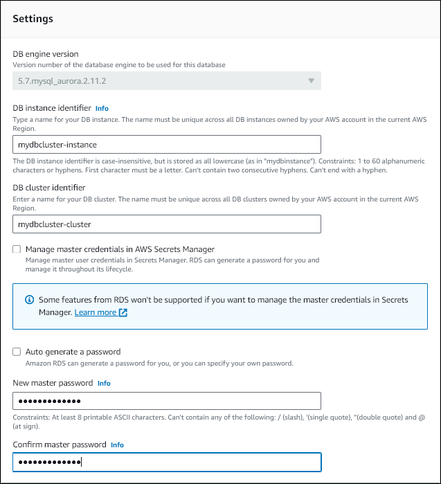

# Modifying an Amazon Aurora DB cluster

You can change the settings of a DB cluster to accomplish tasks such as changing its backup retention period or its database
port. You can also modify DB instances in a DB cluster to accomplish tasks such as changing its DB instance class or enabling
Performance Insights for it. This topic guides you through modifying an Aurora DB cluster and its DB instances, and describes the
settings for each.

We recommend that you test any changes on a test DB cluster or DB instance before modifying a production DB cluster or DB
instance, so that you fully understand the impact of each change. This is especially important when upgrading database
versions.

###### Topics

- [Modifying the DB cluster by using the console, CLI, and API](#Aurora.Modifying.Cluster "#Aurora.Modifying.Cluster")
- [Modifying a DB instance in a DB cluster](#Aurora.Modifying.Instance "#Aurora.Modifying.Instance")
- [Changing the password for the database master user](#Aurora.Modifying.Password "#Aurora.Modifying.Password")
- [Settings for Amazon Aurora](#Aurora.Modifying.Settings "#Aurora.Modifying.Settings")
- [Settings that don't apply to Amazon Aurora DB clusters](#Aurora.Modifying.SettingsNotApplicableDBClusters "#Aurora.Modifying.SettingsNotApplicableDBClusters")
- [Settings that don't apply to Amazon Aurora DB instances](#Aurora.Modifying.SettingsNotApplicable "#Aurora.Modifying.SettingsNotApplicable")

## Modifying the DB cluster by using the console, CLI, and API

You can modify a DB cluster using the AWS Management Console, the AWS CLI, or the RDS API.

###### Note

Most modifications can be applied immediately or during the next scheduled maintenance window. Some modifications, such as
turning on deletion protection, are applied immediately—regardless of when you choose to apply them.

Changing the master password in the AWS Management Console is always applied immediately.

If you're using SSL endpoints and change the DB cluster identifier, stop and restart the DB cluster to update the SSL
endpoints. For more information, see [Stopping and starting an Amazon Aurora DB cluster](aurora-cluster-stop-start.md "aurora-cluster-stop-start.md").

###### To modify a DB cluster

1. Sign in to the AWS Management Console and open the Amazon RDS console at
   [https://console.aws.amazon.com/rds/](https://console.aws.amazon.com/rds/ "https://console.aws.amazon.com/rds/").
2. In the navigation pane, choose **Databases**, and then select the DB cluster that you
   want to modify.
3. Choose **Modify**.
   The **Modify DB cluster** page appears.
4. Change any of the settings that you want.
   For information about each setting, see
   [Settings for Amazon Aurora](#Aurora.Modifying.Settings "#Aurora.Modifying.Settings").

###### Note

In the AWS Management Console, some instance level changes only apply to the current DB instance, while others
apply to the entire DB cluster. For information about whether a setting applies to the DB instance or the DB
cluster, see the scope for the setting in [Settings for Amazon Aurora](#Aurora.Modifying.Settings "#Aurora.Modifying.Settings"). To change a setting that modifies the entire DB cluster at
the instance level in the AWS Management Console, follow the instructions in [Modifying a DB instance in a DB cluster](#Aurora.Modifying.Instance "#Aurora.Modifying.Instance"). 5. When all the changes are as you want them, choose **Continue** and check the summary of
modifications. 6. To apply the changes immediately, select **Apply immediately**. 7. On the confirmation page, review your changes.
If they are correct, choose **Modify cluster**
to save your changes.

Alternatively, choose **Back** to edit your changes,
or choose **Cancel** to cancel your changes.
To modify a DB cluster using the AWS CLI, call the
[modify-db-cluster](../../../cli/latest/reference/rds/modify-db-cluster.md "../../../cli/latest/reference/rds/modify-db-cluster.md") command.
Specify the DB cluster identifier, and the values for the settings that you want to modify.
For information about each setting, see
[Settings for Amazon Aurora](#Aurora.Modifying.Settings "#Aurora.Modifying.Settings").

###### Note

Some settings only apply to DB instances. To change those settings,
follow the instructions in [Modifying a DB instance in a DB cluster](#Aurora.Modifying.Instance "#Aurora.Modifying.Instance").

###### Example

The following command modifies `mydbcluster`
by setting the backup retention period to 1 week (7 days).

For Linux, macOS, or Unix:

```
aws rds modify-db-cluster \
    --db-cluster-identifier `mydbcluster` \
    --backup-retention-period `7`

```

For Windows:

```
aws rds modify-db-cluster ^
    --db-cluster-identifier `mydbcluster` ^
    --backup-retention-period `7`

```

To modify a DB cluster using the Amazon RDS API, call the
[ModifyDBCluster](../APIReference/API_ModifyDBCluster.md "../APIReference/API_ModifyDBCluster.md") operation.
Specify the DB cluster identifier, and the values for the settings that you want to modify.
For information about each parameter, see
[Settings for Amazon Aurora](#Aurora.Modifying.Settings "#Aurora.Modifying.Settings").

###### Note

Some settings only apply to DB instances. To change those settings,
follow the instructions in [Modifying a DB instance in a DB cluster](#Aurora.Modifying.Instance "#Aurora.Modifying.Instance").

## Modifying a DB instance in a DB cluster

You can modify a DB instance in a DB cluster using the AWS Management Console, the AWS CLI, or the RDS API.

When you modify a DB instance, you can apply the changes immediately.
To apply changes immediately, you select the **Apply Immediately** option in the AWS Management Console,
you use the `--apply-immediately` parameter when calling the AWS CLI,
or you set the `ApplyImmediately` parameter to `true` when using the Amazon RDS API.

If you don't choose to apply changes immediately, the changes are deferred until the next maintenance window. During
the next maintenance window, any of these deferred changes are applied. If you choose to apply changes immediately, your new
changes and any previously deferred changes are applied.

To see the modifications that are pending for the next maintenance window, use the [describe-db-clusters](https://awscli.amazonaws.com/v2/documentation/api/latest/reference/rds/describe-db-clusters.html "https://awscli.amazonaws.com/v2/documentation/api/latest/reference/rds/describe-db-clusters.html") AWS CLI command and check the `PendingModifiedValues` field.

###### Important

If any of the deferred modifications require downtime, choosing **Apply immediately** can cause
unexpected downtime for the DB instance. There is no downtime for the other DB instances in the DB cluster.

Modifications that you defer aren't listed in the output of the `describe-pending-maintenance-actions`
CLI command. Maintenance actions only include system upgrades that you schedule for the next maintenance window.

###### To modify a DB instance in a DB cluster

1. Sign in to the AWS Management Console and open the Amazon RDS console at
   [https://console.aws.amazon.com/rds/](https://console.aws.amazon.com/rds/ "https://console.aws.amazon.com/rds/").
2. In the navigation pane, choose **Databases**, and then select the DB instance that you want
   to modify.
3. For **Actions**, choose **Modify**. The **Modify DB
   instance** page appears.
4. Change any of the settings that you want. For information about each setting, see [Settings for Amazon Aurora](#Aurora.Modifying.Settings "#Aurora.Modifying.Settings").

###### Note

Some settings apply to the entire DB cluster and must be changed at the cluster level. To change those
settings, follow the instructions in [Modifying the DB cluster by using the console, CLI, and API](#Aurora.Modifying.Cluster "#Aurora.Modifying.Cluster").

In the AWS Management Console, some instance level changes only apply to the current DB instance, while others apply
to the entire DB cluster. For information about whether a setting applies to the DB instance or the DB
cluster, see the scope for the setting in [Settings for Amazon Aurora](#Aurora.Modifying.Settings "#Aurora.Modifying.Settings"). 5. When all the changes are as you want them, choose **Continue** and check the summary of
modifications. 6. To apply the changes immediately, select **Apply immediately**. 7. On the confirmation page, review your changes. If they are correct, choose **Modify DB
instance** to save your changes.

Alternatively, choose **Back** to edit your changes, or choose **Cancel** to
cancel your changes.
To modify a DB instance in a DB cluster by using the AWS CLI, call the [modify-db-instance](../../../cli/latest/reference/rds/modify-db-instance.md "../../../cli/latest/reference/rds/modify-db-instance.md") command. Specify the DB instance
identifier, and the values for the settings that you want to modify. For information about each parameter, see [Settings for Amazon Aurora](#Aurora.Modifying.Settings "#Aurora.Modifying.Settings").

###### Note

Some settings apply to the entire DB cluster. To change those settings,
follow the instructions in [Modifying the DB cluster by using the console, CLI, and API](#Aurora.Modifying.Cluster "#Aurora.Modifying.Cluster").

###### Example

The following code modifies `mydbinstance`
by setting the DB instance class to `db.r4.xlarge`.
The changes are applied during the next maintenance window
by using `--no-apply-immediately`.
Use `--apply-immediately` to apply the changes immediately.

For Linux, macOS, or Unix:

```
aws rds modify-db-instance \
    --db-instance-identifier `mydbinstance` \
    --db-instance-class `db.r4.xlarge` \
    `--no-apply-immediately`
```

For Windows:

```
aws rds modify-db-instance ^
    --db-instance-identifier `mydbinstance` ^
    --db-instance-class `db.r4.xlarge` ^
    `--no-apply-immediately`
```

To modify a DB instance by using the Amazon RDS API, call the [ModifyDBInstance](../APIReference/API_ModifyDBInstance.md "../APIReference/API_ModifyDBInstance.md") operation. Specify the DB instance identifier, and the values for the settings that you
want to modify. For information about each parameter, see [Settings for Amazon Aurora](#Aurora.Modifying.Settings "#Aurora.Modifying.Settings").

###### Note

Some settings apply to the entire DB cluster. To change those settings,
follow the instructions in [Modifying the DB cluster by using the console, CLI, and API](#Aurora.Modifying.Cluster "#Aurora.Modifying.Cluster").

## Changing the password for the database master user

You can use the AWS Management Console or the AWS CLI to change the master user password.

You modify the writer DB instance to change the master user password using the AWS Management Console.

###### To change the master user password

1. Sign in to the AWS Management Console and open the Amazon RDS console at
   [https://console.aws.amazon.com/rds/](https://console.aws.amazon.com/rds/ "https://console.aws.amazon.com/rds/").
2. In the navigation pane, choose **Databases**, and then select the DB instance that you want
   to modify.
3. For **Actions**, choose **Modify**.

The **Modify DB instance** page appears. 4. Enter a **New master password**. 5. For **Confirm master password**, enter the same new password.

 6. Choose **Continue** and check the summary of modifications.

###### Note

Password changes are always applied immediately. 7. On the confirmation page, choose **Modify DB instance**.
You call the [modify-db-cluster](../../../cli/latest/reference/rds/modify-db-cluster.md "../../../cli/latest/reference/rds/modify-db-cluster.md") command to change the
master user password using the AWS CLI. Specify the DB cluster identifier and the new password, as shown in the following
examples.

You don't need to specify `--apply-immediately|--no-apply-immediately`, because password changes are always
applied immediately.

For Linux, macOS, or Unix:

```
aws rds modify-db-cluster \
    --db-cluster-identifier `mydbcluster` \
    --master-user-password `mynewpassword`

```

For Windows:

```
aws rds modify-db-cluster ^
    --db-cluster-identifier `mydbcluster` ^
    --master-user-password `mynewpassword`

```

## Settings for Amazon Aurora

The following table contains details about which settings you can modify, the methods for modifying the setting,
and the scope of the setting. The scope determines whether the setting applies to the entire DB cluster or if it
can be set only for specific DB instances.

###### Note

Additional settings are available if you are modifying an Aurora Serverless v1 or Aurora Serverless v2 DB cluster. For
information about these settings, see [Modifying an Aurora Serverless v1 DB cluster](aurora-serverless.md "aurora-serverless.md") and [Managing Aurora Serverless v2 DB clusters](aurora-serverless-v2-administration.md "aurora-serverless-v2-administration.md").

Some settings aren't available for Aurora Serverless v1 and Aurora Serverless v2 because of their limitations. For more
information, see [Limitations of Aurora Serverless v1](aurora-serverless.md#aurora-serverless.limitations "aurora-serverless.md#aurora-serverless.limitations") and [Requirements and limitations for Aurora Serverless v2](aurora-serverless-v2.md "aurora-serverless-v2.md").

| Setting and description                                                                                                                                                                                                                                                                                                                                                                                                                                                                                                                                                                                                                                                                                                                                                                                                                                                                                                                                                                                                                                                                                                                                                                                                                              | Method                                                                                                                                                                                                                                                                                                                                                                                                                                                                                                                                                                                                                                                                                                                                                                                                                                                                                                                                                                                                                                                                                                                                                                                                                                                                                                                                                                                                                                                | Scope                                                                                                                                                                                                                                                                                                                                                                                                                                                                                                                 | Downtime notes                                                                                                                                                                                                                                                                                                                                                                                                                                                                                                                                                                                                                                           |
| ---------------------------------------------------------------------------------------------------------------------------------------------------------------------------------------------------------------------------------------------------------------------------------------------------------------------------------------------------------------------------------------------------------------------------------------------------------------------------------------------------------------------------------------------------------------------------------------------------------------------------------------------------------------------------------------------------------------------------------------------------------------------------------------------------------------------------------------------------------------------------------------------------------------------------------------------------------------------------------------------------------------------------------------------------------------------------------------------------------------------------------------------------------------------------------------------------------------------------------------------------- | ----------------------------------------------------------------------------------------------------------------------------------------------------------------------------------------------------------------------------------------------------------------------------------------------------------------------------------------------------------------------------------------------------------------------------------------------------------------------------------------------------------------------------------------------------------------------------------------------------------------------------------------------------------------------------------------------------------------------------------------------------------------------------------------------------------------------------------------------------------------------------------------------------------------------------------------------------------------------------------------------------------------------------------------------------------------------------------------------------------------------------------------------------------------------------------------------------------------------------------------------------------------------------------------------------------------------------------------------------------------------------------------------------------------------------------------------------- | --------------------------------------------------------------------------------------------------------------------------------------------------------------------------------------------------------------------------------------------------------------------------------------------------------------------------------------------------------------------------------------------------------------------------------------------------------------------------------------------------------------------- | -------------------------------------------------------------------------------------------------------------------------------------------------------------------------------------------------------------------------------------------------------------------------------------------------------------------------------------------------------------------------------------------------------------------------------------------------------------------------------------------------------------------------------------------------------------------------------------------------------------------------------------------------------- | ----------------------------------------------------------------------------------------------------------------------------------------- |
| **Auto minor version upgrade**<br>Whether you want the DB instance to receive preferred minor engine version upgrades automatically<br>when they become available. Upgrades are installed only during your scheduled maintenance window.<br>For more information about engine updates, see<br>[Database engine updates for<br>Amazon Aurora PostgreSQL](AuroraPostgreSQL.md "AuroraPostgreSQL.md")<br>and [Database engine updates for Amazon Aurora MySQL](AuroraMySQL.md "AuroraMySQL.md").<br>For more information about the \*_Auto minor version upgrade_<br>• setting<br>for Aurora MySQL, see [Enabling automatic upgrades between minor Aurora MySQL versions](AuroraMySQL.Updates.md "AuroraMySQL.Updates.md").                                                                                                                                                                                                                                                                                                                                                                                                                                                                                                                             | NoteThis setting is enabled by default. For each new cluster, choose the appropriate value for this setting<br>based on its importance, expected lifetime, and the amount of verification testing that you do after<br>each upgrade.<br>When you change this setting, perform this modification for every DB instance in your Aurora cluster. If any DB<br>instance in your cluster has this setting turned off, the cluster isn't automatically upgraded.<br>Using the AWS Management Console, [Modifying a DB instance in a DB cluster](#Aurora.Modifying.Instance "#Aurora.Modifying.Instance").<br>Using the AWS CLI, run [modify-db-instance](../../../cli/latest/reference/rds/modify-db-instance.md "../../../cli/latest/reference/rds/modify-db-instance.md") and set the<br>`--auto-minor-version-upgrade                                                                                                                                                                                                                                                                                                                                                                                                                                                                                                                                                                                                                                    | --no-auto-minor-version-upgrade`option.<br>Using the RDS API, call [ModifyDBInstance](../APIReference/API_ModifyDBInstance.md "../APIReference/API_ModifyDBInstance.md") and set the`AutoMinorVersionUpgrade` parameter.                                                                                                                                                                                                                                                                                              | The entire DB cluster                                                                                                                                                                                                                                                                                                                                                                                                                                                                                                                                                                                                                                    | An outage doesn't occur during this change. Outages do occur during future maintenance windows when<br>Aurora applies automatic upgrades. |
| **Backup retention period**<br>The number of days that<br>automatic backups are retained.<br>The minimum value is `1`.<br>For more information, see<br>[Backups](Aurora.Managing.md#Aurora.Managing.Backups.Backup "Aurora.Managing.md#Aurora.Managing.Backups.Backup").                                                                                                                                                                                                                                                                                                                                                                                                                                                                                                                                                                                                                                                                                                                                                                                                                                                                                                                                                                             | Using the AWS Management Console, [Modifying the DB cluster by using the console, CLI, and API](#Aurora.Modifying.Cluster "#Aurora.Modifying.Cluster").<br>Using the AWS CLI, run [modify-db-cluster](../../../cli/latest/reference/rds/modify-db-cluster.md "../../../cli/latest/reference/rds/modify-db-cluster.md") and set the `--backup-retention-period` option.<br>Using the RDS API, call [ModifyDBCluster](../APIReference/API_ModifyDBCluster.md "../APIReference/API_ModifyDBCluster.md") and set the `BackupRetentionPeriod` parameter.                                                                                                                                                                                                                                                                                                                                                                                                                                                                                                                                                                                                                                                                                                                                                                                                                                                                                                   | The entire DB cluster                                                                                                                                                                                                                                                                                                                                                                                                                                                                                                 | An outage doesn't occur during this change.                                                                                                                                                                                                                                                                                                                                                                                                                                                                                                                                                                                                              |
| **Backup window (Start time)**<br>The time range during which automated backups of your database<br>occurs. The backup window is a start time in Universal Coordinated<br>Time (UTC), and a duration in hours.<br>Aurora backups are continuous and incremental, but the backup window is used to create<br>a daily system backup that is preserved within the backup retention period. You can<br>copy it to preserve it outside of the retention period.<br>The maintenance window and the backup window for the DB cluster can't overlap.<br>For more information, see [Backup window](Aurora.Managing.md#Aurora.Managing.Backups.BackupWindow "Aurora.Managing.md#Aurora.Managing.Backups.BackupWindow").                                                                                                                                                                                                                                                                                                                                                                                                                                                                                                                                        | Using the AWS Management Console, [Modifying the DB cluster by using the console, CLI, and API](#Aurora.Modifying.Cluster "#Aurora.Modifying.Cluster").<br>Using the AWS CLI, run [modify-db-cluster](../../../cli/latest/reference/rds/modify-db-cluster.md "../../../cli/latest/reference/rds/modify-db-cluster.md") and set the `--preferred-backup-window` option.<br>Using the RDS API, call [ModifyDBCluster](../APIReference/API_ModifyDBCluster.md "../APIReference/API_ModifyDBCluster.md") and set the `PreferredBackupWindow` parameter.                                                                                                                                                                                                                                                                                                                                                                                                                                                                                                                                                                                                                                                                                                                                                                                                                                                                                                   | The entire DB cluster.                                                                                                                                                                                                                                                                                                                                                                                                                                                                                                | An outage doesn't occur during this change.                                                                                                                                                                                                                                                                                                                                                                                                                                                                                                                                                                                                              |
| **Capacity settings**<br>The scaling properties of an Aurora Serverless v1 DB cluster. You can only modify scaling properties for DB<br>clusters in `serverless` DB engine mode.<br>For information about Aurora Serverless v1, see [Using Amazon Aurora Serverless v1](aurora-serverless.md "aurora-serverless.md").                                                                                                                                                                                                                                                                                                                                                                                                                                                                                                                                                                                                                                                                                                                                                                                                                                                                                                                                | Using the AWS Management Console, [Modifying the DB cluster by using the console, CLI, and API](#Aurora.Modifying.Cluster "#Aurora.Modifying.Cluster").<br>Using the AWS CLI, run [modify-db-cluster](../../../cli/latest/reference/rds/modify-db-cluster.md "../../../cli/latest/reference/rds/modify-db-cluster.md") and set the `--scaling-configuration` option.<br>Using the RDS API, call [ModifyDBCluster](../APIReference/API_ModifyDBCluster.md "../APIReference/API_ModifyDBCluster.md") and set the `ScalingConfiguration` parameter.                                                                                                                                                                                                                                                                                                                                                                                                                                                                                                                                                                                                                                                                                                                                                                                                                                                                                                      | The entire DB cluster                                                                                                                                                                                                                                                                                                                                                                                                                                                                                                 | An outage doesn't occur during this change.<br>The change occurs immediately. This setting ignores the apply immediately setting.                                                                                                                                                                                                                                                                                                                                                                                                                                                                                                                        |
| **Certificate authority**<br>The certificate authority (CA) for the server certificate used by the DB instance.                                                                                                                                                                                                                                                                                                                                                                                                                                                                                                                                                                                                                                                                                                                                                                                                                                                                                                                                                                                                                                                                                                                                      | Using the AWS Management Console, [Modifying a DB instance in a DB cluster](#Aurora.Modifying.Instance "#Aurora.Modifying.Instance").<br>Using the AWS CLI, run [modify-db-instance](../../../cli/latest/reference/rds/modify-db-instance.md "../../../cli/latest/reference/rds/modify-db-instance.md") and set the `--ca-certificate-identifier`<br>option.<br>Using the RDS API, call [ModifyDBInstance](../APIReference/API_ModifyDBInstance.md "../APIReference/API_ModifyDBInstance.md") and set the `CACertificateIdentifier` parameter.                                                                                                                                                                                                                                                                                                                                                                                                                                                                                                                                                                                                                                                                                                                                                                                                                                                                                                        | Only the specified DB instance                                                                                                                                                                                                                                                                                                                                                                                                                                                                                        | An outage only occurs if the DB engine doesn't support rotation without restart.<br>You can use the [describe-db-engine-versions](../../../cli/latest/reference/rds/describe-db-engine-versions.md "../../../cli/latest/reference/rds/describe-db-engine-versions.md") AWS CLI command to determine whether<br>the DB engine supports rotation without restart.                                                                                                                                                                                                                                                                                          |
| **Cluster storage configuration**<br>The storage type for the DB cluster: **Aurora I/O-Optimized\*<br>• or **Aurora Standard\*\*.<br>For more information, see [Storage configurations for Amazon Aurora DB<br>clusters](Aurora.Overview.md#aurora-storage-type "Aurora.Overview.md#aurora-storage-type").                                                                                                                                                                                                                                                                                                                                                                                                                                                                                                                                                                                                                                                                                                                                                                                                                                                                                                                                           | Using the AWS Management Console, [Modifying the DB cluster by using the console, CLI, and API](#Aurora.Modifying.Cluster "#Aurora.Modifying.Cluster").<br>Using the AWS CLI, run [modify-db-cluster](../../../cli/latest/reference/rds/modify-db-cluster.md "../../../cli/latest/reference/rds/modify-db-cluster.md") and set the `--storage-type` option.<br>Using the RDS API, call [ModifyDBCluster](../APIReference/API_ModifyDBCluster.md "../APIReference/API_ModifyDBCluster.md") and set the `StorageType` parameter.                                                                                                                                                                                                                                                                                                                                                                                                                                                                                                                                                                                                                                                                                                                                                                                                                                                                                                                        | The entire DB cluster                                                                                                                                                                                                                                                                                                                                                                                                                                                                                                 | Changing the storage type of an Aurora PostgreSQL DB cluster with Optimized Reads instance classes causes an outage.<br>This does not occur when changing storage types for clusters with other instance class types.<br>For more information on the DB instance class types, see [DB instance class types](Concepts.DBInstanceClass.md "Concepts.DBInstanceClass.md").                                                                                                                                                                                                                                                                                  |
| **Copy tags to snapshots**<br>Select to specify that tags defined for this DB cluster are copied<br>to DB snapshots created from this DB cluster. For more information,<br>see [Tagging Amazon Aurora and Amazon RDS resources](USER_Tagging.md "USER_Tagging.md").                                                                                                                                                                                                                                                                                                                                                                                                                                                                                                                                                                                                                                                                                                                                                                                                                                                                                                                                                                                  | Using the AWS Management Console, [Modifying the DB cluster by using the console, CLI, and API](#Aurora.Modifying.Cluster "#Aurora.Modifying.Cluster").<br>Using the AWS CLI, run [https://docs.aws.amazon.com/cli/latest/reference/rds/modify-db-cluster.html](../../../cli/latest/reference/rds/modify-db-cluster.md "../../../cli/latest/reference/rds/modify-db-cluster.md") and set the `--copy-tags-to-snapshot` or<br>`--no-copy-tags-to-snapshot` option.<br>Using the RDS API, call [https://docs.aws.amazon.com/AmazonRDS/latest/APIReference/API_ModifyDBCluster.html](../APIReference/API_ModifyDBCluster.md "../APIReference/API_ModifyDBCluster.md") and set the `CopyTagsToSnapshot` parameter.                                                                                                                                                                                                                                                                                                                                                                                                                                                                                                                                                                                                                                                                                                                                        | The entire DB cluster                                                                                                                                                                                                                                                                                                                                                                                                                                                                                                 | An outage doesn't occur during this change.                                                                                                                                                                                                                                                                                                                                                                                                                                                                                                                                                                                                              |
| **Data API**<br>You can access Aurora Serverless v1 with web services–based applications, including AWS Lambda and<br>AWS AppSync.<br>This setting only applies to an Aurora Serverless v1 DB cluster.<br>For more information, see<br>[Using the Amazon RDS Data API](data-api.md "data-api.md").                                                                                                                                                                                                                                                                                                                                                                                                                                                                                                                                                                                                                                                                                                                                                                                                                                                                                                                                                   | Using the AWS Management Console, [Modifying the DB cluster by using the console, CLI, and API](#Aurora.Modifying.Cluster "#Aurora.Modifying.Cluster").<br>Using the AWS CLI, run [`modify-db-cluster`](../../../cli/latest/reference/rds/modify-db-cluster.md "../../../cli/latest/reference/rds/modify-db-cluster.md") and set the `--enable-http-endpoint`<br>option.<br>Using the RDS API, call [`ModifyDBCluster`](../APIReference/API_ModifyDBCluster.md "../APIReference/API_ModifyDBCluster.md") and set the `EnableHttpEndpoint` parameter.                                                                                                                                                                                                                                                                                                                                                                                                                                                                                                                                                                                                                                                                                                                                                                                                                                                                                                  | The entire DB cluster                                                                                                                                                                                                                                                                                                                                                                                                                                                                                                 | An outage doesn't occur during this change.                                                                                                                                                                                                                                                                                                                                                                                                                                                                                                                                                                                                              |
| **Database authentication**<br>The database authentication you want to use.For<br>MySQL:<br>• Choose **Password authentication** to<br>authenticate database users with database passwords<br>only.<br>• Choose **Password and IAM database<br>authentication\*<br>• to authenticate database users<br>with database passwords and user credentials through IAM<br>users and roles. For more information, see [IAM database authentication](UsingWithRDS.md "UsingWithRDS.md").<br>For PostgreSQL:<br>• Choose **IAM database authentication** to<br>authenticate database users with database passwords and user<br>credentials through users and roles. For more<br>information, see [IAM database authentication](UsingWithRDS.md "UsingWithRDS.md").<br>• Choose **Kerberos authentication\*\* to<br>authenticate database passwords and user credentials using<br>Kerberos authentication. For more information, see [Using Kerberos authentication with Aurora PostgreSQL](postgresql-kerberos.md "postgresql-kerberos.md").                                                                                                                                                                                                                   | Using the AWS Management Console, [Modifying the DB cluster by using the console, CLI, and API](#Aurora.Modifying.Cluster "#Aurora.Modifying.Cluster").<br>Using the AWS CLI, run [modify-db-cluster](../../../cli/latest/reference/rds/modify-db-cluster.md "../../../cli/latest/reference/rds/modify-db-cluster.md") and set the following options:<br>• For IAM authentication, set the<br>`--enable-iam-database-authentication                                                                                                                                                                                                                                                                                                                                                                                                                                                                                                                                                                                                                                                                                                                                                                                                                                                                                                                                                                                                                   | --no-enable-iam-database-authentication`<br>option.<br>• For Kerberos authentication, set the `--domain`<br>and `--domain-iam-role-name` options.<br>Using the RDS API, call [ModifyDBCluster](../APIReference/API_ModifyDBCluster.md "../APIReference/API_ModifyDBCluster.md") and set the following parameters:<br>• For IAM authentication, set the<br>`EnableIAMDatabaseAuthentication`<br>parameter.<br>• For Kerberos authentication, set the `Domain`<br>and `DomainIAMRoleName` parameters.                   | The entire DB cluster                                                                                                                                                                                                                                                                                                                                                                                                                                                                                                                                                                                                                                    | An outage doesn't occur during this change.                                                                                               |
| **Database port**<br>The port that you want<br>to use to access the DB cluster.                                                                                                                                                                                                                                                                                                                                                                                                                                                                                                                                                                                                                                                                                                                                                                                                                                                                                                                                                                                                                                                                                                                                                                      | Using the AWS Management Console, [Modifying the DB cluster by using the console, CLI, and API](#Aurora.Modifying.Cluster "#Aurora.Modifying.Cluster").<br>Using the AWS CLI, run [`modify-db-cluster`](../../../cli/latest/reference/rds/modify-db-cluster.md "../../../cli/latest/reference/rds/modify-db-cluster.md") and set the `--port`<br>option.<br>Using the RDS API, call [`ModifyDBCluster`](../APIReference/API_ModifyDBCluster.md "../APIReference/API_ModifyDBCluster.md") and set the `Port` parameter.                                                                                                                                                                                                                                                                                                                                                                                                                                                                                                                                                                                                                                                                                                                                                                                                                                                                                                                                | The entire DB cluster                                                                                                                                                                                                                                                                                                                                                                                                                                                                                                 | An outage occurs during this change. All of the DB instances in the DB cluster are rebooted immediately.                                                                                                                                                                                                                                                                                                                                                                                                                                                                                                                                                 |
| **DB cluster identifier**<br>The DB cluster identifier. This value is stored as a lowercase string.<br>When you change the DB cluster identifier, the DB cluster endpoints change. The endpoints of the DB<br>instances in the DB cluster don't change.                                                                                                                                                                                                                                                                                                                                                                                                                                                                                                                                                                                                                                                                                                                                                                                                                                                                                                                                                                                              | Using the AWS Management Console, [Modifying the DB cluster by using the console, CLI, and API](#Aurora.Modifying.Cluster "#Aurora.Modifying.Cluster").<br>Using the AWS CLI, run [`modify-db-cluster`](../../../cli/latest/reference/rds/modify-db-cluster.md "../../../cli/latest/reference/rds/modify-db-cluster.md") and set the `--new-db-cluster-identifier`<br>option.<br>Using the RDS API, call [`ModifyDBCluster`](../APIReference/API_ModifyDBCluster.md "../APIReference/API_ModifyDBCluster.md") and set the `NewDBClusterIdentifier` parameter.                                                                                                                                                                                                                                                                                                                                                                                                                                                                                                                                                                                                                                                                                                                                                                                                                                                                                         | The entire DB cluster                                                                                                                                                                                                                                                                                                                                                                                                                                                                                                 | An outage doesn't occur during this change.                                                                                                                                                                                                                                                                                                                                                                                                                                                                                                                                                                                                              |
| **DB cluster parameter group**<br>The DB cluster parameter group that you want<br>associated with the DB cluster.<br>For more information, see<br>[Parameter groups for Amazon Aurora](USER_WorkingWithParamGroups.md "USER_WorkingWithParamGroups.md").                                                                                                                                                                                                                                                                                                                                                                                                                                                                                                                                                                                                                                                                                                                                                                                                                                                                                                                                                                                             | Using the AWS Management Console, [Modifying the DB cluster by using the console, CLI, and API](#Aurora.Modifying.Cluster "#Aurora.Modifying.Cluster").<br>Using the AWS CLI, run [`modify-db-cluster`](../../../cli/latest/reference/rds/modify-db-cluster.md "../../../cli/latest/reference/rds/modify-db-cluster.md") and set the `--db-cluster-parameter-group-name`<br>option.<br>Using the RDS API, call [`ModifyDBCluster`](../APIReference/API_ModifyDBCluster.md "../APIReference/API_ModifyDBCluster.md") and set the `DBClusterParameterGroupName` parameter.                                                                                                                                                                                                                                                                                                                                                                                                                                                                                                                                                                                                                                                                                                                                                                                                                                                                              | The entire DB cluster                                                                                                                                                                                                                                                                                                                                                                                                                                                                                                 | An outage doesn't occur during this change. When you change the parameter group, changes to some parameters<br>are applied to the DB instances in the DB cluster immediately without a reboot. Changes to other parameters are<br>applied only after the DB instances in the DB cluster are rebooted.                                                                                                                                                                                                                                                                                                                                                    |
| **DB instance class**<br>The DB instance class that you want to use.<br>For more information,<br>see [Amazon Aurora DB instance classes](Concepts.md "Concepts.md").                                                                                                                                                                                                                                                                                                                                                                                                                                                                                                                                                                                                                                                                                                                                                                                                                                                                                                                                                                                                                                                                                 | Using the AWS Management Console, [Modifying a DB instance in a DB cluster](#Aurora.Modifying.Instance "#Aurora.Modifying.Instance").<br>Using the AWS CLI, run [`modify-db-instance`](../../../cli/latest/reference/rds/modify-db-instance.md "../../../cli/latest/reference/rds/modify-db-instance.md") and set the `--db-instance-class`<br>option.<br>Using the RDS API, call [`ModifyDBInstance`](../APIReference/API_ModifyDBInstance.md "../APIReference/API_ModifyDBInstance.md") and set the `DBInstanceClass` parameter.                                                                                                                                                                                                                                                                                                                                                                                                                                                                                                                                                                                                                                                                                                                                                                                                                                                                                                                    | Only the specified DB instance                                                                                                                                                                                                                                                                                                                                                                                                                                                                                        | An outage occurs during this change.                                                                                                                                                                                                                                                                                                                                                                                                                                                                                                                                                                                                                     |
| **DB instance identifier**<br>The DB instance identifier.<br>This value is stored as a lowercase string.                                                                                                                                                                                                                                                                                                                                                                                                                                                                                                                                                                                                                                                                                                                                                                                                                                                                                                                                                                                                                                                                                                                                             | Using the AWS Management Console, [Modifying a DB instance in a DB cluster](#Aurora.Modifying.Instance "#Aurora.Modifying.Instance").<br>Using the AWS CLI, run [`modify-db-instance`](../../../cli/latest/reference/rds/modify-db-instance.md "../../../cli/latest/reference/rds/modify-db-instance.md") and set the `--new-db-instance-identifier`<br>option.<br>Using the RDS API, call [`ModifyDBInstance`](../APIReference/API_ModifyDBInstance.md "../APIReference/API_ModifyDBInstance.md") and set the `NewDBInstanceIdentifier` parameter.                                                                                                                                                                                                                                                                                                                                                                                                                                                                                                                                                                                                                                                                                                                                                                                                                                                                                                   | Only the specified DB instance                                                                                                                                                                                                                                                                                                                                                                                                                                                                                        | Downtime occurs during this change.<br>RDS restarts the DB instance to update the following:<br>• Aurora MySQL – `SERVER_ID` column in the<br>`information_schema.replica_host_status`<br>table<br>• Aurora PostgreSQL – `server_id` column in<br>the `aurora_replica_status()` function                                                                                                                                                                                                                                                                                                                                                                 |
| **DB parameter group**<br>The DB parameter group that you want<br>associated with the DB instance.<br>For more information, see<br>[Parameter groups for Amazon Aurora](USER_WorkingWithParamGroups.md "USER_WorkingWithParamGroups.md").                                                                                                                                                                                                                                                                                                                                                                                                                                                                                                                                                                                                                                                                                                                                                                                                                                                                                                                                                                                                            | Using the AWS Management Console, [Modifying a DB instance in a DB cluster](#Aurora.Modifying.Instance "#Aurora.Modifying.Instance").<br>Using the AWS CLI, run [`modify-db-instance`](../../../cli/latest/reference/rds/modify-db-instance.md "../../../cli/latest/reference/rds/modify-db-instance.md") and set the `--db-parameter-group-name`<br>option.<br>Using the RDS API, call [`ModifyDBInstance`](../APIReference/API_ModifyDBInstance.md "../APIReference/API_ModifyDBInstance.md") and set the `DBParameterGroupName` parameter.                                                                                                                                                                                                                                                                                                                                                                                                                                                                                                                                                                                                                                                                                                                                                                                                                                                                                                         | Only the specified DB instance                                                                                                                                                                                                                                                                                                                                                                                                                                                                                        | An outage doesn't occur during this change.<br>When you associate a new DB parameter group with a DB instance, the modified static and dynamic parameters are applied<br>only after the DB instance is rebooted. However, if you modify dynamic parameters in the DB parameter group<br>after you associate it with the DB instance, these changes are applied immediately without a reboot.<br>For more information, see [Parameter groups for Amazon Aurora](USER_WorkingWithParamGroups.md "USER_WorkingWithParamGroups.md") and [Rebooting an Amazon Aurora DB cluster or Amazon Aurora DB instance](USER_RebootCluster.md "USER_RebootCluster.md"). |
| **Deletion protection**<br>\*_Enable deletion protection_<br>• to prevent your DB<br>cluster from being deleted. For more information, see [Deletion protection for Aurora clusters](USER_DeleteCluster.md#USER_DeletionProtection "USER_DeleteCluster.md#USER_DeletionProtection").                                                                                                                                                                                                                                                                                                                                                                                                                                                                                                                                                                                                                                                                                                                                                                                                                                                                                                                                                                 | Using the AWS Management Console, [Modifying the DB cluster by using the console, CLI, and API](#Aurora.Modifying.Cluster "#Aurora.Modifying.Cluster").<br>Using the AWS CLI, run [`modify-db-cluster`](../../../cli/latest/reference/rds/modify-db-cluster.md "../../../cli/latest/reference/rds/modify-db-cluster.md") and set the<br>`--deletion-protection                                                                                                                                                                                                                                                                                                                                                                                                                                                                                                                                                                                                                                                                                                                                                                                                                                                                                                                                                                                                                                                                                        | --no-deletion-protection` option.<br>Using the RDS API, call [`ModifyDBCluster`](../APIReference/API_ModifyDBCluster.md "../APIReference/API_ModifyDBCluster.md") and set the<br>`DeletionProtection` parameter.                                                                                                                                                                                                                                                                                                      | The entire DB cluster                                                                                                                                                                                                                                                                                                                                                                                                                                                                                                                                                                                                                                    | An outage doesn't occur during this change.                                                                                               |
| **Engine version**<br>The version of the DB engine that you want to use. Before you upgrade your production DB cluster,<br>we recommend that you test the upgrade process on a test DB cluster to verify its duration and to<br>validate your applications.                                                                                                                                                                                                                                                                                                                                                                                                                                                                                                                                                                                                                                                                                                                                                                                                                                                                                                                                                                                          | Using the AWS Management Console, [Modifying the DB cluster by using the console, CLI, and API](#Aurora.Modifying.Cluster "#Aurora.Modifying.Cluster").<br>Using the AWS CLI, run [`modify-db-cluster`](../../../cli/latest/reference/rds/modify-db-cluster.md "../../../cli/latest/reference/rds/modify-db-cluster.md") and set the `--engine-version`<br>option.<br>Using the RDS API, call [`ModifyDBCluster`](../APIReference/API_ModifyDBCluster.md "../APIReference/API_ModifyDBCluster.md") and set the `EngineVersion` parameter.                                                                                                                                                                                                                                                                                                                                                                                                                                                                                                                                                                                                                                                                                                                                                                                                                                                                                                             | The entire DB cluster                                                                                                                                                                                                                                                                                                                                                                                                                                                                                                 | An outage occurs during this change.                                                                                                                                                                                                                                                                                                                                                                                                                                                                                                                                                                                                                     |
| **Enhanced monitoring**<br>\*_Enable enhanced monitoring_<br>• to enable gathering metrics<br>in real time for the operating system that your DB instance runs on.<br>For more information, see<br>[Monitoring OS metrics with Enhanced Monitoring](USER_Monitoring.md "USER_Monitoring.md").                                                                                                                                                                                                                                                                                                                                                                                                                                                                                                                                                                                                                                                                                                                                                                                                                                                                                                                                                        | Using the AWS Management Console, [Modifying a DB instance in a DB cluster](#Aurora.Modifying.Instance "#Aurora.Modifying.Instance").<br>Using the AWS CLI, run [`modify-db-instance`](../../../cli/latest/reference/rds/modify-db-instance.md "../../../cli/latest/reference/rds/modify-db-instance.md") and set the `--monitoring-role-arn`<br>and `--monitoring-interval` options.<br>Using the RDS API, call [`ModifyDBInstance`](../APIReference/API_ModifyDBInstance.md "../APIReference/API_ModifyDBInstance.md") and set the `MonitoringRoleArn` and<br>`MonitoringInterval` parameters.                                                                                                                                                                                                                                                                                                                                                                                                                                                                                                                                                                                                                                                                                                                                                                                                                                                      | Only the specified DB instance                                                                                                                                                                                                                                                                                                                                                                                                                                                                                        | An outage doesn't occur during this change.                                                                                                                                                                                                                                                                                                                                                                                                                                                                                                                                                                                                              |
| **Log exports**<br>Select the log types to publish to Amazon CloudWatch Logs.<br>For more information, see<br>[Aurora MySQL database log files](USER_LogAccess.Concepts.md "USER_LogAccess.Concepts.md").                                                                                                                                                                                                                                                                                                                                                                                                                                                                                                                                                                                                                                                                                                                                                                                                                                                                                                                                                                                                                                            | Using the AWS Management Console, [Modifying the DB cluster by using the console, CLI, and API](#Aurora.Modifying.Cluster "#Aurora.Modifying.Cluster").<br>Using the AWS CLI, run [`modify-db-cluster`](../../../cli/latest/reference/rds/modify-db-cluster.md "../../../cli/latest/reference/rds/modify-db-cluster.md") and set the `--cloudwatch-logs-export-configuration`<br>option.<br>Using the RDS API, call [`ModifyDBCluster`](../APIReference/API_ModifyDBCluster.md "../APIReference/API_ModifyDBCluster.md") and set the `CloudwatchLogsExportConfiguration` parameter.                                                                                                                                                                                                                                                                                                                                                                                                                                                                                                                                                                                                                                                                                                                                                                                                                                                                   | The entire DB cluster                                                                                                                                                                                                                                                                                                                                                                                                                                                                                                 | An outage doesn't occur during this change.                                                                                                                                                                                                                                                                                                                                                                                                                                                                                                                                                                                                              |
| **Maintenance window**<br>The time range during which system maintenance occurs.<br>System maintenance includes upgrades, if applicable.<br>The maintenance window is a start time<br>in Universal Coordinated Time (UTC),<br>and a duration in hours.<br>If you set the window to the current time,<br>there must be at least 30 minutes<br>between the current time and end of the window<br>to ensure any pending changes are applied.<br>You can set the maintenance window independently for the DB cluster and<br>for each DB instance in the DB cluster. When the scope of a modification is<br>the entire DB cluster, the modification is performed during the DB cluster<br>maintenance window. When the scope of a modification is<br>the a DB instance, the modification is performed during<br>maintenance window of that DB instance.<br>The maintenance window and the backup window for the DB cluster can't overlap.<br>For more information, see<br>[Amazon RDS maintenance window](USER_UpgradeDBInstance.md#Concepts.DBMaintenance "USER_UpgradeDBInstance.md#Concepts.DBMaintenance").                                                                                                                                           | To change the maintenance window for the DB cluster using the AWS Management Console, [Modifying the DB cluster by using the console, CLI, and API](#Aurora.Modifying.Cluster "#Aurora.Modifying.Cluster").<br>To change the maintenance window for a DB instance using the AWS Management Console, [Modifying a DB instance in a DB cluster](#Aurora.Modifying.Instance "#Aurora.Modifying.Instance").<br>To change the maintenance window for the DB cluster using the AWS CLI, run [`modify-db-cluster`](../../../cli/latest/reference/rds/modify-db-cluster.md "../../../cli/latest/reference/rds/modify-db-cluster.md") and set the `--preferred-maintenance-window`<br>option.<br>To change the maintenance window for a DB instance using the AWS CLI, run [`modify-db-instance`](../../../cli/latest/reference/rds/modify-db-instance.md "../../../cli/latest/reference/rds/modify-db-instance.md") and set the `--preferred-maintenance-window`<br>option.<br>To change the maintenance window for the DB cluster using the RDS API, call [`ModifyDBCluster`](../APIReference/API_ModifyDBCluster.md "../APIReference/API_ModifyDBCluster.md") and set the `PreferredMaintenanceWindow` parameter.<br>To change the maintenance window for a DB instance using the RDS API, call [`ModifyDBInstance`](../APIReference/API_ModifyDBInstance.md "../APIReference/API_ModifyDBInstance.md") and set the `PreferredMaintenanceWindow` parameter. | The entire DB cluster or a single DB instance                                                                                                                                                                                                                                                                                                                                                                                                                                                                         | If there are one or more pending actions that cause an outage, and the maintenance window is changed to include the current time,<br>then those pending actions are applied immediately, and an outage occurs.                                                                                                                                                                                                                                                                                                                                                                                                                                           |
| **Manage master credentials in AWS Secrets Manager**<br>Select **Manage master credentials in AWS Secrets Manager\*<br>• to manage the master user<br>password in a secret in Secrets Manager.<br>Optionally, choose a KMS key to use to protect the secret.<br>Choose from the KMS keys in your account, or enter the key from a<br>different account.<br>For more information, see [Password management with<br>Amazon Aurora<br>and AWS Secrets Manager](rds-secrets-manager.md "rds-secrets-manager.md").<br>If Aurora is already managing the master user password for the DB cluster, you can rotate<br>the master user password by choosing **Rotate secret immediately\*\*.<br>For more information, see [Password management with<br>Amazon Aurora<br>and AWS Secrets Manager](rds-secrets-manager.md "rds-secrets-manager.md").                                                                                                                                                                                                                                                                                                                                                                                                            | Using the AWS Management Console, [Modifying a DB instance in a DB cluster](#Aurora.Modifying.Instance "#Aurora.Modifying.Instance").<br>Using the AWS CLI, run [`modify-db-cluster`](../../../cli/latest/reference/rds/modify-db-cluster.md "../../../cli/latest/reference/rds/modify-db-cluster.md") and set the<br>`--manage-master-user-password                                                                                                                                                                                                                                                                                                                                                                                                                                                                                                                                                                                                                                                                                                                                                                                                                                                                                                                                                                                                                                                                                                  | --no-manage-master-user-password`<br>and `--master-user-secret-kms-key-id`options. To rotate the master user<br>password immediately, set the`--rotate-master-user-password` option.<br>Using the RDS API, call [`ModifyDBCluster`](../APIReference/API_ModifyDBCluster.md "../APIReference/API_ModifyDBCluster.md") and set the `ManageMasterUserPassword`<br>and `MasterUserSecretKmsKeyId`parameters. To rotate the master user<br>password immediately, set the`RotateMasterUserPassword` parameter to<br>`true`. | The entire DB cluster                                                                                                                                                                                                                                                                                                                                                                                                                                                                                                                                                                                                                                    | An outage doesn't occur during this change.                                                                                               |
| **Network type**<br>The IP addressing protocols supported by the DB cluster.<br>**IPv4\*<br>• to specify that resources can communicate with the DB cluster only<br>over the IPv4 addressing protocol.<br>**Dual-stack mode\*<br>• to specify that resources can communicate with the<br>DB cluster over IPv4, IPv6, or both. Use dual-stack mode if you have any resources that<br>must communicate with your DB cluster over the IPv6 addressing protocol. To use dual-stack<br>mode, make sure at least two subnets spanning two Availability Zones that support both the IPv4<br>and IPv6 network protocol. Also, make sure you associate an IPv6 CIDR block with subnets in the<br>DB subnet group you specify.<br>For more information, see [Amazon Aurora IP<br>addressing](USER_VPC.md#USER_VPC.IP_addressing "USER_VPC.md#USER_VPC.IP_addressing").                                                                                                                                                                                                                                                                                                                                                                                         | Using the AWS Management Console, [Modifying the DB cluster by using the console, CLI, and API](#Aurora.Modifying.Cluster "#Aurora.Modifying.Cluster").<br>Using the AWS CLI, run [`modify-db-cluster`](../../../cli/latest/reference/rds/modify-db-cluster.md "../../../cli/latest/reference/rds/modify-db-cluster.md") and set the `--network-type`<br>option.<br>Using the RDS API, call [`ModifyDBCluster`](../APIReference/API_ModifyDBCluster.md "../APIReference/API_ModifyDBCluster.md") and set the `NetworkType` parameter.                                                                                                                                                                                                                                                                                                                                                                                                                                                                                                                                                                                                                                                                                                                                                                                                                                                                                                                 | The entire DB cluster                                                                                                                                                                                                                                                                                                                                                                                                                                                                                                 | An outage doesn't occur during this change.                                                                                                                                                                                                                                                                                                                                                                                                                                                                                                                                                                                                              |
| **New master password**<br>The password for your master user.<br>• For Aurora MySQL, the password must contain 8–41 printable ASCII characters.<br>• For Aurora PostgreSQL, it must contain 8–99 printable ASCII characters.<br>• It can't contain `/`, `"`, `@`, or a space.                                                                                                                                                                                                                                                                                                                                                                                                                                                                                                                                                                                                                                                                                                                                                                                                                                                                                                                                                                        | Using the AWS Management Console, [Modifying a DB instance in a DB cluster](#Aurora.Modifying.Instance "#Aurora.Modifying.Instance").<br>Using the AWS CLI, run [`modify-db-cluster`](../../../cli/latest/reference/rds/modify-db-cluster.md "../../../cli/latest/reference/rds/modify-db-cluster.md") and set the `--master-user-password`<br>option.<br>Using the RDS API, call [`ModifyDBCluster`](../APIReference/API_ModifyDBCluster.md "../APIReference/API_ModifyDBCluster.md") and set the `MasterUserPassword` parameter.                                                                                                                                                                                                                                                                                                                                                                                                                                                                                                                                                                                                                                                                                                                                                                                                                                                                                                                    | The entire DB cluster                                                                                                                                                                                                                                                                                                                                                                                                                                                                                                 | An outage doesn't occur during this change.                                                                                                                                                                                                                                                                                                                                                                                                                                                                                                                                                                                                              |
| **Performance Insights**<br>Whether to enable Performance Insights, a tool that monitors your DB instance<br>load so that you can analyze and troubleshoot your database performance.<br>For more information, see<br>[Monitoring DB load with Performance Insights on Amazon Aurora](USER_PerfInsights.md "USER_PerfInsights.md").                                                                                                                                                                                                                                                                                                                                                                                                                                                                                                                                                                                                                                                                                                                                                                                                                                                                                                                  | Using the AWS Management Console, [Modifying a DB instance in a DB cluster](#Aurora.Modifying.Instance "#Aurora.Modifying.Instance").<br>Using the AWS CLI, run [`modify-db-instance`](../../../cli/latest/reference/rds/modify-db-instance.md "../../../cli/latest/reference/rds/modify-db-instance.md") and set the `--enable-performance-insights                                                                                                                                                                                                                                                                                                                                                                                                                                                                                                                                                                                                                                                                                                                                                                                                                                                                                                                                                                                                                                                                                                  | --no-enable-performance-insights`<br>option.<br>Using the RDS API, call [`ModifyDBInstance`](../APIReference/API_ModifyDBInstance.md "../APIReference/API_ModifyDBInstance.md") and set the `EnablePerformanceInsights` parameter.                                                                                                                                                                                                                                                                                    | Only the specified DB instance                                                                                                                                                                                                                                                                                                                                                                                                                                                                                                                                                                                                                           | An outage doesn't occur during this change.                                                                                               |
| **Performance Insights AWS KMS key**<br>The AWS KMS key identifier for encryption of Performance Insights data. The KMS key identifier is the<br>Amazon Resource Name (ARN), key identifier, or key alias for the KMS key.<br>For more information, see<br>[Turning Performance Insights on and off for Aurora](USER_PerfInsights.md "USER_PerfInsights.md").                                                                                                                                                                                                                                                                                                                                                                                                                                                                                                                                                                                                                                                                                                                                                                                                                                                                                        | Using the AWS Management Console, [Modifying a DB instance in a DB cluster](#Aurora.Modifying.Instance "#Aurora.Modifying.Instance").<br>Using the AWS CLI, run [`modify-db-instance`](../../../cli/latest/reference/rds/modify-db-instance.md "../../../cli/latest/reference/rds/modify-db-instance.md") and set the `--performance-insights-kms-key-id`<br>option.<br>Using the RDS API, call [`ModifyDBInstance`](../APIReference/API_ModifyDBInstance.md "../APIReference/API_ModifyDBInstance.md") and set the `PerformanceInsightsKMSKeyId` parameter.                                                                                                                                                                                                                                                                                                                                                                                                                                                                                                                                                                                                                                                                                                                                                                                                                                                                                          | Only the specified DB instance                                                                                                                                                                                                                                                                                                                                                                                                                                                                                        | An outage doesn't occur during this change.                                                                                                                                                                                                                                                                                                                                                                                                                                                                                                                                                                                                              |
| **Performance Insights retention period**<br>The amount of time, in days, to retain Performance Insights data.<br>The retention setting is **Default (7 days)**. To retain your performance<br>data for longer, specify 1–24 months. For more information about retention periods, see<br>[Pricing and data retention for Performance Insights](USER_PerfInsights.Overview.md "USER_PerfInsights.Overview.md").<br>For more information, see<br>[Turning Performance Insights on and off for Aurora](USER_PerfInsights.md "USER_PerfInsights.md").                                                                                                                                                                                                                                                                                                                                                                                                                                                                                                                                                                                                                                                                                                   | Using the AWS Management Console, [Modifying a DB instance in a DB cluster](#Aurora.Modifying.Instance "#Aurora.Modifying.Instance").<br>Using the AWS CLI, run [`modify-db-instance`](../../../cli/latest/reference/rds/modify-db-instance.md "../../../cli/latest/reference/rds/modify-db-instance.md") and set the `--performance-insights-retention-period`<br>option.<br>Using the RDS API, call [`ModifyDBInstance`](../APIReference/API_ModifyDBInstance.md "../APIReference/API_ModifyDBInstance.md") and set the `PerformanceInsightsRetentionPeriod` parameter.                                                                                                                                                                                                                                                                                                                                                                                                                                                                                                                                                                                                                                                                                                                                                                                                                                                                             | Only the specified DB instance                                                                                                                                                                                                                                                                                                                                                                                                                                                                                        | An outage doesn't occur during this change.                                                                                                                                                                                                                                                                                                                                                                                                                                                                                                                                                                                                              |
| **Promotion tier**<br>A value that specifies the order in which an Aurora Replica is promoted to the primary instance in a DB<br>cluster, after a failure of the existing primary instance.<br>For more information, see<br>[Fault tolerance for an Aurora DB<br>cluster](Concepts.md#Aurora.Managing.FaultTolerance "Concepts.md#Aurora.Managing.FaultTolerance").                                                                                                                                                                                                                                                                                                                                                                                                                                                                                                                                                                                                                                                                                                                                                                                                                                                                                  | Using the AWS Management Console, [Modifying a DB instance in a DB cluster](#Aurora.Modifying.Instance "#Aurora.Modifying.Instance").<br>Using the AWS CLI, run [`modify-db-instance`](../../../cli/latest/reference/rds/modify-db-instance.md "../../../cli/latest/reference/rds/modify-db-instance.md") and set the `--promotion-tier`<br>option.<br>Using the RDS API, call [`ModifyDBInstance`](../APIReference/API_ModifyDBInstance.md "../APIReference/API_ModifyDBInstance.md") and set the `PromotionTier` parameter.                                                                                                                                                                                                                                                                                                                                                                                                                                                                                                                                                                                                                                                                                                                                                                                                                                                                                                                         | Only the specified DB instance                                                                                                                                                                                                                                                                                                                                                                                                                                                                                        | An outage doesn't occur during this change.                                                                                                                                                                                                                                                                                                                                                                                                                                                                                                                                                                                                              |
| **Public access**<br>**Publicly accessible\*<br>• to give the DB instance a public IP<br>address, meaning that it's accessible outside the VPC. To be<br>publicly accessible, the DB instance also has to be in a public<br>subnet in the VPC.<br>**Not publicly accessible\*<br>• to make the DB instance accessible only<br>from inside the VPC.<br>For more information, see [Hiding a DB cluster in a VPC from<br>the internet](USER_VPC.md#USER_VPC.Hiding "USER_VPC.md#USER_VPC.Hiding").<br>To connect to a DB instance from outside of its Amazon VPC, the DB instance must be publicly accessible, access must be granted<br>using the inbound rules of the DB instance's security group, and other requirements must be met. For more information,<br>see [Can't connect to Amazon RDS DB instance](CHAP_Troubleshooting.md#CHAP_Troubleshooting.Connecting "CHAP_Troubleshooting.md#CHAP_Troubleshooting.Connecting").<br>If your DB instance is isn't publicly accessible, you can also use an AWS Site-to-Site VPN connection or<br>an Direct Connect connection to access it from a private network. For more information, see<br>[Internetwork traffic privacy](inter-network-traffic-privacy.md "inter-network-traffic-privacy.md"). | Using the AWS Management Console, [Modifying a DB instance in a DB cluster](#Aurora.Modifying.Instance "#Aurora.Modifying.Instance").<br>Using the AWS CLI, run [`modify-db-instance`](../../../cli/latest/reference/rds/modify-db-instance.md "../../../cli/latest/reference/rds/modify-db-instance.md") and set the `--publicly-accessible                                                                                                                                                                                                                                                                                                                                                                                                                                                                                                                                                                                                                                                                                                                                                                                                                                                                                                                                                                                                                                                                                                          | --no-publicly-accessible`<br>option.<br>Using the RDS API, call [`ModifyDBInstance`](../APIReference/API_ModifyDBInstance.md "../APIReference/API_ModifyDBInstance.md") and set the `PubliclyAccessible` parameter.                                                                                                                                                                                                                                                                                                   | Only the specified DB instance                                                                                                                                                                                                                                                                                                                                                                                                                                                                                                                                                                                                                           | An outage doesn't occur during this change.                                                                                               |
| **Serverless v2 capacity settings**<br>The database capacity of an Aurora Serverless v2 DB cluster, measured in Aurora Capacity Units<br>(ACUs).<br>For more information, see [Setting the Aurora Serverless v2 capacity range for a cluster](aurora-serverless-v2-administration.md#aurora-serverless-v2-setting-acus "aurora-serverless-v2-administration.md#aurora-serverless-v2-setting-acus").                                                                                                                                                                                                                                                                                                                                                                                                                                                                                                                                                                                                                                                                                                                                                                                                                                                  | Using the AWS Management Console, [Modifying the DB cluster by using the console, CLI, and API](#Aurora.Modifying.Cluster "#Aurora.Modifying.Cluster").<br>Using the AWS CLI, run [`modify-db-cluster`](../../../cli/latest/reference/rds/modify-db-cluster.md "../../../cli/latest/reference/rds/modify-db-cluster.md") and set the `--serverless-v2-scaling-configuration`<br>option.<br>Using the RDS API, call [`ModifyDBCluster`](../APIReference/API_ModifyDBCluster.md "../APIReference/API_ModifyDBCluster.md") and set the `ServerlessV2ScalingConfiguration`<br>parameter.                                                                                                                                                                                                                                                                                                                                                                                                                                                                                                                                                                                                                                                                                                                                                                                                                                                                  | The entire DB cluster                                                                                                                                                                                                                                                                                                                                                                                                                                                                                                 | An outage doesn't occur during this change.<br>The change occurs immediately. This setting ignores the apply immediately setting.                                                                                                                                                                                                                                                                                                                                                                                                                                                                                                                        |
| **Security group**<br>The security group<br>you want associated with the DB cluster.<br>For more information, see<br>[Controlling access with security<br>groups](Overview.md "Overview.md").                                                                                                                                                                                                                                                                                                                                                                                                                                                                                                                                                                                                                                                                                                                                                                                                                                                                                                                                                                                                                                                        | Using the AWS Management Console, [Modifying the DB cluster by using the console, CLI, and API](#Aurora.Modifying.Cluster "#Aurora.Modifying.Cluster").<br>Using the AWS CLI, run [`modify-db-cluster`](../../../cli/latest/reference/rds/modify-db-cluster.md "../../../cli/latest/reference/rds/modify-db-cluster.md") and set the `--vpc-security-group-ids`<br>option.<br>Using the RDS API, call [`ModifyDBCluster`](../APIReference/API_ModifyDBCluster.md "../APIReference/API_ModifyDBCluster.md") and set the `VpcSecurityGroupIds` parameter.                                                                                                                                                                                                                                                                                                                                                                                                                                                                                                                                                                                                                                                                                                                                                                                                                                                                                               | The entire DB cluster                                                                                                                                                                                                                                                                                                                                                                                                                                                                                                 | An outage doesn't occur during this change.                                                                                                                                                                                                                                                                                                                                                                                                                                                                                                                                                                                                              |
| **Target Backtrack window**<br>The amount of time you want to be able to backtrack your DB cluster, in seconds. This<br>setting is available only for Aurora MySQL and only if the DB cluster was created with Backtrack enabled.                                                                                                                                                                                                                                                                                                                                                                                                                                                                                                                                                                                                                                                                                                                                                                                                                                                                                                                                                                                                                    | Using the AWS Management Console, [Modifying the DB cluster by using the console, CLI, and API](#Aurora.Modifying.Cluster "#Aurora.Modifying.Cluster").<br>Using the AWS CLI, run [`modify-db-cluster`](../../../cli/latest/reference/rds/modify-db-cluster.md "../../../cli/latest/reference/rds/modify-db-cluster.md") and set the `--backtrack-window`<br>option.<br>Using the RDS API, call [`ModifyDBCluster`](../APIReference/API_ModifyDBCluster.md "../APIReference/API_ModifyDBCluster.md") and set the `BacktrackWindow` parameter.                                                                                                                                                                                                                                                                                                                                                                                                                                                                                                                                                                                                                                                                                                                                                                                                                                                                                                         | The entire DB cluster                                                                                                                                                                                                                                                                                                                                                                                                                                                                                                 | An outage doesn't occur during this change.                                                                                                                                                                                                                                                                                                                                                                                                                                                                                                                                                                                                              |

## Settings that don't apply to Amazon Aurora DB clusters

The following settings in the AWS CLI command [`modify-db-cluster`](../../../cli/latest/reference/rds/modify-db-cluster.md "../../../cli/latest/reference/rds/modify-db-cluster.md") and the RDS API operation [`ModifyDBCluster`](../APIReference/API_ModifyDBCluster.md "../APIReference/API_ModifyDBCluster.md") don't apply to Amazon Aurora DB clusters.

###### Note

You can't use the AWS Management Console to modify these settings for Aurora DB
clusters.

| AWS CLI setting                           | RDS API setting                      |
| ----------------------------------------- | ------------------------------------ | --------------------------- |
| `--allocated-storage`                     | `AllocatedStorage`                   |
| `--auto-minor-version-upgrade             | --no-auto-minor-version-upgrade`     | `AutoMinorVersionUpgrade`   |
| `--db-cluster-instance-class`             | `DBClusterInstanceClass`             |
| `--enable-performance-insights            | --no-enable-performance-insights`    | `EnablePerformanceInsights` |
| `--iops`                                  | `Iops`                               |
| `--monitoring-interval`                   | `MonitoringInterval`                 |
| `--monitoring-role-arn`                   | `MonitoringRoleArn`                  |
| `--option-group-name`                     | `OptionGroupName`                    |
| `--performance-insights-kms-key-id`       | `PerformanceInsightsKMSKeyId`        |
| `--performance-insights-retention-period` | `PerformanceInsightsRetentionPeriod` |

## Settings that don't apply to Amazon Aurora DB instances

The following settings in the AWS CLI command [`modify-db-instance`](../../../cli/latest/reference/rds/modify-db-instance.md "../../../cli/latest/reference/rds/modify-db-instance.md") and the RDS API operation [`ModifyDBInstance`](../APIReference/API_ModifyDBInstance.md "../APIReference/API_ModifyDBInstance.md") don't apply to Amazon Aurora DB instances.

###### Note

You can't use the AWS Management Console to modify these settings for Aurora DB
instances.

| AWS CLI setting                   | RDS API setting                      |
| --------------------------------- | ------------------------------------ | ----------------------------- |
| `--allocated-storage`             | `AllocatedStorage`                   |
| `--allow-major-version-upgrade    | --no-allow-major-version-upgrade`    | `AllowMajorVersionUpgrade`    |
| `--copy-tags-to-snapshot          | --no-copy-tags-to-snapshot`          | `CopyTagsToSnapshot`          |
| `--domain`                        | `Domain`                             |
| `--db-security-groups`            | `DBSecurityGroups`                   |
| `--db-subnet-group-name`          | `DBSubnetGroupName`                  |
| `--domain-iam-role-name`          | `DomainIAMRoleName`                  |
| `--multi-az                       | --no-multi-az`                       | `MultiAZ`                     |
| `--iops`                          | `Iops`                               |
| `--license-model`                 | `LicenseModel`                       |
| `--network-type`                  | `NetworkType`                        |
| `--option-group-name`             | `OptionGroupName`                    |
| `--processor-features`            | `ProcessorFeatures`                  |
| `--storage-type`                  | `StorageType`                        |
| `--tde-credential-arn`            | `TdeCredentialArn`                   |
| `--tde-credential-password`       | `TdeCredentialPassword`              |
| `--use-default-processor-features | --no-use-default-processor-features` | `UseDefaultProcessorFeatures` |
