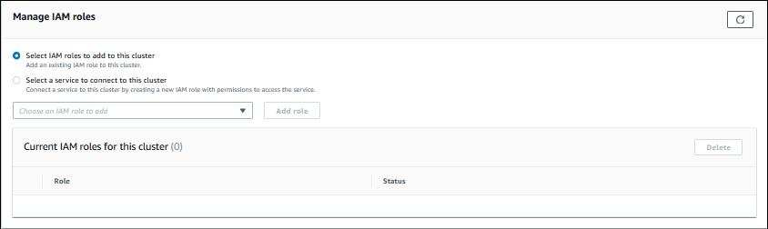
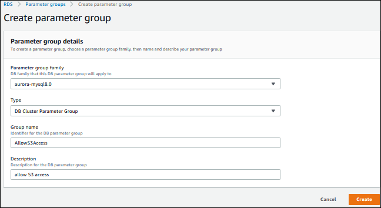

# Associating an IAM role with an

Amazon Aurora MySQL DB cluster

To permit database users in an Amazon Aurora DB cluster to access other AWS services, you associate the IAM role that
you created in [Creating an
IAM role to allow Amazon Aurora to access AWS services](AuroraMySQL.Integrating.Authorizing.IAM.md "AuroraMySQL.Integrating.Authorizing.IAM.md") with that DB cluster. You can also have AWS
create a new IAM role by associating the service directly.

###### Note

You can't associate an IAM role with an Aurora Serverless v1 DB cluster. For more information, see [Using Amazon Aurora Serverless v1](aurora-serverless.md "aurora-serverless.md").

You can associate an IAM role with an Aurora Serverless v2 DB cluster.

To associate an IAM role with a DB cluster you do two things:

1. Add the role to the list of associated roles for a DB cluster by using the RDS console, the [add-role-to-db-cluster](../../../cli/latest/reference/rds/add-role-to-db-cluster.md "../../../cli/latest/reference/rds/add-role-to-db-cluster.md") AWS CLI command, or the
   [AddRoleToDBCluster](../APIReference/API_AddRoleToDBCluster.md "../APIReference/API_AddRoleToDBCluster.md") RDS API operation.

You can add a maximum of five IAM roles for each Aurora DB cluster. 2. Set the cluster-level parameter for the related AWS service to the ARN for the associated IAM role.

The following table describes the cluster-level parameter names for the IAM roles used to access other AWS
services.

| Cluster-level parameter      | Description                                                                                                                                                                                                                                                                                                                                                                                                                              |
| ---------------------------- | ---------------------------------------------------------------------------------------------------------------------------------------------------------------------------------------------------------------------------------------------------------------------------------------------------------------------------------------------------------------------------------------------------------------------------------------- |
| `aws_default_lambda_role`    | Used when invoking a Lambda function from your DB cluster.                                                                                                                                                                                                                                                                                                                                                                               |
| `aws_default_logs_role`      | This parameter is no longer required for exporting log data from your DB cluster to<br>Amazon CloudWatch Logs. Aurora MySQL now uses a service-linked role for the required permissions. For more<br>information about service-linked roles, see [Using service-linked roles for<br>Amazon Aurora](UsingWithRDS.IAM.md "UsingWithRDS.IAM.md").                                                                                           |
| `aws_default_s3_role`        | Used when invoking the `LOAD DATA FROM S3`, `LOAD XML FROM S3`, or<br>`SELECT INTO OUTFILE S3` statement from your DB cluster.<br>In Aurora MySQL version 2, the IAM role specified in this parameter is used if an IAM role<br>isn't specified for `aurora_load_from_s3_role` or<br>`aurora_select_into_s3_role` for the appropriate statement.<br>In Aurora MySQL version 3, the IAM role specified for this parameter is always used. |
| `aurora_load_from_s3_role`   | Used when invoking the `LOAD DATA FROM S3` or `LOAD XML FROM S3`<br>statement from your DB cluster. If an IAM role is not specified for this parameter, the IAM<br>role specified in `aws_default_s3_role` is used.<br>In Aurora MySQL version 3, this parameter isn't available.                                                                                                                                                        |
| `aurora_select_into_s3_role` | Used when invoking the `SELECT INTO OUTFILE S3` statement from your DB cluster.<br>If an IAM role is not specified for this parameter, the IAM role specified in<br>`aws_default_s3_role` is used.<br>In Aurora MySQL version 3, this parameter isn't available.                                                                                                                                                                         |

To associate an IAM role to permit your Amazon RDS cluster to communicate with other AWS services on your behalf, take
the following steps.

###### To associate an IAM role with an Aurora DB cluster using the console

1. Open the RDS console at [https://console.aws.amazon.com/rds/](https://console.aws.amazon.com/rds/ "https://console.aws.amazon.com/rds/").
2. Choose **Databases**.
3. Choose the name of the Aurora DB cluster that you want to associate an IAM role with to show its
   details.
4. On the **Connectivity & security** tab, in the **Manage IAM
   roles** section, do one of the following:
   - **Select IAM roles to add to this cluster** (default)
   - **Select a service to connect to this cluster**

 5. To use an existing IAM role, choose it from the menu, then choose **Add
role**.

If adding the role is successful, its status shows as `Pending`, then
`Available`. 6. To connect a service directly:

    1. Choose **Select a service to connect to this cluster**.
    2. Choose the service from the menu, then choose **Connect service**.
    3. For **Connect cluster to `Service Name`**, enter the
     Amazon Resource Name (ARN) to use to connect to the service, then choose **Connect
     service**.AWS creates a new IAM role for connecting to the service. Its status shows as `Pending`,

then `Available`. 7. (Optional) To stop associating an IAM role with a DB cluster and remove the related permission, choose
the role and then choose **Delete**.

###### To set the cluster-level parameter for the associated IAM role

1. In the RDS console, choose **Parameter groups** in the navigation pane.
2. If you are already using a custom DB parameter group, you can select that group to use instead of
   creating a new DB cluster parameter group. If you are using the default DB cluster parameter group,
   create a new DB cluster parameter group, as described in the following steps:
   1. Choose **Create parameter group**.
   2. For **Parameter group family**, choose `aurora-mysql8.0` for an
      Aurora MySQL 8.0-compatible DB cluster, or `aurora-mysql5.7` for an Aurora MySQL
      5.7-compatible DB cluster.
   3. For **Type**, choose **DB Cluster Parameter Group**.
   4. For **Group name**, type the name of your new DB cluster parameter
      group.
   5. For **Description**, type a description for your new DB cluster parameter
      group.

    6. Choose **Create**.

3. On the **Parameter groups** page, select your DB cluster parameter group and choose
   **Edit** for **Parameter group actions**.
4. Set the appropriate cluster-level [parameters](#aurora_cluster_params_iam_roles "#aurora_cluster_params_iam_roles") to
   the related IAM role ARN values.

For example, you can set just the `aws_default_s3_role` parameter to
`arn:aws:iam::123456789012:role/AllowS3Access`. 5. Choose **Save changes**. 6. To change the DB cluster parameter group for your DB cluster, complete the following steps:

    1. Choose **Databases**, and then choose your Aurora DB cluster.
    2. Choose **Modify**.
    3. Scroll to **Database options** and set **DB cluster parameter
     group** to the DB cluster parameter group.
    4. Choose **Continue**.
    5. Verify your changes and then choose **Apply immediately**.
    6. Choose **Modify cluster**.
    7. Choose **Databases**, and then choose the primary instance for your DB
     cluster.
    8. For **Actions**, choose **Reboot**.


    When the instance has rebooted, your IAM role is associated with your DB cluster.


    For more information about cluster parameter groups, see [Aurora MySQL configuration parameters](AuroraMySQL.Reference.md "AuroraMySQL.Reference.md").

###### To associate an IAM role with a DB cluster by using the AWS CLI

1. Call the `add-role-to-db-cluster` command from the AWS CLI to add the ARNs for your IAM roles
   to the DB cluster, as shown following.

```
PROMPT> aws rds add-role-to-db-cluster --db-cluster-identifier my-cluster --role-arn arn:aws:iam::123456789012:role/AllowAuroraS3Role
PROMPT> aws rds add-role-to-db-cluster --db-cluster-identifier my-cluster --role-arn arn:aws:iam::123456789012:role/AllowAuroraLambdaRole

```

2. If you are using the default DB cluster parameter group, create a new DB cluster parameter group. If
   you are already using a custom DB parameter group, you can use that group instead of creating a new DB
   cluster parameter group.

To create a new DB cluster parameter group, call the `create-db-cluster-parameter-group`
command from the AWS CLI, as shown following.

```
PROMPT> aws rds create-db-cluster-parameter-group  --db-cluster-parameter-group-name AllowAWSAccess \
     --db-parameter-group-family aurora5.7 --description "Allow access to Amazon S3 and AWS Lambda"
```

For an Aurora MySQL 5.7-compatible DB cluster, specify `aurora-mysql5.7` for
`--db-parameter-group-family`. For an Aurora MySQL 8.0-compatible DB cluster, specify
`aurora-mysql8.0` for `--db-parameter-group-family`. 3. Set the appropriate cluster-level parameter or parameters and the related IAM role ARN values in your
DB cluster parameter group, as shown following.

```
PROMPT> aws rds modify-db-cluster-parameter-group --db-cluster-parameter-group-name AllowAWSAccess \
    --parameters "ParameterName=aws_default_s3_role,ParameterValue=arn:aws:iam::123456789012:role/AllowAuroraS3Role,method=pending-reboot" \
    --parameters "ParameterName=aws_default_lambda_role,ParameterValue=arn:aws:iam::123456789012:role/AllowAuroraLambdaRole,method=pending-reboot"
```

4. Modify the DB cluster to use the new DB cluster parameter group and then reboot the cluster, as shown
   following.

```
PROMPT> aws rds modify-db-cluster --db-cluster-identifier my-cluster --db-cluster-parameter-group-name AllowAWSAccess
PROMPT> aws rds reboot-db-instance --db-instance-identifier my-cluster-primary
```

When the instance has rebooted, your IAM roles are associated with your DB cluster.

For more information about cluster parameter groups, see [Aurora MySQL configuration parameters](AuroraMySQL.Reference.md "AuroraMySQL.Reference.md").
