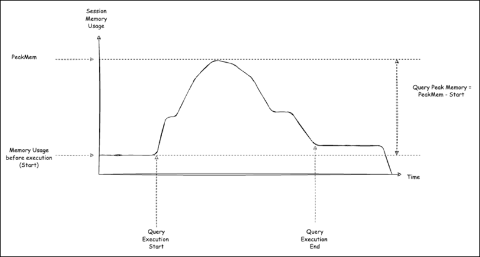

# Monitoring query execution plans and peak memory for Aurora PostgreSQL

You can monitor query execution plans in your Aurora PostgreSQL DB instance to detect the execution plans
contributing to current database load and to track performance statistics of execution plans over time
using the `aurora_compute_plan_id` parameter. Whenever a query executes, the execution plan used
by the query is assigned an identifier and the same identifier is used by subsequent executions of the same plan.

The `aurora_compute_plan_id` is turned `OFF` by default in DB parameter group from Aurora PostgreSQL versions 14.10, 15.5, and higher versions.
To assign a plan identifier, set `aurora_compute_plan_id` to `ON` in the parameter group.

This plan identifier is used in several utilities that serve a different purpose.

You can monitor query peak memory usage in your DB instance to detect queries contributing to high database memory use from the following versions:

- 16.3 and all higher versions
- 15.7 and higher versions
- 14.12 and higher versions
  Whenever a query runs, the peak memory used by the query is tracked. Queries typically run many times; the average, minimum and maximum memory usage values across all runs can be viewed for each query.

###### Topics

- [Accessing query execution plans and peak memory using Aurora functions](#AuroraPostgreSQL.Monitoring.Query.Plans.Functions "#AuroraPostgreSQL.Monitoring.Query.Plans.Functions")
- [Parameter reference for Aurora PostgreSQL query execution plans](#AuroraPostgreSQL.Monitoring.Query.Plans.Parameters "#AuroraPostgreSQL.Monitoring.Query.Plans.Parameters")

## Accessing query execution plans and peak memory using Aurora functions

With `aurora_compute_plan_id`, you can access the execution plans using the following functions:

- aurora_stat_activity
- aurora_stat_plans

The query peak memory does not include memory that is allocated before query processing starts. Peak memory usage is tracked and reported separately for the planning
and execution phases of each query.

You can access the query peak memory statistics using the following functions:

- aurora_stat_statements
- aurora_stat_plans

For more information on these functions, see [Aurora PostgreSQL functions reference](Appendix.AuroraPostgreSQL.md "Appendix.AuroraPostgreSQL.md").

## Parameter reference for Aurora PostgreSQL query execution plans

You can monitor the query execution plans using the below parameters in a DB parameter group.

###### Parameters

- [aurora_compute_plan_id](#aurora.compute_plan_id "#aurora.compute_plan_id")
- [aurora_stat_plans.minutes_until_recapture](#aurora.minutes_until_recapture "#aurora.minutes_until_recapture")
- [aurora_stat_plans.calls_until_recapture](#aurora.calls_until_recapture "#aurora.calls_until_recapture")
- [aurora_stat_plans.with_costs](#aurora.with_costs "#aurora.with_costs")
- [aurora_stat_plans.with_analyze](#aurora.with_analyze "#aurora.with_analyze")
- [aurora_stat_plans.with_timing](#aurora.with_timing "#aurora.with_timing")
- [aurora_stat_plans.with_buffers](#aurora.with_buffers "#aurora.with_buffers")
- [aurora_stat_plans.with_wal](#aurora.with_wal "#aurora.with_wal")
- [aurora_stat_plans.with_triggers](#aurora.with_triggers "#aurora.with_triggers")

###### Note

The configuration for `aurora_stat_plans.with_*` parameters takes effect only for newly captured plans.

### aurora_compute_plan_id

The `aurora_compute_plan_id` is a configuration parameter that controls whether a plan identifier is assigned during query execution.

| Default | Allowed values                           | Description                                                    |
| ------- | ---------------------------------------- | -------------------------------------------------------------- |
| off     | 0(off)                                   | Set to `off` to prevent a plan identifier from being assigned. |
| 1(on)   | Set to `on` to assign a plan identifier. |

### aurora_stat_plans.minutes_until_recapture

The number of minutes to pass before a plan is recaptured. Default is 0 which will disable recapturing
a plan. When the `aurora_stat_plans.calls_until_recapture`
threshold is passed, the plan will be recaptured.

| Default | Allowed values | Description                                                    |
| ------- | -------------- | -------------------------------------------------------------- |
| 0       | 0-1073741823   | Set the number of minutes to pass before a plan is recaptured. |

### aurora_stat_plans.calls_until_recapture

The number of calls to a plan before it is recaptured. Default is 0 which will disable recapturing
a plan after a number of calls. When the `aurora_stat_plans.minutes_until_recapture`
threshold is passed, the plan will be recaptured.

| Default | Allowed values | Description                                          |
| ------- | -------------- | ---------------------------------------------------- |
| 0       | 0-1073741823   | Set the number of calls before a plan is recaptured. |

### aurora_stat_plans.with_costs

Captures an EXPLAIN plan with estimated costs. The allowed values are `on` and `off`. The default is `on`.

| Default | Allowed values                                    | Description                                              |
| ------- | ------------------------------------------------- | -------------------------------------------------------- |
| on      | 0(off)                                            | Doesn't show estimated cost and rows for each plan node. |
| 1(on)   | Shows estimated cost and rows for each plan node. |

### aurora_stat_plans.with_analyze

Controls the EXPLAIN plan with ANALYZE. This mode is only used the first time a plan is captured. The allowed values are `on` and `off`. The default is `off`.

| Default | Allowed values                                    | Description                                              |
| ------- | ------------------------------------------------- | -------------------------------------------------------- |
| off     | 0(off)                                            | Doesn't include actual run time statistics for the plan. |
| 1(on)   | Includes actual run time statistics for the plan. |

### aurora_stat_plans.with_timing

Plan timing will be captured in the explain when ANALYZE is used. The default is `on`.

| Default | Allowed values                                                  | Description                                                            |
| ------- | --------------------------------------------------------------- | ---------------------------------------------------------------------- |
| on      | 0(off)                                                          | Doesn't include actual start up time and time spent in each plan node. |
| 1(on)   | Includes actual start up time and time spent in each plan node. |

### aurora_stat_plans.with_buffers

Plan buffer usage statistics will be captured in the explain when ANALYZE is used. The default is `off`.

| Default | Allowed values                        | Description                                  |
| ------- | ------------------------------------- | -------------------------------------------- |
| off     | 0(off)                                | Doesn't include information on buffer usage. |
| 1(on)   | Includes information on buffer usage. |

### aurora_stat_plans.with_wal

Plan wal usage statistics will be captured in the explain when ANALYZE is used. The default is `off`.

| Default | Allowed values                                 | Description                                           |
| ------- | ---------------------------------------------- | ----------------------------------------------------- |
| off     | 0(off)                                         | Doesn't include information on WAL record generation. |
| 1(on)   | Includes information on WAL record generation. |

### aurora_stat_plans.with_triggers

Plan trigger execution statistics will be captured in the explain when `ANALYZE` is used. The default is `off`.

| Default | Allowed values                          | Description                                    |
| ------- | --------------------------------------- | ---------------------------------------------- |
| off     | 0(off)                                  | Doesn't include triggers execution statistics. |
| 1(on)   | Includes triggers execution statistics. |
