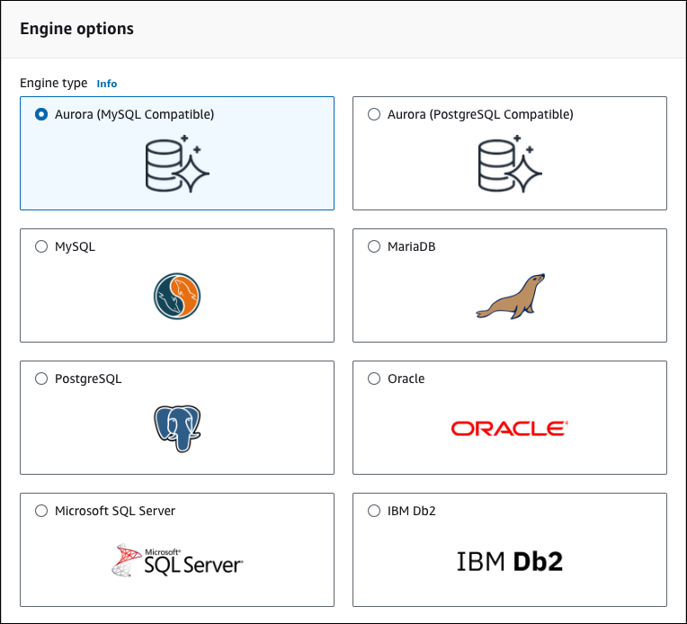
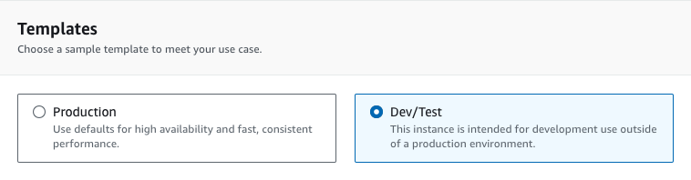
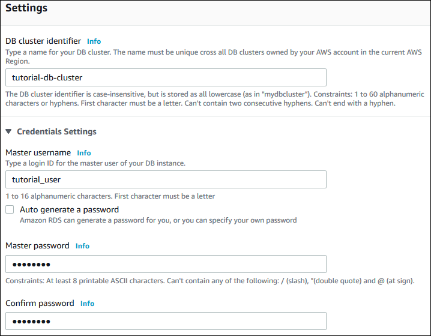
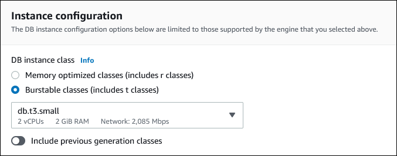
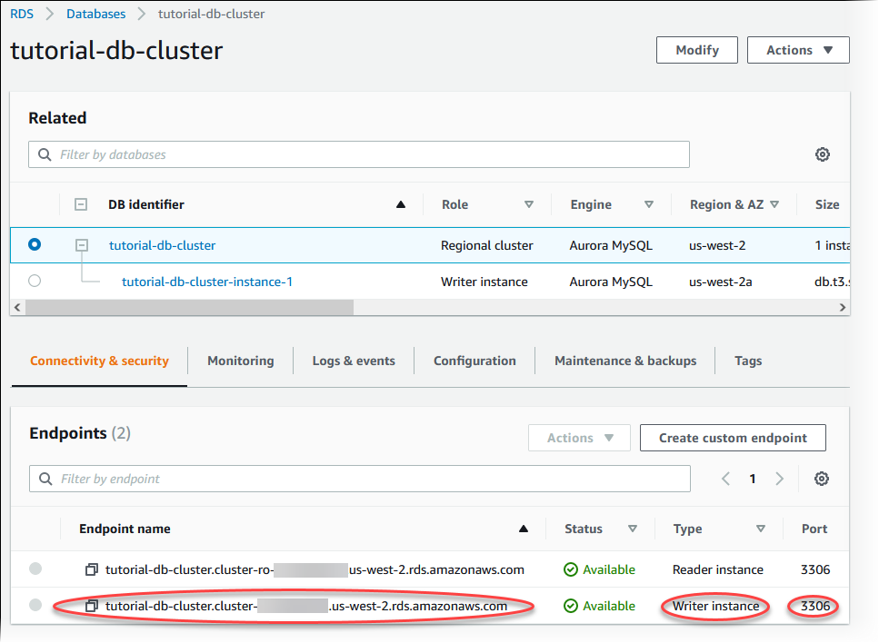
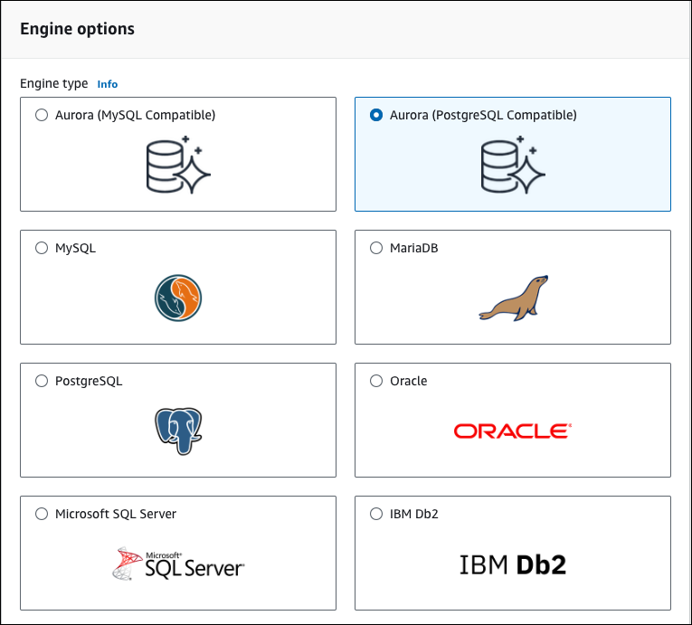
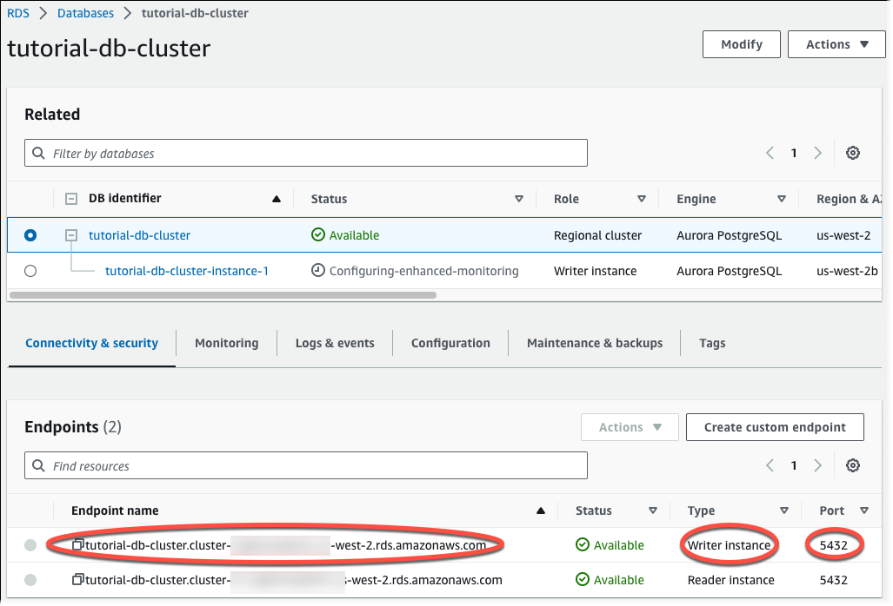

# Create an Amazon Aurora DB cluster

Create an Amazon Aurora MySQL or Aurora PostgreSQL DB cluster that maintains the data used by a
web application.

Aurora MySQL

###### To create an Aurora MySQL DB cluster

1. Sign in to the AWS Management Console and open the Amazon RDS console at
   [https://console.aws.amazon.com/rds/](https://console.aws.amazon.com/rds/ "https://console.aws.amazon.com/rds/").
2. In the upper-right corner of the AWS Management Console, make sure the
   AWS Region is the same as the one where you created your EC2
   instance.
3. In the navigation pane, choose
   **Databases**.
4. Choose **Create database**.
5. On the **Create database** page, choose
   **Standard create**.
6. For **Engine options**, choose **Aurora
   (MySQL Compatible)**.

Keep the default values for **Version** and the
other engine options. 7. In the **Templates** section, choose
**Dev/Test**.

 8. In the **Settings** section, set these
values:

    * **DB cluster identifier** – Type
     `tutorial-db-cluster`.
    * **Master username** – Type
     `tutorial_user`.
    * **Auto generate a password** –
     Leave the option turned off.
    * **Master password** – Type a
     password.
    * **Confirm password** – Retype the
     password.

 9. In the **Instance configuration** section, set
these values:

    * **Burstable classes (includes t
     classes)**
    * **db.t3.small** or
     **db.t3.medium**

    ###### Note

    We recommend using the T DB instance classes only for
     development and test servers, or other non-production
     servers. For more details on the T instance classes, see
     [DB instance class types](Concepts.DBInstanceClass.md "Concepts.DBInstanceClass.md").

 10. In the **Availability and durability** section,
use the default values. 11. In the **Connectivity** section, set these values
and keep the other values as their defaults:

    * For **Compute resource**, choose
     **Connect to an EC2 compute
     resource**.
    * For **EC2 instance**, choose the EC2
     instance you created previously, such as
     **tutorial-ec2-instance-web-server**.

 12. Open the **Additional configuration** section,
and enter `sample` for **Initial
database name**. Keep the default settings for the
other options. 13. To create your Aurora MySQL DB cluster, choose **Create
database**.

Your new DB cluster appears in the **Databases**
list with the status **Creating**. 14. Wait for the **Status** of your new DB cluster to
show as **Available**. Then choose the DB cluster
name to show its details. 15. In the **Connectivity & security** section,
view the **Endpoint** and **Port**
of the writer DB instance.

Note the endpoint and port for your writer DB instance. You use
this information to connect your web server to your DB
cluster. 16. Complete [Install a web server on your EC2 instance](CHAP_Tutorials.WebServerDB.md "CHAP_Tutorials.WebServerDB.md").

Aurora PostgreSQL

###### To create an Aurora PostgreSQL DB cluster

1. Sign in to the AWS Management Console and open the Amazon RDS console at
   [https://console.aws.amazon.com/rds/](https://console.aws.amazon.com/rds/ "https://console.aws.amazon.com/rds/").
2. In the upper-right corner of the AWS Management Console, make sure the
   AWS Region is the same as the one where you created your EC2
   instance.
3. In the navigation pane, choose
   **Databases**.
4. Choose **Create database**.
5. On the **Create database** page, choose
   **Standard create**.
6. For **Engine options**, choose **Aurora
   (PostgreSQL Compatible)**.

Keep the default values for **Version** and the
other engine options. 7. In the **Templates** section, choose
**Dev/Test**.

 8. In the **Settings** section, set these
values:

    * **DB cluster identifier** – Type
     `tutorial-db-cluster`.
    * **Master username** – Type
     `tutorial_user`.
    * **Auto generate a password** –
     Leave the option turned off.
    * **Master password** – Type a
     password.
    * **Confirm password** – Retype the
     password.

 9. In the **Instance configuration** section, set
these values:

    * **Burstable classes (includes t
     classes)**
    * **db.t3.small** or
     **db.t3.medium**

    ###### Note

    We recommend using the T DB instance classes only for
     development and test servers, or other non-production
     servers. For more details on the T instance classes, see
     [DB instance class types](Concepts.DBInstanceClass.md "Concepts.DBInstanceClass.md").

 10. In the **Availability and durability** section,
use the default values. 11. In the **Connectivity** section, set these values
and keep the other values as their defaults:

    * For **Compute resource**, choose
     **Connect to an EC2 compute
     resource**.
    * For **EC2 instance**, choose the EC2
     instance you created previously, such as
     **tutorial-ec2-instance-web-server**.

 12. Open the **Additional configuration** section,
and enter `sample` for **Initial
database name**. Keep the default settings for the
other options. 13. To create your Aurora PostgreSQL DB cluster, choose **Create
database**.

Your new DB cluster appears in the **Databases**
list with the status **Creating**. 14. Wait for the **Status** of your new DB cluster to
show as **Available**. Then choose the DB cluster
name to show its details. 15. In the **Connectivity & security** section,
view the **Endpoint** and **Port**
of the writer DB instance.

Note the endpoint and port for your writer DB instance. You use
this information to connect your web server to your DB
cluster. 16. Complete [Install a web server on your EC2 instance](CHAP_Tutorials.WebServerDB.md "CHAP_Tutorials.WebServerDB.md").
