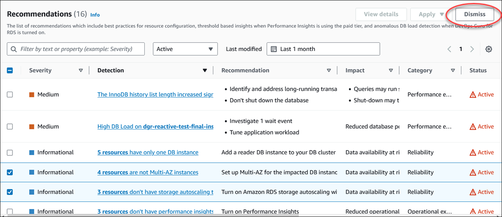

# Dismissing Amazon Aurora recommendations

You can dismiss one or more Amazon Aurora recommendations using the Amazon RDS console, AWS CLI, or Amazon RDS API.

###### To dismiss one or more recommendations

1. Sign in to the AWS Management Console and open the Amazon RDS console at
   [https://console.aws.amazon.com/rds/](https://console.aws.amazon.com/rds/ "https://console.aws.amazon.com/rds/").
2. In the navigation pane, perform any of the following:
   - Choose **Recommendations**.

   The **Recommendations** page appears with the list of
   all recommendations.
   - Choose **Databases** and then choose **Recommendations**
     for a resource in the databases page.

   The details appear in the **Recommendations** tab for
   the selected recommendation.
   - Choose **Detection** for an active recommendation in the
     **Recommendations** page or the
     **Recommendations** tab in the
     **Databases** page.

   The recommendation details page displays the list of affected resources.

3. Choose one or more recommendation, or one or more affected resources
   in the recommendation details page, and then choose
   **Dismiss**.

The following example shows the **Recommendations**
page with multiple active recommendations selected to dismiss.

A banner displays a message when the selected one or more recommendations are
dismissed.

The following example shows the banner with the successful message.

The following example shows the banner with the failure message.

###### To dismiss an Aurora recommendation using the

AWS CLI

1. Run the command `aws rds describe-db-recommendations --filters "Name=status,Values=active"`.

The output provides a list of recommendations in `active` status. 2. Find the `recommendationId` for the recommendation that you want to dismiss from step 1. 3. Run the command `>aws rds modify-db-recommendation --status dismissed --recommendationId <ID>` with the
`recommendationId` from step 2 to dismiss the recommendation.
To dismiss an Aurora recommendation using the Amazon RDS API, use the [ModifyDBRecommendation](../APIReference/API_ModifyDBRecommendation.md "../APIReference/API_ModifyDBRecommendation.md") operation.
