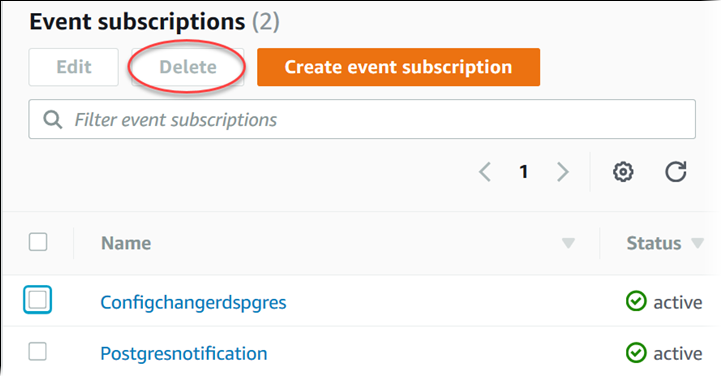

# Deleting an Amazon RDS event notification subscription

You can delete a subscription when you no longer need it. All subscribers to the topic will no longer receive
event notifications specified by the subscription.

###### To delete an Amazon RDS event notification subscription

1. Sign in to the AWS Management Console and open the Amazon RDS console at
   [https://console.aws.amazon.com/rds/](https://console.aws.amazon.com/rds/ "https://console.aws.amazon.com/rds/").
2. In the navigation pane, choose **DB Event Subscriptions**.
3. In the **My DB Event Subscriptions** pane, choose the subscription that you
   want to delete.
4. Choose **Delete**.
5. The Amazon RDS console indicates that the subscription is being deleted.


To delete an Amazon RDS event notification subscription, use the AWS CLI [`delete-event-subscription`](../../../cli/latest/reference/rds/delete-event-subscription.md "../../../cli/latest/reference/rds/delete-event-subscription.md")
command. Include the following required parameter:

- `--subscription-name`

###### Example

The following example deletes the subscription `myrdssubscription`.

```
aws rds delete-event-subscription --subscription-name `myrdssubscription`
```

To delete an Amazon RDS event notification subscription, use the RDS API [`DeleteEventSubscription`](../APIReference/API_DeleteEventSubscription.md "../APIReference/API_DeleteEventSubscription.md")
command. Include the following required parameter:

- `SubscriptionName`
