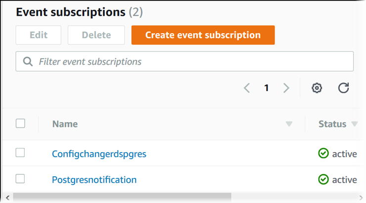

# Listing Amazon RDS event notification subscriptions

You can list your current Amazon RDS event notification subscriptions.

###### To list your current Amazon RDS event notification subscriptions

1. Sign in to the AWS Management Console and open the Amazon RDS console at
   [https://console.aws.amazon.com/rds/](https://console.aws.amazon.com/rds/ "https://console.aws.amazon.com/rds/").
2. In the navigation pane, choose **Event subscriptions**. The **Event
   subscriptions** pane shows all your event notification subscriptions.


To list your current Amazon RDS event notification subscriptions, use the AWS CLI [`describe-event-subscriptions`](../../../cli/latest/reference/rds/describe-event-subscriptions.md "../../../cli/latest/reference/rds/describe-event-subscriptions.md") command.

###### Example

The following example describes all event subscriptions.

```
aws rds describe-event-subscriptions
```

The following example describes the `myfirsteventsubscription`.

```
aws rds describe-event-subscriptions --subscription-name `myfirsteventsubscription`
```

To list your current Amazon RDS event notification subscriptions, call the Amazon RDS API [`DescribeEventSubscriptions`](../APIReference/API_DescribeEventSubscriptions.md "../APIReference/API_DescribeEventSubscriptions.md") action.
