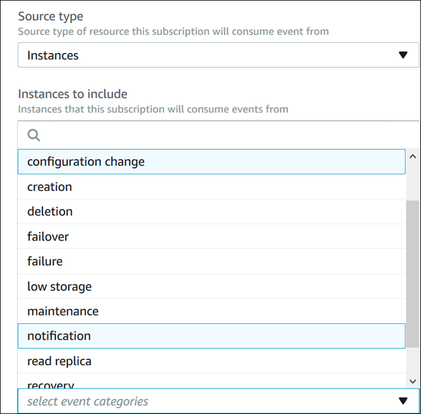

# Listing the Amazon RDS event notification categories

All events for a resource type are grouped into categories. To view the list of categories available, use the
following procedures.

When you create or modify an event notification subscription, the event categories are displayed in the
Amazon RDS console. For more information, see [Modifying an Amazon RDS event notification subscription](USER_Events.md "USER_Events.md").


To list the Amazon RDS event notification categories, use the AWS CLI [`describe-event-categories`](../../../cli/latest/reference/rds/describe-event-categories.md "../../../cli/latest/reference/rds/describe-event-categories.md")
command. This command has no required parameters.

###### Example

```
aws rds describe-event-categories
```

To list the Amazon RDS event notification categories, use the Amazon RDS API [`DescribeEventCategories`](../APIReference/API_DescribeEventCategories.md "../APIReference/API_DescribeEventCategories.md")
command. This command has no required parameters.
