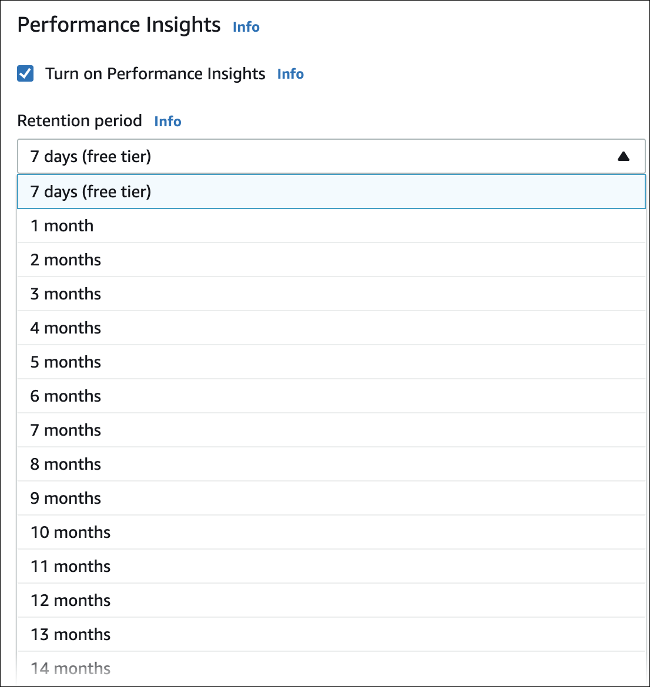

# Pricing and data retention for Performance Insights

By default, Performance Insights includes 7 days of performance data history and 1 million API requests per month. You
can also purchase longer retention periods. For complete pricing information, see [Performance Insights Pricing](https://aws.amazon.com/rds/performance-insights/pricing/ "https://aws.amazon.com/rds/performance-insights/pricing/").

In the RDS console, you can choose any of the following retention periods for your Performance Insights data:

- **Default (7 days)**
- **`n` months**, where **`n`** is a number
  from 1–24

To learn how to set a retention period using the AWS CLI, see [Turning Performance Insights on and off for Aurora](USER_PerfInsights.md "USER_PerfInsights.md").

###### Note

Stopping a DB cluster with Performance Insights enabled doesn't affect data retention. While a DB cluster is stopped, Performance Insights won't collect any data.
