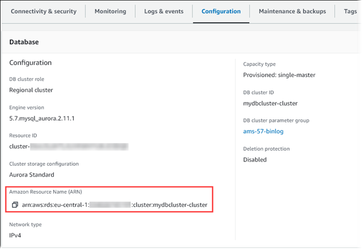

# Getting an existing ARN for Amazon RDS

You can get the ARN of an RDS resource by using the AWS Management Console, AWS Command Line Interface (AWS CLI), or RDS API.

To get an ARN from the AWS Management Console, navigate to the resource you want an ARN for, and view the details for that resource.

For example, you can get the ARN for a DB cluster from the **Configuration** tab
of the DB cluster details.


To get an ARN from the AWS CLI for a particular RDS resource, you use the `describe` command for that resource.
The following table shows each AWS CLI command, and the ARN property used with the command to get an ARN.

| AWS CLI command                                                                                                                                                                               | ARN property               |
| --------------------------------------------------------------------------------------------------------------------------------------------------------------------------------------------- | -------------------------- |
| [describe-event-subscriptions](../../../cli/latest/reference/rds/describe-event-subscriptions.md "../../../cli/latest/reference/rds/describe-event-subscriptions.md")                         | EventSubscriptionArn       |
| [describe-certificates](../../../cli/latest/reference/rds/describe-certificates.md "../../../cli/latest/reference/rds/describe-certificates.md")                                              | CertificateArn             |
| [describe-db-parameter-groups](../../../cli/latest/reference/rds/describe-db-parameter-groups.md "../../../cli/latest/reference/rds/describe-db-parameter-groups.md")                         | DBParameterGroupArn        |
| [describe-db-cluster-parameter-groups](../../../cli/latest/reference/rds/describe-db-cluster-parameter-groups.md "../../../cli/latest/reference/rds/describe-db-cluster-parameter-groups.md") | DBClusterParameterGroupArn |
| [describe-db-instances](../../../cli/latest/reference/rds/describe-db-instances.md "../../../cli/latest/reference/rds/describe-db-instances.md")                                              | DBInstanceArn              |
| [describe-db-security-groups](../../../cli/latest/reference/rds/describe-db-security-groups.md "../../../cli/latest/reference/rds/describe-db-security-groups.md")                            | DBSecurityGroupArn         |
| [describe-db-snapshots](../../../cli/latest/reference/rds/describe-db-snapshots.md "../../../cli/latest/reference/rds/describe-db-snapshots.md")                                              | DBSnapshotArn              |
| [describe-events](../../../cli/latest/reference/rds/describe-events.md "../../../cli/latest/reference/rds/describe-events.md")                                                                | SourceArn                  |
| [describe-reserved-db-instances](../../../cli/latest/reference/rds/describe-reserved-db-instances.md "../../../cli/latest/reference/rds/describe-reserved-db-instances.md")                   | ReservedDBInstanceArn      |
| [describe-db-subnet-groups](../../../cli/latest/reference/rds/describe-db-subnet-groups.md "../../../cli/latest/reference/rds/describe-db-subnet-groups.md")                                  | DBSubnetGroupArn           |
| [describe-db-clusters](../../../cli/latest/reference/rds/describe-db-clusters.md "../../../cli/latest/reference/rds/describe-db-clusters.md")                                                 | DBClusterArn               |
| [describe-db-cluster-snapshots](../../../cli/latest/reference/rds/describe-db-cluster-snapshots.md "../../../cli/latest/reference/rds/describe-db-cluster-snapshots.md")                      | DBClusterSnapshotArn       |

For example, the following AWS CLI command gets the ARN for a DB instance.

###### Example

For Linux, macOS, or Unix:

```
aws rds describe-db-instances \
--db-instance-identifier `DBInstanceIdentifier` \
--region `us-west-2` \
--query "*[].{DBInstanceIdentifier:DBInstanceIdentifier,DBInstanceArn:DBInstanceArn}"

```

For Windows:

```
aws rds describe-db-instances ^
--db-instance-identifier `DBInstanceIdentifier` ^
--region `us-west-2` ^
--query "*[].{DBInstanceIdentifier:DBInstanceIdentifier,DBInstanceArn:DBInstanceArn}"

```

The output of that command is like the following:

```

[
    {
        "DBInstanceArn": "arn:aws:rds:us-west-2:`account_id`:db:`instance_id`",
        "DBInstanceIdentifier": "`instance_id`"
    }
]

```

To get an ARN for a particular RDS resource, you can call the following RDS API operations and use the ARN properties shown following.

| RDS API operation                                                                                                                                     | ARN property               |
| ----------------------------------------------------------------------------------------------------------------------------------------------------- | -------------------------- |
| [DescribeEventSubscriptions](../APIReference/API_DescribeEventSubscriptions.md "../APIReference/API_DescribeEventSubscriptions.md")                   | EventSubscriptionArn       |
| [DescribeCertificates](../APIReference/API_DescribeCertificates.md "../APIReference/API_DescribeCertificates.md")                                     | CertificateArn             |
| [DescribeDBParameterGroups](../APIReference/API_DescribeDBParameterGroups.md "../APIReference/API_DescribeDBParameterGroups.md")                      | DBParameterGroupArn        |
| [DescribeDBClusterParameterGroups](../APIReference/API_DescribeDBClusterParameterGroups.md "../APIReference/API_DescribeDBClusterParameterGroups.md") | DBClusterParameterGroupArn |
| [DescribeDBInstances](../APIReference/API_DescribeDBInstances.md "../APIReference/API_DescribeDBInstances.md")                                        | DBInstanceArn              |
| [DescribeDBSecurityGroups](../APIReference/API_DescribeDBSecurityGroups.md "../APIReference/API_DescribeDBSecurityGroups.md")                         | DBSecurityGroupArn         |
| [DescribeDBSnapshots](../APIReference/API_DescribeDBSnapshots.md "../APIReference/API_DescribeDBSnapshots.md")                                        | DBSnapshotArn              |
| [DescribeEvents](../APIReference/API_DescribeEvents.md "../APIReference/API_DescribeEvents.md")                                                       | SourceArn                  |
| [DescribeReservedDBInstances](../APIReference/API_DescribeReservedDBInstances.md "../APIReference/API_DescribeReservedDBInstances.md")                | ReservedDBInstanceArn      |
| [DescribeDBSubnetGroups](../APIReference/API_DescribeDBSubnetGroups.md "../APIReference/API_DescribeDBSubnetGroups.md")                               | DBSubnetGroupArn           |
| [DescribeDBClusters](../APIReference/API_DescribeDBClusters.md "../APIReference/API_DescribeDBClusters.md")                                           | DBClusterArn               |
| [DescribeDBClusterSnapshots](../APIReference/API_DescribeDBClusterSnapshots.md "../APIReference/API_DescribeDBClusterSnapshots.md")                   | DBClusterSnapshotArn       |
