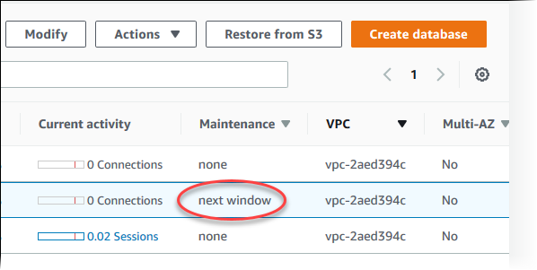
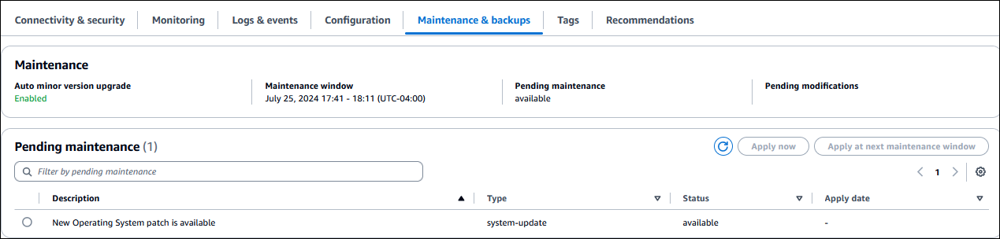
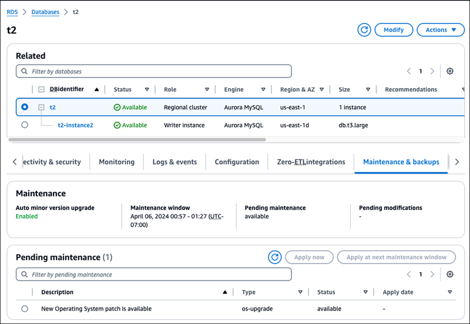
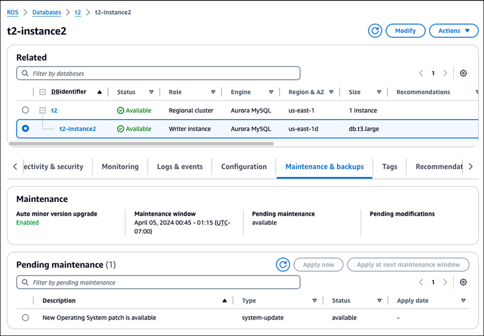
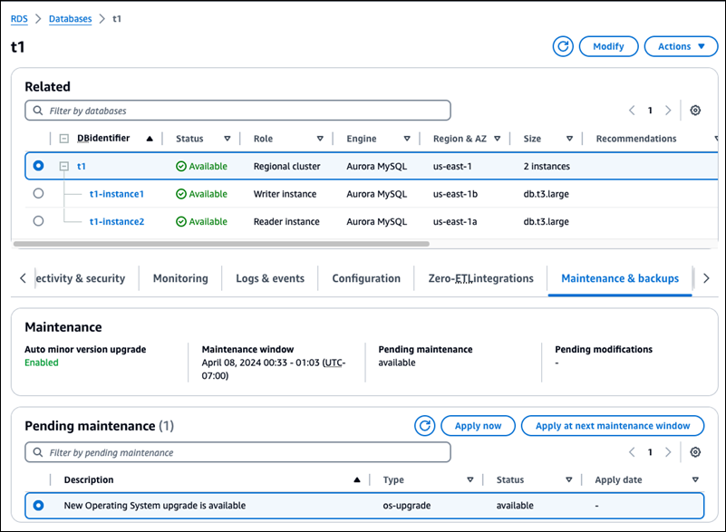
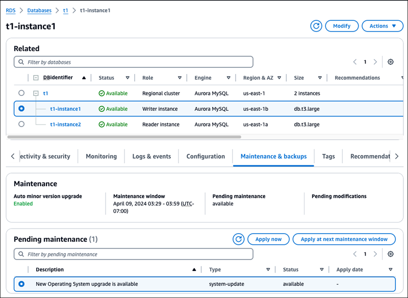
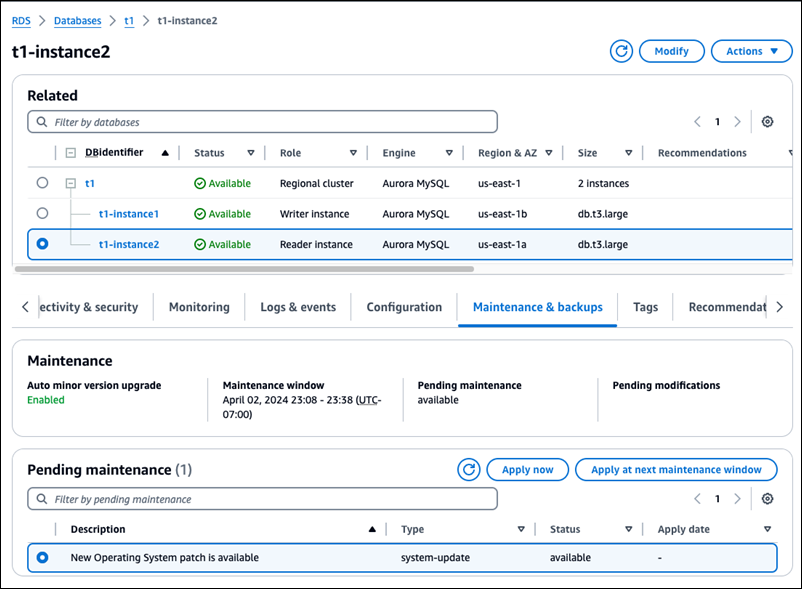

# Maintaining an Amazon Aurora DB cluster

Periodically, Amazon RDS performs maintenance on Amazon RDS resources. The following topics describe these maintenance actions and how to apply them.

## Overview of DB cluster

maintenance updates

Maintenance most often involves updates to the following resources in your DB cluster:

- Underlying hardware
- Underlying operating system (OS)
- Database engine version

Updates to the operating system most often occur for security issues. We recommend that
you do them as soon as possible. For more information about operating system updates, see
[Operating system updates for Aurora DB clusters](#Aurora_OS_updates "#Aurora_OS_updates").

###### Topics

- [Offline resources
  during maintenance updates](#USER_UpgradeDBInstance.Maintenance.Overview.offline "#USER_UpgradeDBInstance.Maintenance.Overview.offline")
- [Deferred
  DB instance and DB cluster modifications](#USER_UpgradeDBInstance.Maintenance.Overview.Deferred "#USER_UpgradeDBInstance.Maintenance.Overview.Deferred")
- [Eventual consistency for the DescribePendingMaintenanceActions API](#USER_UpgradeDBInstance.Maintenance.Overview.eventual-consistency "#USER_UpgradeDBInstance.Maintenance.Overview.eventual-consistency")

### Offline resources

during maintenance updates

Some maintenance items require that Amazon RDS take your DB cluster offline for a short time.
Maintenance items that require a resource to be offline include required operating
system or database patching. Required patching is automatically scheduled only for
patches that are related to security and instance reliability. Such patching occurs
infrequently, typically once every few months. It seldom requires more than a fraction
of your maintenance window.

### Deferred

DB instance and DB cluster modifications

Deferred DB cluster and instance modifications that you have chosen not
to apply immediately are applied during the maintenance window. For example, you might
choose to change DB instance classes or cluster or DB parameter groups during the maintenance
window. Such modifications that you specify using the **pending
reboot** setting don't show up in the **Pending
maintenance** list. For information about modifying a DB cluster, see [Modifying an Amazon Aurora DB cluster](Aurora.md "Aurora.md").

To see the modifications that are pending for the next maintenance
window, use the [describe-db-clusters](https://awscli.amazonaws.com/v2/documentation/api/latest/reference/rds/describe-db-clusters.html "https://awscli.amazonaws.com/v2/documentation/api/latest/reference/rds/describe-db-clusters.html") AWS CLI command and check the
`PendingModifiedValues` field.

### Eventual consistency for the DescribePendingMaintenanceActions API

The Amazon RDS `DescribePendingMaintenanceActions` API follows an eventual
consistency model. This means that the result of the
`DescribePendingMaintenanceActions` command might not be immediately
visible to all subsequent RDS commands. Keep this in mind when you use
`DescribePendingMaintenanceActions` immediately after using a previous
API command.

Eventual consistency can affect the way you managed your maintenance updates. For
example, if you run the `ApplyPendingMaintenanceActions` command to update
the database engine version for a DB cluster, it will eventually be visible to
`DescribePendingMaintenanceActions`. In this scenario,
`DescribePendingMaintenanceActions` might show that the maintenance
action wasn't applied even though it was.

To manage eventual consistency, you can do the following:

- Confirm the state of your DB cluster before you run a command to modify it. Run
  the appropriate `DescribePendingMaintenanceActions` command using an
  exponential backoff algorithm to ensure that you allow enough time for the
  previous command to propagate through the system. To do this, run the
  `DescribePendingMaintenanceActions` command repeatedly, starting
  with a couple of seconds of wait time, and increasing gradually up to five
  minutes of wait time.
- Add wait time between subsequent commands, even if a
  `DescribePendingMaintenanceActions` command returns an accurate
  response. Apply an exponential backoff algorithm starting with a couple of
  seconds of wait time, and increase gradually up to about five minutes of wait
  time.

## Viewing pending maintenance

updates

View whether a maintenance update is available for your DB cluster by using the RDS
console, the AWS CLI, or the RDS API. If an update is available, it is indicated in the
**Maintenance** column for the DB cluster on the Amazon RDS console,
as shown in this figure.



If no maintenance update is available for a DB
cluster,
the column value is **none** for it.

If a maintenance update is available for a DB
cluster,
the following column values are possible:

- **required** – The maintenance action will be applied to the resource
  and can't be deferred indefinitely.
- **available** – The maintenance action is available, but
  it will not be applied to the resource automatically. You can apply it manually.
- **next window** – The maintenance action will be applied to the resource
  during the next maintenance window.
- **In progress** – The maintenance action is being applied
  to the resource.

If an update is available, you can do one of the following:

- If the maintenance value is **next window**, defer the
  maintenance actions by choosing **Defer upgrade** from
  **Actions**. You can't defer a maintenance action that
  has already started.
- Apply the maintenance actions immediately.
- Apply the maintenance actions during your next maintenance window.
- Take no action.

###### To take an action by using the AWS Management Console

1. Choose the DB instance or cluster to show
   its details.
2. Choose **Maintenance & backups**. The pending maintenance
   actions appear.
3. Choose the action to take, then choose when to apply it.



The maintenance window determines when pending operations start, but doesn't limit
the total run time of these operations. Maintenance operations aren't guaranteed to
finish before the maintenance window ends, and can continue beyond the specified end
time. For more information, see [Amazon RDS maintenance window](#Concepts.DBMaintenance "#Concepts.DBMaintenance").

You can also view whether a maintenance update is available for your DB
cluster by running the
[describe-pending-maintenance-actions](../../../cli/latest/reference/rds/describe-pending-maintenance-actions.md "../../../cli/latest/reference/rds/describe-pending-maintenance-actions.md") AWS CLI command.

For information about applying maintenance updates, see
[Applying updates to a DB cluster](#USER_UpgradeDBInstance.OSUpgrades "#USER_UpgradeDBInstance.OSUpgrades").

### Maintenance actions for Amazon Aurora

The following maintenance actions apply to Aurora DB clusters:

- `os-upgrade` – Update the operating systems of all the DB instances in the DB cluster, using rolling upgrades.
  For more information, see [Operating system updates for Aurora DB clusters](#Aurora_OS_updates "#Aurora_OS_updates").
- `system-update` – Patch the DB engine for Aurora PostgreSQL.

The following maintenance actions apply to Aurora DB instances:

- `ca-certificate-rotation` – Update the Amazon RDS Certificate Authority certificate for the DB instance.
- `hardware-maintenance` – Perform maintenance on the underlying hardware for the DB instance.
- `system-update` – Update the operating system for the DB instance.

## Choosing the frequency of Aurora MySQL maintenance updates

You can control whether Aurora MySQL upgrades happen frequently or rarely for each DB cluster. The best choice depends on your usage of Aurora MySQL
and the priorities for your applications that run on Aurora. For information about the Aurora MySQL long-term stability (LTS) releases that require
less frequent upgrades, see [Aurora MySQL long-term support (LTS) releases](AuroraMySQL.Update.md#AuroraMySQL.Updates.LTS "AuroraMySQL.Update.md#AuroraMySQL.Updates.LTS").

You might choose to upgrade an Aurora MySQL cluster rarely if some or all of the following conditions apply:

- Your testing cycle for your application takes a long time for each update to the Aurora MySQL database engine.
- You have many DB clusters or many applications all running on the same Aurora MySQL version. You prefer to upgrade all of your DB clusters and
  associated applications at the same time.
- You use both Aurora MySQL and RDS for MySQL. You prefer to keep the Aurora MySQL clusters and RDS for MySQL DB instances compatible with the same level
  of MySQL.
- Your Aurora MySQL application is in production or is otherwise business-critical. You can't afford downtime for upgrades outside of
  rare occurrences for critical patches.
- Your Aurora MySQL application isn't limited by performance issues or feature gaps that are addressed in subsequent Aurora MySQL
  versions.

If the preceding factors apply to your situation, you can limit the number of forced upgrades for an Aurora MySQL DB cluster. You do so by choosing a
specific Aurora MySQL version known as the "Long-Term Support" (LTS) version when you create or upgrade that DB cluster. Doing so minimizes the
number of upgrade cycles, testing cycles, and upgrade-related outages for that DB cluster.

You might choose to upgrade an Aurora MySQL cluster frequently if some or all of the following conditions apply:

- The testing cycle for your application is straightforward and brief.
- Your application is still in the development stage.
- Your database environment uses a variety of Aurora MySQL versions, or Aurora MySQL and RDS for MySQL versions. Each Aurora MySQL cluster has its
  own upgrade cycle.
- You are waiting for specific performance or feature improvements before you increase your usage of Aurora MySQL.

If the preceding factors apply to your situation, you can enable Aurora to apply important upgrades more frequently. To do so, upgrade an
Aurora MySQL DB cluster to a more recent Aurora MySQL version than the LTS version. Doing so makes the latest performance enhancements, bug fixes, and
features available to you more quickly.

## Amazon RDS maintenance window

The _maintenance window_ is a weekly time interval during which
any system changes are applied. Every DB cluster has a weekly
maintenance window. The maintenance window is an opportunity to control when
modifications and software patching occur. For more information about adjusting the
maintenance window, see [Adjusting the preferred DB cluster
maintenance window](#AdjustingTheMaintenanceWindow.Aurora "#AdjustingTheMaintenanceWindow.Aurora").

RDS consumes some of the resources on your DB
cluster while maintenance is being applied. You
might observe a minimal effect on performance. For a DB instance, on rare occasions, a
Multi-AZ failover might be required for a maintenance update to complete.

If a maintenance event is scheduled for a given week, it's initiated during the
30-minute maintenance window you identify. Most maintenance events also complete during
the 30-minute maintenance window, although larger maintenance events may take more than
30 minutes to complete. The maintenance window is paused when the DB
cluster is stopped.

The 30-minute maintenance window is selected at random from an 8-hour block of time
per region. If you don't specify a maintenance window when you create the DB cluster,
RDS assigns a 30-minute maintenance window on a randomly selected day of the
week.

The following table shows the time blocks for each AWS Region from which default
maintenance windows are assigned.

| Region Name                | Region         | Time Block      |
| -------------------------- | -------------- | --------------- |
| US East (N. Virginia)      | us-east-1      | 03:00–11:00 UTC |
| US East (Ohio)             | us-east-2      | 03:00–11:00 UTC |
| US West (N. California)    | us-west-1      | 06:00–14:00 UTC |
| US West (Oregon)           | us-west-2      | 06:00–14:00 UTC |
| Africa (Cape Town)         | af-south-1     | 03:00–11:00 UTC |
| Asia Pacific (Hong Kong)   | ap-east-1      | 06:00–14:00 UTC |
| Asia Pacific (Hyderabad)   | ap-south-2     | 06:30–14:30 UTC |
| Asia Pacific (Jakarta)     | ap-southeast-3 | 08:00–16:00 UTC |
| Asia Pacific (Malaysia)    | ap-southeast-5 | 09:00–17:00 UTC |
| Asia Pacific (Melbourne)   | ap-southeast-4 | 11:00–19:00 UTC |
| Asia Pacific (Mumbai)      | ap-south-1     | 06:00–14:00 UTC |
| Asia Pacific (New Zealand) | ap-southeast-6 | 13:00–21:00 UTC |
| Asia Pacific (Osaka)       | ap-northeast-3 | 22:00–23:59 UTC |
| Asia Pacific (Seoul)       | ap-northeast-2 | 13:00–21:00 UTC |
| Asia Pacific (Singapore)   | ap-southeast-1 | 14:00–22:00 UTC |
| Asia Pacific (Sydney)      | ap-southeast-2 | 12:00–20:00 UTC |
| Asia Pacific (Taipei)      | ap-east-2      | 9:00–17:00 UTC  |
| Asia Pacific (Thailand)    | ap-southeast-7 | 8:00–16:00 UTC  |
| Asia Pacific (Tokyo)       | ap-northeast-1 | 13:00–21:00 UTC |
| Canada (Central)           | ca-central-1   | 03:00–11:00 UTC |
| Canada West (Calgary)      | ca-west-1      | 18:00–02:00 UTC |
| China (Beijing)            | cn-north-1     | 06:00–14:00 UTC |
| China (Ningxia)            | cn-northwest-1 | 06:00–14:00 UTC |
| Europe (Frankfurt)         | eu-central-1   | 21:00–05:00 UTC |
| Europe (Ireland)           | eu-west-1      | 22:00–06:00 UTC |
| Europe (London)            | eu-west-2      | 22:00–06:00 UTC |
| Europe (Milan)             | eu-south-1     | 02:00–10:00 UTC |
| Europe (Paris)             | eu-west-3      | 23:59–07:29 UTC |
| Europe (Spain)             | eu-south-2     | 02:00–10:00 UTC |
| Europe (Stockholm)         | eu-north-1     | 23:00–07:00 UTC |
| Europe (Zurich)            | eu-central-2   | 02:00–10:00 UTC |
| Israel (Tel Aviv)          | il-central-1   | 03:00–11:00 UTC |
| Mexico (Central)           | mx-central-1   | 19:00–3:00 UTC  |
| Middle East (Bahrain)      | me-south-1     | 06:00–14:00 UTC |
| Middle East (UAE)          | me-central-1   | 05:00–13:00 UTC |
| South America (São Paulo)  | sa-east-1      | 00:00–08:00 UTC |
| AWS GovCloud (US-East)     | us-gov-east-1  | 17:00–01:00 UTC |
| AWS GovCloud (US-West)     | us-gov-west-1  | 06:00–14:00 UTC |

###### Topics

- [Adjusting the preferred DB cluster
  maintenance window](#AdjustingTheMaintenanceWindow.Aurora "#AdjustingTheMaintenanceWindow.Aurora")

### Adjusting the preferred DB cluster

maintenance window

The Aurora DB cluster maintenance window should fall at the time of lowest usage and
thus might need modification from time to time. Your DB cluster is unavailable during
this time only if the updates that are being applied require an outage. The outage
is for the minimum amount of time required to make the necessary updates.

###### Note

For upgrades to the database engine, Amazon Aurora manages the preferred
maintenance window for a DB cluster and not individual instances.

###### To adjust the preferred DB cluster maintenance window

1. Sign in to the AWS Management Console and open the Amazon RDS console at
   [https://console.aws.amazon.com/rds/](https://console.aws.amazon.com/rds/ "https://console.aws.amazon.com/rds/").
2. In the navigation pane, choose
   **Databases**.
3. Choose the DB cluster for which you want to change the maintenance
   window.
4. Choose **Modify**.
5. In the **Maintenance** section, update the
   maintenance window.
6. Choose **Continue**.

On the confirmation page, review your changes. 7. To apply the changes to the maintenance window immediately, choose
**Immediately** in the **Schedule of
modifications** section. 8. Choose **Modify cluster** to save your
changes.

Alternatively, choose **Back** to edit your
changes, or choose **Cancel** to cancel your
changes.
To adjust the preferred DB cluster maintenance window, use the AWS CLI [`modify-db-cluster`](../../../cli/latest/reference/rds/modify-db-cluster.md "../../../cli/latest/reference/rds/modify-db-cluster.md") command with the following
parameters:

- `--db-cluster-identifier`
- `--preferred-maintenance-window`
  The following code example sets the maintenance window to Tuesdays
  from 4:00–4:30 AM UTC.

For Linux, macOS, or Unix:

```
aws rds modify-db-cluster \
--db-cluster-identifier `my-cluster` \
--preferred-maintenance-window `Tue:04:00-Tue:04:30`
```

For Windows:

```
aws rds modify-db-cluster ^
--db-cluster-identifier `my-cluster` ^
--preferred-maintenance-window `Tue:04:00-Tue:04:30`
```

To adjust the preferred DB cluster maintenance window, use the Amazon RDS [`ModifyDBCluster`](../APIReference/API_ModifyDBCluster.md "../APIReference/API_ModifyDBCluster.md") API operation with the following
parameters:

- `DBClusterIdentifier`
- `PreferredMaintenanceWindow`

## Applying updates to a DB cluster

With Amazon RDS, you can choose when to apply maintenance operations. You can decide when Amazon RDS applies updates by using the AWS Management Console, AWS CLI, or RDS
API.

###### To manage an update for a DB cluster

1.  Sign in to the AWS Management Console and open the Amazon RDS console at
    [https://console.aws.amazon.com/rds/](https://console.aws.amazon.com/rds/ "https://console.aws.amazon.com/rds/").
2.  In the navigation pane, choose **Databases**.
3.  Choose the DB cluster that has a required update.
4.  For **Actions**, choose one of the following:

        * **Patch now**
        * **Patch at next window**


        ###### Note

        If you choose **Patch at next window** and later want to delay the update, you can choose **Defer
         upgrade**. You can't defer a maintenance action if it has already started.

        To cancel a maintenance action, modify the DB instance and disable **Auto minor version upgrade**.

    To apply a pending update to a DB cluster, use the [apply-pending-maintenance-action](../../../cli/latest/reference/rds/apply-pending-maintenance-action.md "../../../cli/latest/reference/rds/apply-pending-maintenance-action.md") AWS CLI command.

###### Example

For Linux, macOS, or Unix:

```
aws rds apply-pending-maintenance-action \
    --resource-identifier `arn:aws:rds:us-west-2:001234567890:db:mysql-db` \
    --apply-action `system-update` \
    --opt-in-type `immediate`
```

For Windows:

```
aws rds apply-pending-maintenance-action ^
    --resource-identifier `arn:aws:rds:us-west-2:001234567890:db:mysql-db` ^
    --apply-action `system-update` ^
    --opt-in-type `immediate`
```

###### Note

To defer a maintenance action, specify `undo-opt-in` for `--opt-in-type`. You can't specify
`undo-opt-in` for `--opt-in-type` if the maintenance action has already started.

To cancel a maintenance action, run the [modify-db-instance](../../../cli/latest/reference/rds/modify-db-instance.md "../../../cli/latest/reference/rds/modify-db-instance.md") AWS CLI command and
specify `--no-auto-minor-version-upgrade`.

To return a list of resources that have at least one pending update, use the [describe-pending-maintenance-actions](../../../cli/latest/reference/rds/describe-pending-maintenance-actions.md "../../../cli/latest/reference/rds/describe-pending-maintenance-actions.md") AWS CLI command.

###### Example

For Linux, macOS, or Unix:

```
aws rds describe-pending-maintenance-actions \
    --resource-identifier `arn:aws:rds:us-west-2:001234567890:db:mysql-db`
```

For Windows:

```
aws rds describe-pending-maintenance-actions ^
    --resource-identifier `arn:aws:rds:us-west-2:001234567890:db:mysql-db`
```

You can also return a list of resources for a DB cluster by
specifying the `--filters` parameter of the `describe-pending-maintenance-actions` AWS CLI command. The format for the
`--filters` command is
`Name=`filter-name`,Value=`resource-id`,...`.

The following are the accepted values for the `Name` parameter of a filter:

- `db-instance-id` – Accepts a list of DB instance identifiers or Amazon Resource Names (ARNs). The returned list only
  includes pending maintenance actions for the DB instances identified by these identifiers or ARNs.
- `db-cluster-id` – Accepts a list of DB cluster identifiers or ARNs for Amazon Aurora. The returned list only includes
  pending maintenance actions for the DB clusters identified by these identifiers or ARNs.
  For example, the following example returns the pending maintenance actions for the `sample-cluster1` and
  `sample-cluster2` DB clusters.

###### Example

For Linux, macOS, or Unix:

```
aws rds describe-pending-maintenance-actions \
	--filters Name=db-cluster-id,Values=sample-cluster1,sample-cluster2
```

For Windows:

```
aws rds describe-pending-maintenance-actions ^
	--filters Name=db-cluster-id,Values=sample-cluster1,sample-cluster2
```

To apply an update to a DB cluster, call the Amazon RDS API
[`ApplyPendingMaintenanceAction`](../APIReference/API_ApplyPendingMaintenanceAction.md "../APIReference/API_ApplyPendingMaintenanceAction.md") operation.

To return a list of resources that have at least one pending update, call the Amazon RDS API [`DescribePendingMaintenanceActions`](../APIReference/API_DescribePendingMaintenanceActions.md "../APIReference/API_DescribePendingMaintenanceActions.md") operation.

## Automatic minor version upgrades for Aurora

DB clusters

The **Auto minor version upgrade** setting specifies whether Aurora
automatically applies upgrades to your DB cluster. These upgrades include new minor
versions containing additional features and patches containing bug fixes.

Automatic minor version upgrades periodically update your
database to recent database engine versions. However, the upgrade might
not always include the latest database engine version. If you need to
keep your databases on specific versions at particular times,
we recommend that you manually upgrade to the database versions that
you need according to your required schedule.
In cases of critical security issues or when a version reaches its end-of-support date,
Amazon Aurora
might apply a minor version upgrade even if you haven't enabled the **Auto minor version upgrade**
option. For more information, see the upgrade documentation for your specific database engine.

See [Upgrading the minor version or patch level of an Aurora MySQL DB cluster](AuroraMySQL.Updates.md "AuroraMySQL.Updates.md")
and [Performing a minor
version upgrade](USER_UpgradeDBInstance.PostgreSQL.md "USER_UpgradeDBInstance.PostgreSQL.md").

###### Note

Aurora Global Database doesn't support automatic minor version
upgrades.

This setting is turned on by default. For each new DB cluster, choose the appropriate
value for this setting. This value is based on its importance, expected lifetime, and
the amount of verification testing that you do after each upgrade.

For instructions on turning the **Auto minor version upgrade**
setting on or off, see the following:

- [Enabling automatic minor version upgrades
  for an Aurora DB cluster](#aurora-amvu-cluster "#aurora-amvu-cluster")
- [Enabling automatic minor version upgrades
  for individual DB instances in an Aurora DB cluster](#aurora-amvu-instance "#aurora-amvu-instance")

###### Important

We strongly recommend that for new and existing DB clusters, you apply this
setting to the DB cluster and not to the DB instances in the cluster individually.
If any DB instance in your cluster has this setting turned off, the DB cluster
isn't automatically upgraded.

The following table shows how the **Auto minor version upgrade**
setting works when applied at the cluster and instance levels.

| Action                                                                                                                         | Cluster setting  | Instance settings                                     | Cluster upgraded automatically? |
| ------------------------------------------------------------------------------------------------------------------------------ | ---------------- | ----------------------------------------------------- | ------------------------------- |
| You set it to True on the DB cluster.                                                                                          | True             | True for all new and existing instances               | Yes                             |
| You set it to False on the DB cluster.                                                                                         | False            | False for all new and existing instances              | No                              |
| It was set previously to True on the DB cluster.<br>You set it to False on at least one DB instance.                           | Changes to False | False for one or more instances                       | No                              |
| It was set previously to False on the DB cluster.<br>You set it to True on at least one DB instance, but not all<br>instances. | False            | True for one or more instances, but not all instances | No                              |
| It was set previously to False on the DB cluster.<br>You set it to True on all DB instances.                                   | Changes to True  | True for all instances                                | Yes                             |

Automatic minor version upgrades are communicated in advance through an Amazon RDS DB
cluster event with a category of `maintenance` and ID of
`RDS-EVENT-0156`. For more information, see [Amazon RDS event categories and event messages for Aurora](USER_Events.md "USER_Events.md").

Automatic upgrades occur during the maintenance window. If the individual DB instances
in the DB cluster have different maintenance windows from the cluster maintenance
window, then the cluster maintenance window takes precedence.

For more information about engine updates for Aurora PostgreSQL, see [Database engine updates for
Amazon Aurora PostgreSQL](AuroraPostgreSQL.md "AuroraPostgreSQL.md").

For more information about the **Auto minor version upgrade** setting
for Aurora MySQL, see [Enabling automatic upgrades between minor Aurora MySQL versions](AuroraMySQL.Updates.md "AuroraMySQL.Updates.md"). For general information about engine
updates for Aurora MySQL, see [Database engine updates for Amazon Aurora MySQL](AuroraMySQL.md "AuroraMySQL.md").

###### Topics

Follow the general procedure in [Modifying the DB cluster by using the console, CLI, and API](Aurora.md#Aurora.Modifying.Cluster "Aurora.md#Aurora.Modifying.Cluster").

**Console**

On the **Modify DB cluster** page, in the
**Maintenance** section, select the
**Enable auto minor version upgrade** check
box.

**AWS CLI**

Call the [modify-db-cluster](../../../cli/latest/reference/rds/modify-db-cluster.md "../../../cli/latest/reference/rds/modify-db-cluster.md") AWS CLI command. Specify the name of
your DB cluster for the `--db-cluster-identifier` option
and `true` for the
`--auto-minor-version-upgrade` option. Optionally,
specify the `--apply-immediately` option to immediately
enable this setting for your DB cluster.

**RDS API**

Call the [ModifyDBCluster](../APIReference/API_ModifyDBCluster.md "../APIReference/API_ModifyDBCluster.md") API operation and specify the name of
your DB cluster for the `DBClusterIdentifier` parameter
and `true` for the `AutoMinorVersionUpgrade`
parameter. Optionally, set the `ApplyImmediately`
parameter to `true` to immediately enable this setting
for your DB cluster.

Follow the general procedure in [Modifying a DB instance in a DB cluster](Aurora.md#Aurora.Modifying.Instance "Aurora.md#Aurora.Modifying.Instance").

**Console**

On the **Modify DB instance** page, in the
**Maintenance** section, select the
**Enable auto minor version upgrade** check
box.

**AWS CLI**

Call the [modify-db-instance](../../../cli/latest/reference/rds/modify-db-instance.md "../../../cli/latest/reference/rds/modify-db-instance.md") AWS CLI command. Specify the name of
your DB instance for the `--db-instance-identifier`
option and `true` for the
`--auto-minor-version-upgrade` option. Optionally,
specify the `--apply-immediately` option to immediately
enable this setting for your DB instance. Run a separate
`modify-db-instance` command for each DB instance in
the cluster.

**RDS API**

Call the [ModifyDBInstance](../APIReference/API_ModifyDBInstance.md "../APIReference/API_ModifyDBInstance.md") API operation and specify the name of
your DB cluster for the `DBInstanceIdentifier` parameter
and `true` for the `AutoMinorVersionUpgrade`
parameter. Optionally, set the `ApplyImmediately`
parameter to `true` to immediately enable this setting
for your DB instance. Call a separate `ModifyDBInstance`
operation for each DB instance in the cluster.

You can use a CLI command such as the following to check the status of the
`AutoMinorVersionUpgrade` setting for all of the DB instances in your
Aurora MySQL clusters.

```
aws rds describe-db-instances \
  --query '*[].{DBClusterIdentifier:DBClusterIdentifier,DBInstanceIdentifier:DBInstanceIdentifier,AutoMinorVersionUpgrade:AutoMinorVersionUpgrade}'

```

That command produces output similar to the following:

```
[
  {
      "DBInstanceIdentifier": "db-writer-instance",
      "DBClusterIdentifier": "my-db-cluster-57",
      "AutoMinorVersionUpgrade": true
  },
  {
      "DBInstanceIdentifier": "db-reader-instance1",
      "DBClusterIdentifier": "my-db-cluster-57",
      "AutoMinorVersionUpgrade": false
  },
  {
      "DBInstanceIdentifier": "db-writer-instance2",
      "DBClusterIdentifier": "my-db-cluster-80",
      "AutoMinorVersionUpgrade": true
  },
... output omitted ...

```

In this example, **Enable auto minor version upgrade** is turned off
for the DB cluster `my-db-cluster-57`, because it's turned off for one of the
DB instances in the cluster.

## Operating system updates for Aurora DB clusters

DB instances in Aurora MySQL and Aurora PostgreSQL DB clusters occasionally require operating system
updates. Amazon RDS upgrades the operating system to a newer version to improve database
performance and customers’ overall security posture. Typically, the updates take about
10 minutes. Operating system updates don't change the DB engine version or DB instance class of a
DB instance.

There are two types of operating system updates, differentiated by the description for
the pending maintenance action:

- **Operating system distribution upgrade**
  – Used to migrate to the latest supported major version of Amazon Linux.
  Its description is `New Operating System upgrade is
available`.
- **Operating system patch** – Used to apply
  various security fixes and sometimes to improve database performance. Its
  description is `New Operating System patch is available`.

Operating system updates can be either optional or mandatory:

- An **optional update** can be applied at any
  time. While these updates are optional, we recommend that you apply them
  periodically to keep your RDS fleet up to date. RDS _does
  not_ apply these updates automatically.

To be notified when a new, optional operating system patch becomes available,
you can subscribe to [RDS-EVENT-0230](USER_Events.md#RDS-EVENT-0230 "USER_Events.md#RDS-EVENT-0230") in the
security patching event category. For information about subscribing to RDS
events, see [Subscribing to Amazon RDS event notification](USER_Events.md "USER_Events.md").

###### Note

`RDS-EVENT-0230` doesn't apply to operating system distribution
upgrades.

- A **mandatory update** is required, and we send a
  notification before the mandatory update. The notification might contain a due
  date. Plan to schedule your update before this due date. After the specified due
  date, Amazon RDS automatically upgrades the operating system for your DB instance to the
  latest version during one of your assigned maintenance windows.

Operating system distribution upgrades are mandatory.

###### Note

Staying current on all optional and mandatory updates might be required to meet
various compliance obligations. We recommend that you apply all updates made
available by RDS routinely during your maintenance windows.

For Aurora DB clusters, you can use the **cluster-level** maintenance option to
perform operating system (OS) updates. Find the option to perform cluster-level updates in the
**Maintenance & backups**
tab when you select the name of your DB cluster in the console, or use the `os-upgrade` command
in the AWS CLI. This method preserves read availability with rolling upgrades that automatically apply updates
to a few reader DB instances at a time. To prevent multiple failovers and reduce unnecessary downtime, Aurora
upgrades the writer DB instance last.

Cluster-level OS updates occur during the maintenance window that you specified for the cluster. This
ensures coordinated updates across the entire cluster.

For backward compatibility, Aurora also maintains the **instance-level** maintenance
option. However, we recommend that you use cluster-level updates instead. If you must use instance-level
updates, update the reader DB instances in a DB cluster first, then update the writer DB instance. If you update reader and
writer instances simultaneously, you increase the chance of failover-related downtime. Find the option to
perform instance-level updates in the **Maintenance & backups** tab when you select the
name of your DB instance in the console, or use the `system-update` command in the AWS CLI.

Instance-level OS updates occur during the maintenance window that you specified for each respective
instance. For example, if a cluster and two reader instances have different maintenance window times, an OS
update at the cluster level aligns with the cluster maintenance window.

You can use the AWS Management Console or the AWS CLI to get information about the type of operating
system upgrade.

###### To get update information using the AWS Management Console

1. Sign in to the AWS Management Console and open the Amazon RDS console at
   [https://console.aws.amazon.com/rds/](https://console.aws.amazon.com/rds/ "https://console.aws.amazon.com/rds/").
2. In the navigation pane, choose **Databases**, and
   then select the DB instance.
3. Choose **Maintenance & backups**.
4. In the **Pending maintenance** section, find the
   operating system update, and check the **Description**
   value.
   The following images show a DB cluster with a writer DB instance that has an operating
   system patch available.




The following images show a DB cluster with a writer DB instance and a reader DB instance. The
writer instance has a mandatory operating system upgrade available. The reader
instance has an operating system patch available.






To get update information from the AWS CLI, use the [describe-pending-maintenance-actions](../../../cli/latest/reference/rds/describe-pending-maintenance-actions.md "../../../cli/latest/reference/rds/describe-pending-maintenance-actions.md") command.

```
aws rds describe-pending-maintenance-actions
```

The following output shows an operating system distribution upgrade for a
DB cluster and a DB instance.

```
{
  "PendingMaintenanceActions": [
    {
      "ResourceIdentifier": "arn:aws:rds:us-east-1:123456789012:cluster:t3",
      "PendingMaintenanceActionDetails": [
        {
          "Action": "os-upgrade",
          "Description": "New Operating System upgrade is available"
        }
      ]
    },
    {
      "ResourceIdentifier": "arn:aws:rds:us-east-1:123456789012:db:t3-instance1",
      "PendingMaintenanceActionDetails": [
        {
          "Action": "system-update",
          "Description": "New Operating System upgrade is available"
        }
      ]
    },
  ]
}
```

The following output shows an operating system patch for a DB instance.

```
{
  "ResourceIdentifier": "arn:aws:rds:us-east-1:123456789012:db:mydb2",
  "PendingMaintenanceActionDetails": [
    {
      "Action": "system-update",
      "Description": "New Operating System patch is available"
    }
  ]
}
```

### Availability of operating system

updates

Operating system updates are specific to DB engine version and DB instance class. Therefore,
DB instances receive or require updates at different times. When an operating system
update is available for your DB instance based on its engine version and instance class,
the update appears in the console. It can also be viewed by running the [describe-pending-maintenance-actions](../../../cli/latest/reference/rds/describe-pending-maintenance-actions.md "../../../cli/latest/reference/rds/describe-pending-maintenance-actions.md") AWS CLI command or by calling the
[DescribePendingMaintenanceActions](../APIReference/API_DescribePendingMaintenanceActions.md "../APIReference/API_DescribePendingMaintenanceActions.md") RDS API operation. If an update is
available for your instance, you can update your operating system by following the
instructions in [Applying updates to a DB cluster](#USER_UpgradeDBInstance.OSUpgrades "#USER_UpgradeDBInstance.OSUpgrades").
