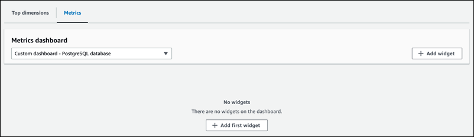
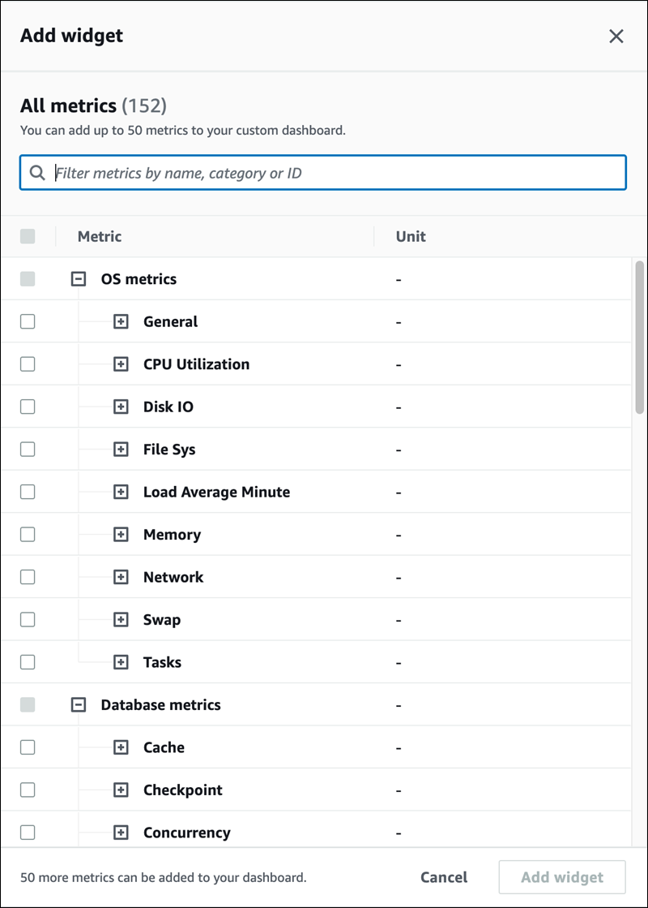

# Creating a custom dashboard with Performance Insights

###### Important

AWS has announced the end-of-life date for Performance Insights: July 31, 2026. After this date, Amazon RDS will no longer support the Performance Insights console experience.
The Performance Insights console will redirect to CloudWatch Database Insights. Flexible retention periods (1–24 months) and their associated pricing are preserved
in Standard mode of Database Insights at the same cost as Performance Insights today. The Performance Insights API will continue to exist with no changes. Costs for the
Performance Insights API will appear in your AWS bill with the cost of CloudWatch Database Insights.

We recommend that you review your DB clusters
using Performance Insights and choose the Database Insights mode that best fits your needs before July 31, 2026.
For core monitoring with flexible retention, Standard mode of Database Insights preserves your existing experience and pricing.
For advanced capabilities including fleet-level monitoring, lock diagnostics, and execution plan capture, see
[Turning on the Advanced mode of Database Insights for Amazon Aurora](USER_DatabaseInsights.TurningOnAdvanced.md "USER_DatabaseInsights.TurningOnAdvanced.md").

If you take no action, DB clusters using Performance Insights
will default to using the Standard mode of Database Insights with your existing retention period configured.
Your CloudFormation templates, Terraform configurations, and deployment scripts will continue to work exactly as they do today – all
Performance Insights API parameters, including retention period settings, are fully preserved.
After July 31, 2026, only the Advanced mode of Database Insights will support execution plans and on-demand analysis.

With CloudWatch Database Insights, you can monitor database load for your fleet of databases and analyze and troubleshoot performance at scale.
For more information about Database Insights, see [Monitoring Amazon Aurora databases with CloudWatch Database Insights](USER_DatabaseInsights.md "USER_DatabaseInsights.md") or
[Register for upcoming workshops](https://aws-experience.com/amer/smb/events/series/Cloud-Operations-Enablement "https://aws-experience.com/amer/smb/events/series/Cloud-Operations-Enablement") to learn more.
For current pricing information, see [Amazon CloudWatch Pricing](https://aws.amazon.com/cloudwatch/pricing/ "https://aws.amazon.com/cloudwatch/pricing/").

In the new monitoring view, you can create a custom dashboard with the metrics you
need to meet your analysis requirements.

You can create a custom dashboard by selecting Performance Insights and CloudWatch metrics for your DB instance.
You can use this custom dashboard for other DB instances of the same database
engine type in your AWS account.

###### Note

The customized dashboard supports up to 50 metrics.

Use the widget settings menu to edit or delete the dashboard, and move or resize the
widget window.

###### To create a custom dashboard with Performance Insights in the navigation pane

1. Sign in to the AWS Management Console and open the Amazon RDS console at
   [https://console.aws.amazon.com/rds/](https://console.aws.amazon.com/rds/ "https://console.aws.amazon.com/rds/").
2. In the left navigation pane, choose **Performance Insights**.
3. Choose a DB instance.
4. Scroll down to the **Metrics tab** in the window.
5. Select the custom dashboard from the drop down list. The following example
   shows the custom dashboard creation.

 6. Choose **Add widget** to open the **Add
widget** window. You can open and view the available operating
system (OS) metrics, database metrics, and CloudWatch metrics in the window.

The following example shows the **Add widget** window with the metrics.

 7. Select the metrics that you want to view in the dashboard and choose
**Add widget**. You can use the search field to find a
specific metric.

The selected metrics appear on your dashboard. 8. (Optional) If you want to modify or delete your dashboard, choose the
settings icon on the widget, and then select one of the following actions in the menu.

    * **Edit** – Modify the metrics list in the window. Choose
     **Update widget** after you select the metrics for
     your dashboard.
    * **Delete** – Deletes the widget. Choose
     **Delete** in the confirmation window.
