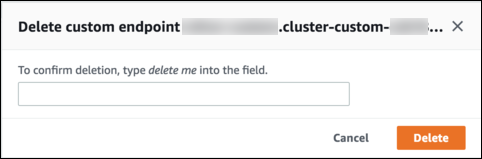

# Deleting a custom endpoint

Delete a custom endpoint using the AWS Management Console, AWS CLI, or the Amazon RDS API.

To delete a custom endpoint with the AWS Management Console, go to the cluster detail page,
select the appropriate custom endpoint, and select the **Delete**
action.


To delete a custom endpoint with the AWS CLI, run the [delete-db-cluster-endpoint](../../../cli/latest/reference/rds/delete-db-cluster-endpoint.md "../../../cli/latest/reference/rds/delete-db-cluster-endpoint.md") command.

The following command deletes a custom endpoint. You don't need to specify the
associated cluster, but you must specify the region.

For Linux, macOS, or Unix:

```
aws rds delete-db-cluster-endpoint --db-cluster-endpoint-identifier `custom-end-point-id` \
  --region `region_name`

```

For Windows:

```
aws rds delete-db-cluster-endpoint --db-cluster-endpoint-identifier `custom-end-point-id` ^
  --region `region_name`

```

To delete a custom endpoint with the RDS API, run the [DeleteDBClusterEndpoint](../APIReference/API_DeleteDBClusterEndpoint.md "../APIReference/API_DeleteDBClusterEndpoint.md")
operation.
