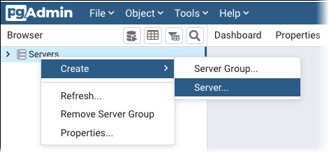
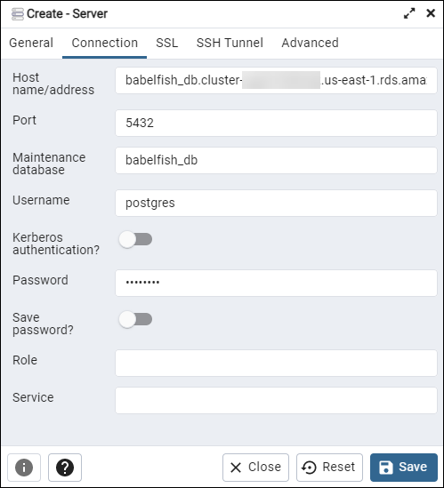
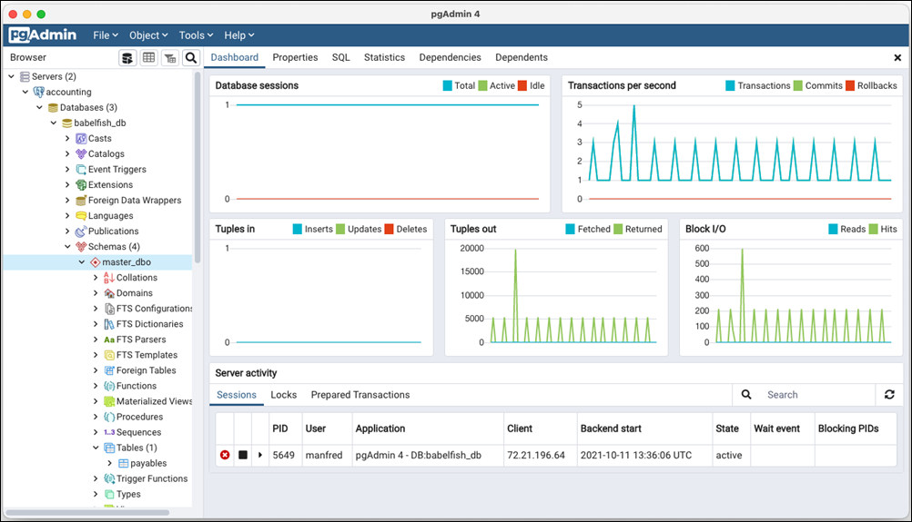

# Using a PostgreSQL client to connect to your DB cluster

You can use a PostgreSQL client to connect to Babelfish on the PostgreSQL
port. Starting with version 5.1.0, the Babelfish server enforces end-to-end
connection encryption by default. Update your application to work with
SSL/TLS certificates. For more information about configuring SSL/TLS certificates,
see [Securing Aurora PostgreSQL data with SSL/TLS](AuroraPostgreSQL.md#AuroraPostgreSQL.Security.SSL "AuroraPostgreSQL.md#AuroraPostgreSQL.Security.SSL").

## Using psql to connect to the DB cluster

You can download the PostgreSQL client from the [PostgreSQL](https://www.postgresql.org/download/ "https://www.postgresql.org/download/") website.
Follow the instructions specific to your operating system version to install
psql.

You can query an Aurora PostgreSQL DB cluster that supports Babelfish with
the `psql` command line client. When connecting, use the PostgreSQL
port (by default, port 5432). Typically, you don't need to specify the port
number unless you changed it from the default. Use the following command to
connect to Babelfish from the `psql` client:

```
psql -h `bfish-db.cluster-123456789012`.`aws-region`.rds.amazonaws.com
-p `5432` -U `postgres` -d babelfish_db
```

The parameters are as follows:

- `-h` – The host name of the DB cluster (cluster
  endpoint) that you want to access.
- `-p` – The PostgreSQL port number used to connect to
  your DB instance.
- `-d` – The database that you want to connect to. The
  default is `babelfish_db`.
- `-U` – The database user account that you want to
  access. (The example shows the default master username.)

When you run a SQL command on the psql client, you end the command with a
semicolon. For example, the following SQL command queries the [pg_tables
system view](https://www.postgresql.org/docs/current/view-pg-tables.html "https://www.postgresql.org/docs/current/view-pg-tables.html") to return information about each table in the
database.

`SELECT * FROM pg_tables;`

The psql client also has a set of built-in metacommands. A
_metacommand_ is a shortcut that adjusts formatting or
provides a shortcut that returns meta-data in an easy-to-use format. For
example, the following metacommand returns similar information to the previous
SQL command:

`\d`

Metacommands don't need to be terminated with a semicolon (;).

To exit the psql client, enter `\q`.

For more information about using the psql client to query an Aurora PostgreSQL
cluster, see [the
PostgreSQL documentation](https://www.postgresql.org/docs/14/app-psql.html "https://www.postgresql.org/docs/14/app-psql.html").

## Using pgAdmin to connect to the DB cluster

You can use the pgAdmin client to access your data in native PostgreSQL
dialect.

###### To connect to the cluster with the pgAdmin client

1. Download and install the pgAdmin client from the [pgAdmin website](https://www.pgadmin.org/ "https://www.pgadmin.org/").
2. Open the client and authenticate with pgAdmin.
3. Open the context (right-click) menu for **Servers**,
   and then choose **Create**,
   **Server**.

 4. Enter information in the **Create - Server** dialog
box.

On the **Connection** tab, add the Aurora PostgreSQL
cluster address for **Host** and the PostgreSQL port
number (by default, 5432) for **Port**. Provide
authentication details, and choose **Save**.



After connecting, you can use pgAdmin functionality to monitor and manage your
Aurora PostgreSQL cluster on the PostgreSQL port.



To learn more, see the [pgAdmin](https://www.pgadmin.org/ "https://www.pgadmin.org/")
web page.
