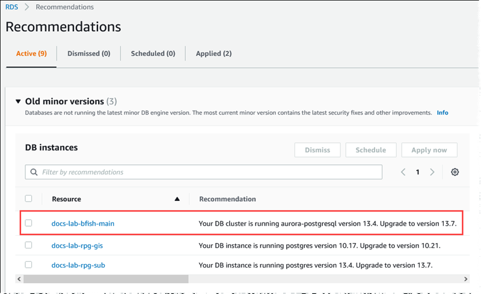

# Upgrading

Babelfish to a new minor version

A minor version update aims to maintain backward compatibility. However, in some
cases, critical security fixes or important bug fixes may not be fully backward
compatible. A _patch_ version includes important fixes for a
minor version after its release. For example, the version label for the first
release of Aurora PostgreSQL 13.4 was Aurora PostgreSQL 13.4.0. Several patches for that
minor version have been released to date, including Aurora PostgreSQL 13.4.1, 13.4.2,
and 13.4.4. You can find the patches available for each Aurora PostgreSQL version in the
**Patch releases** list at the top of the Aurora PostgreSQL release
notes for that version. For an example, see [PostgreSQL 14.3](../AuroraPostgreSQLReleaseNotes/AuroraPostgreSQL.md#AuroraPostgreSQL.Updates.20180305.143X "../AuroraPostgreSQLReleaseNotes/AuroraPostgreSQL.md#AuroraPostgreSQL.Updates.20180305.143X") in the _Release Notes for Aurora PostgreSQL_.

If your Aurora PostgreSQL DB cluster is configured with the **Auto minor
version upgrade** option, your Babelfish for Aurora PostgreSQL DB cluster is upgraded
automatically during the cluster's maintenance window. To learn more about auto
minor version upgrade (AmVU) and how to use it, see [Automatic minor version upgrades for Aurora
DB clusters](USER_UpgradeDBInstance.md#Aurora.Maintenance.AMVU "USER_UpgradeDBInstance.md#Aurora.Maintenance.AMVU"). If
your cluster isn't using AmVU, you can manually upgrade your Babelfish for Aurora PostgreSQL DB
cluster to new minor versions either by responding to maintenance tasks, or by
modifying the cluster to use the new version.

When you choose an Aurora PostgreSQL version to install and when you view an existing
Aurora PostgreSQL DB cluster in the AWS Management Console, the version displays the
`major`.`minor` digits only.
For example, the following image from the Console for an existing Babelfish for Aurora PostgreSQL DB
cluster with Aurora PostgreSQL 13.4 recommends upgrading the cluster to version 13.7, a
new minor release of Aurora PostgreSQL.

To get complete version details, including the `patch`
level, you can query the Aurora PostgreSQL DB cluster using the
`aurora_version` Aurora PostgreSQL function. For more information, see
[aurora_version](aurora_version.md "aurora_version.md") in the [Aurora PostgreSQL functions
reference](Appendix.AuroraPostgreSQL.md "Appendix.AuroraPostgreSQL.md"). You can find an example
of using the function in the [To use the PostgreSQL port to query for version information](babelfish-information-identify-version.md#apg-version-info-psql "babelfish-information-identify-version.md#apg-version-info-psql") procedure in [Identifying your version of
Babelfish](babelfish-information-identify-version.md "babelfish-information-identify-version.md").

The following table shows Aurora PostgreSQL and Babelfish version and the
available target versions that can support the minor version upgrade process.

| Current source versions       | Newest upgrade targets                                                                                                                                              |
| ----------------------------- | ------------------------------------------------------------------------------------------------------------------------------------------------------------------- |
| Aurora PostgreSQL (Babelfish) | Aurora PostgreSQL (Babelfish)                                                                                                                                       |
| 17.4 (5.1)                    | 17.5 (5.2)                                                                                                                                                          |
| 16.8 (4.5)                    | 16.9 (4.6)                                                                                                                                                          |
| 16.6 (4.4.0)                  | 16.9 (4.6), 16.8 (4.5.0)                                                                                                                                            |
| 16.4 (4.3.0)                  | 16.9 (4.6), 16.8 (4.5.0), 16.6 (4.4.0)                                                                                                                              |
| 16.3 (4.2.0)                  | 16.9 (4.6), 16.8 (4.5.0), 16.6 (4.4.0), 16.4 (4.3.0)                                                                                                                |
| 16.2 (4.1.0)                  | 16.9 (4.6), 16.8 (4.5.0), 16.6 (4.4.0), 16.4 (4.3.0), 16.3 (4.2.0)                                                                                                  |
| 16.1 (4.0.0)                  | 16.9 (4.6), 16.8 (4.5.0), 16.6 (4.4.0), 16.4 (4.3.0), 16.3 (4.2.0), 16.2 (4.1.0)                                                                                    |
| 15.12 (3.9.0)                 | 15.13 (3.10)                                                                                                                                                        |
| 15.10 (3.8.0)                 | 15.13 (3.10), 15.12 (3.9.0)                                                                                                                                         |
| 15.8 (3.7.0)                  | 15.13 (3.10), 15.12 (3.9.0), 15.10 (3.8.0)                                                                                                                          |
| 15.7 (3.6.0)                  | 15.13 (3.10), 15.12 (3.9.0), 15.10 (3.8.0), 15.8 (3.7.0)                                                                                                            |
| 15.6 (3.5.0)                  | 15.13 (3.10), 15.12 (3.9.0), 15.10 (3.8.0), 15.8 (3.7.0), 15.7 (3.6.0)                                                                                              |
| 15.5 (3.4.0)                  | 15.13 (3.10), 15.12 (3.9.0), 15.10 (3.8.0), 15.8 (3.7.0), 15.7 (3.6.0), 15.6 (3.5.0)                                                                                |
| 15.4 (3.3.0)                  | 15.13 (3.10), 15.12 (3.9.0), 15.10 (3.8.0), 15.8 (3.7.0), 15.7 (3.6.0), 15.6 (3.5.0), 15.5 (3.4.0)                                                                  |
| 15.12 (3.9.0), 15.3 (3.2.0)   | 15.13 (3.10), 15.12 (3.9.0), 15.10 (3.8.0), 15.8 (3.7.0), 15.7 (3.6.0), 15.6 (3.5.0), 15.5 (3.4.0), 15.4 (3.3.0)                                                    |
| 15.2 (3.1.0)                  | 15.13 (3.10), 15.12 (3.9.0), 15.10 (3.8.0), 15.8 (3.7.0), 15.7 (3.6.0), 15.6 (3.5.0), 15.5 (3.4.0), 15.4 (3.3.0), 15.3 (3.2.0)                                      |
| 14.17 (2.12.0)                | 14.18 (2.13.0)                                                                                                                                                      |
| 14.15 (2.11.0)                | 14.18 (2.13.0), 14.17 (2.12.0)                                                                                                                                      |
| 14.13 (2.10.0)                | 14.18 (2.13.0), 14.17 (2.12.0), 14.15 (2.11.0)                                                                                                                      |
| 14.12 (2.9.0)                 | 14.18 (2.13.0), 14.17 (2.12.0), 14.15 (2.11.0), 14.13 (2.10.0)                                                                                                      |
| 14.11 (2.8.0)                 | 14.18 (2.13.0), 14.17 (2.12.0), 14.15 (2.11.0), 14.13 (2.10.0), 14.12 (2.9.0)                                                                                       |
| 14.10 (2.7.0)                 | 14.18 (2.13.0), 14.17 (2.12.0), 14.15 (2.11.0), 14.13 (2.10.0), 14.12 (2.9.0), 14.11 (2.8.0)                                                                        |
| 14.9 (2.6.0)                  | 14.18 (2.13.0), 14.17 (2.12.0), 14.15 (2.11.0), 14.13 (2.10.0), 14.12 (2.9.0), 14.11 (2.8.0), 14.10 (2.7.0)                                                         |
| 14.8 (2.5.0)                  | 14.18 (2.13.0), 14.17 (2.12.0), 14.15 (2.11.0), 14.13 (2.10.0), 14.12 (2.9.0), 14.11 (2.8.0), 14.10 (2.7.0), 14.9 (2.6.0)                                           |
| 14.7 (2.4.0)                  | 14.18 (2.13.0), 14.17 (2.12.0), 14.15 (2.11.0), 14.13 (2.10.0), 14.12 (2.9.0), 14.11 (2.8.0), 14.10 (2.7.0), 14.9 (2.6.0), 14.8 (2.5.0)                             |
| 14.6 (2.3.0)                  | 14.18 (2.13.0), 14.17 (2.12.0), 14.15 (2.11.0), 14.13 (2.10.0), 14.12 (2.9.0), 14.11 (2.8.0), 14.10 (2.7.0), 14.9 (2.6.0), 14.8 (2.5.0), 14.7 (2.4.0)               |
| 14.5 (2.2.0)                  | 14.18 (2.13.0), 14.17 (2.12.0), 14.15 (2.11.0), 14.13 (2.10.0), 14.12 (2.9.0), 14.11 (2.8.0), 14.10 (2.7.0), 14.9 (2.6.0), 14.8 (2.5.0), 14.7 (2.4.0), 14.6 (2.3.0) |
| 14.3 (2.1.0)                  | 14.18 (2.13.0), 14.6 (2.3.0)                                                                                                                                        |
| 13.8 (1.4.0)                  | 13.9 (1.5.0)                                                                                                                                                        |
| 13.7 (1.3.0)                  | 13.9 (1.5.0), 13.8 (1.4.0)                                                                                                                                          |
