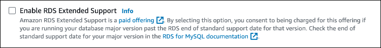

# Restoring an Aurora DB cluster or a global cluster with Amazon RDS Extended Support

When you restore an Aurora DB cluster or a global cluster, select **Enable
RDS Extended Support** in the console, or use the Extended Support option in the AWS CLI or the
parameter in the RDS API. When you enroll an Aurora DB cluster or a global cluster in
RDS Extended Support, it is permanently enrolled in RDS Extended Support for the life of the Aurora DB cluster or
global cluster.

The default for the RDS Extended Support setting depends on whether you use the console, the AWS CLI,
or the RDS API to restore your database. If you use the console, you don't select
**Enable RDS Extended Support**, and the major engine version you are restoring
is past the Aurora end of standard support, then Amazon Aurora automatically upgrades
your DB instance to a newer engine version. If you use the AWS CLI or the RDS API and you
don't specify the RDS Extended Support setting, then Amazon RDS defaults to enabling RDS Extended Support. When you
automate by using [CloudFormation](../../../AWSCloudFormation/latest/UserGuide/aws-resource-rds-dbinstance.md#aws-resource-rds-dbinstance-return-values:~:text=EngineLifecycleSupport "../../../AWSCloudFormation/latest/UserGuide/aws-resource-rds-dbinstance.md#aws-resource-rds-dbinstance-return-values:~:text=EngineLifecycleSupport") or other services, this default behavior maintains the availability of
your database past the Aurora end of standard support date. You can disable RDS Extended Support by using the
AWS CLI or the RDS API.

###### Topics

- [RDS Extended Support behavior](#extended-support-restoring-db-instance-behavior "#extended-support-restoring-db-instance-behavior")
- [Considerations for RDS Extended Support](#extended-support-restoring-db-instance-considerations "#extended-support-restoring-db-instance-considerations")
- [Restore an Aurora DB cluster DB cluster or a global cluster with RDS Extended Support](#extended-support-restoring-db-instance-restore "#extended-support-restoring-db-instance-restore")

## RDS Extended Support behavior

The following table summarizes what happens when a major engine version of an
Aurora DB cluster or a global cluster that you are restoring has reached the Aurora end of
standard support.

| RDS Extended Support status\* | Behavior                                                                                                                                                                    |
| ----------------------------- | --------------------------------------------------------------------------------------------------------------------------------------------------------------------------- |
| Enabled                       | Amazon RDS charges you for RDS Extended Support.                                                                                                                            |
| Disabled                      | After the restore finishes, Amazon RDS automatically upgrades your Aurora DB cluster or global cluster to a newer engine version (in a future maintenance window). |

\* In the RDS console, the RDS Extended Support status appears as Yes or No. In the AWS CLI or
RDS API, the RDS Extended Support status appears as `open-source-rds-extended-support`
or `open-source-rds-extended-support-disabled`.

## Considerations for RDS Extended Support

Before restoring an Aurora DB cluster or a global cluster,
consider the following items:

- _After_ the Aurora end of standard
  support date has passed, if you want to restore an Aurora DB cluster or a
  global cluster from Amazon S3, you can only do so by using the AWS CLI or
  the RDS API. Use the `--engine-lifecycle-support` option in the
  [restore-db-cluster-from-s3](../../../cli/latest/reference/rds/restore-db-cluster-from-s3.md "../../../cli/latest/reference/rds/restore-db-cluster-from-s3.md") AWS CLI command or the
  `EngineLifecycleSupport` parameter in the [RestoreDBClusterFromS3](../APIReference/API_RestoreDBClusterFromS3.md "../APIReference/API_RestoreDBClusterFromS3.md") RDS API operation.
- If you want to prevent Aurora from restoring your databases to
  RDS Extended Support versions, specify
  `open-source-rds-extended-support-disabled` in the AWS CLI or the
  RDS API. By doing so, you will avoid any associated RDS Extended Support charges.

If you specify this setting, Amazon Aurora will
automatically upgrade your restored database to a newer, supported major
version. If the upgrade fails pre-upgrade checks, Amazon Aurora will safely
roll back to the RDS Extended Support engine version. This database will remain in
RDS Extended Support mode, and Amazon Aurora will charge you for RDS Extended Support until
you manually upgrade your database.

- RDS Extended Support is set at the cluster level. Members of a cluster will always have
  the same setting for RDS Extended Support in the RDS console,
  `--engine-lifecycle-support` in the AWS CLI, and
  `EngineLifecycleSupport` in the RDS API.

For more information, see [Amazon Aurora versions](Aurora.md "Aurora.md").

## Restore an Aurora DB cluster DB cluster or a global cluster with RDS Extended Support

You can restore an Aurora DB cluster or a global cluster with an RDS Extended Support version
using the AWS Management Console, the AWS CLI, or the RDS API.

When you restore an Aurora DB cluster or a global
cluster, select **Enable RDS Extended Support** in the
**Engine options** section. If you don't select this
setting and the major engine version that you are restoring is past the Aurora
end of standard support, then Amazon Aurora automatically
upgrades your Aurora DB cluster or global
cluster
to a version under Aurora standard support.

The following image shows the **Enable RDS Extended Support**
setting:

When you run the [restore-db-cluster-from-snapshot](../../../cli/latest/reference/rds/restore-db-cluster-from-snapshot.md "../../../cli/latest/reference/rds/restore-db-cluster-from-snapshot.md") AWS CLI command, select
RDS Extended Support by specifying `open-source-rds-extended-support` for the
`--engine-lifecycle-support` option.

If you want to avoid charges associated with RDS Extended Support, set the
`--engine-lifecycle-support` option to
`open-source-rds-extended-support-disabled`. By default, this
option is set to `open-source-rds-extended-support`.

You can also specify this value using the following AWS CLI commands:

- [restore-db-cluster-from-s3](../../../cli/latest/reference/rds/restore-db-cluster-from-s3.md "../../../cli/latest/reference/rds/restore-db-cluster-from-s3.md")
- [restore-db-cluster-to-point-in-time](../../../cli/latest/reference/rds/restore-db-cluster-to-point-in-time.md "../../../cli/latest/reference/rds/restore-db-cluster-to-point-in-time.md")
  When you use the [RestoreDBClusterFromSnapshot](../APIReference/API_RestoreDBClusterFromSnapshot.md "../APIReference/API_RestoreDBClusterFromSnapshot.md")
  Amazon RDS API operation,
  select RDS Extended Support by setting the `EngineLifecycleSupport` parameter
  to `open-source-rds-extended-support`.

If you want to avoid charges associated with RDS Extended Support, set the
`EngineLifecycleSupport` parameter to
`open-source-rds-extended-support-disabled`. By default, this
parameter is set to `open-source-rds-extended-support`.

You can also specify this value using the following RDS API operations:

- [RestoreDBClusterFromS3](../APIReference/API_RestoreDBClusterFromS3.md "../APIReference/API_RestoreDBClusterFromS3.md")
- [RestoreDBClusterToPointInTime](../APIReference/API_RestoreDBClusterToPointInTime.md "../APIReference/API_RestoreDBClusterToPointInTime.md")

For more information about restoring an Aurora DB cluster, follow
the instructions for your DB engine in [Backing up and restoring an Amazon Aurora DB cluster](BackupRestoreAurora.md "BackupRestoreAurora.md").
