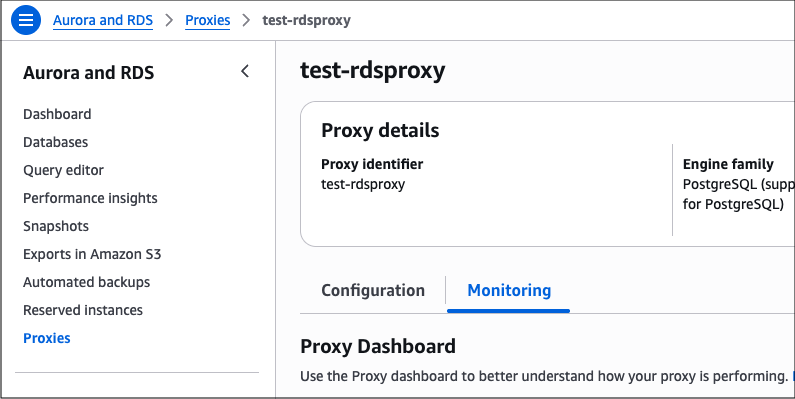

# RDS Proxy monitoring dashboard

You can access the RDS Proxy monitoring dashboard under the Monitoring tab of your proxy.

The dashboard provides a pre-configured set of metrics arranged into widgets, designed to help you perform common observability and troubleshooting tasks. If a metric is not visible in this dashboard, you can view all metrics in CloudWatch using a link on the dashboard.

You can't add or remove metrics from the default dashboard. If you want to create custom monitoring views for your proxies, you can do so directly in CloudWatch. For more information, see [Using CloudWatch dashboards](../../../AmazonCloudWatch/latest/monitoring/CloudWatch_Dashboards.md "../../../AmazonCloudWatch/latest/monitoring/CloudWatch_Dashboards.md").

The monitoring dashboard is divided into several sections, with metrics grouped into widgets using predefined aggregations. For more information about the underlying RDS Proxy metrics, see [Monitoring RDS Proxy metrics with CloudWatch](rds-proxy.monitoring.md "rds-proxy.monitoring.md").

###### Topics

- [Overview](#rds-proxy-monitoring-dashboard-overview "#rds-proxy-monitoring-dashboard-overview")
- [Latency](#rds-proxy-monitoring-dashboard-latency "#rds-proxy-monitoring-dashboard-latency")
- [Connection pool](#rds-proxy-monitoring-dashboard-connection-pool "#rds-proxy-monitoring-dashboard-connection-pool")
- [Database connections utilization](#rds-proxy-monitoring-dashboard-db-connections-utilization-section "#rds-proxy-monitoring-dashboard-db-connections-utilization-section")

## Overview

### Availability % by role

The percentage of time for which the target was available in the `READWRITE` and `READ_ONLY` roles, based on an aggregation of the `AvailabilityPercentage` metric.

The availability metric describes the success rate of the database health checks performed by the proxy, which reflects the health status of the target database instances. This widget uses the `Average` statistic for each role, and the calculation is influenced by the number of database instances in a given role (one for the `READWRITE` role, potentially multiple for `READ_ONLY` roles) and the number of nodes in your proxy (decided by RDS Proxy infrastructure).

###### Note

RDS Proxy automatically adjusts its capacity based on the configuration of DB instances registered with it. You can't directly control the number of nodes in your proxy, but you can check the current node count using the `sample count` statistic for the availability metric. For more information on how RDS Proxy adjusts its capacity, see [Planning for IP address capacity](rds-proxy-network-prereqs.md#rds-proxy-network-prereqs.plan-ip-address "rds-proxy-network-prereqs.md#rds-proxy-network-prereqs.plan-ip-address").

**The `READWRITE` target role** can only contain one database instance, and the availability percentage is calculated as the average health check success rate across all proxy nodes. For example, if the proxy contains four nodes and one of them didn't receive a successful health check response in a given period, read/write availability will be reported as 75% for that period. Similarly, if the proxy contains four nodes and none of them were able to run health checks for 30 seconds during a 1-minute period, the proxy will report 50% availability during that minute.

**The `READ_ONLY` target role** can contain multiple database instances, such as multiple replicas in an Aurora cluster. From the perspective of each RDS Proxy node, the read-only role is considered available if any of the target instances passes a health check. Availability is then averaged across all proxy nodes, and the final number is presented in the widget. Consider this example of a proxy containing four nodes:

- Each proxy node performs a health check on multiple read-only targets (database instances) where some checks succeed and some fail. A proxy node will report the read-only role as available as long as it receives a successful health check response from at least one target instance.
- Four proxy nodes perform health checks on multiple read-only targets. Three proxy nodes can connect to at least one target, but one proxy node is unable to connect to any of the targets. The read-only role availability will be calculated as an `Average` of role availability reported by the proxy nodes: `(100% + 100% + 100% + 0% )/ 4 = 75%`

###### Note

The RDS Proxy `READ_ONLY` target role is supported with Aurora clusters or Amazon RDS Multi-AZ DB cluster deployments with two readable standbys, but not with Amazon RDS DB instance deployments with read replicas. Availability for the `READ_ONLY` role might show "zero" if the proxy doesn't contain a read-only target.

The role availability widget is most useful in the following scenarios:

- Diagnosing connection errors, when you want to quickly assess whether availability was impacted due to the health of proxy nodes or target database instances.
- Diagnosing high traffic events, when the database didn't experience definite unavailability but the proxy's health check metrics can support the hypothesis of a database overload. RDS Proxy uses a number of persistent connections reserved for monitoring and health check duties, so if database metrics don't indicate downtime but the proxy's health checks are intermittently failing, it might be an indicator of excessive database load.
- Identifying configuration issues that prevent the proxy from connecting to target instances. For example, if you see a drop in proxy availability metrics but the target instances appear healthy according to other signals, it might indicate an issue with network ACLs associated with the proxy's subnets or a misconfiguration of the Security Group(s) attached to target database instances.

When diagnosing issues involving RDS Proxy availability metrics, you must also review health and utilization indicators from the database itself. The proxy's availability calculations are influenced by the database's ability to respond to health checks, so you must gather information from both sides before forming conclusions.

### Database connections utilization % by role

The percentage utilization of the proxy's connection pool for each role, calculated as `DatabaseConnections` divided by `MaxDatabaseConnectionsAllowed`.

The maximum number of database connections allowed refers to the proxy's maximum pool size controlled by the `MaxConnectionsPercent` setting, which in turn depends on the database connection limit such as the `max_connections` parameter. For more information about this setting, see [RDS Proxy connection considerations](rds-proxy-connections.md "rds-proxy-connections.md").

###### Note

RDS Proxy reserves a portion of the `MaxConnectionsPercent` quota for internal monitoring connections. The total number of reserved connections is not a constant, but it depends on the number of internal proxy nodes and the number of target database instances.

We recommend keeping at least a 30% headroom between the number of connections allowed and the maximum number of database connections expected during peak load. This headroom improves client experience during unexpected workload spikes and helps RDS Proxy redistribute connections across its internal infrastructure for heat management and other purposes. To help you follow this recommendation, the connections utilization widget includes a fixed guide line at 70% of the maximum.

For example, assume you have an Aurora PostgreSQL cluster with one writer and two readers with a `max_connections` setting of 500 for each instance, and a proxy configured with `MaxConnectionsPercent` of 50:

1. RDS Proxy reserves a number of connections for monitoring purposes, which means that the `MaxDatabaseConnectionsAllowed` is less than 250 per instance: `(max_connections=500 * MaxConnectionsPercent=50%) - reserved connections`
2. For the `READWRITE` role containing one writer, the maximum size of the proxy connection pool will be slightly less than 250 (`50% * 500 - reserved_connections`), and the 70% guide line will correspond to less than 175 connections (`70% * 250 - reserved connections`).
3. For the `READ_ONLY` role containing two readers, the maximum size of the proxy connection pool will be slightly less than 500 (`2 * 50% * 500 - reserved_connections`), and the 70% guide line will correspond to less than 350 connections (`70% * 500 - reserved connections`).

This widget serves as a general indicator of connection utilization, and it's a useful starting point during certain troubleshooting scenarios. For example:

- Frequent and sharp variations in connection utilization could indicate that the `MaxIdleConnectionsPercent` setting is too low, and you could reduce connection churn by allowing idle connections to remain open for a longer period.
- Based on your workload patterns and client activity, you might develop a high-level expectation for how many connections are in use at any given time. The widget can help you validate those expectations and detect potential client issues. Consider a situation where your `MaxIdleConnectionsPercent` setting is very low but the connection utilization is consistently very high. This might indicate that clients are rarely idle (which is not necessarily a problem) but it might also mean that connections are being pinned and thus aren't subject to idleness checks.
- In the absence of issues with pinning or proxy configuration, high database connection utilization could mean that the database's `max_connections` setting needs to be raised or, in case of the read-only role, the cluster could use more read replicas.

### Latency breakdown

The latency of connection borrows and query responses.

| Label                              | Description                                                                                                                                                       | Source                                               |
| ---------------------------------- | ----------------------------------------------------------------------------------------------------------------------------------------------------------------- | ---------------------------------------------------- |
| `DatabaseConnectionsBorrowLatency` | The time it takes for the proxy to get a database connection, whether it's an existing one from the pool or a new one that had to be opened against the database. | RDS Proxy, `DatabaseConnectionsBorrowLatency` metric |
| `QueryResponseLatency`             | The time between getting a query request and the proxy responding to it.                                                                                          | RDS Proxy, `QueryResponseLatency` metric             |
| `QueryDatabaseResponseLatency`     | The time that the database took to respond to the query, including network latency between the proxy and the database.                                            | RDS Proxy, `QueryDatabaseResponseLatency` metric     |

This widget helps you understand the average response time of your queries and how the proxy layer contributes to the total latency. The borrow latency metric can be particularly useful for detecting pool congestion, which is when client requests are waiting because there aren't enough connections readily available in the pool.

Data points for these metrics are published only if the value is greater than zero, which means that the widget might contain gaps during periods without query traffic.

### Client connections

The number of connections between the clients and the proxy, broken down by connection state.

| Label                              | Description                                                                                      | Source                                               |
| ---------------------------------- | ------------------------------------------------------------------------------------------------ | ---------------------------------------------------- |
| `ClientConnectionsReceived`        | The number of client connection requests received.                                               | RDS Proxy, `ClientConnectionsReceived` metric        |
| `ClientConnectionsSetupSucceeded`  | The number of client connections successfully established.                                       | RDS Proxy, `ClientConnectionsSetupSucceeded` metric  |
| `ClientConnectionsSetupFailedAuth` | The number of client connection attempts that failed due to misconfigured authentication or TLS. | RDS Proxy, `ClientConnectionsSetupFailedAuth` metric |
| `ClientConnectionsClosed`          | The number of client connections closed.                                                         | RDS Proxy, `ClientConnectionsClosed` metric          |

This widget can help you assess the throughput and status of client connections by showing multiple client connections metrics on a single chart. It can be useful for monitoring the overall success rate of client connections and observing the rate at which connections are opened and closed. This can be helpful in detecting connection storms and changes in client activity over time.

### Proxy workload

The number of query requests per proxy endpoint, based on the `QueryRequests` proxy metrics.

The data series labels vary depending on the endpoint:

- The default read/write proxy endpoint uses the `default` label.
- If you enabled the optional read-only endpoint while creating the proxy through the AWS Management Console, this endpoint uses the `read-only` label prefixed with the proxy name. For a proxy named `my-proxy`, the label will be `my-proxy-read-only`.
- Additional proxy endpoints use the endpoint name as the label without additional prefixes.

This widget is useful for monitoring the volume of workload handled through each of the proxy endpoints.

###### Important

The `QueryRequests` metric is currently not emitted for query activity on PostgreSQL connections using the Extended Query Protocol.

## Latency

### Database response latency by target

The database response latency per target (database instance), based on the `QueryDatabaseResponseLatency` proxy metric.

This widget is useful for monitoring database response latency for each database instance under the proxy, especially when you use different database instances for different workloads or the instance sizes aren't identical. Consider the following examples:

- A database cluster contains multiple read replicas, all of which receive traffic through the proxy. Additionally, some of the replicas receive traffic directly from clients bypassing the proxy. The widget can help you determine whether that additional traffic is impacting query latency for workloads handled through the proxy.
- A database cluster contains replicas of different sizes, the entire workload is handled through the proxy, and the database instances use default connection configuration where the connection limit is proportional to instance size. The proxy follows connection limits and sends proportionally fewer connections to smaller instances, but those instances might produce higher latency as a result of their caches and buffers also being smaller. The widget can help you determine whether that is the case, and whether small instances are keeping up with larger ones in terms of query latency.

## Connection pool

### Database connections pinned % by role

The percentage of database connections pinned for each role, calculated as `DatabaseConnectionsCurrentlySessionPinned` divided by `DatabaseConnections`.

This widget is useful for monitoring connection pinning in your workload. Similar to other widgets, the relative value is used here as a more suitable health indicator than the absolute number of connections pinned. An ideal value is zero, but connection pinning might not be entirely avoidable in all workloads. You might be comfortable with a small percentage of connections experiencing pinning as long as they don't cause discernible impact on the rest of the workload. However, if a large portion of the entire workload experiences pinning, it might indicate an issue with client behavior that prevents RDS Proxy from multiplexing connections (reusing them between transactions).

To learn more about connection pinning, see [Avoiding pinning an RDS Proxy](rds-proxy-pinning.md "rds-proxy-pinning.md").

### Database connections setup metrics by role

The number of connections setups between the proxy and the database, broken down by setup outcome and target role. The widget shows multiple data series for each role:

| Label                               | Description                                                  | Source                                                |
| ----------------------------------- | ------------------------------------------------------------ | ----------------------------------------------------- |
| `DatabaseConnectionRequests`        | The number of requests to create a database connection.      | RDS Proxy, `DatabaseConnectionRequests` metric        |
| `DatabaseConnectionsSetupSucceeded` | The number of database connections successfully established. | RDS Proxy, `DatabaseConnectionsSetupSucceeded` metric |
| `DatabaseConnectionsSetupFailed`    | The number of database connection requests that failed.      | RDS Proxy, `DatabaseConnectionsSetupFailed` metric    |

Data points for these metrics are published only if the value is greater than zero, which means that the widget might contain gaps during periods without a relevant event. For example, if a client runs queries through the proxy during a given period, and the proxy can handle the entirety of the traffic by reusing existing back-end database connections (without opening new connections), you won't see data points for that period.

This widget is useful for observing activity and connection churn between the proxy and the database. When paired with the information shown on the **Client Connections** widget, you can use it to assess the efficiency of connection pooling and multiplexing inside the proxy.

Keep in mind that RDS Proxy doesn't preallocate the entire connection pool at its maximum capacity, and it closes idle database connections after a period of inactivity. It's normal for `DatabaseConnectionRequests` to be above zero and fluctuate under load, but it's the ratio of `DatabaseConnectionRequests` to `ClientConnectionsReceived` that might require your attention. For example:

- If the clients open a certain number of connections to the proxy and the proxy is opening almost the same number of connections to the database in each period, you can reason that the proxy isn't able to reuse connections due to pinning or other reasons. This situation might require further investigation, focusing on client behavior that prevents the proxy from reusing connections.
- If the clients open a certain number of connections to the proxy, but new database connections are only a fraction of that number, it shows that the proxy handles the vast majority of the traffic by reusing existing connections. This is the normal, desired state of the connection pool.

### Database connections setup metrics by target

An equivalent of **Database Connections Setup Metrics By Role** with the data broken down by target (database instance).

## Database connections utilization

### Database connections utilization % by target

The percentage utilization of the proxy's connection pool for each target (database instance), calculated as `DatabaseConnections` divided by `MaxDatabaseConnectionsAllowed`.

This widget is similar to **Database Connections Utilization % By Role**, but it provides a granular view of connection utilization for each database instance. It can be useful for verifying fair connection distribution in the `READ_ONLY` role for database clusters with multiple instances.

For example, assume you have an Aurora cluster with two readers and `MaxDatabaseConnectionsAllowed` of 500 per reader. If the number of proxy connections is 100 on the first reader and 125 on the second reader, the widget will show 20% connection utilization for the first reader and 25% for the second one.

###### Note

RDS Proxy attempts to equalize the number of client connections on each replica, weighted by the database's connection limit. It doesn't load-balance traffic based on database metrics such as CPU utilization, and it doesn't know how long each client session will last after it's opened. As a result, a small imbalance in connection utilization between instances is a normal phenomenon.

### Database connections usage by READWRITE/READ\_ONLY role

The number of database connections utilized and allowed by the proxy and the database. There are two widgets of this type: one for the `READWRITE` role and one for the `READ_ONLY` role.

This widget is only visible if the proxy's database target supports a `READ_ONLY` role, which includes Aurora DB clusters and Amazon RDS Multi-AZ DB cluster deployments. The widget is not shown for Amazon RDS DB instance deployments.

Each widget contains multiple data series:

| Label                                  | Description                                                                                                                                                 | Source                                            |
| -------------------------------------- | ----------------------------------------------------------------------------------------------------------------------------------------------------------- | ------------------------------------------------- |
| `Database Connections`                 | The number of connections that exist in the database, whether opened by the proxy or other clients.                                                         | Database, `DatabaseConnections` metric            |
| `Database Connections: proxy`          | The number of database connections that exist between the proxy and the database, excluding internal connections used by RDS Proxy for database monitoring. | RDS Proxy, `DatabaseConnections` metric           |
| `MaxDatabaseConnectionsAllowed: Proxy` | Maximum number of database connections allowed by the proxy, controlled by the `MaxConnectionsPercent` setting.                                             | RDS Proxy, `MaxDatabaseConnectionsAllowed` metric |

The figures presented are sums (totals) for the proxy and the underlying database cluster. For example, assume that the database cluster contains two instances allowing 1000 connections each and the proxy is configured with `MaxConnectionsPercent` of `20`. In this scenario, `MaxDatabaseConnectionsAllowed: Proxy` will show `2 * 1000 * 20% = 400` minus a number of connections reserved internally by RDS Proxy for monitoring purposes. The actual value will be less than `400`, and it will vary depending on the number of nodes in your proxy.

This widget is most useful in the following situations:

- Monitoring the absolute connection utilization figures for the proxy and the database.
- Determining the number of connections reaching the database through the proxy versus connections bypassing the proxy.
- Calculating the difference between current connection utilization and the maximum allowed utilization.

###### Note

The value of `DatabaseConnections` will be higher than `Database Connections: Proxy` even if all client connections are handled through the proxy. There's always a number of internal connections maintained by the RDS platform and the RDS Proxy infrastructure. Those connections are counted by the database, but are not reflected in the proxy metrics.
