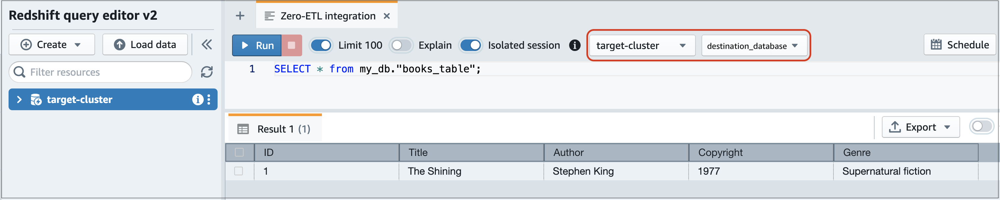

# Adding data to a source Aurora DB cluster and querying it

To finish creating a zero-ETL integration that replicates data from Amazon Aurora into
Amazon Redshift, you must create a database in the target destination.

For connections with Amazon Redshift, connect to your Amazon Redshift cluster or workgroup and create a database with a
reference to your integration identifier. Then, you can add data to your source Aurora
DB cluster and see it replicated in Amazon Redshift or Amazon SageMaker.

###### Topics

- [Creating a target database](#zero-etl.create-db "#zero-etl.create-db")
- [Adding data to the source DB cluster](#zero-etl.add-data-rds "#zero-etl.add-data-rds")
- [Querying your Aurora data in Amazon Redshift](#zero-etl.query-data-redshift "#zero-etl.query-data-redshift")
- [Data type differences between Aurora and Amazon Redshift databases](#zero-etl.data-type-mapping "#zero-etl.data-type-mapping")
- [DDL operations for Aurora PostgreSQL](#zero-etl.ddl-postgres "#zero-etl.ddl-postgres")

## Creating a target database

Before you can start replicating data into Amazon Redshift, after you create an integration,
you must create a database in your target data warehouse. This
database must include a reference to the integration identifier. You can use the Amazon Redshift
console or the Query editor v2 to create the database.

For instructions to create a destination database, see [Create a destination database in Amazon Redshift](../../../redshift/latest/mgmt/zero-etl-using.md#zero-etl-using.create-db "../../../redshift/latest/mgmt/zero-etl-using.md#zero-etl-using.create-db").

## Adding data to the source DB cluster

After you configure your integration, you can populate the source Aurora DB cluster
with data that you want to replicate into your data warehouse.

###### Note

There are differences between data types in Amazon Aurora and the target analytics warehouse. For a
table of data type mappings, see [Data type differences between Aurora and Amazon Redshift databases](#zero-etl.data-type-mapping "#zero-etl.data-type-mapping").

First, connect to the source DB cluster using the MySQL or
PostgreSQL client of your choice. For instructions, see [Connecting to an Amazon Aurora DB cluster](Aurora.md "Aurora.md").

Then, create a table and insert a row of sample data.

###### Important

Make sure that the table has a primary key. Otherwise, it can't be replicated to
the target data warehouse.

The pg_dump and pg_restore PostgreSQL utilities initially create tables without a primary key and then add it afterwards. If you're using one of these utilities, we recommend first creating a schema and then loading data in a separate command.

**MySQL**

The following example uses the [MySQL Workbench utility](https://dev.mysql.com/downloads/workbench/ "https://dev.mysql.com/downloads/workbench/").

```
CREATE DATABASE `my_db`;

USE `my_db`;

CREATE TABLE `books_table` (ID int NOT NULL, Title VARCHAR(50) NOT NULL, Author VARCHAR(50) NOT NULL,
Copyright INT NOT NULL, Genre VARCHAR(50) NOT NULL, **PRIMARY KEY** (ID));

INSERT INTO `books_table` VALUES (1, 'The Shining', 'Stephen King', 1977, 'Supernatural fiction');
```

**PostgreSQL**

The following example uses the `psql`
PostgreSQL interactive terminal. When connecting to the cluster, include the named
database that you specified when creating the integration.

```
psql -h `mycluster`.cluster-`123456789012`.us-east-2.rds.amazonaws.com -p 5432 -U `username` -d `named_db`;

named_db=> CREATE TABLE `books_table` (ID int NOT NULL, Title VARCHAR(50) NOT NULL, Author VARCHAR(50) NOT NULL,
Copyright INT NOT NULL, Genre VARCHAR(50) NOT NULL, **PRIMARY KEY** (ID));

named_db=> INSERT INTO `books_table` VALUES (1, 'The Shining', 'Stephen King', 1977, 'Supernatural fiction');
```

## Querying your Aurora data in Amazon Redshift

After you add data to the Aurora DB cluster, it's replicated into the destination database and is ready to be
queried.

###### To query the replicated data

1. Navigate to the Amazon Redshift console and choose **Query editor
   v2** from the left navigation pane.
2. Connect to your cluster or workgroup and choose your destination database
   (which you created from the integration) from the dropdown menu
   (**destination_database** in this example). For
   instructions to create a destination database, see [Create a destination database in Amazon Redshift](../../../redshift/latest/mgmt/zero-etl-using.md#zero-etl-using.create-db "../../../redshift/latest/mgmt/zero-etl-using.md#zero-etl-using.create-db").
3. Use a SELECT statement to query your data. In this example, you can run the
   following command to select all data from the table that you created in the
   source Aurora DB cluster:

```
SELECT * from `my_db`."`books_table`";
```



    * ``my_db`` is the Aurora database schema name. This option is only needed for MySQL databases.
    * ``books_table`` is the Aurora table name.

You can also query the data using the a command line client. For example:

```
destination_database=# select * from `my_db`."`books_table`";

 ID |       Title |        Author |   Copyright |                  Genre |  txn_seq |  txn_id
----+–------------+---------------+-------------+------------------------+----------+--------+
  1 | The Shining |  Stephen King |        1977 |   Supernatural fiction |        2 |   12192
```

###### Note

For case-sensitivity, use double quotes (" ") for schema, table, and column
names. For more information, see [enable_case_sensitive_identifier](../../../redshift/latest/dg/r_enable_case_sensitive_identifier.md "../../../redshift/latest/dg/r_enable_case_sensitive_identifier.md").

## Data type differences between Aurora and Amazon Redshift databases

The following tables show the mappings of
Aurora MySQL and Aurora PostgreSQL data types to corresponding destination data types.
_Amazon Aurora currently supports only these data types for
zero-ETL integrations._

If a table in your source DB cluster includes an unsupported data type, the table goes
out of sync and isn't consumable by the destination target. Streaming from the source to the
target continues, but the table with the unsupported data type isn't available. To fix
the table and make it available in the target destination, you must manually revert the breaking change
and then refresh the integration by running `ALTER DATABASE...INTEGRATION
 REFRESH`.

###### Note

You can't refresh zero-ETL integrations with an Amazon SageMaker lakehouse. Instead, delete and
try to create the integration again.

###### Topics

- [Aurora MySQL](#zero-etl.data-type-mapping-mysql "#zero-etl.data-type-mapping-mysql")
- [Aurora PostgreSQL](#zero-etl.data-type-mapping-postgres "#zero-etl.data-type-mapping-postgres")

### Aurora MySQL

| Aurora MySQL data type                           | Target data type | Description                                             | Limitations                                                          |
| ------------------------------------------------ | ---------------- | ------------------------------------------------------- | -------------------------------------------------------------------- |
| INT                                              | INTEGER          | Signed four-byte integer                                | None                                                                 |
| SMALLINT                                         | SMALLINT         | Signed two-byte integer                                 | None                                                                 |
| TINYINT                                          | SMALLINT         | Signed two-byte integer                                 | None                                                                 |
| MEDIUMINT                                        | INTEGER          | Signed four-byte integer                                | None                                                                 |
| BIGINT                                           | BIGINT           | Signed eight-byte integer                               | None                                                                 |
| INT UNSIGNED                                     | BIGINT           | Signed eight-byte integer                               | None                                                                 |
| TINYINT UNSIGNED                                 | SMALLINT         | Signed two-byte integer                                 | None                                                                 |
| MEDIUMINT UNSIGNED                               | INTEGER          | Signed four-byte integer                                | None                                                                 |
| BIGINT UNSIGNED                                  | DECIMAL(20,0)    | Exact numeric of selectable precision                   | None                                                                 |
| DECIMAL(p,s) = NUMERIC(p,s)                      | DECIMAL(p,s)     | Exact numeric of selectable precision                   | Precision greater than 38 and scale greater than 37 not<br>supported |
| DECIMAL(p,s) UNSIGNED = NUMERIC(p,s)<br>UNSIGNED | DECIMAL(p,s)     | Exact numeric of selectable precision                   | Precision greater than 38 and scale greater than 37 not<br>supported |
| FLOAT4/REAL                                      | REAL             | Single precision floating-point number                  | None                                                                 |
| FLOAT4/REAL UNSIGNED                             | REAL             | Single precision floating-point number                  | None                                                                 |
| DOUBLE/REAL/FLOAT8                               | DOUBLE PRECISION | Double precision floating-point number                  | None                                                                 |
| DOUBLE/REAL/FLOAT8 UNSIGNED                      | DOUBLE PRECISION | Double precision floating-point number                  | None                                                                 |
| BIT(n)                                           | VARBYTE(8)       | Variable-length binary value                            | None                                                                 |
| BINARY(n)                                        | VARBYTE(n)       | Variable-length binary value                            | None                                                                 |
| VARBINARY(n)                                     | VARBYTE(n)       | Variable-length binary value                            | None                                                                 |
| CHAR(n)                                          | VARCHAR(n)       | Variable-length string value                            | None                                                                 |
| VARCHAR(n)                                       | VARCHAR(n)       | Variable-length string value                            | None                                                                 |
| TEXT                                             | VARCHAR(65535)   | Variable-length string value up to 65,535<br>characters | None                                                                 |
| TINYTEXT                                         | VARCHAR(255)     | Variable-length string value up to 255<br>characters    | None                                                                 |
| MEDIUMTEXT                                       | VARCHAR(65535)   | Variable-length string value up to 65,535<br>characters | None                                                                 |
| LONGTEXT                                         | VARCHAR(65535)   | Variable-length string value up to 65,535<br>characters | None                                                                 |
| ENUM                                             | VARCHAR(1020)    | Variable-length string value up to 1,020<br>characters  | None                                                                 |
| SET                                              | VARCHAR(1020)    | Variable-length string value up to 1,020<br>characters  | None                                                                 |
| DATE                                             | DATE             | Calendar date (year, month, day)                        | None                                                                 |
| DATETIME                                         | TIMESTAMP        | Date and time (without time zone)                       | None                                                                 |
| TIMESTAMP(p)                                     | TIMESTAMP        | Date and time (without time zone)                       | None                                                                 |
| TIME                                             | VARCHAR(18)      | Variable-length string value up to 18<br>characters     | None                                                                 |
| YEAR                                             | VARCHAR(4)       | Variable-length string value up to 4<br>characters      | None                                                                 |
| JSON                                             | SUPER            | Semistructured data or documents as values              | None                                                                 |

### Aurora PostgreSQL

Zero-ETL integrations for Aurora PostgreSQL don't support custom data types or data
types created by extensions.

| Aurora PostgreSQL data type       | Amazon Redshift data type | Description                                                       | Limitations                                                                                                                                                              |
| --------------------------------- | ------------------------- | ----------------------------------------------------------------- | ------------------------------------------------------------------------------------------------------------------------------------------------------------------------ |
| array                             | SUPER                     | Semistructured data or documents as values                        | None                                                                                                                                                                     |
| bigint                            | BIGINT                    | Signed eight-byte integer                                         | None                                                                                                                                                                     |
| bigserial                         | BIGINT                    | Signed eight-byte integer                                         | None                                                                                                                                                                     |
| bit varying(n)                    | VARBYTE(n)                | Variable-length binary value up to 16,777,216<br>bytes            | None                                                                                                                                                                     |
| bit(n)                            | VARBYTE(n)                | Variable-length binary value up to 16,777,216<br>bytes            | None                                                                                                                                                                     |
| bit, bit varying                  | VARBYTE(16777216)         | Variable-length binary value up to 16,777,216<br>bytes            | None                                                                                                                                                                     |
| boolean                           | BOOLEAN                   | Logical boolean (true/false)                                      | None                                                                                                                                                                     |
| bytea                             | VARBYTE(16777216)         | Variable-length binary value up to 16,777,216<br>bytes            | None                                                                                                                                                                     |
| char(n)                           | CHAR(n)                   | Fixed-length character string value up to 65,535<br>bytes         | None                                                                                                                                                                     |
| char varying(n)                   | VARCHAR(65535)            | Variable-length character string value up to<br>65,535 characters | None                                                                                                                                                                     |
| cid                               | BIGINT                    | Signed eight-byte integer                                         | None                                                                                                                                                                     |
| cidr                              | VARCHAR(19)               | Variable-length string value up to 19 characters                  | None                                                                                                                                                                     |
| date                              | DATE                      | Calendar date (year, month, day)                                  | Values greater than 294,276 A.D. not supported                                                                                                                           |
| double precision                  | DOUBLE PRECISION          | Double precision floating-point numbers                           | Subnormal values not fully supported                                                                                                                                     |
| gtsvector                         | VARCHAR(65535)            | Variable-length string value up to 65,535 characters              | None                                                                                                                                                                     |
| inet                              | VARCHAR(19)               | Variable-length string value up to 19 characters                  | None                                                                                                                                                                     |
| integer                           | INTEGER                   | Signed four-byte integer                                          | None                                                                                                                                                                     |
| int2vector                        | SUPER                     | Semistructured data or documents as<br>values.                    | None                                                                                                                                                                     |
| interval                          | INTERVAL                  | Duration of time                                                  | Only INTERVAL types that specify either a year to month or a day<br>to second qualifier are supported.                                                                   |
| json                              | SUPER                     | Semistructured data or documents as values                        | None                                                                                                                                                                     |
| jsonb                             | SUPER                     | Semistructured data or documents as values                        | None                                                                                                                                                                     |
| jsonpath                          | VARCHAR(65535)            | Variable-length string value up to 65,535<br>characters           | None                                                                                                                                                                     |
| macaddr                           | VARCHAR(17)               | Variable-length string value up to 17<br>characters               | None                                                                                                                                                                     |
| macaddr8                          | VARCHAR(23)               | Variable-length string value up to 23<br>characters               | None                                                                                                                                                                     |
| money                             | DECIMAL(20,3)             | Currency amount                                                   | None                                                                                                                                                                     |
| name                              | VARCHAR(64)               | Variable-length string value up to 64<br>characters               | None                                                                                                                                                                     |
| numeric(p,s)                      | DECIMAL(p,s)              | User-defined fixed precision value                                | • `NaN` values not supported<br>• Precision and scale must be explicitly defined and not<br>greater than 38 (precision) and 37 (scale)<br>• Negative scale not supported |
| oid                               | BIGINT                    | Signed eight-byte integer                                         | None                                                                                                                                                                     |
| oidvector                         | SUPER                     | Semistructured data or documents as<br>values.                    | None                                                                                                                                                                     |
| pg_brin_bloom_summary             | VARCHAR(65535)            | Variable-length string value up to 65,535<br>characters           | None                                                                                                                                                                     |
| pg_dependencies                   | VARCHAR(65535)            | Variable-length string value up to 65,535<br>characters           | None                                                                                                                                                                     |
| pg_lsn                            | VARCHAR(17)               | Variable-length string value up to 17<br>characters               | None                                                                                                                                                                     |
| pg_mcv_list                       | VARCHAR(65535)            | Variable-length string value up to 65,535<br>characters           | None                                                                                                                                                                     |
| pg_ndistinct                      | VARCHAR(65535)            | Variable-length string value up to 65,535<br>characters           | None                                                                                                                                                                     |
| pg_node_tree                      | VARCHAR(65535)            | Variable-length string value up to 65,535<br>characters           | None                                                                                                                                                                     |
| pg_snapshot                       | VARCHAR(65535)            | Variable-length string value up to 65,535<br>characters           | None                                                                                                                                                                     |
| real                              | REAL                      | Single precision floating-point number                            | Subnormal values not fully supported                                                                                                                                     |
| refcursor                         | VARCHAR(65535)            | Variable-length string value up to 65,535<br>characters           | None                                                                                                                                                                     |
| smallint                          | SMALLINT                  | Signed two-byte integer                                           | None                                                                                                                                                                     |
| smallserial                       | SMALLINT                  | Signed two-byte integer                                           | None                                                                                                                                                                     |
| serial                            | INTEGER                   | Signed four-byte integer                                          | None                                                                                                                                                                     |
| text                              | VARCHAR(65535)            | Variable-length string value up to 65,535<br>characters           | None                                                                                                                                                                     |
| tid                               | VARCHAR(23)               | Variable-length string value up to 23<br>characters               | None                                                                                                                                                                     |
| time [(p)] without time zone      | VARCHAR(19)               | Variable-length string value up to 19<br>characters               | `Infinity` and `-Infinity` values not<br>supported                                                                                                                       |
| time [(p)] with time zone         | VARCHAR(22)               | Variable-length string value up to 22<br>characters               | `Infinity` and `-Infinity` values not<br>supported                                                                                                                       |
| timestamp [(p)] without time zone | TIMESTAMP                 | Date and time (without time zone)                                 | • `Infinity` and `-Infinity`<br>values not supported<br>• Values greater than `9999-12-31` not<br>supported<br>• B.C. values not supported                               |
| timestamp [(p)] with time zone    | TIMESTAMPTZ               | Date and time (with time zone)                                    | • `Infinity` and `-Infinity`<br>values not supported<br>• Values greater than `9999-12-31` not<br>supported<br>• B.C. values not supported                               |
| tsquery                           | VARCHAR(65535)            | Variable-length string value up to 65,535<br>characters           | None                                                                                                                                                                     |
| tsvector                          | VARCHAR(65535)            | Variable-length string value up to 65,535<br>characters           | None                                                                                                                                                                     |
| txid_snapshot                     | VARCHAR(65535)            | Variable-length string value up to 65,535<br>characters           | None                                                                                                                                                                     |
| uuid                              | VARCHAR(36)               | Variable-length 36 character string                               | None                                                                                                                                                                     |
| xid                               | BIGINT                    | Signed eight-byte integer                                         | None                                                                                                                                                                     |
| xid8                              | DECIMAL(20, 0)            | Fixed precision decimal                                           | None                                                                                                                                                                     |
| xml                               | VARCHAR(65535)            | Variable-length string value up to 65,535<br>characters           | None                                                                                                                                                                     |

## DDL operations for Aurora PostgreSQL

Amazon Redshift is derived from PostgreSQL, so it shares several features with Aurora PostgreSQL due to their common PostgreSQL architecture. Zero-ETL integrations
leverage these similarities to streamline data replication from Aurora PostgreSQL to Amazon Redshift, mapping databases by name and utilizing the shared
database, schema, and table structure.

Consider the following points when managing Aurora PostgreSQL
zero-ETL integrations:

- Isolation is managed at the database level.
- Replication occurs at the database level.
- Aurora PostgreSQL databases are mapped to Amazon Redshift databases by name, with
  data flowing to the corresponding renamed Redshift database if the original is
  renamed.

Despite their similarities, Amazon Redshift and Aurora PostgreSQL have important
differences. The following sections outline Amazon Redshift system responses for common DDL
operations.

###### Topics

- [Database operations](#zero-etl.ddl-postgres-database "#zero-etl.ddl-postgres-database")
- [Schema operations](#zero-etl.ddl-postgres-schema "#zero-etl.ddl-postgres-schema")
- [Table operations](#zero-etl.ddl-postgres-table "#zero-etl.ddl-postgres-table")

### Database operations

The following table shows the system responses for database DDL operations.

| DDL operation     | Redshift system response                                                                                                                                                                                                                                                                                                                                                                                                          |
| ----------------- | --------------------------------------------------------------------------------------------------------------------------------------------------------------------------------------------------------------------------------------------------------------------------------------------------------------------------------------------------------------------------------------------------------------------------------- |
| `CREATE DATABASE` | No operation                                                                                                                                                                                                                                                                                                                                                                                                                      |
| `DROP DATABASE`   | Amazon Redshift drops all the data in the target Redshift<br>database.                                                                                                                                                                                                                                                                                                                                                            |
| `RENAME DATABASE` | Amazon Redshift drops all the data in the original target<br>database and resynchronize the data in the new target database. If<br>the new database doesn't exist, you must manually create it. For<br>instructions, see [Create a destination database in Amazon Redshift](../../../redshift/latest/mgmt/zero-etl-using.md#zero-etl-using.create-db "../../../redshift/latest/mgmt/zero-etl-using.md#zero-etl-using.create-db"). |

### Schema operations

The following table shows the system responses for schema DDL operations.

| DDL operation   | Redshift system response                                                                     |
| --------------- | -------------------------------------------------------------------------------------------- |
| `CREATE SCHEMA` | No operation                                                                                 |
| `DROP SCHEMA`   | Amazon Redshift drops the original schema.                                                   |
| `RENAME SCHEMA` | Amazon Redshift drops the original schema then resynchronizes the<br>data in the new schema. |

### Table operations

The following table shows the system responses for table DDL operations.

| DDL operation                            | Redshift system response                                                                                                                                                                                                                                                                                                                                                 |
| ---------------------------------------- | ------------------------------------------------------------------------------------------------------------------------------------------------------------------------------------------------------------------------------------------------------------------------------------------------------------------------------------------------------------------------ |
| `CREATE TABLE`                           | Amazon Redshift creates the table.<br>Some operations cause table creation to fail, such as creating<br>a table without a primary key or performing declarative<br>partitioning. For more information, see [Limitations](zero-etl.md#zero-etl.reqs-lims "zero-etl.md#zero-etl.reqs-lims") and [Troubleshooting Aurora zero-ETL integrations](zero-etl.md "zero-etl.md"). |
| `DROP TABLE`                             | Amazon Redshift drops the table.                                                                                                                                                                                                                                                                                                                                         |
| `TRUNCATE TABLE`                         | Amazon Redshift truncates the table.                                                                                                                                                                                                                                                                                                                                     |
| `ALTER TABLE`<br>(`RENAME...`)           | Amazon Redshift renames the table or column.                                                                                                                                                                                                                                                                                                                             |
| `ALTER TABLE` (`SET<br>SCHEMA`)          | Amazon Redshift drops the table in the original schema and resynchronizes<br>the table in the new schema.                                                                                                                                                                                                                                                                |
| `ALTER TABLE` (`ADD PRIMARY<br>KEY`)     | Amazon Redshift adds a primary key and resynchronizes the<br>table.                                                                                                                                                                                                                                                                                                      |
| `ALTER TABLE` (`ADD<br>COLUMN`)          | Amazon Redshift adds a column to the table.                                                                                                                                                                                                                                                                                                                              |
| `ALTER TABLE` (`DROP<br>COLUMN`)         | Amazon Redshift drops the column if it's not a primary key column.<br>Otherwise, it resynchronizes the table.                                                                                                                                                                                                                                                            |
| `ALTER TABLE` (`SET<br>LOGGED/UNLOGGED`) | If you change the table to logged, Amazon Redshift<br>resynchronizes the table. If you change the table to unlogged, Amazon Redshift<br>drops the table.                                                                                                                                                                                                                 |
