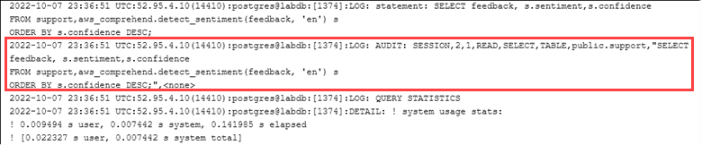

# Auditing database objects

With pgAudit set up on your
RDS for PostgreSQL DB instance and configured for your requirements,
more detailed information is captured in the PostgreSQL log. For example, while the default PostgreSQL logging configuration
identifies the date and time that a change was made in a database table, with the pgAudit
extension the log entry can include the schema, user who made the change, and other details
depending on how the extension parameters are configured. You can set up auditing to
track changes in the following ways.

- For each session, by user. For the session level, you can capture the
  fully qualified command text.
- For each object, by user and by database.
  The object auditing capability is activated when you create the `rds_pgaudit` role on your system and then
  add this role to the `pgaudit.role` parameter in your custom parameter parameter group. By default, the
  `pgaudit.role` parameter is unset and the only allowable value is `rds_pgaudit`.
  The following steps assume that `pgaudit` has been initialized and that
  you have created the `pgaudit` extension by following the procedure in [Setting up the pgAudit extension](Appendix.PostgreSQL.CommonDBATasks.pgaudit.md "Appendix.PostgreSQL.CommonDBATasks.pgaudit.md").


As shown in this example, the "LOG: AUDIT: SESSION" line provides information about the table and its schema, among other
details.

###### To set up object auditing

1. Use `psql` to connect to the RDS for PostgreSQL DB instance.

```
psql --host=`your-instance-name`.`aws-region`.rds.amazonaws.com --port=5432 --username=`postgres`postgres --password --dbname=`labdb`
```

2. Create a database role named `rds_pgaudit` using the following command.

```
`labdb=>` `CREATE ROLE rds_pgaudit;`
`CREATE ROLE
`labdb=>``
```

3. Close the `psql` session.

```
`labdb=>` `\q`
```

In the next few steps, use the AWS CLI to modify the audit log parameters in your
custom parameter group. 4. Use the following AWS CLI command to set the `pgaudit.role` parameter to `rds_pgaudit`.
By default, this parameter is empty, and `rds_pgaudit` is the only allowable value.

```
aws rds modify-db-parameter-group \
   --db-parameter-group-name `custom-param-group-name` \
   --parameters "ParameterName=pgaudit.role,ParameterValue=rds_pgaudit,ApplyMethod=pending-reboot" \
   --region `aws-region`
```

5. Use the following AWS CLI command to reboot the RDS for PostgreSQL DB instance so that
   your changes to the parameters take effect.

```
aws rds reboot-db-instance \
    --db-instance-identifier `your-instance` \
    --region `aws-region`
```

6. Run the following command to confirm that the `pgaudit.role` is set to `rds_pgaudit`.

```
`SHOW pgaudit.role;`
`pgaudit.role
------------------
rds_pgaudit`
```

To test pgAudit logging, you can run several example commands that you want to audit. For example, you might run the
following commands.

```
`CREATE TABLE t1 (id int);
GRANT SELECT ON t1 TO rds_pgaudit;
SELECT * FROM t1;`
`id
----
(0 rows)`
```

The database logs should contain an entry similar to the following.

```
...
2017-06-12 19:09:49 UTC:...:rds_test@postgres:[11701]:LOG: AUDIT:
OBJECT,1,1,READ,SELECT,TABLE,public.t1,select * from t1;
...
```

For information on viewing the logs, see [Monitoring Amazon RDS log files](USER_LogAccess.md "USER_LogAccess.md").

To learn more about the pgAudit extension, see [pgAudit](https://github.com/pgaudit/pgaudit/blob/master/README.md "https://github.com/pgaudit/pgaudit/blob/master/README.md") on GitHub.
