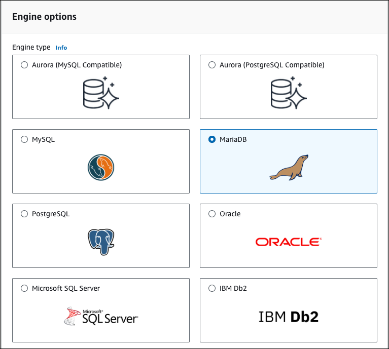
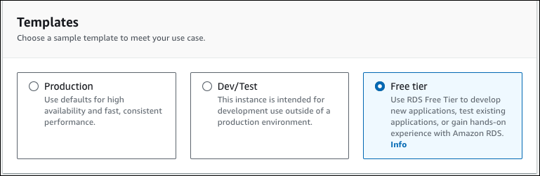
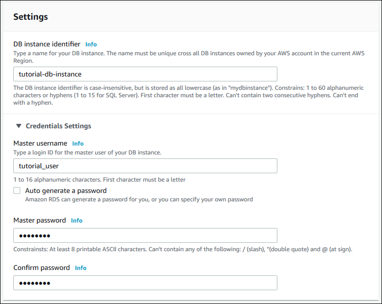
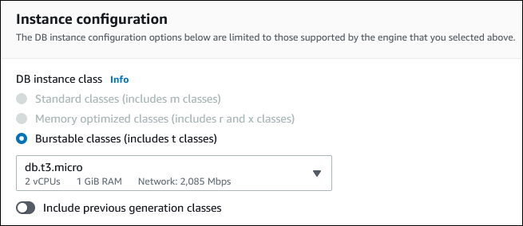
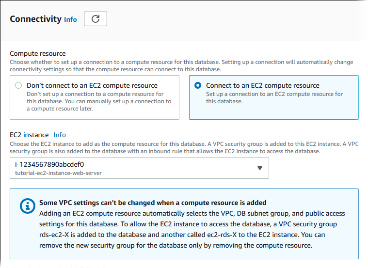
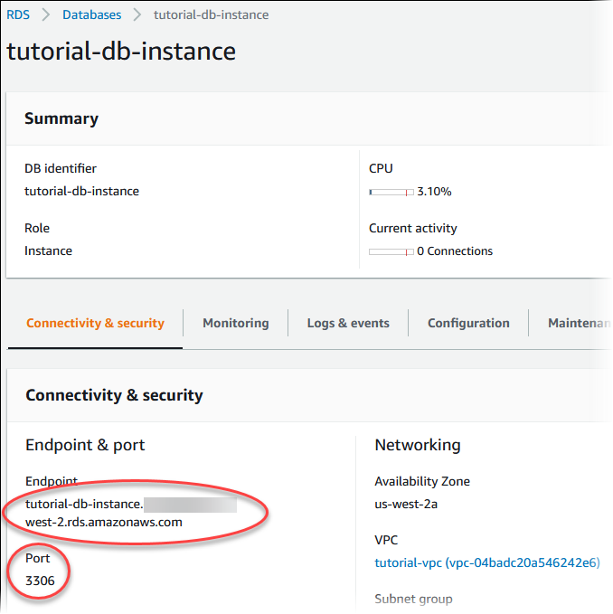
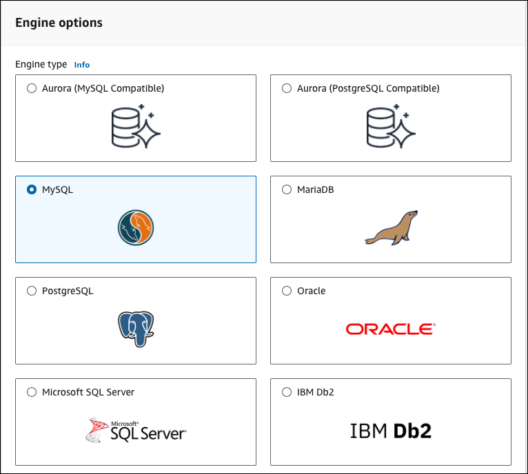
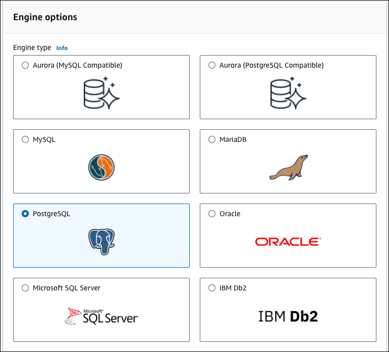
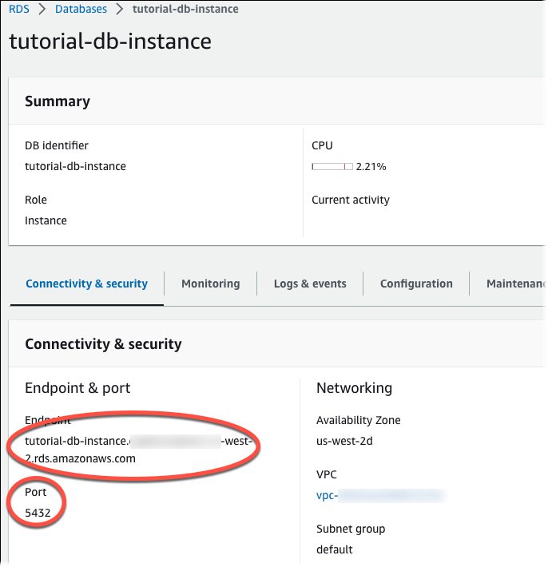

# Create an Amazon RDS DB instance

Create an RDS for MariaDB, RDS for MySQL, or RDS for PostgreSQL DB instance that maintains the data used by a web
application.

RDS for MariaDB

###### To create a MariaDB instance

1. Sign in to the AWS Management Console and open the Amazon RDS console at
   [https://console.aws.amazon.com/rds/](https://console.aws.amazon.com/rds/ "https://console.aws.amazon.com/rds/").
2. In the upper-right corner of the AWS Management Console, check the
   AWS Region. It should be the same as the one where you
   created your EC2 instance.
3. In the navigation pane, choose
   **Databases**.
4. Choose **Create database**.
5. On the **Create database** page, choose
   **Standard create**.
6. For **Engine options**, choose
   **MariaDB**.

 7. For **Templates**, choose
**Free tier** or **Sandbox**. **Free tier**
appears for free plan accounts. **Sandbox** appears for paid plan accounts.

 8. In the **Availability and durability**
section, keep the defaults. 9. In the **Settings** section, set these
values:

    * **DB instance identifier**
     – Type
     `tutorial-db-instance`.
    * **Master username** – Type
     `tutorial_user`.
    * **Auto generate a password**
     – Leave the option turned off.
    * **Master password** – Type
     a password.
    * **Confirm password** –
     Retype the password.

 10. In the **Instance configuration**
section, set these values:

    * **Burstable classes (includes t
     classes)**
    * **db.t3.micro**

 11. In the **Storage** section, keep the
defaults. 12. In the **Connectivity** section, set
these values and keep the other values as their
defaults:

    * For **Compute resource**, choose
     **Connect to an EC2 compute
     resource**.
    * For **EC2 instance**, choose the
     EC2 instance you created previously, such as
     **tutorial-ec2-instance-web-server**.

 13. In the **Database authentication**
section, make sure **Password
authentication** is selected. 14. Open the **Additional configuration**
section, and enter `sample` for
**Initial database name**. Keep the
default settings for the other options. 15. To create your MariaDB instance, choose **Create
database**.

Your new DB instance appears in the
**Databases** list with the status
**Creating**. 16. Wait for the **Status** of your new DB
instance to show as **Available**. Then
choose the DB instance name to show its details. 17. In the **Connectivity & security**
section, view the **Endpoint** and
**Port** of the DB instance.

Note the endpoint and port for your DB instance. You use
this information to connect your web server to your DB
instance. 18. Complete [Install a web server on your EC2 instance](CHAP_Tutorials.WebServerDB.md "CHAP_Tutorials.WebServerDB.md").

RDS for MySQL

###### To create a MySQL DB instance

1. Sign in to the AWS Management Console and open the Amazon RDS console at
   [https://console.aws.amazon.com/rds/](https://console.aws.amazon.com/rds/ "https://console.aws.amazon.com/rds/").
2. In the upper-right corner of the AWS Management Console, check the
   AWS Region. It should be the same as the one where you
   created your EC2 instance.
3. In the navigation pane, choose
   **Databases**.
4. Choose **Create database**.
5. On the **Create database** page, choose
   **Standard create**.
6. For **Engine options**, choose
   **MySQL**.

 7. For **Templates**, choose **Free
tier** or **Sandbox**.
**Free tier** appears for free plan
accounts. **Sandbox** appears for paid
plan accounts.

 8. In the **Availability and durability**
section, keep the defaults. 9. In the **Settings** section, set these
values:

    * **DB instance identifier**
     – Type
     `tutorial-db-instance`.
    * **Master username** – Type
     `tutorial_user`.
    * **Auto generate a password**
     – Leave the option turned off.
    * **Master password** – Type
     a password.
    * **Confirm password** –
     Retype the password.

 10. In the **Instance configuration**
section, set these values:

    * **Burstable classes (includes t
     classes)**
    * **db.t3.micro**

 11. In the **Storage** section, keep the
defaults. 12. In the **Connectivity** section, set
these values and keep the other values as their
defaults:

    * For **Compute resource**, choose
     **Connect to an EC2 compute
     resource**.
    * For **EC2 instance**, choose the
     EC2 instance you created previously, such as
     **tutorial-ec2-instance-web-server**.

 13. In the **Database authentication**
section, make sure **Password
authentication** is selected. 14. Open the **Additional configuration**
section, and enter `sample` for
**Initial database name**. Keep the
default settings for the other options. 15. To create your MySQL DB instance, choose **Create
database**.

Your new DB instance appears in the
**Databases** list with the status
**Creating**. 16. Wait for the **Status** of your new DB
instance to show as **Available**. Then
choose the DB instance name to show its details. 17. In the **Connectivity & security**
section, view the **Endpoint** and
**Port** of the DB instance.

Note the endpoint and port for your DB instance. You use
this information to connect your web server to your DB
instance. 18. Complete [Install a web server on your EC2 instance](CHAP_Tutorials.WebServerDB.md "CHAP_Tutorials.WebServerDB.md").

RDS for PostgreSQL

###### To create a PostgreSQL DB instance

1. Sign in to the AWS Management Console and open the Amazon RDS console at
   [https://console.aws.amazon.com/rds/](https://console.aws.amazon.com/rds/ "https://console.aws.amazon.com/rds/").
2. In the upper-right corner of the AWS Management Console, check the
   AWS Region. It should be the same as the one where you
   created your EC2 instance.
3. In the navigation pane, choose
   **Databases**.
4. Choose **Create database**.
5. On the **Create database** page, choose
   **Standard create**.
6. For **Engine options**, choose
   **PostgreSQL**.

 7. For **Templates**, choose **Free
tier** or **Sandbox**.
**Free tier** appears for free plan
accounts. **Sandbox** appears for paid
plan accounts.

 8. In the **Availability and durability**
section, keep the defaults. 9. In the **Settings** section, set these
values:

    * **DB instance identifier**
     – Type
     `tutorial-db-instance`.
    * **Master username** – Type
     `tutorial_user`.
    * **Auto generate a password**
     – Leave the option turned off.
    * **Master password** – Type
     a password.
    * **Confirm password** –
     Retype the password.

 10. In the **Instance configuration**
section, set these values:

    * **Burstable classes (includes t
     classes)**
    * **db.t3.micro**

 11. In the **Storage** section, keep the
defaults. 12. In the **Connectivity** section, set
these values and keep the other values as their
defaults:

    * For **Compute resource**, choose
     **Connect to an EC2 compute
     resource**.
    * For **EC2 instance**, choose the
     EC2 instance you created previously, such as
     **tutorial-ec2-instance-web-server**.

 13. In the **Database authentication**
section, make sure **Password
authentication** is selected. 14. Open the **Additional configuration**
section, and enter `sample` for
**Initial database name**. Keep the
default settings for the other options. 15. To create your PostgreSQL DB instance, choose **Create
database**.

Your new DB instance appears in the
**Databases** list with the status
**Creating**. 16. Wait for the **Status** of your new DB
instance to show as **Available**. Then
choose the DB instance name to show its details. 17. In the **Connectivity & security**
section, view the **Endpoint** and
**Port** of the DB instance.

Note the endpoint and port for your DB instance. You use
this information to connect your web server to your DB
instance. 18. Complete [Install a web server on your EC2 instance](CHAP_Tutorials.WebServerDB.md "CHAP_Tutorials.WebServerDB.md").
