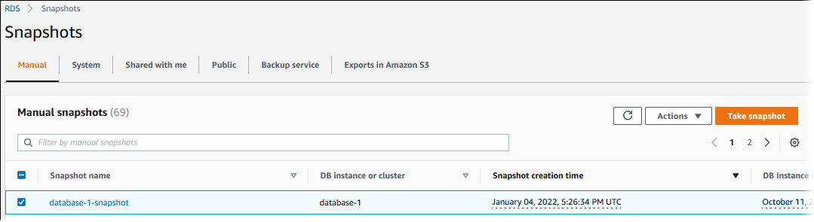
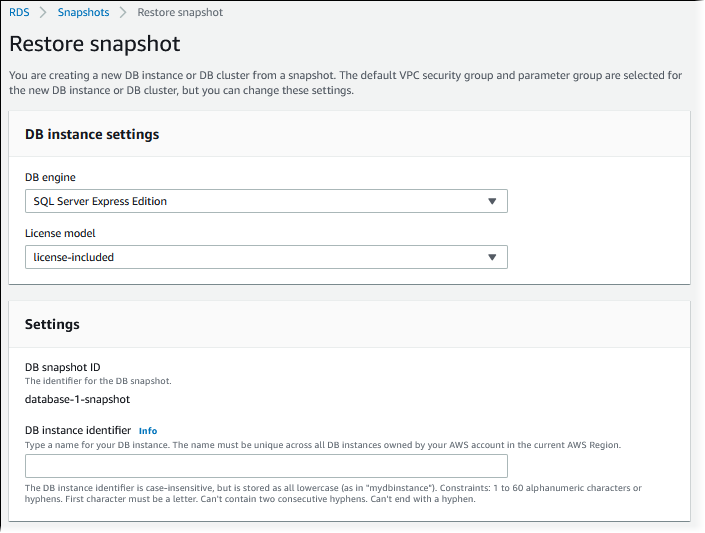
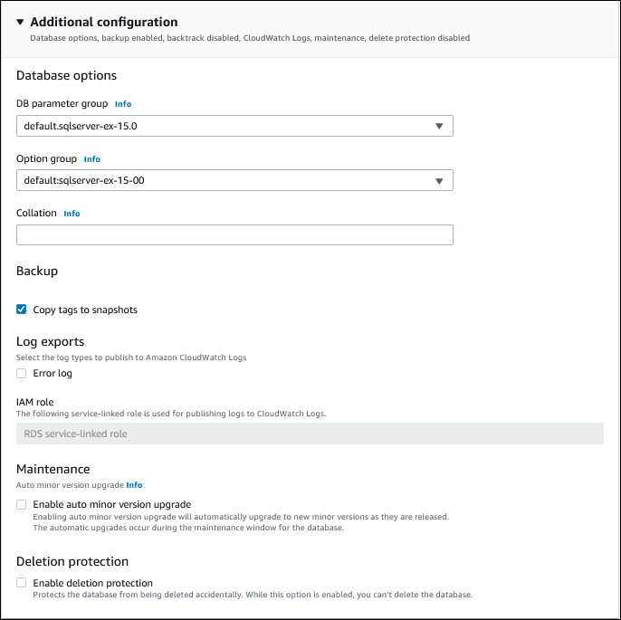
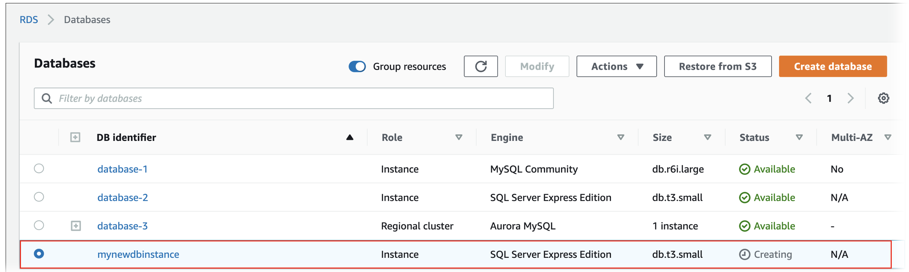

# Tutorial: Restore an Amazon RDS DB instance from a DB snapshot

Often, when working with Amazon RDS you might have a DB instance that you work with
occasionally but don't need full time. For example, suppose that you have a quarterly
customer survey that uses an Amazon EC2 instance to host a customer survey website. You also have
a DB instance that is used to store the survey results. One way to save money on such a
scenario is to take a DB snapshot of the DB instance after the survey is completed. You then
delete the DB instance and restore it when you need to conduct the survey again.

When you restore the DB instance, you provide the name of the DB snapshot to restore from.
You then provide a name for the new DB instance that's created from the restore
operation.

For more detailed information on restoring DB instances from snapshots, see [Restoring to a DB instance](USER_RestoreFromSnapshot.md "USER_RestoreFromSnapshot.md").

For information about AWS KMS key management for Amazon RDS, see [AWS KMS key management](Overview.Encryption.md "Overview.Encryption.md").

## Restoring a DB instance from a DB snapshot

Use the following procedure to restore from a snapshot in the AWS Management Console.

###### To restore a DB instance from a DB snapshot

1. Sign in to the AWS Management Console and open the Amazon RDS console at
   [https://console.aws.amazon.com/rds/](https://console.aws.amazon.com/rds/ "https://console.aws.amazon.com/rds/").
2. In the navigation pane, choose **Snapshots**.
3. Choose the DB snapshot that you want to restore from.
4. For **Actions**, choose **Restore snapshot**.

The **Restore snapshot** page appears.

 5. Under **DB instance settings**, use the default settings for **DB engine** and
**License model** (for Oracle or Microsoft SQL Server). 6. Under **Settings**, for **DB instance identifier** enter the unique name that you
want to use for the restored DB instance, for example `mynewdbinstance`.

If you're restoring from a DB instance that you deleted after you made the DB snapshot, you can use the name of
that DB instance. 7. Under **Availability & durability**, choose whether to
create a standby instance in another Availability Zone.

For this tutorial, don't create a standby instance. 8. Under **Connectivity**, use the default settings for the following:

    * **Virtual private cloud (VPC)**
    * **DB subnet group**
    * **Public access**
    * **VPC security group (firewall)**

9. Choose the **DB instance class**.

For this tutorial, choose **Burstable classes (includes t classes)**, and then choose
**db.t3.small**. 10. For **Encryption**, use the default settings.

If the source DB instance for the snapshot was encrypted, the restored DB instance is also encrypted. You can't
make it unencrypted. 11. Expand **Additional configuration** at the bottom of the page.

 12. Do the following under **Database options**:

    1. Choose the **DB parameter group**.

    For this tutorial, use the default parameter group.
    2. Choose the **Option group**.

    For this tutorial, use the default option group.

    ###### Important

    In some cases, you might restore from a DB snapshot of a DB
     instance that uses a persistent or permanent option. If so, make
     sure to choose an option group that uses the same option.
    3. For **Deletion protection**, choose the **Enable deletion protection** check
     box.

13. Choose **Restore DB instance**.

The **Databases** page displays the restored DB instance, with a status of `Creating`.

