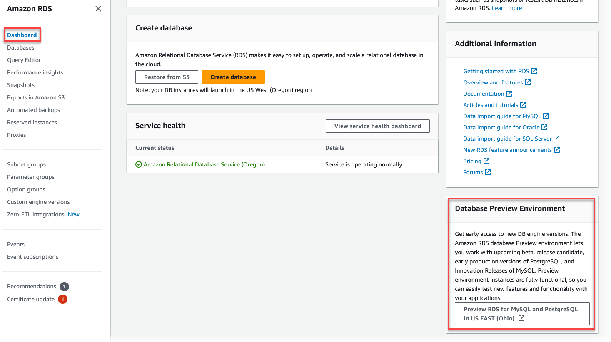
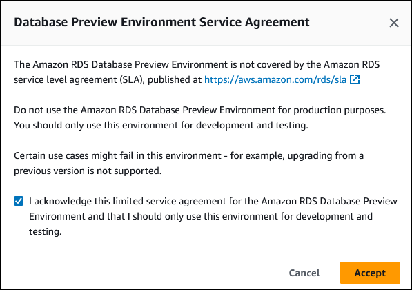

# MariaDB on Amazon RDS versions

For MariaDB, version numbers are organized as version X.Y.Z. In Amazon RDS terminology, X.Y
denotes the major version, and Z is the minor version number. For Amazon RDS implementations, a
version change is considered major if the major version number changes, for example going
from version 10.5 to 10.6. A version change is considered minor if only the minor version
number changes, for example going from version 10.6.14 to 10.6.16.

###### Topics

- [Version currency timelines](#MariaDB.Concepts.VersionMgmt.VersionCurrencyTimelines "#MariaDB.Concepts.VersionMgmt.VersionCurrencyTimelines")
- [Supported MariaDB minor versions on Amazon RDS](#MariaDB.Concepts.VersionMgmt.Supported "#MariaDB.Concepts.VersionMgmt.Supported")
- [Supported MariaDB major versions on Amazon RDS](#MariaDB.Concepts.VersionMgmt.ReleaseCalendar "#MariaDB.Concepts.VersionMgmt.ReleaseCalendar")
- [Working with the Database Preview environment](#mariadb-working-with-the-database-preview-environment "#mariadb-working-with-the-database-preview-environment")
- [MariaDB version 12.3.1 in the Database Preview environment](#mariadb-preview-environment-version-12-3 "#mariadb-preview-environment-version-12-3")
- [Deprecated versions for Amazon RDS for MariaDB](#MariaDB.Concepts.DeprecatedVersions "#MariaDB.Concepts.DeprecatedVersions")

## Version currency timelines

RDS for MariaDB tracks community database engine releases on a defined cadence. These
version currency timelines are published to give you transparency into that cadence.
You can use these timelines to:

- Plan major version upgrades and estimate when a new RDS for MariaDB major
  version will be available.
- Schedule minor version upgrades during your maintenance windows.

The following table lists the version currency timelines for RDS for MariaDB.

| Release type   | Timelines                                                           |
| -------------- | ------------------------------------------------------------------- |
| Major versions | Within 3 months of the community release of the first patch version |
| Minor versions | Within 30 days of the community release                             |

## Supported MariaDB minor versions on Amazon RDS

Amazon RDS currently supports the following minor versions of MariaDB.

###### Note

Dates with only a month and a year are approximate and are updated with an exact date when it’s known.

The following table shows the minor versions of MariaDB 12.3 that Amazon RDS currently
supports.

| MariaDB engine version | Community release date | RDS release date | RDS end of standard support date |
| ---------------------- | ---------------------- | ---------------- | -------------------------------- |
| 12.3.3                 | 24 August 2026         | 4 September 2026 | September 2027                   |
| 12.3.2                 | 28 May 2026            | 7 August 2026    | August 2027                      |

The following table shows the minor versions of MariaDB 11.8 that Amazon RDS currently
supports.

| MariaDB engine version | Community release date | RDS release date | RDS end of standard support date |
| ---------------------- | ---------------------- | ---------------- | -------------------------------- |
| 11.8.9                 | 24 August 2026         | 4 September 2026 | September 2027                   |
| 11.8.8                 | 27 May 2026            | 5 June 2026      | June 2027                        |
| 11.8.6                 | 4 February 2026        | 10 February 2026 | February 2027                    |
| 11.8.5                 | 14 November 2025       | 20 November 2025 | 31 October 2026                  |
| 11.8.3                 | 6 August 2025          | 25 August 2025   | 31 October 2026                  |

The following table shows the minor versions of MariaDB 11.4 that Amazon RDS currently
supports.

| MariaDB engine version | Community release date | RDS release date | RDS end of standard support date |
| ---------------------- | ---------------------- | ---------------- | -------------------------------- |
| 11.4.13                | 24 August 2026         | 4 September 2026 | September 2027                   |
| 11.4.12                | 27 May 2026            | 5 June 2026      | June 2027                        |
| 11.4.10                | 4 February 2026        | 10 February 2026 | February 2027                    |
| 11.4.9                 | 6 November 2025        | 18 November 2025 | 31 October 2026                  |
| 11.4.8                 | 6 August 2025          | 13 August 2025   | 31 October 2026                  |
| 11.4.7                 | 22 May 2025            | 4 June 2025      | 31 October 2026                  |

The following table shows the minor versions of MariaDB 10.11 that Amazon RDS currently
supports.

| MariaDB engine version | Community release date | RDS release date | RDS end of standard support date |
| ---------------------- | ---------------------- | ---------------- | -------------------------------- |
| 10.11.19               | 24 August 2026         | 4 September 2026 | September 2027                   |
| 10.11.18               | 27 May 2026            | 5 June 2026      | June 2027                        |
| 10.11.16               | 4 February 2026        | 10 February 2026 | February 2027                    |
| 10.11.15               | 6 November 2025        | 18 November 2025 | 31 October 2026                  |
| 10.11.14               | 6 August 2025          | 13 August 2025   | 31 October 2026                  |
| 10.11.13               | 22 May 2025            | 4 June 2025      | 31 October 2026                  |

The following table shows the minor versions of MariaDB 10.6 that Amazon RDS currently
supports.

| MariaDB engine version | Community release date | RDS release date | RDS end of standard support date |
| ---------------------- | ---------------------- | ---------------- | -------------------------------- |
| 10.6.28                | 13 August 2026         | 4 September 2026 | 31 December 2026                 |
| 10.6.27                | 27 May 2026            | 5 June 2026      | 31 December 2026                 |
| 10.6.25                | 4 February 2026        | 10 February 2026 | 31 December 2026                 |
| 10.6.24                | 6 November 2025        | 18 November 2025 | November 2026                    |
| 10.6.23                | 6 August 2025          | 13 August 2025   | November 2026                    |
| 10.6.22                | 6 May 2025             | 20 May 2025      | November 2026                    |

The following table shows the minor versions of MariaDB 10.5 that Amazon RDS currently
supports.

| MariaDB engine version | Community release date | RDS release date | RDS end of standard support date |
| ---------------------- | ---------------------- | ---------------- | -------------------------------- |
| 10.5.29                | 6 May 2025             | 20 May 2025      | August 2026                      |
| 10.5.28                | 4 February 2025        | 24 February 2025 | August 2026                      |

You can specify any currently supported MariaDB version when creating a new DB
instance. You can specify the major version (such as MariaDB 10.5), and any
supported minor version for the specified major version. If no version is specified,
Amazon RDS defaults to a supported version, typically the most recent version. If a
major version is specified but a minor version is not, Amazon RDS defaults to a recent
release of the major version you have specified. To see a list of supported versions,
as well as defaults for newly created DB instances, use the
[`describe-db-engine-versions`](../../../cli/latest/reference/rds/describe-db-engine-versions.md "../../../cli/latest/reference/rds/describe-db-engine-versions.md") AWS CLI command.

For example, to list the supported engine versions for RDS for MariaDB, run the following CLI command:

```
aws rds describe-db-engine-versions --engine mariadb --query "*[].{Engine:Engine,EngineVersion:EngineVersion}" --output text
```

The default MariaDB version might vary by AWS Region. To create a DB instance with a
specific minor version, specify the minor version during DB instance creation. You can
determine the default minor version for an AWS Region by running the following AWS CLI
command:

```
aws rds describe-db-engine-versions --default-only --engine mariadb --engine-version `major_engine_version` --region `region` --query "*[].{Engine:Engine,EngineVersion:EngineVersion}" --output text
```

Replace `major_engine_version` with the major engine version,
and replace `region` with the AWS Region. For example, the
following AWS CLI command returns the default MariaDB minor engine version for the 10.5
major version and the US West (Oregon) AWS Region (us-west-2):

```
aws rds describe-db-engine-versions --default-only --engine mariadb --engine-version 10.5 --region us-west-2 --query "*[].{Engine:Engine,EngineVersion:EngineVersion}" --output text
```

### MariaDB minor versions on Amazon RDS

###### Minor versions

- [MariaDB version 12.3.3](#MariaDB.Concepts.VersionMgmt.Supported.Minor.12.3.3 "#MariaDB.Concepts.VersionMgmt.Supported.Minor.12.3.3")
- [MariaDB version 12.3.2](#MariaDB.Concepts.VersionMgmt.Supported.Minor.12.3.2 "#MariaDB.Concepts.VersionMgmt.Supported.Minor.12.3.2")
- [MariaDB version 11.8.9](#MariaDB.Concepts.VersionMgmt.Supported.Minor.11.8.9 "#MariaDB.Concepts.VersionMgmt.Supported.Minor.11.8.9")
- [MariaDB version 11.8.8](#MariaDB.Concepts.VersionMgmt.Supported.Minor.11.8.8 "#MariaDB.Concepts.VersionMgmt.Supported.Minor.11.8.8")
- [MariaDB version 11.8.6](#MariaDB.Concepts.VersionMgmt.Supported.Minor.11.8.6 "#MariaDB.Concepts.VersionMgmt.Supported.Minor.11.8.6")
- [MariaDB version 11.8.5](#MariaDB.Concepts.VersionMgmt.Supported.Minor.11.8.5 "#MariaDB.Concepts.VersionMgmt.Supported.Minor.11.8.5")
- [MariaDB version 11.8.3](#MariaDB.Concepts.VersionMgmt.Supported.Minor.11.8.3 "#MariaDB.Concepts.VersionMgmt.Supported.Minor.11.8.3")
- [MariaDB version 11.4.13](#MariaDB.Concepts.VersionMgmt.Supported.Minor.11.4.13 "#MariaDB.Concepts.VersionMgmt.Supported.Minor.11.4.13")
- [MariaDB version 11.4.12](#MariaDB.Concepts.VersionMgmt.Supported.Minor.11.4.12 "#MariaDB.Concepts.VersionMgmt.Supported.Minor.11.4.12")
- [MariaDB version 11.4.10](#MariaDB.Concepts.VersionMgmt.Supported.Minor.11.4.10 "#MariaDB.Concepts.VersionMgmt.Supported.Minor.11.4.10")
- [MariaDB version 11.4.9](#MariaDB.Concepts.VersionMgmt.Supported.Minor.11.4.9 "#MariaDB.Concepts.VersionMgmt.Supported.Minor.11.4.9")
- [MariaDB version 11.4.8](#MariaDB.Concepts.VersionMgmt.Supported.Minor.11.4.8 "#MariaDB.Concepts.VersionMgmt.Supported.Minor.11.4.8")
- [MariaDB version 11.4.7](#MariaDB.Concepts.VersionMgmt.Supported.Minor.11.4.7 "#MariaDB.Concepts.VersionMgmt.Supported.Minor.11.4.7")
- [MariaDB version 11.4.5](#MariaDB.Concepts.VersionMgmt.Supported.Minor.11.4.5 "#MariaDB.Concepts.VersionMgmt.Supported.Minor.11.4.5")
- [MariaDB version 11.4.4](#MariaDB.Concepts.VersionMgmt.Supported.Minor.11.4.4 "#MariaDB.Concepts.VersionMgmt.Supported.Minor.11.4.4")
- [MariaDB version 10.11.19](#MariaDB.Concepts.VersionMgmt.Supported.Minor.10.11.19 "#MariaDB.Concepts.VersionMgmt.Supported.Minor.10.11.19")
- [MariaDB version 10.11.18](#MariaDB.Concepts.VersionMgmt.Supported.Minor.10.11.18 "#MariaDB.Concepts.VersionMgmt.Supported.Minor.10.11.18")
- [MariaDB version 10.11.16](#MariaDB.Concepts.VersionMgmt.Supported.Minor.10.11.16 "#MariaDB.Concepts.VersionMgmt.Supported.Minor.10.11.16")
- [MariaDB version 10.11.15](#MariaDB.Concepts.VersionMgmt.Supported.Minor.10.11.15 "#MariaDB.Concepts.VersionMgmt.Supported.Minor.10.11.15")
- [MariaDB version 10.11.14](#MariaDB.Concepts.VersionMgmt.Supported.Minor.10.11.14 "#MariaDB.Concepts.VersionMgmt.Supported.Minor.10.11.14")
- [MariaDB version 10.11.13](#MariaDB.Concepts.VersionMgmt.Supported.Minor.10.11.13 "#MariaDB.Concepts.VersionMgmt.Supported.Minor.10.11.13")
- [MariaDB version 10.11.11](#MariaDB.Concepts.VersionMgmt.Supported.Minor.10.11.11 "#MariaDB.Concepts.VersionMgmt.Supported.Minor.10.11.11")
- [MariaDB version 10.11.10](#MariaDB.Concepts.VersionMgmt.Supported.Minor.10.11.10 "#MariaDB.Concepts.VersionMgmt.Supported.Minor.10.11.10")
- [MariaDB version 10.6.28](#MariaDB.Concepts.VersionMgmt.Supported.Minor.10.6.28 "#MariaDB.Concepts.VersionMgmt.Supported.Minor.10.6.28")
- [MariaDB version 10.6.27](#MariaDB.Concepts.VersionMgmt.Supported.Minor.10.6.27 "#MariaDB.Concepts.VersionMgmt.Supported.Minor.10.6.27")
- [MariaDB version 10.6.25](#MariaDB.Concepts.VersionMgmt.Supported.Minor.10.6.25 "#MariaDB.Concepts.VersionMgmt.Supported.Minor.10.6.25")
- [MariaDB version 10.6.24](#MariaDB.Concepts.VersionMgmt.Supported.Minor.10.6.24 "#MariaDB.Concepts.VersionMgmt.Supported.Minor.10.6.24")
- [MariaDB version 10.6.23](#MariaDB.Concepts.VersionMgmt.Supported.Minor.10.6.23 "#MariaDB.Concepts.VersionMgmt.Supported.Minor.10.6.23")
- [MariaDB version 10.6.22](#MariaDB.Concepts.VersionMgmt.Supported.Minor.10.6.22 "#MariaDB.Concepts.VersionMgmt.Supported.Minor.10.6.22")
- [MariaDB version 10.6.21](#MariaDB.Concepts.VersionMgmt.Supported.Minor.10.6.21 "#MariaDB.Concepts.VersionMgmt.Supported.Minor.10.6.21")
- [MariaDB version 10.6.20](#MariaDB.Concepts.VersionMgmt.Supported.Minor.10.6.20 "#MariaDB.Concepts.VersionMgmt.Supported.Minor.10.6.20")
- [MariaDB version 10.5.29](#MariaDB.Concepts.VersionMgmt.Supported.Minor.10.5.29 "#MariaDB.Concepts.VersionMgmt.Supported.Minor.10.5.29")
- [MariaDB version 10.5.28](#MariaDB.Concepts.VersionMgmt.Supported.Minor.10.5.28 "#MariaDB.Concepts.VersionMgmt.Supported.Minor.10.5.28")
- [MariaDB version 10.5.27](#MariaDB.Concepts.VersionMgmt.Supported.Minor.10.5.27 "#MariaDB.Concepts.VersionMgmt.Supported.Minor.10.5.27")

#### MariaDB version 12.3.3

MariaDB version 12.3.3 is now available on Amazon RDS. This release contains fixes
and improvements added by the MariaDB community and Amazon RDS.

**New features and enhancements**

- Updated the time zone information to base it on
  `tzdata2026c`.
- Added support for post-quantum hybrid key exchange
  (`X25519MLKEM768` and `SecP256r1MLKEM768`) for
  TLS 1.3 connections. Clients that support post-quantum key exchange
  negotiate a quantum-resistant shared secret automatically. To confirm
  which group the current session negotiated, query the
  `Ssl_named_group` status variable. For example:
  `SHOW STATUS LIKE 'Ssl_named_group';`.

#### MariaDB version 12.3.2

MariaDB version 12.3.2 is now available on Amazon RDS. This release contains fixes
and improvements added by the MariaDB community and Amazon RDS.

**New features and enhancements**

- **Reserved user for RDS Proxy** – The
  `rdsproxyadmin` user is a reserved user. You can't modify or
  drop this user. For more information, see [MariaDB security on Amazon RDS](MariaDB.Concepts.UsersAndPrivileges.md "MariaDB.Concepts.UsersAndPrivileges.md").
- **Drop protection for the replication user
  account** – Starting with RDS for MariaDB version 12.3, drop
  protection applies to the `rdsrepladmin` account regardless of
  its host value. Attempting to drop `'rdsrepladmin'@'host'` for
  any host results in an error. For more information, see [MariaDB security on Amazon RDS](MariaDB.Concepts.UsersAndPrivileges.md "MariaDB.Concepts.UsersAndPrivileges.md").

#### MariaDB version 11.8.9

MariaDB version 11.8.9 is now available on Amazon RDS. This release contains fixes
and improvements added by the MariaDB community and Amazon RDS.

**New features and enhancements**

- Updated the time zone information to base it on
  `tzdata2026c`.
- Added support for post-quantum hybrid key exchange
  (`X25519MLKEM768` and `SecP256r1MLKEM768`) for
  TLS 1.3 connections. Clients that support post-quantum key exchange
  negotiate a quantum-resistant shared secret automatically. To confirm
  which group the current session negotiated, query the
  `Ssl_named_group` status variable. For example:
  `SHOW STATUS LIKE 'Ssl_named_group';`.

#### MariaDB version 11.8.8

MariaDB version 11.8.8 is now available on Amazon RDS. This release contains fixes
and improvements added by the MariaDB community and Amazon RDS.

**New features and enhancements**

- Updated the time zone information to base it on
  `tzdata2026b`.

#### MariaDB version 11.8.6

MariaDB version 11.8.6 is now available on Amazon RDS. This release contains fixes
and improvements added by the MariaDB community and Amazon RDS.

**New features and enhancements**

- Updated the time zone information to base it on
  `tzdata2025c`.
- Fixed an issue which can cause some SQL statements to not get logged in the audit log.

#### MariaDB version 11.8.5

MariaDB version 11.8.5 is now available on Amazon RDS. This release contains fixes
and improvements added by the MariaDB community and Amazon RDS.

#### MariaDB version 11.8.3

MariaDB version 11.8.3 is now available on Amazon RDS. This release contains fixes
and improvements added by the MariaDB community and Amazon RDS.

**New features and enhancements**

- **New default value for parameter** – The default value of `require_secure_transport` parameter changed from `0` to `1`, enforcing secure transport connections by default.
  For more information, see [Requiring SSL/TLS for all connections to a MariaDB DB instance on Amazon RDS](mariadb-ssl-connections.require-ssl.md "mariadb-ssl-connections.require-ssl.md").

#### MariaDB version 11.4.13

MariaDB version 11.4.13 is now available on Amazon RDS. This release contains fixes
and improvements added by the MariaDB community and Amazon RDS.

**New features and enhancements**

- Updated the time zone information to base it on
  `tzdata2026c`.
- Added support for post-quantum hybrid key exchange
  (`X25519MLKEM768` and `SecP256r1MLKEM768`) for
  TLS 1.3 connections. Clients that support post-quantum key exchange
  negotiate a quantum-resistant shared secret automatically. To confirm
  which group the current session negotiated, query the
  `Ssl_named_group` status variable. For example:
  `SHOW STATUS LIKE 'Ssl_named_group';`.

#### MariaDB version 11.4.12

MariaDB version 11.4.12 is now available on Amazon RDS. This release contains fixes
and improvements added by the MariaDB community and Amazon RDS.

**New features and enhancements**

- Updated the time zone information to base it on
  `tzdata2026b`.

#### MariaDB version 11.4.10

MariaDB version 11.4.10 is now available on Amazon RDS. This release contains fixes
and improvements added by the MariaDB community and Amazon RDS.

**New features and enhancements**

- Updated the time zone information to base it on
  `tzdata2025c`.
- Fixed an issue which can cause some SQL statements to not get logged in the audit log.

#### MariaDB version 11.4.9

MariaDB version 11.4.9 is now available on Amazon RDS. This release contains fixes
and improvements added by the MariaDB community and Amazon RDS.

#### MariaDB version 11.4.8

MariaDB version 11.4.8 is now available on Amazon RDS. This release contains fixes
and improvements added by the MariaDB community and Amazon RDS.

#### MariaDB version 11.4.7

MariaDB version 11.4.7 is now available on Amazon RDS. This release contains fixes
and improvements added by the MariaDB community and Amazon RDS.

**New features and enhancements**

- Updated the time zone information to base it on
  `tzdata2025b`.

#### MariaDB version 11.4.5

MariaDB version 11.4.5 is now available on Amazon RDS. This release contains fixes
and improvements added by the MariaDB community and Amazon RDS.

**New features and enhancements**

- Updated the time zone information to base it on
  `tzdata2025a`.

#### MariaDB version 11.4.4

MariaDB version 11.4.4 is now available on Amazon RDS. This release contains fixes
and improvements added by the MariaDB community and Amazon RDS.

**New features and enhancements**

- Reverted two MariaDB community changes that cause point-in-time
  recovery (PITR) to fail. For more information, see [MariaDB Server Jira
  issue MDEV-35528](https://jira.mariadb.org/browse/MDEV-35528 "https://jira.mariadb.org/browse/MDEV-35528").

#### MariaDB version 10.11.19

MariaDB version 10.11.19 is now available on Amazon RDS. This release contains fixes
and improvements added by the MariaDB community and Amazon RDS.

**New features and enhancements**

- Updated the time zone information to base it on
  `tzdata2026c`.

#### MariaDB version 10.11.18

MariaDB version 10.11.18 is now available on Amazon RDS. This release contains fixes
and improvements added by the MariaDB community and Amazon RDS.

**New features and enhancements**

- Updated the time zone information to base it on
  `tzdata2026b`.

#### MariaDB version 10.11.16

MariaDB version 10.11.16 is now available on Amazon RDS. This release contains fixes
and improvements added by the MariaDB community and Amazon RDS.

**New features and enhancements**

- Updated the time zone information to base it on
  `tzdata2025c`.
- Fixed an issue which can cause some SQL statements to not get logged in the audit log.

#### MariaDB version 10.11.15

MariaDB version 10.11.15 is now available on Amazon RDS. This release contains
fixes and improvements added by the MariaDB community and Amazon RDS.

#### MariaDB version 10.11.14

MariaDB version 10.11.14 is now available on Amazon RDS. This release contains
fixes and improvements added by the MariaDB community and Amazon RDS.

#### MariaDB version 10.11.13

MariaDB version 10.11.13 is now available on Amazon RDS. This release contains
fixes and improvements added by the MariaDB community and Amazon RDS.

**New features and enhancements**

- Updated the time zone information to base it on
  `tzdata2025b`.

#### MariaDB version 10.11.11

MariaDB version 10.11.11 is now available on Amazon RDS. This release contains
fixes and improvements added by the MariaDB community and Amazon RDS.

**New features and enhancements**

- Updated the time zone information to base it on
  `tzdata2025a`.

#### MariaDB version 10.11.10

MariaDB version 10.11.10 is now available on Amazon RDS. This release contains
fixes and improvements added by the MariaDB community and Amazon RDS.

**New features and enhancements**

- Reverted two MariaDB community changes that cause point-in-time
  recovery (PITR) to fail. For more information, see [MariaDB Server Jira
  issue MDEV-35528](https://jira.mariadb.org/browse/MDEV-35528 "https://jira.mariadb.org/browse/MDEV-35528").

#### MariaDB version 10.6.28

MariaDB version 10.6.28 is now available on Amazon RDS. This release contains fixes
and improvements added by the MariaDB community and Amazon RDS.

**New features and enhancements**

- Updated the time zone information to base it on
  `tzdata2026c`.

#### MariaDB version 10.6.27

MariaDB version 10.6.27 is now available on Amazon RDS. This release contains fixes
and improvements added by the MariaDB community and Amazon RDS.

**New features and enhancements**

- Updated the time zone information to base it on
  `tzdata2026b`.

#### MariaDB version 10.6.25

MariaDB version 10.6.25 is now available on Amazon RDS. This release contains fixes
and improvements added by the MariaDB community and Amazon RDS.

**New features and enhancements**

- Updated the time zone information to base it on
  `tzdata2025c`.
- Fixed an issue which can cause some SQL statements to not get logged in the audit log.

#### MariaDB version 10.6.24

MariaDB version 10.6.24 is now available on Amazon RDS. This release contains fixes
and improvements added by the MariaDB community and Amazon RDS.

#### MariaDB version 10.6.23

MariaDB version 10.6.23 is now available on Amazon RDS. This release contains fixes
and improvements added by the MariaDB community and Amazon RDS.

#### MariaDB version 10.6.22

MariaDB version 10.6.22 is now available on Amazon RDS. This release contains fixes
and improvements added by the MariaDB community and Amazon RDS.

**New features and enhancements**

- Updated the time zone information to base it on
  `tzdata2025b`.

#### MariaDB version 10.6.21

MariaDB version 10.6.21 is now available on Amazon RDS. This release contains fixes
and improvements added by the MariaDB community and Amazon RDS.

**New features and enhancements**

- Updated the time zone information to base it on
  `tzdata2025a`.

#### MariaDB version 10.6.20

MariaDB version 10.6.20 is now available on Amazon RDS. This release contains fixes
and improvements added by the MariaDB community and Amazon RDS.

**New features and enhancements**

- Reverted two MariaDB community changes that cause point-in-time
  recovery (PITR) to fail. For more information, see [MariaDB Server Jira
  issue MDEV-35528](https://jira.mariadb.org/browse/MDEV-35528 "https://jira.mariadb.org/browse/MDEV-35528").

#### MariaDB version 10.5.29

MariaDB version 10.5.29 is now available on Amazon RDS. This release contains fixes
and improvements added by the MariaDB community and Amazon RDS.

**New features and enhancements**

- Updated the time zone information to base it on
  `tzdata2025b`.

#### MariaDB version 10.5.28

MariaDB version 10.5.28 is now available on Amazon RDS. This release contains fixes
and improvements added by the MariaDB community and Amazon RDS.

**New features and enhancements**

- Updated the time zone information to base it on
  `tzdata2025a`.

#### MariaDB version 10.5.27

MariaDB version 10.5.27 is now available on Amazon RDS. This release contains fixes
and improvements added by the MariaDB community and Amazon RDS.

**New features and enhancements**

- Reverted two MariaDB community changes that cause point-in-time
  recovery (PITR) to fail. For more information, see [MariaDB Server Jira
  issue MDEV-35528](https://jira.mariadb.org/browse/MDEV-35528 "https://jira.mariadb.org/browse/MDEV-35528").

## Supported MariaDB major versions on Amazon RDS

RDS for MariaDB major versions remain available at least until community end of life for
the corresponding community version. You can use the following dates to plan your
testing and upgrade cycles. If Amazon extends support for an RDS for MariaDB version for
longer than originally stated, we plan to update this table to reflect the later date.

###### Note

Dates with only a month and a year are approximate and are updated with an exact
date when it’s known.

You can also view information about support dates for major engine versions by
running the [describe-db-major-engine-versions](../../../cli/latest/reference/rds/describe-db-major-engine-versions.md "../../../cli/latest/reference/rds/describe-db-major-engine-versions.md") AWS CLI command or by using the [DescribeDBMajorEngineVersions](../APIReference/API_DescribeDBMajorEngineVersions.md "../APIReference/API_DescribeDBMajorEngineVersions.md") RDS API operation.

| MariaDB major version | Community release date | RDS release date | Community end of life date | RDS end of standard support date |
| --------------------- | ---------------------- | ---------------- | -------------------------- | -------------------------------- |
| MariaDB 12.3          | 28 May 2026            | 7 August 2026    | June 2029                  | June 2029                        |
| MariaDB 11.8          | 6 August 2025          | 25 August 2025   | June 2028                  | June 2028                        |
| MariaDB 11.4          | 8 August 2024          | 15 October 2024  | May 2029                   | May 2029                         |
| MariaDB 10.11         | 16 February 2023       | 21 August 2023   | 16 February 2028           | February 2028                    |
| MariaDB 10.6          | 6 July 2021            | 3 February 2022  | 6 July 2026                | 31 December 2026                 |
| MariaDB 10.5          | 24 June 2020           | 21 January 2021  | 24 June 2025               | 31 August 2026                   |

## Working with the Database Preview environment

RDS for MariaDB DB instances in the Database Preview environment are functionally similar to
other RDS for MariaDB DB instances. However, you can't use the Database Preview environment for
production workloads.

Preview environments have the following limitations:

- Amazon RDS deletes all DB instances 60 days after you create them, along with any
  backups and snapshots.
- You can only use General Purpose SSD and Provisioned IOPS SSD storage.
- You can't get help from Support with DB instances. Instead,
  you can post your questions to the AWS‐managed Q&A community,
  [AWS re:Post](https://repost.aws/tags/TAsibBK6ZeQYihN9as4S_psg/amazon-relational-database-service "https://repost.aws/tags/TAsibBK6ZeQYihN9as4S_psg/amazon-relational-database-service").
- You can't copy a snapshot of a DB instance to a production environment.

The following options are supported by the preview.

- You can create DB instances using db.m6i, db.r6i, db.m6g, db.m5, db.t3, db.r6g,
  and db.r5 DB instance classes. For more information about RDS instance classes, see
  [DB instance classes](Concepts.DBInstanceClass.md "Concepts.DBInstanceClass.md").
- You can use both single-AZ and Multi-AZ deployments.
- You can use standard MariaDB dump and load functions to export databases from or
  import databases to the Database Preview environment.

### Features not supported in the Database Preview environment

The following features aren't available in the Database Preview environment:

- Cross-Region snapshot copy
- Cross-Region read replicas
- RDS Proxy

### Creating a new DB instance in the Database Preview environment

You can create a DB instance in the Database Preview environment using the AWS Management Console,
AWS CLI, or RDS API.

###### To create a DB instance in the Database Preview environment

1. Sign in to the AWS Management Console and open the Amazon RDS console at
   [https://console.aws.amazon.com/rds/](https://console.aws.amazon.com/rds/ "https://console.aws.amazon.com/rds/").
2. Choose **Dashboard** from the navigation pane.
3. In the **Dashboard** page, locate the
   **Database Preview Environment** section, as shown
   in the following image.



You can navigate directly to the [Database Preview environment](https://us-east-2.console.aws.amazon.com/rds-preview/home?region=us-east-2# "https://us-east-2.console.aws.amazon.com/rds-preview/home?region=us-east-2#"). Before you can proceed, you
must acknowledge and accept the limitations.

 4. To create the RDS for MariaDB DB instance, follow the same process that you
would for creating any Amazon RDS DB instance. For more information, see the
[Console](USER_CreateDBInstance.md#USER_CreateDBInstance.CON "USER_CreateDBInstance.md#USER_CreateDBInstance.CON") procedure in [Creating a DB instance](USER_CreateDBInstance.md#USER_CreateDBInstance.Creating "USER_CreateDBInstance.md#USER_CreateDBInstance.Creating").
To create a DB instance in the Database Preview environment using the AWS CLI,
use the following endpoint.

```
rds-preview.us-east-2.amazonaws.com
```

To create the RDS for MariaDB DB instance, follow the same process that you would
for creating any Amazon RDS DB instance. For more information, see the [AWS CLI](USER_CreateDBInstance.md#USER_CreateDBInstance.CLI "USER_CreateDBInstance.md#USER_CreateDBInstance.CLI") procedure in [Creating a DB instance](USER_CreateDBInstance.md#USER_CreateDBInstance.Creating "USER_CreateDBInstance.md#USER_CreateDBInstance.Creating").

To create a DB instance in the Database Preview environment using the RDS API,
use the following endpoint.

```
rds-preview.us-east-2.amazonaws.com
```

To create the RDS for MariaDB DB instance, follow the same process that you would
for creating any Amazon RDS DB instance. For more information, see the [RDS API](USER_CreateDBInstance.md#USER_CreateDBInstance.API "USER_CreateDBInstance.md#USER_CreateDBInstance.API") procedure in [Creating a DB instance](USER_CreateDBInstance.md#USER_CreateDBInstance.Creating "USER_CreateDBInstance.md#USER_CreateDBInstance.Creating").

## MariaDB version 12.3.1 in the Database Preview environment

MariaDB version 12.3.1 is now available in the Amazon RDS Database Preview environment.
MariaDB version 12.3.1 contains several improvements that are described in [Changes and
improvements in MariaDB 12.3](https://mariadb.com/docs/release-notes/community-server/12.3/mariadb-12.3-changes-and-improvements/ "https://mariadb.com/docs/release-notes/community-server/12.3/mariadb-12.3-changes-and-improvements/").

You can use the Database Preview environment to test your workloads against this
release before it is available in all AWS Regions for production workloads. For
information on the Database Preview environment, see [Working with the Database Preview environment](#mariadb-working-with-the-database-preview-environment "#mariadb-working-with-the-database-preview-environment"). To access the
Preview Environment from the console, select [rds-preview/](https://console.aws.amazon.com/rds-preview/ "https://console.aws.amazon.com/rds-preview/").

## Deprecated versions for Amazon RDS for MariaDB

Amazon RDS for MariaDB versions 10.0, 10.1, 10.2, 10.3, 10.4 and 10.5 are deprecated.

For information about the Amazon RDS deprecation policy for MariaDB, see
[Amazon RDS FAQs](https://aws.amazon.com/rds/faqs/ "https://aws.amazon.com/rds/faqs/").
