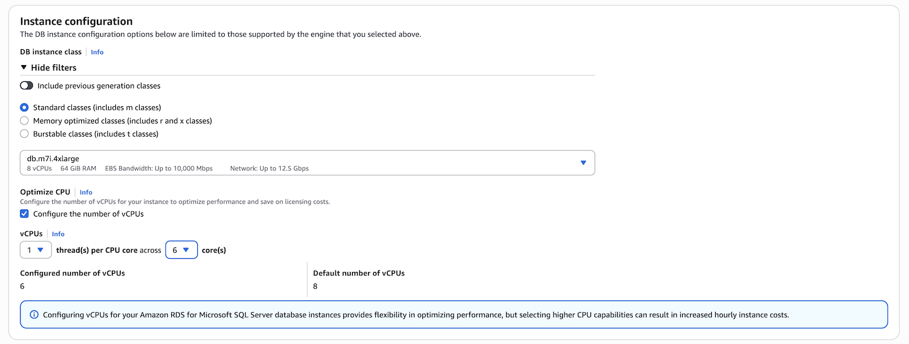

# Setting the CPU cores and threads per CPU core for a DB instance class

You can configure the number of CPU cores and threads per core
for the DB instance class when you perform the following operations:

- [Creating an Amazon RDS DB instance](USER_CreateDBInstance.md "USER_CreateDBInstance.md")
- [Modifying an Amazon RDS DB instance](Overview.DBInstance.md "Overview.DBInstance.md")
- [Restoring to a DB instance](USER_RestoreFromSnapshot.md "USER_RestoreFromSnapshot.md")
- [Restoring a DB instance to a specified time for Amazon RDS](USER_PIT.md "USER_PIT.md")

###### Note

When you modify a DB instance to configure the number of CPU cores
or threads per core, there is a brief outage similar to when you modify
the instance class.

Set the CPU cores by using the AWS Management Console, AWS CLI or the RDS API.

###### To set the cores

1.  Sign in to the AWS Management Console and open the Amazon RDS console at
    [https://console.aws.amazon.com/rds/](https://console.aws.amazon.com/rds/ "https://console.aws.amazon.com/rds/").
2.  Choose **Create database**.
3.  When setting the **Instance configuration** options:

        1. Choose the **Optimize CPU** option.
        2. Set your **vCPU** option by choosing the number of cores.

    

4.  After completing other selections, select **Create database**.

###### To set the cores

1. To configure Optimize CPU using the AWS CLI,
   include the `--processor-features` option in the command.
   Specify the number of CPU cores with the `coreCount` and `threadsPerCore` as `1`.
2. Use the following syntax:

```
aws rds create-db-instance \
    --engine sqlserver-ee \
    --engine-version 16.00 \
    --license-model license-included \
    --allocated-storage 300 \
    --master-username `myuser` \
    --master-user-password `xxxxx` \
    --no-multi-az \
    --vpc-security-group-ids myvpcsecuritygroup \
    --db-subnet-group-name mydbsubnetgroup \
    --db-instance-identifier my-rds-instance \
    --db-instance-class db.m7i.4xlarge \
    --processor-features "Name=coreCount,Value=6" "Name=threadsPerCore,Value=1"
```

###### Example of viewing valid processor values for a DB instance class

Use the `describe-orderable-db-instance-options` command to show the default vCPUs, cores, and threads per core.
For example, the output for the following command shows the processor options for the db.r7i.2xlarge instance class.

```
aws rds describe-orderable-db-instance-options --engine sqlserver-ee \
--db-instance-class db.r7i.2xlarge

Sample output:
-------------------------------------------------------------
|            DescribeOrderableDBInstanceOptions             |
+-----------------------------------------------------------+
||               OrderableDBInstanceOptions                ||
|+------------------------------------+--------------------+|
||  DBInstanceClass                   |  db.r7i.2xlarge    ||
||  Engine                            |  sqlserver-ee      ||
||  EngineVersion                     |  13.00.6300.2.v1   ||
||  LicenseModel                      |  license-included  ||
||  MaxIopsPerDbInstance              |                    ||
||  MaxIopsPerGib                     |                    ||
||  MaxStorageSize                    |  64000             ||
||  MinIopsPerDbInstance              |                    ||
||  MinIopsPerGib                     |                    ||
||  MinStorageSize                    |  20                ||
||  MultiAZCapable                    |  True              ||
||  OutpostCapable                    |  False             ||
||  ReadReplicaCapable                |  True              ||
||  StorageType                       |  gp2               ||
||  SupportsClusters                  |  False             ||
||  SupportsDedicatedLogVolume        |  False             ||
||  SupportsEnhancedMonitoring        |  True              ||
||  SupportsGlobalDatabases           |  False             ||
||  SupportsIAMDatabaseAuthentication |  False             ||
||  SupportsIops                      |  False             ||
||  SupportsKerberosAuthentication    |  True              ||
||  SupportsPerformanceInsights       |  True              ||
||  SupportsStorageAutoscaling        |  True              ||
||  SupportsStorageEncryption         |  True              ||
||  SupportsStorageThroughput         |  False             ||
||  Vpc                               |  True              ||
|+------------------------------------+--------------------+|
|||                   AvailabilityZones                   |||
||+-------------------------------------------------------+||
|||                         Name                          |||
||+-------------------------------------------------------+||
|||  us-west-2a                                           |||
|||  us-west-2b                                           |||
|||  us-west-2c                                           |||
||+-------------------------------------------------------+||
|||              AvailableProcessorFeatures               |||
||+-----------------+-----------------+-------------------+||
|||  AllowedValues  |  DefaultValue   |       Name        |||
||+-----------------+-----------------+-------------------+||
|||  1,2,3,4        |  4              |  coreCount        |||
|||  1              |  1              |  threadsPerCore   |||
||+-----------------+-----------------+-------------------+||
```

In addition, you can run the following commands for DB instance class processor information:

- `describe-db-instances` – Shows the processor information for the specified DB instance
- `describe-db-snapshots` – Shows the processor information for the specified DB snapshot
- `describe-valid-db-instance-modifications` – Shows the valid modifications to the processor
  for the specified DB instance
  In the output of the preceding command, the values for the processor features are `null` if Optimize CPU is not configured.

###### Example of setting the number of CPU cores for a DB instance

The following example modifies `mydbinstance` by setting the
number of CPU cores to 4 threadsPerCore as 1. Apply the changes immediately by using `--apply-immediately`.
If you want to apply the changes during the next scheduled maintenance window, omit `--apply-immediately option`.

```
aws rds modify-db-instance \
    --db-instance-identifier `mydbinstance` \
    --db-instance-class db.r7i.8xlarge \
    --processor-features "Name=coreCount,Value=`4`" "Name=threadsPerCore,Value=`1`" \
    --apply-immediately

```

###### Example of returning to default processor settings for a DB instance

The following example modifies `mydbinstance` by returning it to the default processor values for it.

```
aws rds modify-db-instance \
    --db-instance-identifier `mydbinstance` \
    --db-instance-class db.r7i.8xlarge \
    --use-default-processor-features \
    --apply-immediately

```
