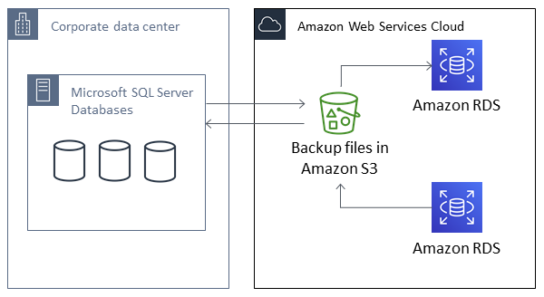

# Importing and exporting SQL Server databases using native

backup and restore

Amazon RDS supports native backup and restore for Microsoft SQL Server databases using full backup files (.bak files). When you use RDS,
you access files stored in Amazon S3 rather than using the local file system on the database server.

For example, you can create a full backup from your local server, store it on S3, and then restore it onto an existing Amazon RDS DB
instance. You can also make backups from RDS, store them on S3, and then restore them wherever you want.

Native backup and restore is available in all AWS Regions for Single-AZ and Multi-AZ DB instances,
including Multi-AZ DB instances with read replicas. Native backup and restore is available for all editions of
Microsoft SQL Server supported on Amazon RDS.

The following diagram shows the supported scenarios.

Using native .bak files to back up and restore databases is usually the fastest way to back up and restore databases. There are many
additional advantages to using native backup and restore. For example, you can do the following:

- Migrate databases to or from Amazon RDS.
- Move databases between RDS for SQL Server DB instances.
- Migrate data, schemas, stored procedures, triggers, and other database code inside .bak
  files.
- Backup and restore single databases, instead of entire DB instances.
- Create copies of databases for development, testing, training, and demonstrations.
- Store and transfer backup files with Amazon S3, for an added layer of protection for disaster recovery.
- Create native backups of databases that have Transparent Data Encryption (TDE) turned
  on, and restore those backups to on-premises databases. For more information, see
  [Support for Transparent Data Encryption in SQL Server](Appendix.SQLServer.Options.md "Appendix.SQLServer.Options.md").
- Restore native backups of on-premises databases that have TDE turned on to RDS for SQL Server DB
  instances. For more information, see [Support for Transparent Data Encryption in SQL Server](Appendix.SQLServer.Options.md "Appendix.SQLServer.Options.md").

###### Contents

- [Limitations and recommendations](SQLServer.Procedural.md#SQLServer.Procedural.Importing.Native.Limitations "SQLServer.Procedural.md#SQLServer.Procedural.Importing.Native.Limitations")
- [Setting up for native backup and restore](SQLServer.Procedural.Importing.Native.md "SQLServer.Procedural.Importing.Native.md")
  - [Manually creating an IAM role for native backup and restore](SQLServer.Procedural.Importing.Native.md#SQLServer.Procedural.Importing.Native.Enabling.IAM "SQLServer.Procedural.Importing.Native.md#SQLServer.Procedural.Importing.Native.Enabling.IAM")

- [Using native backup and restore](SQLServer.Procedural.Importing.Native.md "SQLServer.Procedural.Importing.Native.md")
  - [Backing up a
    database](SQLServer.Procedural.Importing.Native.md#SQLServer.Procedural.Importing.Native.Using.Backup "SQLServer.Procedural.Importing.Native.md#SQLServer.Procedural.Importing.Native.Using.Backup")
    - [Usage](SQLServer.Procedural.Importing.Native.md#SQLServer.Procedural.Importing.Native.Backup.Syntax "SQLServer.Procedural.Importing.Native.md#SQLServer.Procedural.Importing.Native.Backup.Syntax")
    - [Examples](SQLServer.Procedural.Importing.Native.md#SQLServer.Procedural.Importing.Native.Backup.Examples "SQLServer.Procedural.Importing.Native.md#SQLServer.Procedural.Importing.Native.Backup.Examples")

  - [Restoring a database](SQLServer.Procedural.Importing.Native.md#SQLServer.Procedural.Importing.Native.Using.Restore "SQLServer.Procedural.Importing.Native.md#SQLServer.Procedural.Importing.Native.Using.Restore")
    - [Usage](SQLServer.Procedural.Importing.Native.md#SQLServer.Procedural.Importing.Native.Restore.Syntax "SQLServer.Procedural.Importing.Native.md#SQLServer.Procedural.Importing.Native.Restore.Syntax")
    - [Examples](SQLServer.Procedural.Importing.Native.md#SQLServer.Procedural.Importing.Native.Restore.Examples "SQLServer.Procedural.Importing.Native.md#SQLServer.Procedural.Importing.Native.Restore.Examples")

  - [Restoring a log](SQLServer.Procedural.Importing.Native.md#SQLServer.Procedural.Importing.Native.Restore.Log "SQLServer.Procedural.Importing.Native.md#SQLServer.Procedural.Importing.Native.Restore.Log")
    - [Usage](SQLServer.Procedural.Importing.Native.md#SQLServer.Procedural.Importing.Native.Restore.Log.Syntax "SQLServer.Procedural.Importing.Native.md#SQLServer.Procedural.Importing.Native.Restore.Log.Syntax")
    - [Examples](SQLServer.Procedural.Importing.Native.md#SQLServer.Procedural.Importing.Native.Restore.Log.Examples "SQLServer.Procedural.Importing.Native.md#SQLServer.Procedural.Importing.Native.Restore.Log.Examples")

  - [Finishing a database restore](SQLServer.Procedural.Importing.Native.md#SQLServer.Procedural.Importing.Native.Finish.Restore "SQLServer.Procedural.Importing.Native.md#SQLServer.Procedural.Importing.Native.Finish.Restore")
    - [Usage](SQLServer.Procedural.Importing.Native.md#SQLServer.Procedural.Importing.Native.Finish.Restore.Syntax "SQLServer.Procedural.Importing.Native.md#SQLServer.Procedural.Importing.Native.Finish.Restore.Syntax")

  - [Working with partially restored databases](SQLServer.Procedural.Importing.Native.md#SQLServer.Procedural.Importing.Native.Partially.Restored "SQLServer.Procedural.Importing.Native.md#SQLServer.Procedural.Importing.Native.Partially.Restored")
    - [Dropping a
      partially restored database](SQLServer.Procedural.Importing.Native.md#SQLServer.Procedural.Importing.Native.Drop.Partially.Restored "SQLServer.Procedural.Importing.Native.md#SQLServer.Procedural.Importing.Native.Drop.Partially.Restored")
    - [Snapshot restore and
      point-in-time recovery behavior for partially restored databases](SQLServer.Procedural.Importing.Native.md#SQLServer.Procedural.Importing.Native.Snapshot.Restore "SQLServer.Procedural.Importing.Native.md#SQLServer.Procedural.Importing.Native.Snapshot.Restore")

  - [Canceling a task](SQLServer.Procedural.Importing.Native.md#SQLServer.Procedural.Importing.Native.Using.Cancel "SQLServer.Procedural.Importing.Native.md#SQLServer.Procedural.Importing.Native.Using.Cancel")
    - [Usage](SQLServer.Procedural.Importing.Native.md#SQLServer.Procedural.Importing.Native.Cancel.Syntax "SQLServer.Procedural.Importing.Native.md#SQLServer.Procedural.Importing.Native.Cancel.Syntax")

  - [Tracking the status of tasks](SQLServer.Procedural.Importing.Native.md#SQLServer.Procedural.Importing.Native.Tracking "SQLServer.Procedural.Importing.Native.md#SQLServer.Procedural.Importing.Native.Tracking")
    - [Usage](SQLServer.Procedural.Importing.Native.md#SQLServer.Procedural.Importing.Native.Tracking.Syntax "SQLServer.Procedural.Importing.Native.md#SQLServer.Procedural.Importing.Native.Tracking.Syntax")
    - [Examples](SQLServer.Procedural.Importing.Native.md#SQLServer.Procedural.Importing.Native.Tracking.Examples "SQLServer.Procedural.Importing.Native.md#SQLServer.Procedural.Importing.Native.Tracking.Examples")
    - [Response](SQLServer.Procedural.Importing.Native.md#SQLServer.Procedural.Importing.Native.Tracking.Response "SQLServer.Procedural.Importing.Native.md#SQLServer.Procedural.Importing.Native.Tracking.Response")

- [Compressing backup
  files](SQLServer.Procedural.Importing.Native.md "SQLServer.Procedural.Importing.Native.md")
- [Troubleshooting](SQLServer.Procedural.Importing.Native.md "SQLServer.Procedural.Importing.Native.md")
- [Importing and exporting SQL Server data using other methods](SQLServer.Procedural.Importing.md "SQLServer.Procedural.Importing.md")
  - [Importing data into RDS for SQL Server by using a snapshot](SQLServer.Procedural.Importing.md#SQLServer.Procedural.Importing.Procedure "SQLServer.Procedural.Importing.md#SQLServer.Procedural.Importing.Procedure")
    - [Import the data](SQLServer.Procedural.Importing.md#ImportData.SQLServer.Import "SQLServer.Procedural.Importing.md#ImportData.SQLServer.Import")
      - [Generate and Publish Scripts Wizard](SQLServer.Procedural.Importing.md#ImportData.SQLServer.MgmtStudio.ScriptWizard "SQLServer.Procedural.Importing.md#ImportData.SQLServer.MgmtStudio.ScriptWizard")
      - [Import and Export Wizard](SQLServer.Procedural.Importing.md#ImportData.SQLServer.MgmtStudio.ImportExportWizard "SQLServer.Procedural.Importing.md#ImportData.SQLServer.MgmtStudio.ImportExportWizard")
      - [Bulk copy](SQLServer.Procedural.Importing.md#ImportData.SQLServer.MgmtStudio.BulkCopy "SQLServer.Procedural.Importing.md#ImportData.SQLServer.MgmtStudio.BulkCopy")

  - [Exporting data from RDS for SQL Server](SQLServer.Procedural.Importing.md#SQLServer.Procedural.Exporting "SQLServer.Procedural.Importing.md#SQLServer.Procedural.Exporting")
    - [SQL Server Import and Export Wizard](SQLServer.Procedural.Importing.md#SQLServer.Procedural.Exporting.SSIEW "SQLServer.Procedural.Importing.md#SQLServer.Procedural.Exporting.SSIEW")
    - [SQL Server Generate and Publish Scripts Wizard and bcp utility](SQLServer.Procedural.Importing.md#SQLServer.Procedural.Exporting.SSGPSW "SQLServer.Procedural.Importing.md#SQLServer.Procedural.Exporting.SSGPSW")

- [Using BCP utility from Linux to import and export data](SQLServer.Procedural.Importing.BCP.md "SQLServer.Procedural.Importing.BCP.md")
  - [Prerequisites](SQLServer.Procedural.Importing.BCP.md#SQLServer.Procedural.Importing.BCP.Linux.Prerequisites "SQLServer.Procedural.Importing.BCP.md#SQLServer.Procedural.Importing.BCP.Linux.Prerequisites")
  - [Installing SQL Server command-line tools on Linux](SQLServer.Procedural.Importing.BCP.md#SQLServer.Procedural.Importing.BCP.Linux.Installing "SQLServer.Procedural.Importing.BCP.md#SQLServer.Procedural.Importing.BCP.Linux.Installing")
  - [Exporting data from RDS for SQL Server](SQLServer.Procedural.Importing.BCP.md#SQLServer.Procedural.Importing.BCP.Linux.Exporting "SQLServer.Procedural.Importing.BCP.md#SQLServer.Procedural.Importing.BCP.Linux.Exporting")
    - [Basic export syntax](SQLServer.Procedural.Importing.BCP.md#SQLServer.Procedural.Importing.BCP.Linux.Exporting.Basic "SQLServer.Procedural.Importing.BCP.md#SQLServer.Procedural.Importing.BCP.Linux.Exporting.Basic")
    - [Export example](SQLServer.Procedural.Importing.BCP.md#SQLServer.Procedural.Importing.BCP.Linux.Exporting.Example "SQLServer.Procedural.Importing.BCP.md#SQLServer.Procedural.Importing.BCP.Linux.Exporting.Example")

  - [Importing data to RDS for SQL Server](SQLServer.Procedural.Importing.BCP.md#SQLServer.Procedural.Importing.BCP.Linux.Importing "SQLServer.Procedural.Importing.BCP.md#SQLServer.Procedural.Importing.BCP.Linux.Importing")
    - [Basic import syntax](SQLServer.Procedural.Importing.BCP.md#SQLServer.Procedural.Importing.BCP.Linux.Importing.Basic "SQLServer.Procedural.Importing.BCP.md#SQLServer.Procedural.Importing.BCP.Linux.Importing.Basic")
    - [Import example](SQLServer.Procedural.Importing.BCP.md#SQLServer.Procedural.Importing.BCP.Linux.Importing.Example "SQLServer.Procedural.Importing.BCP.md#SQLServer.Procedural.Importing.BCP.Linux.Importing.Example")

  - [Common BCP options](SQLServer.Procedural.Importing.BCP.md#SQLServer.Procedural.Importing.BCP.Linux.Options "SQLServer.Procedural.Importing.BCP.md#SQLServer.Procedural.Importing.BCP.Linux.Options")
  - [Best practices and considerations](SQLServer.Procedural.Importing.BCP.md#SQLServer.Procedural.Importing.BCP.Linux.BestPractices "SQLServer.Procedural.Importing.BCP.md#SQLServer.Procedural.Importing.BCP.Linux.BestPractices")
  - [Troubleshooting common issues](SQLServer.Procedural.Importing.BCP.md#SQLServer.Procedural.Importing.BCP.Linux.Troubleshooting "SQLServer.Procedural.Importing.BCP.md#SQLServer.Procedural.Importing.BCP.Linux.Troubleshooting")

## Limitations and recommendations

The following are some limitations to using native backup and restore:

- You can't back up to, or restore from, an Amazon S3 bucket in a different AWS Region from your
  Amazon RDS DB instance.
- You can't restore a database with the same name as an existing database. Database names are unique.
- We strongly recommend that you don't restore backups from one time zone to a different
  time zone. If you restore backups from one time zone to a different time zone, you
  must audit your queries and applications for the effects of the time zone change.
- RDS for Microsoft SQL Server has a size limit of 5 TB per file. For native backups of larger
  databases, you can use multifile backup.
- The maximum database size that can be backed up to S3 depends on the available memory,
  CPU, I/O, and network resources on the DB instance. The larger the database, the
  more memory the backup agent consumes.
- You can't back up to or restore from more than 10 backup files at the same time.
- A differential backup is based on the last full backup. For differential backups to work,
  you can't take a snapshot between the last full backup and the differential
  backup. If you want a differential backup, but a manual or automated snapshot
  exists, then do another full backup before proceeding with the differential
  backup.
- Differential and log restores aren't supported for databases with files that have their file_guid (unique identifier) set to
  `NULL`.
- You can run up to two backup or restore tasks at the same time.
- You can't perform native log backups from SQL Server on Amazon RDS.
- RDS supports native restores of databases up to 64 TiB. Native restores of databases on SQL
  Server Express Edition are limited to 10 GB.
- You can't do a native backup during the maintenance window, or any time Amazon RDS is in the
  process of taking a snapshot of the database. If a native backup task overlaps
  with the RDS daily backup window, the native backup task is canceled.
- On Multi-AZ DB instances, you can only natively restore databases that are backed up in
  the full recovery model.
- Calling the RDS procedures for native backup and restore within a transaction isn't supported.
- Use a symmetric encryption AWS KMS key to encrypt your backups. Amazon RDS doesn't support asymmetric KMS keys. For more
  information, see [Creating symmetric encryption KMS keys](../../../kms/latest/developerguide/create-keys.md#create-symmetric-cmk "../../../kms/latest/developerguide/create-keys.md#create-symmetric-cmk") in the _AWS Key Management Service Developer Guide_.
- Native backup files are encrypted with the specified KMS key using the
  "Encryption-Only" crypto mode. When you are restoring encrypted backup files, be
  aware that they were encrypted with the "Encryption-Only" crypto mode.
- You can't restore a database that contains a FILESTREAM file group.
- Amazon S3 server-side encryption with AWS KMS (SSE-KMS) is supported through your S3 bucket's
  default encryption configuration when you pass
  `@enable_bucket_default_encryption=1` to the backup stored
  procedure. By default, the restore supports the S3 object's server-side
  encryption.

When you provide a KMS key to a stored procedure, any native backup and restores are
encrypted and decrypted on the client-side with the KMS key. AWS stores the
backups in the S3 bucket with SSE-S3 when
`@enable_bucket_default_encryption=0` or with your S3 bucket's
configured default encryption key when
`@enable_bucket_default_encryption=1`.

- When using S3 Access Points, the access point cannot be configured to use an RDS internal
  VPC.

If your database can be offline while the backup file is created, copied, and restored, we
recommend that you use native backup and restore to migrate it to RDS. If your
on-premises database can't be offline, we recommend that you use the AWS Database Migration Service to
migrate your database to Amazon RDS. For more information, see [What is AWS Database Migration Service?](../../../dms/latest/userguide/Welcome.md "../../../dms/latest/userguide/Welcome.md")

Native backup and restore isn't intended to replace the data recovery capabilities of
the cross-region snapshot copy feature. We recommend that you use snapshot copy to copy
your database snapshot to another AWS Region for cross-region disaster recovery in
Amazon RDS. For more information, see [Copying a DB snapshot for Amazon RDS](USER_CopySnapshot.md "USER_CopySnapshot.md").
