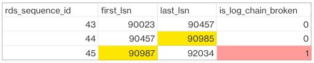

# Copying transaction log backups

To copy a set of available transaction log backups for an individual database to your Amazon S3 bucket, call the `rds_tlog_backup_copy_to_S3`
stored procedure. The `rds_tlog_backup_copy_to_S3` stored procedure will initiate a new task to copy transaction log backups.

###### Note

The `rds_tlog_backup_copy_to_S3` stored procedure will copy the transaction log backups without
validating against `is_log_chain_broken` attribute. For this reason, you should manually confirm an unbroken
log chain before running the `rds_tlog_backup_copy_to_S3` stored procedure. For further explanation, see
[Validating the transaction log backup log chain](#USER.SQLServer.AddlFeat.TransactionLogAccess.Copying.LogChain "#USER.SQLServer.AddlFeat.TransactionLogAccess.Copying.LogChain").

###### Example usage of the `rds_tlog_backup_copy_to_S3` stored procedure

```
exec msdb.dbo.rds_tlog_backup_copy_to_S3
	@db_name='`mydatabasename`',
	[@kms_key_arn='arn:aws:kms:`region`:`account-id`:key/`key-id`'],
	[@backup_file_start_time=`'2022-09-01 01:00:15'`],
	[@backup_file_end_time=`'2022-09-01 21:30:45'`],
	[@starting_lsn=149000000112100001],
	[@ending_lsn=149000000120400001],
	[@rds_backup_starting_seq_id=5],
	[@rds_backup_ending_seq_id=10];

```

The following input parameters are available:

| Parameter                                                                                                                                                    | Description                                                                                                                                                                                                                                                                                                                                                                                    |
| ------------------------------------------------------------------------------------------------------------------------------------------------------------ | ---------------------------------------------------------------------------------------------------------------------------------------------------------------------------------------------------------------------------------------------------------------------------------------------------------------------------------------------------------------------------------------------- | ------------------------------------------------------------------------------------------------------------------------------------------------------------------------------------------------------------------------------------------------------------------------------------------------------------------------------------------------------------------------------------------------------------------------------------------------------------------------------------------------------------------------------------------------------------------------------------------------------------------------------------------------------------------------------------------------------------------------------------------------------------------------------------------------------------------------------------------------------------------------------------------------------------------------------------------------------------------------------------------------------------------------------------------------------------------------------------------------------------------------------------------------------------------------------------------------------------------------------------------------------------------------------------------------------------------------------------------------------------------------------------------------------------------------------------------------------------------------------------------------------------------------------------------------------------------------------------------------------------------------------------------------------------------------------------------------------------------------------------------------------------------------------------------------------------------------------------------------------------------------------------- |
| `@db_name`                                                                                                                                                   | The name of the database to copy transaction log backups for                                                                                                                                                                                                                                                                                                                                   |
| `@kms_key_arn`                                                                                                                                               | A customer managed KMS key. If you encrypt your DB instance with an AWS managed KMS key, you must create a customer managed key. If you encrypt your DB instance with a customer managed key, you can use the same KMS key ARN.                                                                                                                                                                |
| `@backup_file_start_time`                                                                                                                                    | The UTC timestamp as provided from the `[backup_file_time_utc]` column of the `rds_fn_list_tlog_backup_metadata` function.                                                                                                                                                                                                                                                                     |
| `@backup_file_end_time`                                                                                                                                      | The UTC timestamp as provided from the `[backup_file_time_utc]` column of the `rds_fn_list_tlog_backup_metadata` function.                                                                                                                                                                                                                                                                     |
| `@starting_lsn`                                                                                                                                              | The log sequence number (LSN) as provided from the `[starting_lsn]` column of the `rds_fn_list_tlog_backup_metadata` function                                                                                                                                                                                                                                                                  |
| `@ending_lsn`                                                                                                                                                | The log sequence number (LSN) as provided from the `[ending_lsn]` column of the `rds_fn_list_tlog_backup_metadata` function.                                                                                                                                                                                                                                                                   |
| `@rds_backup_starting_seq_id`                                                                                                                                | The sequence ID as provided from the `[rds_backup_seq_id]` column of the `rds_fn_list_tlog_backup_metadata` function.                                                                                                                                                                                                                                                                          |
| `@rds_backup_ending_seq_id`                                                                                                                                  | The sequence ID as provided from the `[rds_backup_seq_id]` column of the `rds_fn_list_tlog_backup_metadata` function.                                                                                                                                                                                                                                                                          | You can specify a set of either the time, LSN, or sequence ID parameters. Only one set of parameters are required. You can also specify just a single parameter in any of the sets. For example, by providing a value for only the `backup_file_end_time` parameter, all available transaction log backup files prior to that time within the seven-day limit will be copied to your Amazon S3 bucket. Following are the valid input parameter combinations for the `rds_tlog_backup_copy_to_S3` stored procedure.                                                                                                                                                                                                                                                                                                                                                                                                                                                                                                                                                                                                                                                                                                                                                                                                                                                                                                                                                                                                                                                                                                                                                                                                                                                                                                                                                                    |
| Parameters provided                                                                                                                                          | Expected result                                                                                                                                                                                                                                                                                                                                                                                |
| ---                                                                                                                                                          | ---                                                                                                                                                                                                                                                                                                                                                                                            |
| `exec msdb.dbo.rds_tlog_backup_copy_to_S3 @db_name = 'testdb1', @backup_file_start_time='2022-08-23 00:00:00', @backup_file_end_time='2022-08-30 00:00:00';` | Copies transaction log backups from the last seven days and exist between the provided range of `backup_file_start_time` and `backup_file_end_time`. In this example, the stored procedure will copy transaction log backups that were generated between '2022-08-23 00:00:00' and '2022-08-30 00:00:00'.                                                                                      |
| `exec msdb.dbo.rds_tlog_backup_copy_to_S3 @db_name = 'testdb1', @backup_file_start_time='2022-08-23 00:00:00';`                                              | Copies transaction log backups from the last seven days and starting from the provided `backup_file_start_time`. In this example, the stored procedure will copy transaction log backups from '2022-08-23 00:00:00' up to the latest transaction log backup.                                                                                                                                   |
| `exec msdb.dbo.rds_tlog_backup_copy_to_S3 @db_name = 'testdb1', @backup_file_end_time='2022-08-30 00:00:00';`                                                | Copies transaction log backups from the last seven days up to the provided `backup_file_end_time`. In this example, the stored procedure will copy transaction log backups from '2022-08-23 00:00:00 up to '2022-08-30 00:00:00'.                                                                                                                                                              |
| `exec msdb.dbo.rds_tlog_backup_copy_to_S3 @db_name='testdb1', @starting_lsn =1490000000040007, @ending_lsn =  1490000000050009;`                             | Copies transaction log backups that are available from the last seven days and are between the provided range of the `starting_lsn` and `ending_lsn`. In this example, the stored procedure will copy transaction log backups from the last seven days with an LSN range between 1490000000040007 and 1490000000050009.                                                                        |
| `exec msdb.dbo.rds_tlog_backup_copy_to_S3 @db_name='testdb1', @starting_lsn =1490000000040007;`                                                              | Copies transaction log backups that are available from the last seven days, beginning from the provided `starting_lsn`. In this example, the stored procedure will copy transaction log backups from LSN 1490000000040007 up to the latest transaction log backup.                                                                                                                             |
| `exec msdb.dbo.rds_tlog_backup_copy_to_S3 @db_name='testdb1', @ending_lsn  =1490000000050009;`                                                               | Copies transaction log backups that are available from the last seven days, up to the provided `ending_lsn`. In this example, the stored procedure will copy transaction log backups beginning from the last seven days up to lsn 1490000000050009.                                                                                                                                            |
| `exec msdb.dbo.rds_tlog_backup_copy_to_S3 @db_name='testdb1', @rds_backup_starting_seq_id= 2000, @rds_backup_ending_seq_id= 5000;`                           | Copies transaction log backups that are available from the last seven days, and exist between the provided range of `rds_backup_starting_seq_id` and `rds_backup_ending_seq_id`. In this example, the stored procedure will copy transaction log backups beginning from the last seven days and within the provided rds backup sequence id range, starting from seq_id 2000 up to seq_id 5000. |
| `exec msdb.dbo.rds_tlog_backup_copy_to_S3 @db_name='testdb1', @rds_backup_starting_seq_id= 2000;`                                                            | Copies transaction log backups that are available from the last seven days, beginning from the provided `rds_backup_starting_seq_id`. In this example, the stored procedure will copy transaction log backups beginning from seq_id 2000, up to the latest transaction log backup.                                                                                                             |
| `exec msdb.dbo.rds_tlog_backup_copy_to_S3 @db_name='testdb1', @rds_backup_ending_seq_id= 5000;`                                                              | Copies transaction log backups that are available from the last seven days, up to the provided `rds_backup_ending_seq_id`. In this example, the stored procedure will copy transaction log backups beginning from the last seven days, up to seq_id 5000.                                                                                                                                      |
| `exec msdb.dbo.rds_tlog_backup_copy_to_S3 @db_name='testdb1', @rds_backup_starting_seq_id= 2000; @rds_backup_ending_seq_id= 2000;`                           | Copies a single transaction log backup with the provided `rds_backup_starting_seq_id`, if available within the last seven days. In this example, the stored procedure will copy a single transaction log backup that has a seq_id of 2000, if it exists within the last seven days.                                                                                                            | ## Validating the transaction log backup log chain Databases configured for access to transaction log backups must have automated backup retention enabled. Automated backup retention sets the databases on the DB instance to the `FULL` recovery model. To support point in time restore for a database, avoid changing the database recovery model, which can result in a broken log chain. We recommend keeping the database set to the `FULL` recovery model. To manually validate the log chain before copying transaction log backups, call the `rds_fn_list_tlog_backup_metadata` function and review the values in the `is_log_chain_broken` column. A value of "1" indicates the log chain was broken between the current log backup and the previous log backup. The following example shows a broken log chain in the output from the `rds_fn_list_tlog_backup_metadata` stored procedure.  In a normal log chain, the log sequence number (LSN) value for first_lsn for given rds_sequence_id should match the value of last_lsn in the preceding rds_sequence_id. In the image, the rds_sequence_id of 45 has a first_lsn value 90987, which does not match the last_lsn value of 90985 for preceeding rds_sequence_id 44. For more information about SQL Server transaction log architecture and log sequence numbers, see [Transaction Log Logical Architecture](https://learn.microsoft.com/en-us/sql/relational-databases/sql-server-transaction-log-architecture-and-management-guide?view=sql-server-ver15#Logical_Arch "https://learn.microsoft.com/en-us/sql/relational-databases/sql-server-transaction-log-architecture-and-management-guide?view=sql-server-ver15#Logical_Arch") in the Microsoft SQL Server documentation. |
