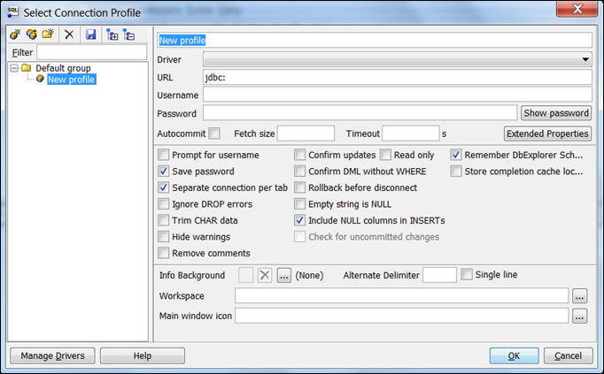
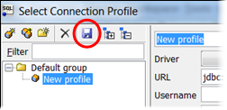
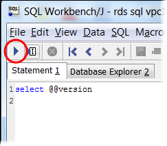

# Connecting to your DB instance with SQL Workbench/J

This example shows how to connect to a DB instance running the Microsoft SQL Server
database engine by using the SQL Workbench/J database tool.
To download SQL Workbench/J, see
[SQL Workbench/J](http://www.sql-workbench.net/ "http://www.sql-workbench.net/").

SQL Workbench/J uses JDBC to connect to your DB instance.
You also need the JDBC driver for SQL Server.
To download this driver, see
[Download Microsoft JDBC Driver for SQL Server](https://learn.microsoft.com/en-us/sql/connect/jdbc/download-microsoft-jdbc-driver-for-sql-server?view=sql-server-ver16 "https://learn.microsoft.com/en-us/sql/connect/jdbc/download-microsoft-jdbc-driver-for-sql-server?view=sql-server-ver16").

###### To connect to a DB instance using SQL Workbench/J

1. Open SQL Workbench/J. The **Select Connection Profile**
   dialog box appears, as shown following.

 2. In the first box at the top of the dialog box, enter a name for the profile. 3. For **Driver**, choose `SQL JDBC 4.0`. 4. For **URL**, enter `jdbc:sqlserver://`,
then enter the endpoint of your DB instance. For example, the URL value might be
the following.

```
jdbc:sqlserver://sqlsvr-pdz.abcd12340.us-west-2.rds.amazonaws.com:1433
```

5. For **Username**, enter the master user name for the DB
   instance.
6. For **Password**, enter the password for the master user.
7. Choose the save icon in the dialog toolbar, as shown following.

 8. Choose **OK**.
After a few moments, SQL Workbench/J connects to your DB instance.
If you can't connect to your DB instance,
see
[Security group considerations](USER_ConnectToMicrosoftSQLServerInstance.md "USER_ConnectToMicrosoftSQLServerInstance.md")
and
[Troubleshooting connections to your SQL Server DB instance](USER_ConnectToMicrosoftSQLServerInstance.md "USER_ConnectToMicrosoftSQLServerInstance.md"). 9. In the query pane, enter the following SQL query.

```
select @@VERSION
```

10. Choose the `Execute` icon in the toolbar, as shown
    following.



The query returns the version information for your DB instance, similar to the
following.

```
Microsoft SQL Server 2017 (RTM-CU22) (KB4577467) - 14.0.3356.20 (X64)
```
