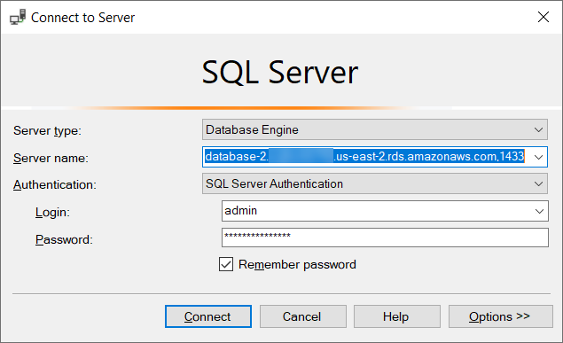
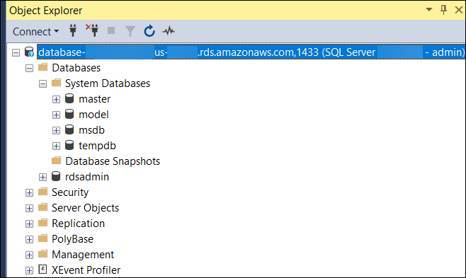
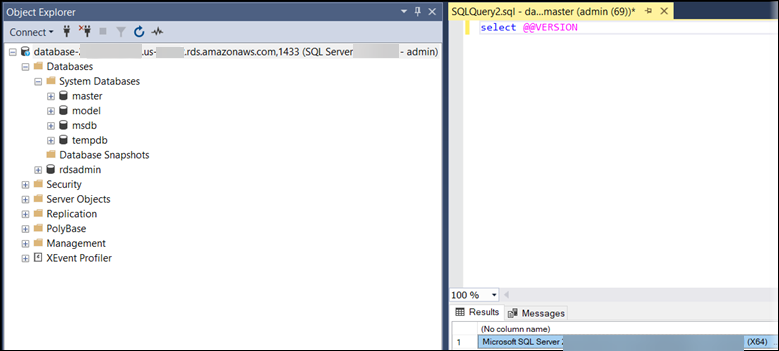

# Connecting to your DB instance with Microsoft SQL Server

Management Studio

In this procedure, you connect to your sample DB instance by using Microsoft SQL Server Management Studio (SSMS). To download
a standalone version of this utility, see [Download SQL Server Management
Studio (SSMS)](https://docs.microsoft.com/en-us/sql/ssms/download-sql-server-management-studio-ssms "https://docs.microsoft.com/en-us/sql/ssms/download-sql-server-management-studio-ssms") in the Microsoft documentation.

###### To connect to a DB instance using SSMS

1. Start SQL Server Management Studio.

The **Connect to Server** dialog box appears.

 2. Provide the information for your DB instance:

    1. For **Server type**,
     choose **Database Engine**.
    2. For **Server name**, enter the DNS name (endpoint) and port number of your DB instance,
     separated by a comma.


    ###### Important

    Change the colon between the endpoint and port number to a comma.


    Your server name should look like the following example.


    ```
    database-2.cg034itsfake.us-east-1.rds.amazonaws.com,1433
    ```
    3. For **Authentication**,
     choose **SQL Server Authentication**.
    4. For **Login**, enter the master user name for your DB
     instance.
    5. For **Password**, enter the password for your DB
     instance.

3. Choose **Connect**.

After a few moments, SSMS connects to your DB instance.

If you can't connect to your DB instance, see [Security group considerations](USER_ConnectToMicrosoftSQLServerInstance.md "USER_ConnectToMicrosoftSQLServerInstance.md") and [Troubleshooting connections to your SQL Server DB instance](USER_ConnectToMicrosoftSQLServerInstance.md "USER_ConnectToMicrosoftSQLServerInstance.md"). 4. Your SQL Server DB instance comes with SQL Server's standard built-in system databases (`master`,
`model`, `msdb`, and `tempdb`). To explore the system databases, do the following:

    1. In SSMS, on the **View** menu, choose **Object Explorer**.
    2. Expand your DB instance, expand **Databases**, and then expand **System Databases**.


    

5. Your SQL Server DB instance also comes with a database named
   `rdsadmin`. Amazon RDS uses this database to store the objects that it
   uses to manage your database. The `rdsadmin` database also includes
   stored procedures that you can run to perform advanced tasks. For more
   information, see [Common DBA tasks for Amazon RDS for Microsoft SQL Server](Appendix.SQLServer.md "Appendix.SQLServer.md").
6. You can now start creating your own databases and running queries against your
   DB instance and databases as usual. To run a test query against your DB
   instance, do the following:
   1. In SSMS, on the **File** menu point to
      **New** and then choose **Query with
      Current Connection**.
   2. Enter the following SQL query.

   ```
   select @@VERSION
   ```

   3. Run the query. SSMS returns the SQL Server version of your Amazon RDS DB
      instance.

   
