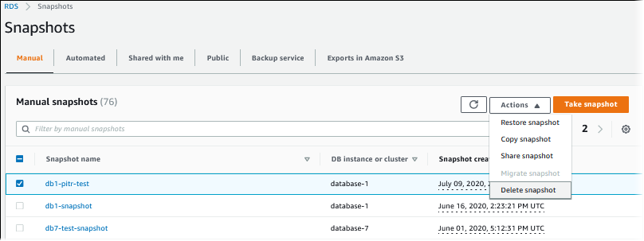
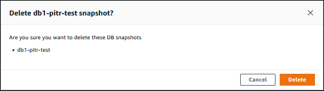

# Deleting a DB snapshot for Amazon RDS

You can delete DB snapshots managed by Amazon RDS when you no longer need them.

###### Note

To delete backups managed by AWS Backup, use the AWS Backup console. For information about
AWS Backup, see the [_AWS Backup Developer Guide_](../../../aws-backup/latest/devguide.md "../../../aws-backup/latest/devguide.md").

## Deleting a DB snapshot

You can delete a manual, shared, or public DB snapshot using the AWS Management Console, the AWS CLI, or the RDS API.

To delete a shared or public snapshot, you must sign in to the AWS account that owns the snapshot.

If you have automated DB snapshots that you want to delete without deleting the DB instance,
change the backup retention period for the DB instance to 0. The automated snapshots are deleted when
the change is applied. You can apply the change immediately if you don't want to wait until the
next maintenance period. After the change is complete, you can then re-enable automatic backups
by setting the backup retention period to a number greater than 0. For information about modifying a
DB instance, see [Modifying an Amazon RDS DB instance](Overview.DBInstance.md "Overview.DBInstance.md").

Retained automated backups and manual snapshots incur billing charges until they're deleted. For more information, see
[Retention costs](USER_WorkingWithAutomatedBackups.md#USER_WorkingWithAutomatedBackups.RetentionCosts "USER_WorkingWithAutomatedBackups.md#USER_WorkingWithAutomatedBackups.RetentionCosts").

If you deleted a DB instance, you can delete its automated DB snapshots by removing the automated
backups for the DB instance. For information about automated backups, see
[Introduction to backups](USER_WorkingWithAutomatedBackups.md "USER_WorkingWithAutomatedBackups.md").

###### To delete a DB snapshot

1. Sign in to the AWS Management Console and open the Amazon RDS console at
   [https://console.aws.amazon.com/rds/](https://console.aws.amazon.com/rds/ "https://console.aws.amazon.com/rds/").
2. In the navigation pane, choose **Snapshots**.

The **Manual snapshots** list appears. 3. Choose the DB snapshot that you want to delete. 4. For **Actions**, choose **Delete snapshot**.

 5. Choose **Delete** on the confirmation page.


You can delete a DB snapshot by using the AWS CLI command
[delete-db-snapshot](../../../cli/latest/reference/rds/delete-db-snapshot.md "../../../cli/latest/reference/rds/delete-db-snapshot.md").

The following options are used to delete a DB snapshot.

- `--db-snapshot-identifier` –
  The identifier for the DB snapshot.

###### Example

The following code deletes the `mydbsnapshot`
DB snapshot.

For Linux, macOS, or Unix:

```
aws rds delete-db-snapshot \
    --db-snapshot-identifier `mydbsnapshot`

```

For Windows:

```
aws rds delete-db-snapshot ^
    --db-snapshot-identifier `mydbsnapshot`

```

You can delete a DB snapshot by using the Amazon RDS API operation [DeleteDBSnapshot](../APIReference/API_DeleteDBSnapshot.md "../APIReference/API_DeleteDBSnapshot.md").

The following parameters are used to delete a DB snapshot.

- `DBSnapshotIdentifier` –
  The identifier for the DB snapshot.
