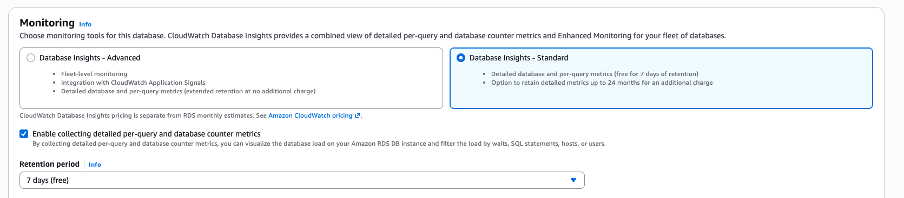

# Enabling and disabling detailed per-query and database counter metrics

Detailed per-query and database counter metrics are enabled by default when you select Database Insights Advanced mode.
If you select Database Insights Standard mode, you can enable them when you create your DB instance or Multi-AZ DB cluster, and turn them off later by modifying your DB instance from the console. Enabling detailed per-query and database counter metrics
doesn't cause downtime, a reboot, or a failover.

###### Note

Performance Schema is an optional performance tool used by Amazon RDS for MariaDB or MySQL. If you turn Performance Schema on or off, you need
to reboot. If you enable or disable detailed per-query and database counter metrics, however, you don't need to reboot. For more information,
see [Overview of the Performance Schema for Database Insights in Amazon RDS for MariaDB or MySQL](USER_PerfInsights.EnableMySQL.md "USER_PerfInsights.EnableMySQL.md").

The Database Insights agent consumes limited CPU and memory on the DB host. When
the DB load is high, the agent limits the performance impact by collecting data less
frequently.

Console
In the console, you can enable collecting detailed per-query and database counter metrics
for Database Insights Standard mode when you create or modify a DB instance or Multi-AZ DB cluster.

Enabling or disabling detailed per-query and database counter metrics when creating a DB instance or Multi-AZ DB cluster

After creating a new DB instance or Multi-AZ DB cluster,
Amazon RDS enables detailed per-query and database counter metrics by default. To turn it off, choose the option
**Database Insights – Standard** and deselect the option **Enable collecting detailed per-query and database counter metrics**.

For more information, see the following topics.

- To create a DB instance, follow the instructions for your DB engine in [Creating an Amazon RDS DB instance](USER_CreateDBInstance.md "USER_CreateDBInstance.md").
- To create a Multi-AZ DB cluster, follow the instructions for your DB engine in [Creating a Multi-AZ DB cluster for Amazon RDS](create-multi-az-db-cluster.md "create-multi-az-db-cluster.md").

The following screenshot shows the **Database Insights** section.



If you choose **Enable collecting detailed per-query and database counter metrics**, you have the following options:

- **Retention** – The amount of time to retain Database Insights data. The retention setting is **Default (7 days)**. To retain your performance
  data for longer, specify 1–24 months. For more information about retention periods, see
  [Pricing and data retention for Database Insights](USER_PerfInsights.Overview.cost.md "USER_PerfInsights.Overview.cost.md").
- **AWS KMS key** – Specify your AWS KMS key.
  Database Insights encrypts all potentially sensitive
  data using your KMS key. Data is encrypted in flight and at rest.
  For more information, see [Changing an KMS key policy for Database Insights](USER_PerfInsights.access-control.cmk-policy.md "USER_PerfInsights.access-control.cmk-policy.md").

Enabling or disabling detailed per-query and database counter metrics when modifying a DB instance or Multi-AZ DB cluster

In the console, you can modify
a DB instance or Multi-AZ DB cluster to manage detailed per-query and database counter metrics for Database Insights.

###### To manage detailed per-query and database counter metrics for a DB instance or Multi-AZ DB cluster using the console

1. Sign in to the AWS Management Console and open the Amazon RDS console at
   [https://console.aws.amazon.com/rds/](https://console.aws.amazon.com/rds/ "https://console.aws.amazon.com/rds/").
2. Choose **Databases**.
3. Choose a DB instance or Multi-AZ DB cluster,
   and choose **Modify**.
4. Select **Enable collecting detailed per-query and database counter metrics** to enable it. To turn it off, choose the option
   **Database Insights – Standard** and deselect the option **Enable collecting detailed per-query and database counter metrics**.

If you choose **Enable collecting detailed per-query and database counter metrics**, you have the following options:

    * **Retention** – The amount of time to retain Database Insights data. The retention setting is **Default (7 days)**. To retain your performance
     data for longer, specify 1–24 months. For more information about retention periods, see
     [Pricing and data retention for Database Insights](USER_PerfInsights.Overview.cost.md "USER_PerfInsights.Overview.cost.md").
    * **AWS KMS key** – Specify your
     KMS key. Database Insights encrypts all
     potentially sensitive data using your KMS key. Data is
     encrypted in flight and at rest. For more information, see
     [Encrypting Amazon RDS resources](Overview.Encryption.md "Overview.Encryption.md").

 5. Choose **Continue**. 6. For **Scheduling of Modifications**, choose Apply immediately. If you
choose Apply during the next scheduled maintenance window, your instance
ignores this setting and turns on collecting detailed per-query and database counter metrics
immediately. 7. Choose **Modify instance**.

AWS CLI
When you use the [create-db-instance](../../../cli/latest/reference/rds/create-db-instance.md "../../../cli/latest/reference/rds/create-db-instance.md") AWS CLI command, turn on detailed per-query and database counter metrics by
specifying `--enable-performance-insights` and set `--database-insights-mode` to either `advanced` or `standard`.
To turn them off, specify `--no-enable-performance-insights` and set `database-insights-mode` to `standard`.

You can also specify these values using the following AWS CLI commands:

- [create-db-cluster](../../../cli/latest/reference/rds/create-db-cluster.md "../../../cli/latest/reference/rds/create-db-cluster.md")
- [modify-db-cluster](../../../cli/latest/reference/rds/modify-db-cluster.md "../../../cli/latest/reference/rds/modify-db-cluster.md")
- [create-db-instance-read-replica](../../../cli/latest/reference/rds/create-db-instance-read-replica.md "../../../cli/latest/reference/rds/create-db-instance-read-replica.md")
- [modify-db-instance](../../../cli/latest/reference/rds/modify-db-instance.md "../../../cli/latest/reference/rds/modify-db-instance.md")
- [restore-db-instance-from-s3](../../../cli/latest/reference/rds/restore-db-instance-from-s3.md "../../../cli/latest/reference/rds/restore-db-instance-from-s3.md")

When you turn on detailed per-query and database counter metrics in the CLI, you can optionally specify the number of days to retain the data with the
`--performance-insights-retention-period` option. You can specify `7`, `month` \* 31 (where `month` is a number from 1–23),
or `731`. For example, if you want to retain your performance data for 3 months, specify `93`, which is 3 \* 31. The default
is `7` days. For more information about retention periods, see [Pricing and data retention for Database Insights](USER_PerfInsights.Overview.cost.md "USER_PerfInsights.Overview.cost.md").

The following example turns on detailed per-query and database counter metrics for `sample-db-cluster` and specifies that the data is
retained for 93 days (3 months).

For Linux, macOS, or Unix:

```
aws rds modify-db-cluster \
	--database-insights-mode standard \
    --db-cluster-identifier sample-db-instance \
    --enable-performance-insights \
    --performance-insights-retention-period 93
```

For Windows:

```
aws rds modify-db-cluster ^
	--database-insights-mode standard ^
    --db-cluster-identifier sample-db-instance ^
    --enable-performance-insights ^
    --performance-insights-retention-period 93
```

If you specify a retention period such as 94 days, which isn't a valid value, RDS issues an error.

```
An error occurred (InvalidParameterValue) when calling the CreateDBInstance operation:
Invalid Performance Insights retention period. Valid values are: [7, 31, 62, 93, 124, 155, 186, 217,
248, 279, 310, 341, 372, 403, 434, 465, 496, 527, 558, 589, 620, 651, 682, 713, 731]
```

###### Note

You can only toggle detailed per-query and database counter metrics for an instance in a DB cluster where they are not managed at the cluster level.

RDS API
When you create a new DB instance using the [CreateDBInstance](../APIReference/API_CreateDBInstance.md "../APIReference/API_CreateDBInstance.md") operation Amazon RDS API operation, turn on detailed per-query and database counter metrics
by setting `EnablePerformanceInsights` to `True`. To turn them off, set
`EnablePerformanceInsights` to `False` and set `DatabaseInsightsMode` to `standard`.

You can also specify the `EnablePerformanceInsights` value using
the following API operations:

- [CreateDBCluster](../APIReference/API_CreateDBCluster.md "../APIReference/API_CreateDBCluster.md") (Multi-AZ DB cluster)
- [ModifyDBCluster](../APIReference/API_ModifyDBCluster.md "../APIReference/API_ModifyDBCluster.md") (Multi-AZ DB cluster)
- [ModifyDBInstance](../APIReference/API_ModifyDBInstance.md "../APIReference/API_ModifyDBInstance.md")
- [CreateDBInstanceReadReplica](../APIReference/API_CreateDBInstanceReadReplica.md "../APIReference/API_CreateDBInstanceReadReplica.md")
- [RestoreDBInstanceFromS3](../APIReference/API_RestoreDBInstanceFromS3.md "../APIReference/API_RestoreDBInstanceFromS3.md")

When you turn on detailed per-query and database counter metrics, you can optionally specify the amount of time, in days, to retain the data with the
`PerformanceInsightsRetentionPeriod` parameter. You can specify `7`, `month` \* 31 (where `month` is a number from 1–23),
or `731`. For example, if you want to retain your performance data for 3 months, specify `93`, which is 3 \* 31. The default
is `7` days. For more information about retention periods, see [Pricing and data retention for Database Insights](USER_PerfInsights.Overview.cost.md "USER_PerfInsights.Overview.cost.md").
