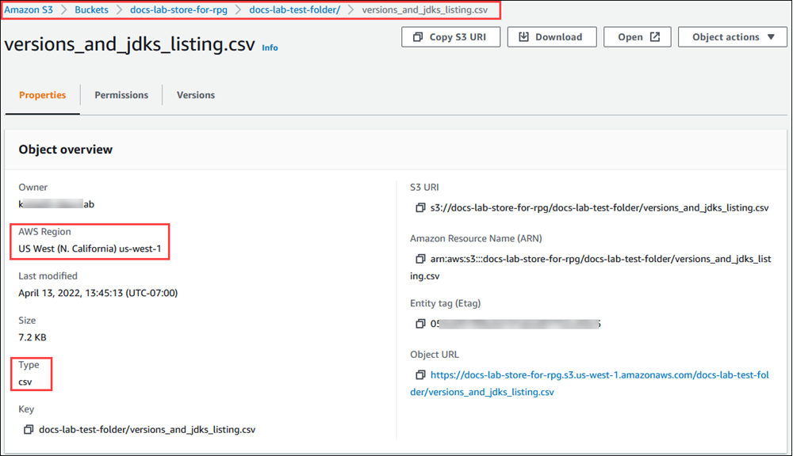

# Overview of importing data from Amazon S3

data

###### To import S3 data into Amazon RDS

First, gather the details that you need to supply to the function. These include the name of the table on

your RDS for PostgreSQL DB instance, and the
bucket name, file path, file type, and AWS Region where the Amazon S3 data is stored.
For more information, see [View an object](../../../AmazonS3/latest/userguide/OpeningAnObject.md "../../../AmazonS3/latest/userguide/OpeningAnObject.md") in the
_Amazon Simple Storage Service User Guide_.

###### Note

Multi part data import from Amazon S3 isn't currently supported.

1. Get the name of the table into which the `aws_s3.table_import_from_s3`
   function is to import the data. As an example, the following command
   creates a table `t1` that can be used in later steps.

```
`postgres=>` CREATE TABLE t1
    (col1 varchar(80),
    col2 varchar(80),
    col3 varchar(80));

```

2. Get the details about the Amazon S3 bucket and the data to import.
   To do this, open the Amazon S3 console at [https://console.aws.amazon.com/s3/](https://console.aws.amazon.com/s3/ "https://console.aws.amazon.com/s3/"), and choose **Buckets**.
   Find the bucket containing your data in the list. Choose the bucket, open its Object overview page, and then
   choose Properties.

Make a note of the bucket name, path, the AWS Region, and file type. You need
the Amazon Resource Name (ARN) later, to set up access to Amazon S3 through an IAM role.
For more more information, see [Setting up access to an Amazon S3
bucket](USER_PostgreSQL.S3Import.md "USER_PostgreSQL.S3Import.md").
The image following shows an example.

 3. You can verify the path to the data on the Amazon S3 bucket by using the AWS CLI command `aws s3 cp`.
If the information is correct, this command downloads a copy of the Amazon S3 file.

```
aws s3 cp s3://`amzn-s3-demo-bucket`/`sample_file_path` ./
```

4. Set up permissions on your
   RDS for PostgreSQL DB instance to allow access to the file on the
   Amazon S3 bucket. To do so, you use either an AWS Identity and Access Management (IAM) role or security
   credentials. For more information, see [Setting up access to an Amazon S3
   bucket](USER_PostgreSQL.S3Import.md "USER_PostgreSQL.S3Import.md").
5. Supply the path and other Amazon S3 object details gathered (see step 2) to the
   `create_s3_uri` function to construct an Amazon S3 URI object. To learn
   more about this function, see [aws_commons.create_s3_uri](USER_PostgreSQL.S3Import.md#USER_PostgreSQL.S3Import.create_s3_uri "USER_PostgreSQL.S3Import.md#USER_PostgreSQL.S3Import.create_s3_uri").
   The following is an example of constructing this object during a psql session.

```
`postgres=>` SELECT aws_commons.create_s3_uri(
   'docs-lab-store-for-rpg',
   'versions_and_jdks_listing.csv',
   'us-west-1'
) AS s3_uri \gset
```

In the next step, you pass this object (`aws_commons._s3_uri_1`) to the
`aws_s3.table_import_from_s3` function to import the data to the table. 6. Invoke the `aws_s3.table_import_from_s3`
function to import the data from Amazon S3 into your table.
For reference information, see
[aws_s3.table_import_from_s3](USER_PostgreSQL.S3Import.md#aws_s3.table_import_from_s3 "USER_PostgreSQL.S3Import.md#aws_s3.table_import_from_s3").

For examples, see [Importing data from Amazon S3 to your RDS for PostgreSQL DB instance](USER_PostgreSQL.S3Import.md "USER_PostgreSQL.S3Import.md").
